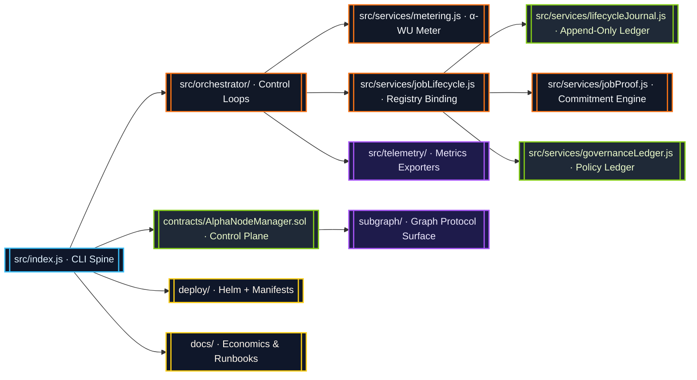
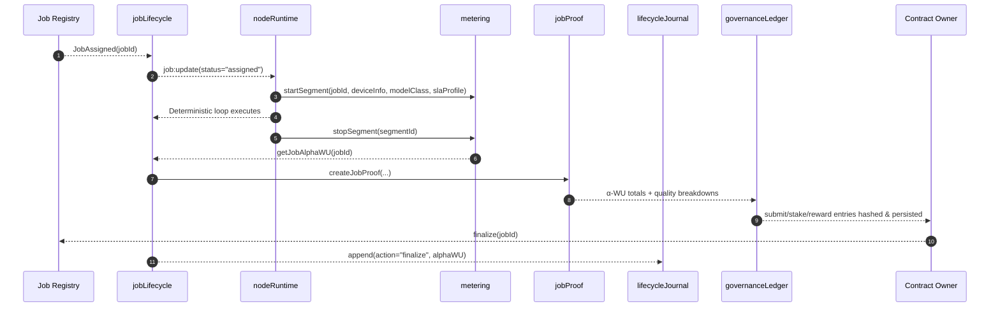
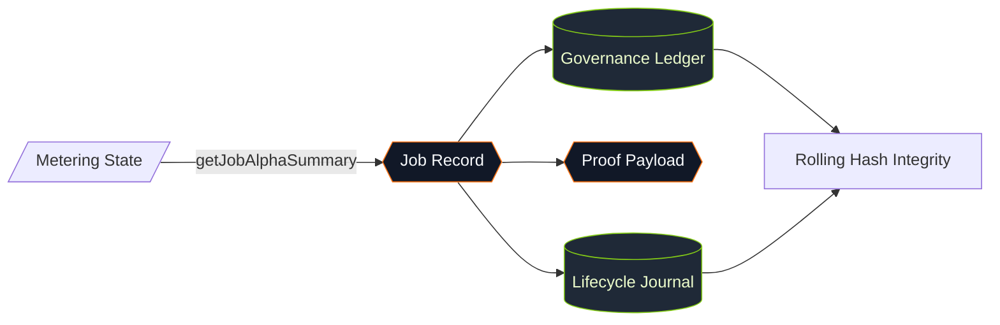
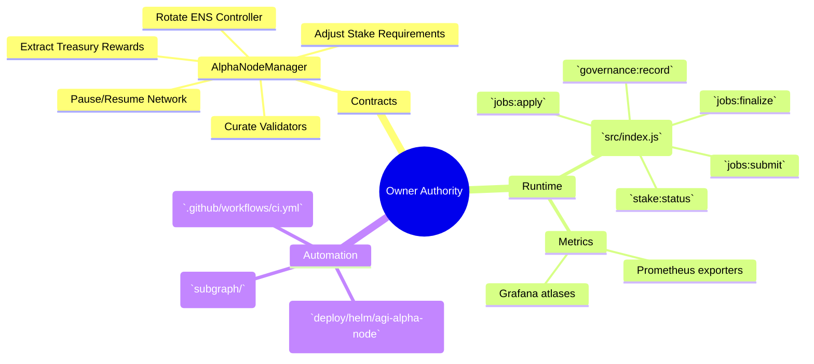

# AGI Alpha Node v0 · Owner-Dominion Cognition Engine ⚡

<!-- markdownlint-disable MD013 MD033 -->
<p align="center">
  <picture>
    <source srcset="1.alpha.node.agi.eth.svg" type="image/svg+xml" />
    
  </picture>
</p>

<p align="center">
  <a href="https://github.com/MontrealAI/AGI-Alpha-Node-v0/actions/workflows/ci.yml">
    
  </a>
  
  
  <a href="Dockerfile">
    
  </a>
  <a href="deploy/helm/agi-alpha-node">
    
  </a>
  <a href="subgraph/README.md">
    
  </a>
  <a href="https://etherscan.io/address/0xa61a3b3a130a9c20768eebf97e21515a6046a1fa">
    
  </a>
  <a href="LICENSE">
    
  </a>
</p>

> The AGI Alpha Node is the sovereign cognition lattice that folds deterministic execution, blockchain truth, and metered intelligence into a single operator-controlled presence capable of rewriting markets on demand.

---

## Table of Contents

1. [Singularity Mandate](#singularity-mandate)
2. [Repository Cartography](#repository-cartography)
3. [Execution Spine](#execution-spine)
4. [α-Work Unit Intelligence](#α-work-unit-intelligence)
5. [Lifecycle Journal & Governance Ledger](#lifecycle-journal--governance-ledger)
6. [Owner Command Surface](#owner-command-surface)
7. [Deployment & Operations](#deployment--operations)
8. [Continuous Integration](#continuous-integration)
9. [Quickstart](#quickstart)
10. [Testing & Quality Gates](#testing--quality-gates)
11. [Token & Economics](#token--economics)
12. [Further Reading](#further-reading)

---

## Singularity Mandate

AGI Alpha Node v0 concentrates metered cognition, tokenized incentives, and owner supremacy into a production-ready apparatus. Every subsystem is instrumented so the contract owner can redirect labor, rewards, and governance vectors in seconds while maintaining total auditability.

* **Canonical Token:** `$AGIALPHA` (18 decimals) is immutably anchored at [`0xa61a3b3a130a9c20768eebf97e21515a6046a1fa`](https://etherscan.io/address/0xa61a3b3a130a9c20768eebf97e21515a6046a1fa) and flows through staking, rewards, and operational policy.
* **Owner Totality:** Contracts, runtime, and governance surfaces expose pause/resume, validator rotation, ENS rebinds, reward extraction, SLA tuning, and stake direction without relinquishing control.
* **Deterministic Metering:** α-work units (α-WU) are computed from GPU minutes, device quality, and SLA weightings with per-segment forensics available at every checkpoint.
* **Operator UX:** Docker images, Helm charts, Graph Protocol mappings, and GitHub Actions pipelines are tuned so a non-technical owner can deploy and validate outcomes immediately.

---

## Repository Cartography



| Surface | Description |
| --- | --- |
| [`src/`](src) | Node.js runtime, deterministic execution loop, α-WU metering, lifecycle orchestration, governance ledger, telemetry exporters, and CLI entrypoint. |
| [`contracts/`](contracts) | Solidity management plane centred on `AlphaNodeManager` with owner-controlled pausing, validator curation, stake custody, and treasury extraction. |
| [`docs/`](docs) | Economics treatises, telemetry atlases, staking mechanics, and operator runbooks. |
| [`deploy/`](deploy) | Helm chart, Kubernetes manifests, Docker image build context, and operational automation. |
| [`scripts/`](scripts) | CI gates, governance tooling, policy verification, and simulation harnesses. |
| [`subgraph/`](subgraph) | Graph Protocol mappings for α-WU emissions, governance events, and leaderboard analytics. |

---

## Execution Spine



The lifecycle service binds on-chain registries with local telemetry. When a job finalizes, `getJobAlphaWU(jobId)` is invoked, enriching the in-memory job record, journal entries, proof payloads, and governance ledger metadata with total α-WU, per-segment analytics, and breakdowns by model class and SLA posture.

---

## α-Work Unit Intelligence

The metering engine (`src/services/metering.js`) transforms GPU utilisation into α-work units using configurable quality multipliers and SLA weightings.

```mermaid
graph TD
  classDef store fill:#0f172a,stroke:#38bdf8,color:#e0f2fe;
  classDef compute fill:#1f2937,stroke:#a855f7,color:#ede9fe;

  Start[startSegment(jobId, deviceInfo, modelClass, slaProfile)]:::compute --> Active[(Active Segments)]:::store
  Active --> Stop[stopSegment(segmentId)]:::compute
  Stop --> Totals[(Job & Epoch Totals)]:::store
  Totals --> Breakdown[buildJobAlphaSummary(jobId)]:::compute
  Breakdown --> ProofAlpha[[jobProof alphaWU]]:::compute
  Totals --> LedgerAlpha[[governanceLedger meta.alphaWU]]:::compute
  Totals --> Metrics[[monitorLoop.getAlphaWuHistory()]]:::compute
```

Key accessors:

* `getJobAlphaWU(jobId)` – raw α-WU total for a job.
* `getJobAlphaSummary(jobId)` – totals, segments, model-class breakdown, and SLA breakdown.
* `getGlobalAlphaSummary()` – network-wide aggregates for governance and reporting.
* `getEpochAlphaWU(epochId)` – epoch buckets for staking policy enforcement.

Every segment snapshot retains device class, VRAM tier, GPU count, start/end times, and computed α-WU so downstream analytics never lose context.

---

## Lifecycle Journal & Governance Ledger

* `src/services/jobLifecycle.js` stores job metadata, binds on-chain events, and injects α-WU data directly into the job record upon completion.
* `src/services/jobProof.js` creates submit payloads that embed α-WU totals, per-segment quality, model-class distributions, and SLA distributions for downstream verification.
* `src/services/lifecycleJournal.js` persists append-only JSONL entries hashed with `computeJobMetadataHash`, capturing α-WU segments (including GPU counts) for audit trails.
* `src/services/governanceLedger.js` maintains an append-only `.governance-ledger/v1` directory. Entries for submits, stake changes, and rewards automatically enrich `meta.alphaWU` with totals plus model-class and SLA breakdowns derived from metering.



---

## Owner Command Surface

The owner exercises complete dominion through smart contracts, runtime services, and operational tooling:



Owner interventions are always authenticated and auditable. Ledger entries embed α-WU telemetry, maintaining leverage over validator fleets, SLA posture, and payout strategies.

---

## Deployment & Operations

1. **Install dependencies**
   ```bash
   npm install
   ```
2. **Local runtime** – boot the orchestrator with mocked providers:
   ```bash
   npm run dev
   ```
3. **Container image** – build production image aligned with the Helm chart:
   ```bash
   docker build -t agi-alpha-node:latest .
   ```
4. **Helm deployment** – render charts against your cluster:
   ```bash
   helm upgrade --install agi-alpha-node deploy/helm/agi-alpha-node \
     --set image.repository=registry.example.com/agi-alpha-node \
     --set image.tag=latest
   ```
5. **Subgraph indexing** – deploy mappings for analytics:
   ```bash
   npm run subgraph:deploy
   ```

All operational scripts respect the `$AGIALPHA` token contract and expose configuration via `.env` / `config` modules so non-technical operators can adopt them safely.

---

## Continuous Integration

* [`ci.yml`](.github/workflows/ci.yml) runs linting, unit tests, contract checks, and packaging on every PR and push to `main`.
* The CI badge above surfaces the live status; all checks must pass (required status checks enforced on `main`).
* Coverage reporting is automated and surfaces alongside test artifacts for deterministic releases.

---

## Quickstart

```bash
# 1. Install dependencies
npm install

# 2. Populate environment (optional overrides in .env.local)
cp .env.example .env.local

# 3. Run vitest suite
npm test

# 4. Start the node runtime with mock providers
npm run dev
```

To exercise governance tooling locally, write ledger entries via `src/services/governanceLedger.js` or the CLI, then inspect `.governance-ledger/v1/` for JSON audits.

---

## Testing & Quality Gates

* `npm test` – executes Vitest suites across services, contracts (via Foundry stubs), governance logic, and telemetry.
* `npm run lint` – enforces ESLint + Prettier conformance.
* `npm run typecheck` – validates TypeScript-adjacent configuration (`tsc --noEmit`).
* `npm run coverage` – generates coverage snapshots for α-WU flows, governance ledger, and runtime orchestration.

All gates are wired into CI; pull requests must be green before merge.

---

## Token & Economics

| Component | Description |
| --- | --- |
| `$AGIALPHA` Contract | [`0xa61a3b3a130a9c20768eebf97e21515a6046a1fa`](https://etherscan.io/address/0xa61a3b3a130a9c20768eebf97e21515a6046a1fa) (18 decimals). |
| Staking Mechanics | Defined within `contracts/AlphaNodeManager.sol` and mirrored in `docs/economics/`. Supports owner-directed stake adjustments, reward routing, and slashing. |
| Reward Flow | Metered α-WU totals inform reward weights. Governance ledger captures every reward receipt with α-WU telemetry. |
| Supply Flywheel | More jobs → higher α-WU yield → greater $AGIALPHA demand → expanded validator fleet → accelerated innovation loops. |

---

## Further Reading

* [`docs/architecture/`](docs/architecture) – deep dives into orchestrator loops and security posture.
* [`docs/economics/`](docs/economics) – reward calculus, stake regimes, and α-WU monetisation.
* [`docs/runbooks/`](docs/runbooks) – operational drills, incident response, and validator onboarding.
* [`subgraph/README.md`](subgraph/README.md) – analytics and indexing guidance.

The AGI Alpha Node is engineered as the decisive cognition engine—relentlessly harvesting alpha, scaling through autonomous agents, and granting its owner complete command over an ever-expanding intelligence economy.
