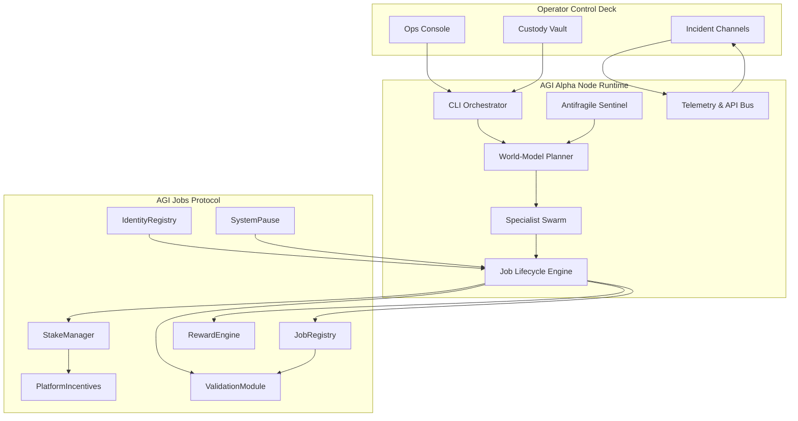
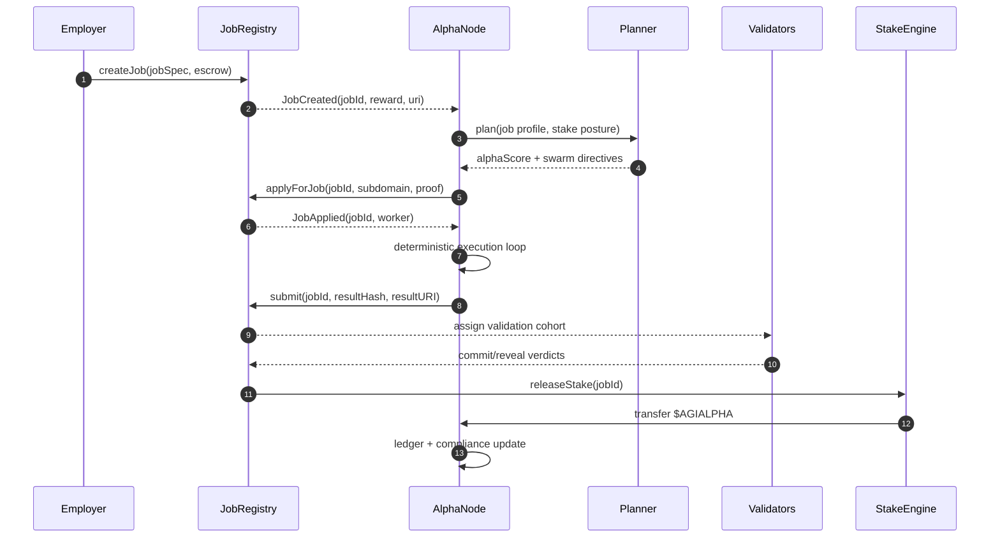
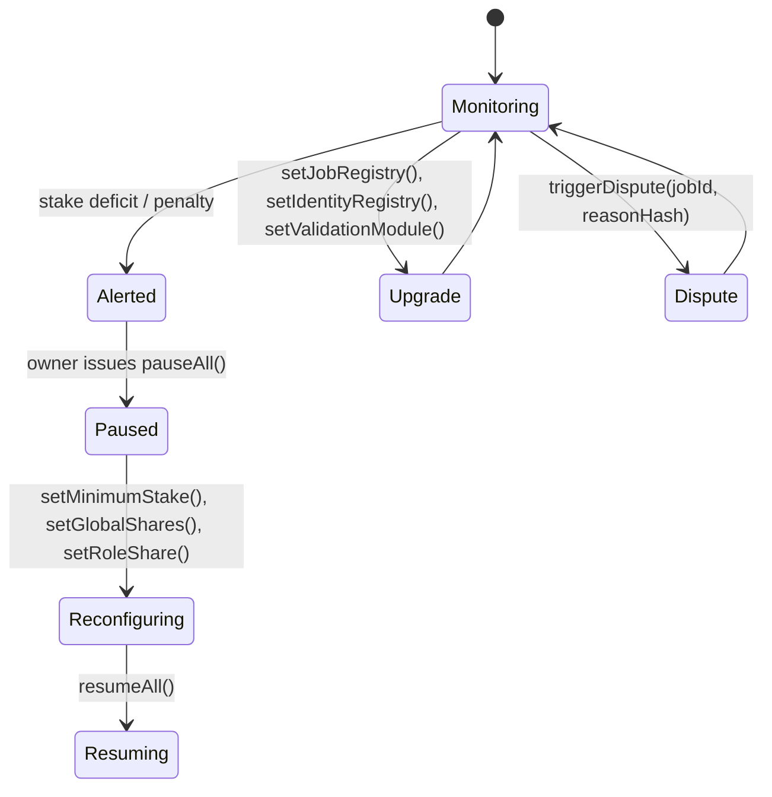

# AGI Alpha Node v0 · Sovereign Yield Intelligence Core ⚡

<!-- markdownlint-disable MD013 MD033 -->
<p align="center">
  
</p>

<p align="center">
  <a href="https://github.com/MontrealAI/AGI-Alpha-Node-v0/actions/workflows/ci.yml">
    
  </a>
  
  
  
  <a href="Dockerfile">
    
  </a>
  
  <a href="https://app.ens.domains/name/alpha.node.agi.eth">
    
  </a>
  <a href="https://etherscan.io/token/0xa61a3b3a130a9c20768eebf97e21515a6046a1fa">
    
  </a>
  <a href="LICENSE">
    
  </a>
</p>

> The AGI Alpha Node binds ENS authority, $AGIALPHA liquidity, and deterministic intelligence loops into a single operator-dominated machine. Every subsystem is observable, replayable, and wired for immediate production activation once the owner signs off.

---

## Table of Contents

1. [Mission Pillars](#mission-pillars)
2. [Core System Constellation](#core-system-constellation)
3. [Autonomous Job Lifecycle](#autonomous-job-lifecycle)
4. [Owner Dominion & Governance Surface](#owner-dominion--governance-surface)
5. [Runtime Interfaces](#runtime-interfaces)
   - [CLI Command Spine](#cli-command-spine)
   - [REST & Governance API](#rest--governance-api)
   - [Telemetry & Compliance](#telemetry--compliance)
6. [Integration with AGI Jobs Protocol](#integration-with-agi-jobs-protocol)
7. [Deployment & Operations Playbooks](#deployment--operations-playbooks)
   - [Local Development](#local-development)
   - [Deterministic Containers](#deterministic-containers)
   - [Kubernetes / Helm](#kubernetes--helm)
8. [Configuration & Secrets](#configuration--secrets)
9. [Quality Gates & Continuous Integration](#quality-gates--continuous-integration)
10. [Repository Atlas](#repository-atlas)
11. [Contributing](#contributing)
12. [License](#license)

---

## Mission Pillars

| Vector | Implementation | Inspect |
| ------ | -------------- | ------- |
| **Identity Anchoring** | ENS proofing halts execution if the runtime loses control of `⟨label⟩.alpha.node.agi.eth`. | [`src/services/ensVerifier.js`](src/services/ensVerifier.js) |
| **Economic Sovereignty** | Canonical $AGIALPHA token maths, staking activators, and reinvestment optimizers keep capital compounding for the owner. | [`src/constants/token.js`](src/constants/token.js), [`src/services/staking.js`](src/services/staking.js), [`src/services/economics.js`](src/services/economics.js) |
| **Lifecycle Engine** | Discovery → apply → execute → submit → finalize pipeline wired to JobRegistry, validation, and reward release. | [`src/services/jobLifecycle.js`](src/services/jobLifecycle.js), [`src/services/jobProof.js`](src/services/jobProof.js) |
| **Intelligence Mesh** | Planner, swarm orchestrator, curriculum evolution, and stress harness produce deterministic strategies and antifragile responses. | [`src/intelligence/planning.js`](src/intelligence/planning.js), [`src/intelligence/swarmOrchestrator.js`](src/intelligence/swarmOrchestrator.js), [`src/intelligence/learningLoop.js`](src/intelligence/learningLoop.js), [`src/intelligence/stressHarness.js`](src/intelligence/stressHarness.js) |
| **Owner Supremacy** | Owners can pause, resume, retune stakes, rotate registries, or trigger disputes; every payload is recorded for audit. | [`src/services/governance.js`](src/services/governance.js), [`src/services/controlPlane.js`](src/services/controlPlane.js), [`src/services/governanceLedger.js`](src/services/governanceLedger.js) |
| **Observability** | REST status bus, Prometheus metrics, compliance ledgers, and stress telemetry keep the machine transparent. | [`src/network/apiServer.js`](src/network/apiServer.js), [`src/telemetry/monitoring.js`](src/telemetry/monitoring.js), [`src/orchestrator/monitorLoop.js`](src/orchestrator/monitorLoop.js) |

---

## Core System Constellation



Each module is restartable, journaling-rich, and guarded by configuration schemas under [`src/config`](src/config).

---

## Autonomous Job Lifecycle



The lifecycle module listens to on-chain events, updates the local ledger, and exposes metrics through the API surface so operators and dashboards can observe every transition.

---

## Owner Dominion & Governance Surface



Key owner capabilities are synthesized by the control plane and API:

- Emergency pause/resume via [`buildSystemPauseTx`](src/services/governance.js).
- Minimum stake, validator thresholds, and registry rotation via [`buildMinimumStakeTx`](src/services/governance.js) and [`buildStakeRegistryUpgradeTx`](src/services/governance.js).
- Reward policy tuning with [`buildGlobalSharesTx`](src/services/governance.js) and [`buildRoleShareTx`](src/services/governance.js).
- Dispute triggers and identity delegate management handled through [`buildDisputeTriggerTx`](src/services/governance.js) and [`buildIdentityDelegateTx`](src/services/governance.js).
- The control plane synthesizes directives based on telemetry, ensuring owners always have the next best action queued. See [`deriveOwnerDirectives`](src/services/controlPlane.js) for full policy logic.

Every governance payload is recorded in [`src/services/governanceLedger.js`](src/services/governanceLedger.js) so operators can audit exactly what was sent on-chain.

---

## Runtime Interfaces

### CLI Command Spine

The CLI (`node src/index.js` or `npx agi-alpha-node`) is the operational backbone. Highlighted commands:

| Command | Purpose | Source |
| ------- | ------- | ------ |
| `status --label <node> --address <0x...>` | Verify ENS ownership, stake posture, rewards, and heartbeat health. | [`src/index.js`](src/index.js) |
| `stake-activate --amount <tokens> --private-key <0x...> --incentives <0x...>` | Broadcast `PlatformIncentives.stakeAndActivate` with secure logging. | [`acknowledgeStakeAndActivate`](src/services/stakeActivation.js) |
| `token approve|allowance|metadata` | Encode ERC-20 approvals and inspect allowances for the canonical token. | [`describeAgialphaToken`](src/services/token.js) |
| `jobs discover|apply|submit|finalize` | Drive the AGI Jobs lifecycle using the deterministic journal and proof engine. | [`createJobLifecycle`](src/services/jobLifecycle.js) |
| `governance pause|minimal-stake|global-shares|role-share|catalog` | Synthesize signed owner payloads with diff metadata. | [`getOwnerFunctionCatalog`](src/services/governance.js) |
| `economics project|optimize` | Model reinvestment strategies and projected compounding curves. | [`optimizeReinvestmentStrategy`](src/services/economics.js) |
| `proof commit|submit` | Generate result commitments and build submission transactions. | [`createJobProof`](src/services/jobProof.js) |

Use `node src/index.js --help` or `<command> --help` for exhaustive flags.

### REST & Governance API

`startAgentApi` exposes machine-readable control for dashboards and automations.

| Endpoint | Method | Description |
| -------- | ------ | ----------- |
| `/jobs` | `GET` | Inspect discovered jobs and cache snapshots. |
| `/jobs/:id/apply` | `POST` | Force an application for a job (expects JSON body with ENS subdomain). |
| `/jobs/:id/submit` | `POST` | Submit job results (result payload and optional metadata). |
| `/jobs/:id/finalize` | `POST` | Finalize completed jobs once validation clears. |
| `/governance/directives` | `GET` + bearer token | Fetch owner directives synthesized by the control plane. |
| `/governance/pause` | `POST` + bearer token | Build pause/resume transactions. |
| `/governance/minimum-stake` | `POST` + bearer token | Craft `StakeManager.setMinimumStake`. |
| `/governance/role-share` | `POST` + bearer token | Encode `RewardEngine.setRoleShare`. |
| `/governance/global-shares` | `POST` + bearer token | Encode `RewardEngine.setGlobalShares`. |
| `/governance/job-registry` / `/identity-registry` | `POST` + bearer token | Rotate registry bindings. |
| `/governance/dispute` | `POST` + bearer token | Craft dispute triggers with reason hashes. |

See [`test/apiServer.test.js`](test/apiServer.test.js) for live request examples.

### Telemetry & Compliance

- **Prometheus metrics** exported from [`src/telemetry/monitoring.js`](src/telemetry/monitoring.js) surface stake posture, job throughput, and alerting signals on `METRICS_PORT` (default `9464`).
- **Compliance ledger** maintained by [`src/services/lifecycleJournal.js`](src/services/lifecycleJournal.js) and [`src/services/governanceLedger.js`](src/services/governanceLedger.js) keeps deterministic records of job execution and owner actions.
- **Monitor loop** in [`src/orchestrator/monitorLoop.js`](src/orchestrator/monitorLoop.js) stitches telemetry, directives, and stress tests into the REST API so dashboards stay synchronized.

---

## Integration with AGI Jobs Protocol

1. **Discovery** — `createJobLifecycle` watches `JobRegistry` events (via provider subscriptions) and normalizes metadata and tags, ensuring legacy (`v0`) and modern (`v2`) tuples are handled uniformly. Jobs are journaled and exposed through `/jobs`.
2. **Application** — `apply(jobId, options)` encodes `applyForJob` (or the first compatible method) and persists transaction metadata, referencing [`JOB_STATUS_MAP`](src/services/jobLifecycle.js) to track progress.
3. **Execution & Proofing** — The swarm orchestrator (`src/intelligence/swarmOrchestrator.js`) and planner compute strategy directives. Once output is ready, [`createJobProof`](src/services/jobProof.js) produces deterministic commitments and `buildProofSubmissionTx` readies the payload.
4. **Submission** — `submit(jobId, payload)` invokes `submitProof`/`submitJob` functions, updates the compliance ledger, and emits events for connected dashboards.
5. **Validation Watch** — The lifecycle engine monitors validator commits/reveals and exposes them through metrics and `/jobs` snapshots, so operators can anticipate outcomes.
6. **Finalization & Rewards** — When validation resolves, `finalize(jobId)` calls the appropriate registry method. Reward releases are reconciled with [`src/services/rewards.js`](src/services/rewards.js) and `optimizeReinvestmentStrategy` determines next reinvestment moves.

Backward-compatible conditionals protect legacy AGI Jobs flows, while default configs target the audited `$AGIALPHA` mainnet deployment.

---

## Deployment & Operations Playbooks

### Local Development

1. Clone and install dependencies:

   ```bash
   git clone https://github.com/MontrealAI/AGI-Alpha-Node-v0.git
   cd AGI-Alpha-Node-v0
   npm ci
   ```

2. Run documentation and code quality gates:

   ```bash
   npm run lint:md
   npm run lint:links
   npm test
   npm run coverage
   ```

3. Launch the CLI in dry-run mode:

   ```bash
   node src/index.js status --label 1 --address 0xYourOperator --rpc https://rpc.ankr.com/eth
   ```

4. Start the REST API and metrics server for dashboards:

   ```bash
   node src/index.js container --api-port 8080 --metrics-port 9464 --interval 120 --once
   ```

### Deterministic Containers

- The production image builds with [`Dockerfile`](Dockerfile) and boots via [`deploy/docker/entrypoint.sh`](deploy/docker/entrypoint.sh).
- Required environment variables: `NODE_LABEL`, `OPERATOR_ADDRESS`, `RPC_URL`; optional: `CONFIG_PATH`, `OFFLINE_SNAPSHOT_PATH`, `AUTO_STAKE`, `METRICS_PORT`, `API_PORT`.
- Example launch:

  ```bash
  docker build -t agi-alpha-node:latest .
  docker run --rm \
    -e NODE_LABEL=1 \
    -e OPERATOR_ADDRESS=0x0000000000000000000000000000000000000001 \
    -e RPC_URL=https://rpc.ankr.com/eth \
    -p 8080:8080 -p 9464:9464 \
    agi-alpha-node:latest --help
  ```

### Kubernetes / Helm

- Helm chart lives at [`deploy/helm/agi-alpha-node`](deploy/helm/agi-alpha-node) with configurable secrets, service ports, liveness probes, and ConfigMap-driven env files.
- Override values (e.g. RPC endpoints, owner tokens) via `values.yaml` or `--set` flags.
- Smoke test with `helm install alpha-node deploy/helm/agi-alpha-node -f my-values.yaml` inside a staging cluster.

---

## Configuration & Secrets

- `.env` files are coerced through [`src/config/schema.js`](src/config/schema.js) ensuring required keys like `RPC_URL`, `OPERATOR_ADDRESS`, and `AGIALPHA_TOKEN_ADDRESS` are present.
- The entrypoint script refuses to launch without mandatory variables and redacts RPC credentials in logs. See [`deploy/docker/entrypoint.sh`](deploy/docker/entrypoint.sh).
- Offline operation is supported through [`src/services/offlineSnapshot.js`](src/services/offlineSnapshot.js) so operators can preload historical state when network access is constrained.

---

## Quality Gates & Continuous Integration

- GitHub Actions workflow [`ci.yml`](.github/workflows/ci.yml) runs markdown lint, link validation, Vitest suites, coverage (`c8`), and Docker smoke builds on every push, PR, and manual dispatch.
- Required local equivalents:
  - `npm run lint:md` / `npm run lint:links`
  - `npm test`
  - `npm run coverage`
- Enforce branch protection on `main` so pull requests must pass CI and receive approval before merge. The README badge links directly to the latest workflow run for transparency.

---

## Repository Atlas

| Path | Purpose |
| ---- | ------- |
| [`src/config`](src/config) | Environment coercion and schema validation. |
| [`src/constants`](src/constants) | Canonical token, ENS, and staking constants. |
| [`src/intelligence`](src/intelligence) | Planner, swarm orchestrator, curriculum evolution, stress harness. |
| [`src/network`](src/network) | REST API server and WebSocket surfaces. |
| [`src/orchestrator`](src/orchestrator) | Bootstrap routines, monitor loop, runtime control. |
| [`src/services`](src/services) | ENS verifier, lifecycle engine, governance toolkit, staking helpers, ledgers. |
| [`src/telemetry`](src/telemetry) | Metrics exporters and monitoring utilities. |
| [`test`](test) | Vitest suites covering lifecycle, governance, telemetry, economics, and CLI behaviours. |
| [`deploy`](deploy) | Docker entrypoint, Helm charts, and operational scripts. |
| [`docs`](docs) | Extended operator handbook and manifesto. |

## Contributing

1. Fork the repository and create a feature branch.
2. Run `npm ci`, `npm run lint`, and `npm test` before committing.
3. Submit a pull request with CI green and branch updated against `main`.
4. Include evidence of ENS control and staking simulations when modifying governance or lifecycle modules.

## License

Released under the [MIT License](LICENSE).
