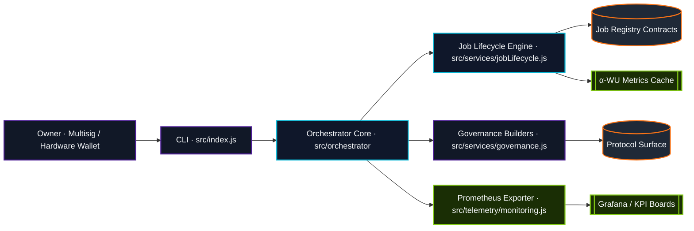
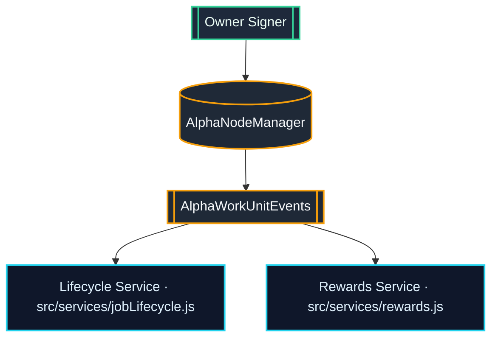
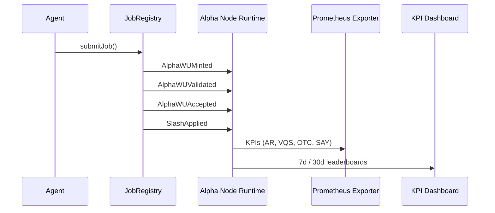
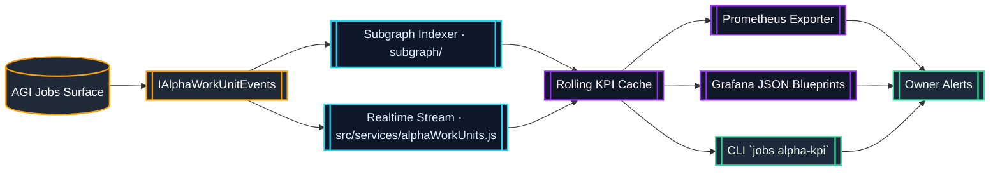
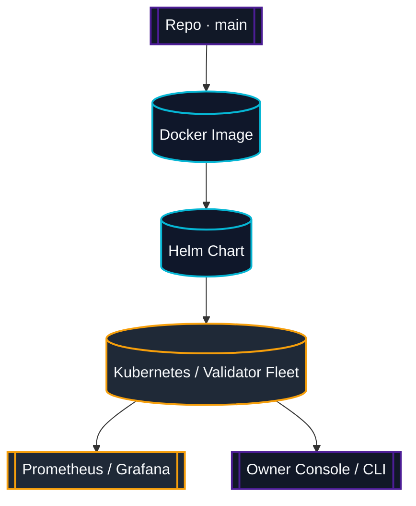

# AGI Alpha Node v0 · Sovereign Cognition Spine ⚡

<!-- markdownlint-disable MD013 MD033 -->
<p align="center">
  <picture>
    <source srcset="1.alpha.node.agi.eth.svg" type="image/svg+xml" />
    
  </picture>
</p>

<p align="center">
  <a href="https://github.com/MontrealAI/AGI-Alpha-Node-v0/actions/workflows/ci.yml">
    
  </a>
  
  
  <a href="Dockerfile">
    
  </a>
  <a href="deploy/helm/agi-alpha-node">
    
  </a>
  <a href="https://etherscan.io/address/0xa61a3b3a130a9c20768eebf97e21515a6046a1fa">
    
  </a>
  <a href="LICENSE">
    
  </a>
</p>

> The command spine for validator-weighted α-work units, ENS sovereignty, and on-chain telemetry—engineered to keep an iconic operator in total control.

---

## Table of Contents

1. [Introduction](#introduction)
2. [Architecture](#architecture)
3. [Smart Contracts](#smart-contracts)
4. [Telemetry](#telemetry)
5. [Dashboards](#dashboards)
6. [Deployment](#deployment)
7. [Continuous Integration](#continuous-integration)
8. [Governance](#governance)
9. [Quickstart](#quickstart)

---

## Introduction

AGI Alpha Node v0 is the sovereign orchestration layer for validator-weighted α-work units (α-WU). It fuses CLI-level command, ENS-bound identity, smart contract automation, and telemetry streaming into a single futuristic runtime that the owner can pause, reconfigure, or redeploy in seconds.

* **Purpose:** Enforce deterministic lifecycle management for alpha job registries, validators, and treasury flows.
* **Scope:** Repository spans the [Node.js runtime](src), [Solidity surfaces](contracts), [telemetry specs](docs/telemetry), and [deployment automation](deploy/helm/agi-alpha-node).
* **Tone:** Iconic, powerful, and pragmatic—every artifact is wired to maximize operator leverage.

---

## Architecture

The runtime stitches CLI directives, orchestration services, and telemetry exporters into a layered control plane. Core modules live under [`src/`](src) with TypeScript-friendly JavaScript, job logic, and governance rails.



### Highlights

* **CLI Spine:** [`src/index.js`](src/index.js) dispatches commands for jobs, treasury, validators, and ENS guardianship.
* **Services:** Job logic under [`src/services`](src/services) handles lifecycle, treasury, and governance mutations.
* **Telemetry:** [`src/telemetry`](src/telemetry) exports Prometheus gauges and KPI caches aligned with on-chain events.
* **Subgraph + Scripts:** [`subgraph/`](subgraph) mirrors the same event schema for indexers or downstream analytics.

---

## Smart Contracts

Contracts preserve validator weighting, slashing controls, and KPI event emission. Each surface is paired with interfaces used by the runtime and subgraph.

| Contract / Spec | Purpose | Location |
| --- | --- | --- |
| `AlphaNodeManager` | Ownable control plane that gates validators, ENS identities, staking, and emits KPI events | [`contracts/AlphaNodeManager.sol`](contracts/AlphaNodeManager.sol) |
| `IAlphaWorkUnitEvents` | Solidity interface defining `AlphaWUMinted`, `AlphaWUValidated`, `AlphaWUAccepted`, `SlashApplied` | [`contracts/interfaces/IAlphaWorkUnitEvents.sol`](contracts/interfaces/IAlphaWorkUnitEvents.sol) |
| KPI Interface Mirror | Shared ABI for external registries and scripts | [`docs/telemetry/AlphaWorkUnitEvents.sol`](docs/telemetry/AlphaWorkUnitEvents.sol) |
| Subgraph Schema | Canonical GraphQL surface for KPI feeds | [`docs/telemetry/subgraph.schema.graphql`](docs/telemetry/subgraph.schema.graphql) |



*Every emitted event is consumed by [`src/services/alphaWorkUnits.js`](src/services/alphaWorkUnits.js) and mirrored in the subgraph mappings to keep CLI, dashboards, and scripts in sync.*

---

## Telemetry

α-WU telemetry is normalized per validator stake, streamed to Prometheus, and mirrored into dashboards for multi-window KPIs.



| KPI | Formula | Gauge | Windows |
| --- | --- | --- | --- |
| Acceptance Rate (AR) | `accepted ÷ minted` | `agi_alpha_node_alpha_wu_acceptance_rate` | 7d · 30d · all |
| Validator-Weighted Quality (VQS) | `median(score × normalized stake)` | `agi_alpha_node_alpha_wu_quality` | 7d · 30d · all |
| On-Time Completion (OTC) | `p95(accepted.ts − minted.ts)` | `agi_alpha_node_alpha_wu_on_time_p95_seconds` | 7d · 30d · all |
| Slashing-Adjusted Yield (SAY) | `(accepted − slashes) ÷ stake` | `agi_alpha_node_alpha_wu_slash_adjusted_yield` | 7d · 30d · all |

The telemetry exporter defined in [`src/telemetry/monitoring.js`](src/telemetry/monitoring.js) pulls data from the KPI cache [`src/telemetry/alphaMetrics.js`](src/telemetry/alphaMetrics.js), ensuring dashboards and CLI outputs share identical calculations.

---

## Dashboards

Grafana JSON blueprints in [`docs/telemetry`](docs/telemetry) provide instant visualization of KPI envelopes, validator health, and governance readiness.



* **Blueprints:** [`docs/telemetry/dashboard.json`](docs/telemetry/dashboard.json) and [`docs/telemetry/alpha-work-unit-dashboard.json`](docs/telemetry/alpha-work-unit-dashboard.json).
* **Control Hierarchy:** Dashboards are fed exclusively by the KPI cache, so CLI leaderboards, Prometheus gauges, and Grafana tiles always agree.

---

## Deployment

Deployment artifacts cover container images, Helm charts, and scripts for spinning new validator spines.

| Surface | Description |
| --- | --- |
| [`Dockerfile`](Dockerfile) | Production Node.js 20 image with telemetry exporters and CLI baked in. |
| [`deploy/helm/agi-alpha-node`](deploy/helm/agi-alpha-node) | Helm chart with ConfigMaps for CLI configs, Prometheus scraping, and ENS secrets. |
| [`scripts/`](scripts) | Helper scripts for RPC bootstrapping, KPI ingestion, and ENS health checks. |

### Control hierarchy



*Helm values map directly to environment variables consumed by [`src/config`](src/config), allowing deterministic promotions across fleets.*

---

## Continuous Integration

Quality gates live in [`./.github/workflows/ci.yml`](.github/workflows/ci.yml) and enforce formatting, lint, test, coverage, Solidity, TypeScript, and Docker validation jobs in a single workflow.

| Job | Purpose |
| --- | --- |
| `lint` | Markdown linting, link checks, branch policy enforcement. |
| `test` | Unit and integration tests for the Node runtime. |
| `solidity` | Lint and compile contracts. |
| `typescript` | Build the subgraph TypeScript bundle. |
| `coverage` | Generate and upload coverage artefacts. |
| `docker-smoke` | Build the container image and run CLI smoke tests. |

**Badges** for build and coverage are pinned above, both sourced from the same workflow.

---

## Governance

Governance primitives keep ownership programmable but uncompromising.

* **ENS & Identity:** [`src/services/ensGuide.js`](src/services/ensGuide.js) and [`src/services/ensVerifier.js`](src/services/ensVerifier.js) enforce ENS resolution for `alpha.node.agi.eth` before orchestrator tasks unlock.
* **Rewards & Treasury Controls:** [`src/services/rewards.js`](src/services/rewards.js) binds payouts to multisig approvals enforced on-chain via `AlphaNodeManager`.
* **Emergency Pauses:** [`src/services/governance.js`](src/services/governance.js) exposes pause/resume hooks wired to registry contracts.
* **Validator Council:** Stake-weighted KPIs determine validator reputation, directly influencing governance proposals.

---

## Quickstart

1. **Install dependencies**

   ```bash
   npm install
   ```

2. **Configure environment**

   ```bash
   cp deploy/docker/node.env.example .env
   # set RPC, registry, telemetry, and ENS values
   ```

3. **Run tests and lint**

   ```bash
   npm run lint && npm test
   ```

4. **Stream KPIs from a registry**

   ```bash
   node src/index.js jobs alpha-kpi \
     --registry 0xRegistry \
     --rpc https://rpc.example \
     --windows 7d,30d \
     --events data/alpha-events.json
   ```

5. **Build and run the container**

   ```bash
   docker build -t agi-alpha-node .
   docker run --env-file .env agi-alpha-node
   ```

Every command surfaces deterministic output, reinforcing the iconic control hierarchy expected from an AGI Alpha Node operator.

---

*License: [MIT](LICENSE)*
