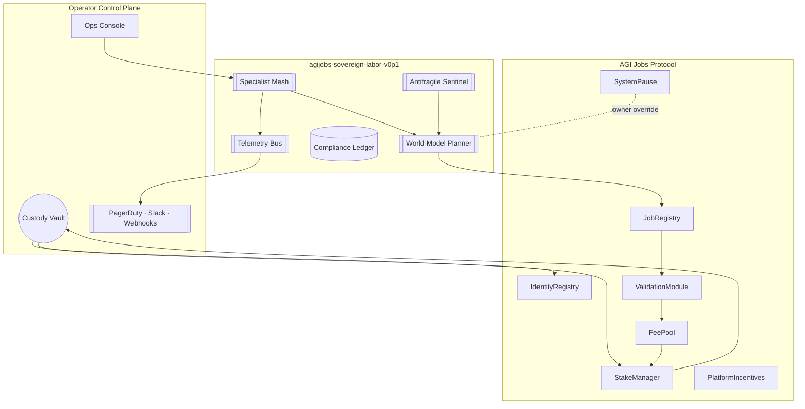

# AGI Alpha Node v0 · Sovereign Labor Intelligence

<!-- markdownlint-disable MD013 MD033 -->
<p align="center">
  
</p>

<p align="center">
  <a href="https://github.com/MontrealAI/AGI-Alpha-Node-v0/actions/workflows/ci.yml">
    
  </a>
  <a href="docs/README.md"></a>
  <a href="https://app.ens.domains/name/alpha.node.agi.eth"></a>
  <a href="https://etherscan.io/token/0xa61a3b3a130a9c20768eebf97e21515a6046a1fa"></a>
  <a href="LICENSE"></a>
</p>

> **agijobs-sovereign-labor-v0p1** is the flagship sovereign labor machine: it absorbs work, compounds $AGIALPHA, and leaves its owner with total operational supremacy.

---

## Navigation

1. [Mission Pulse](#mission-pulse)
2. [Quick Launch Vector](#quick-launch-vector)
3. [Architecture Snapshot](#architecture-snapshot)
4. [Identity, Staking & Treasury](#identity-staking--treasury)
5. [Intelligence & Autonomy Stack](#intelligence--autonomy-stack)
6. [Governance & Safety Controls](#governance--safety-controls)
7. [Continuous Integration & Branch Protection](#continuous-integration--branch-protection)
8. [Repository Layout](#repository-layout)
9. [Contributing](#contributing)
10. [License](#license)

---

## Mission Pulse

- **Production focus** – Hardened documentation, deterministic quality gates, and custody-aware controls allow non-technical owners to launch within minutes.
- **Identity rigor** – Every runtime must control an ENS signature `⟨label⟩.alpha.node.agi.eth`; the machine self-checks ownership on boot, heartbeat, and before settlement.
- **Unified economy** – `$AGIALPHA` (`0xa61a3b3a130a9c20768eebf97e21515a6046a1fa`, 18 decimals) powers staking, slashing, rewards, and reinvestment. No ETH settlement paths exist in production flows.
- **Owner supremacy** – Governance levers cover min-stake thresholds, emission splits, pausing, module upgrades, and delegate rotation.
- **Outcome** – Deterministic world-model planning, antifragile stress harnesses, and auto-reinvestment loops keep wealth compounding and reputation accelerating.

> Dive deeper in the [Operator Command Codex](docs/README.md).

---

## Quick Launch Vector

```bash
git clone https://github.com/MontrealAI/AGI-Alpha-Node-v0.git
cd AGI-Alpha-Node-v0
npm ci
npm run lint   # mirrors Continuous Integration
```

1. Secure your ENS subdomain under `alpha.node.agi.eth` and map resolver/wrapper ownership to the operator wallet.
2. Register delegate keys with `IdentityRegistry.setAdditionalNodeOperator` if using multisig or HSM custody.
3. Fund the operator wallet with `$AGIALPHA` plus gas, approve Stake Manager allowances, then execute `PlatformIncentives.stakeAndActivate(amount)` (or `_acknowledgeStakeAndActivate`).
4. Deploy the runtime via container, Kubernetes, or enclave workflows described in the [codex](docs/README.md#system-constellation).
5. Enforce GitHub branch protections: require **Continuous Integration** on every PR and `main` push so the badge stays green.

---

## Architecture Snapshot



---

## Identity, Staking & Treasury

- `verifyNode(label, proof)` locks every runtime to its ENS identity and halts if resolver/NameWrapper ownership diverges.
- `PlatformIncentives.stakeAndActivate(amount)` sequences allowance, deposit, registry enrollment, and job router registration in one transaction.
- `StakeManager.slash(role, operator, treasuryShare, burnShare)` routes penalties instantly according to owner-set ratios; withdrawals use `StakeManager.withdrawStake` after cooldowns.
- `PlatformRegistry.setMinPlatformStake(amount)` and `StakeManager.setMinStake(role, amount)` let owners raise or lower thresholds dynamically.
- Rewards stream through job escrow (`StakeManager.release`) and epoch emissions (`FeePool.claimRewards`) with optional autopilot reinvestment.

---

## Intelligence & Autonomy Stack

- **World-model planner** – Multi-armed bandit simulations forecast ROI, curriculum fit, and specialist synergy before any bid is placed.
- **Specialist mesh** – Deterministic micro-agents (finance, legal, infra, biotech, creative, compliance) coordinate through an orchestrator with sub-millisecond overhead.
- **Antifragile sentinel** – Stress harness escalates guardrails, tunes difficulty cursors, and ensures volatility drives improvement rather than regression.
- **Compliance ledger** – Structured reasoning traces are hashed for disputes, audits, and regulatory inspection.
- **Autopilot evolution** – Curriculum learning and reinvestment loops expand stake weight, routing priority, and intelligence without manual babysitting.

---

## Governance & Safety Controls

- `SystemPause.pauseAll()` and `unpauseAll()` give owners immediate stop/resume authority across Job Registry, Stake Manager, Validation Module, and allied components.
- Emission tuning flows through `RewardEngineMB.setRoleShare(role, shareBps)` and validator percentage setters.
- `PlatformRegistry.register()` / `deregister()` plus Identity Registry allowlists enable rapid operator rotation or quarantine of compromised keys.
- Module endpoints such as `PlatformRegistry.setReputationEngine` and `JobRegistry.setValidationModule` allow safe upgrades under owner signatures.
- Commit-reveal validation and dispute hooks provide verifiable arbitration without sacrificing autonomy or speed.

---

## Continuous Integration & Branch Protection

- [`Continuous Integration`](.github/workflows/ci.yml) runs on every push and pull request targeting `main`, executing `npm ci`, Markdown linting, and link verification.
- Keep the badge green: reproduce the workflow locally with `npm ci` followed by `npm run lint` before opening a PR.
- Enforce “Require status checks to pass before merging” and select **Continuous Integration** inside GitHub Branch Protection settings.
- Surface CI status in PR templates and release checklists so every deploy stays auditable.

---

## Repository Layout

```text
AGI-Alpha-Node-v0/
├── 1.alpha.node.agi.eth.png      # Iconic crest (PNG)
├── 1.alpha.node.agi.eth.svg      # Iconic crest (SVG)
├── .github/
│   └── workflows/
│       └── ci.yml                # Continuous Integration workflow
├── docs/
│   └── README.md                 # Operator command codex
├── package.json                  # Lint scripts and metadata
├── package-lock.json             # Deterministic npm lockfile
└── README.md                     # This mission brief
```

---

## Contributing

1. Fork or branch from `main`.
2. Run `npm ci` before editing to sync tooling.
3. Update documentation and diagrams alongside any change.
4. Run `npm run lint` and ensure **Continuous Integration** passes before requesting review.
5. Maintain ENS, staking, and governance narratives—this repository is documentation-first.

---

## License

Distributed under the [MIT License](LICENSE). Use responsibly, keep the badge green, and continue compounding.
