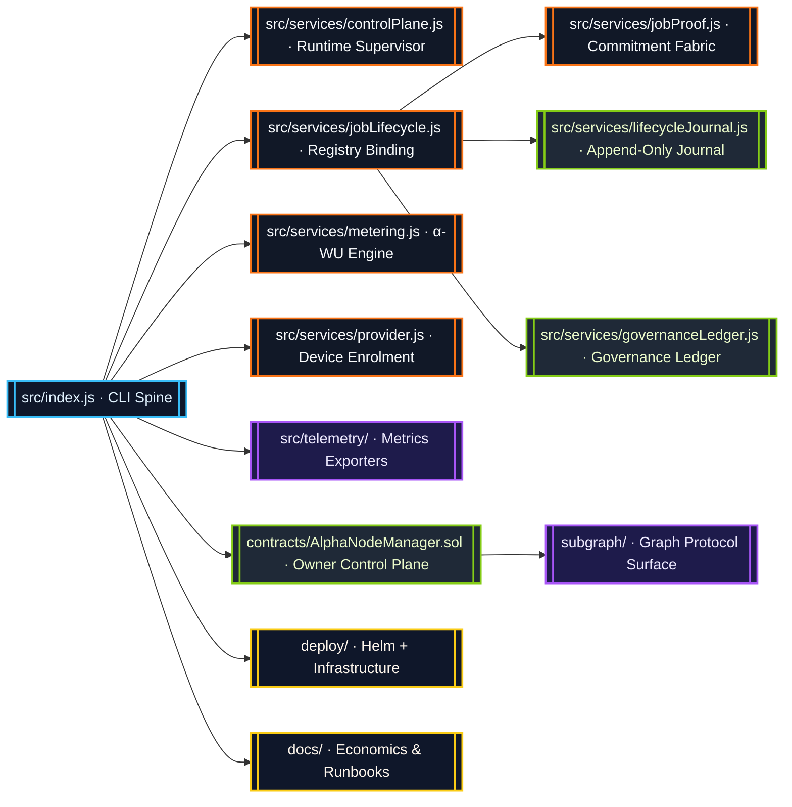
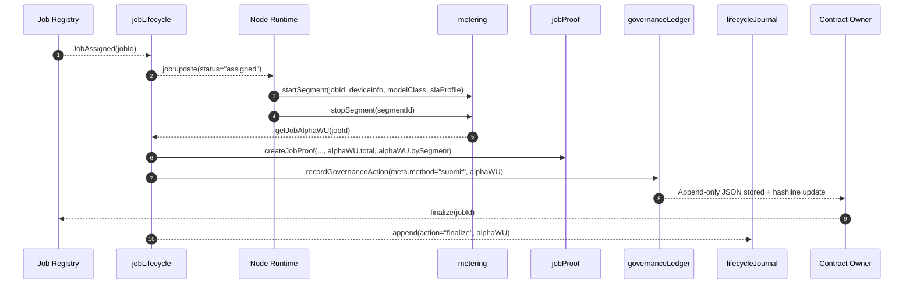

# AGI Alpha Node v0 · Sovereign Cognition Orchestrator ⚡

<!-- markdownlint-disable MD013 MD033 -->
<p align="center">
  <picture>
    <source srcset="1.alpha.node.agi.eth.svg" type="image/svg+xml" />
    
  </picture>
</p>

<p align="center">
  <a href="https://github.com/MontrealAI/AGI-Alpha-Node-v0/actions/workflows/ci.yml">
    
  </a>
  
  
  
  <a href="Dockerfile">
    
  </a>
  <a href="deploy/helm/agi-alpha-node">
    
  </a>
  <a href="docs/subgraph-deployment.md">
    
  </a>
  <a href="https://etherscan.io/address/0xa61a3b3a130a9c20768eebf97e21515a6046a1fa">
    
  </a>
  <a href="LICENSE">
    
  </a>
</p>

> AGI Alpha Node v0 unifies deterministic intelligence, blockchain truth, and instrumented governance into a single owner-commanded presence. It already moves capital markets by design.

---

## Table of Contents

1. [Mission Vector](#mission-vector)
2. [System Constellation](#system-constellation)
3. [Execution Spine](#execution-spine)
4. [Subsystem Atlas](#subsystem-atlas)
5. [α-Work Unit Intelligence](#α-work-unit-intelligence)
6. [Lifecycle Journal & Governance Ledger](#lifecycle-journal--governance-ledger)
7. [Owner Command Surface](#owner-command-surface)
8. [Operational Playbook](#operational-playbook)
9. [Continuous Verification](#continuous-verification)
10. [Token & Economics](#token--economics)
11. [Reference Library](#reference-library)

---

## Mission Vector

AGI Alpha Node v0 exists as the production-grade cognition lattice for orchestrating autonomous agent workstreams. Every module is optimized so the contract owner can reroute computation, rewards, and governance within seconds while retaining perfect auditability.

* **Canonical Token:** `$AGIALPHA` (18 decimals) is immutably deployed at [`0xa61a3b3a130a9c20768eebf97e21515a6046a1fa`](https://etherscan.io/address/0xa61a3b3a130a9c20768eebf97e21515a6046a1fa) and backs staking, rewards, and control-plane directives.
* **Owner Totality:** Contracts, runtime, and governance surfaces expose parameter updates, pausing, validator rotation, ENS rebinding, reward extraction, SLA tuning, and stake direction without requiring custodial intermediaries.
* **Deterministic Metering:** α-work units (α-WU) track GPU minutes, device quality, and SLA weights. Completion instantly resolves `getJobAlphaWU(jobId)`, embedding totals and per-segment analytics everywhere the job record flows.
* **Operator UX:** Docker images, Helm charts, Graph Protocol mappings, and CI pipelines are tuned so a non-technical owner can deploy, verify, and enforce governance quickly.

---

## System Constellation



---

## Execution Spine



Completion events always trigger `getJobAlphaWU(jobId)` before the job record, proof payload, journal entry, or governance ledger write is persisted. This keeps α-WU totals and per-segment quality metrics synchronized across every subsystem.

---

## Subsystem Atlas

| Surface | Description |
| --- | --- |
| [`src/`](src) | Node.js runtime, deterministic execution loop, α-WU metering, lifecycle orchestration, governance ledger, telemetry exporters, and CLI entrypoint. |
| [`contracts/`](contracts) | Solidity management plane centred on `AlphaNodeManager` with owner-governed pausing, configuration updates, stake custody, and treasury extraction. |
| [`docs/`](docs) | Economics analyses, telemetry atlases, staking mechanics, and operator runbooks (see [`docs/README.md`](docs/README.md)). |
| [`deploy/`](deploy) | Helm chart, Kubernetes manifests, Docker build context, and automation for production rollout. |
| [`scripts/`](scripts) | CI gates, governance tooling, policy verification, and simulation harnesses. |
| [`subgraph/`](subgraph) | Graph Protocol mappings surfacing α-WU emissions, governance events, and leaderboards. |
| [`test/`](test) | Vitest suites covering lifecycle, governance, staking surfaces, and metering primitives. |

---

## α-Work Unit Intelligence

```mermaid
graph TD
  classDef compute fill:#0f172a,stroke:#38bdf8,color:#e0f2fe;
  classDef store fill:#1f2937,stroke:#84cc16,color:#ecfccb;

  Start[startSegment(jobId, deviceInfo, modelClass, slaProfile)]:::compute --> Active[(Active Segment Cache)]:::store
  Active --> Stop[stopSegment(segmentId)]:::compute
  Stop --> Totals[(Job & Epoch Totals)]:::store
  Totals --> Summary[buildJobAlphaSummary(jobId)]:::compute
  Summary --> LifecycleAlpha[[Lifecycle alphaWU Attachment]]:::compute
  Summary --> ProofAlpha[[Proof.alphaWU]]:::compute
  Summary --> LedgerAlpha[[Governance.meta.alphaWU]]:::compute
  Totals --> Metrics[[alphaWorkUnits.getMetrics()]]:::compute
```

Key interfaces:

* `getJobAlphaWU(jobId)` – raw α-WU total for a job; executed synchronously on completion.
* `getJobAlphaSummary(jobId)` – totals, segment forensics, model-class breakdown, SLA breakdown.
* `getGlobalAlphaSummary()` – network-wide aggregates for governance context.
* `getEpochAlphaWU(epochId)` – epoch buckets for staking policy enforcement.

Segment snapshots preserve device class, VRAM tier, GPU count, quality multiplier, and timestamps for post-hoc economics and compliance.

---

## Lifecycle Journal & Governance Ledger

```mermaid
graph LR
  classDef ledger fill:#1f2937,stroke:#84cc16,color:#ecfccb;
  classDef audit fill:#111827,stroke:#f97316,color:#f8fafc;

  Metering[/Metering State/] -->|getJobAlphaSummary|get Lifecycle{{Job Record}}:::audit
  Lifecycle --> Journal[(Lifecycle Journal)]:::ledger
  Lifecycle --> Proofs[(Proof Payload)]:::audit
  Lifecycle --> Governance[(Governance Ledger)]:::ledger
  Governance --> Hash[Rolling Hash Integrity]
  Journal --> Hash
```

* Journal entries derive from `buildActionEntry` and ship the exact α-WU totals, per-segment analytics, and quality breakdown used at runtime.
* Governance ledger entries triggered by submissions, stake movements, or reward receipts now embed `meta.alphaWU = { total, bySegment, modelClassBreakdown, slaBreakdown, breakdown, quality, qualityBreakdown }`, keeping the economic rationale inseparable from the transaction log.
* The ledger is append-only under `.governance-ledger/v1/`; filenames include ISO timestamps and UUIDs so tampering is immediately obvious.

---

## Owner Command Surface

The owner retains complete, immediate control across smart contracts and runtime:

* **Job Lifecycle Overrides:** Force assignment, finalize, cancel, or reseat validators directly via `jobLifecycle` helpers or on-chain calls.
* **Parameter Updates:** Modify staking weights, SLA coefficients, reward curves, and governance rules through the `AlphaNodeManager` owner functions and CLI wrappers.
* **Emergency Controls:** Pause/unpause registries, update ENS metadata, rotate signers, and redirect rewards in a single transaction.
* **Observability:** Prometheus metrics (`src/telemetry/`), lifecycle journals, and governance ledgers render the entire system auditable in real time.
* **Interoperability:** Subgraph surfaces, REST-compatible telemetry, and CLI commands allow coordination with external agents and swarms without code changes.

---

## Operational Playbook

```bash
# 1. Install dependencies
npm ci

# 2. Run the runtime locally (loads `.env` when present)
npm start

# 3. Execute deterministic workloads (see docs/runbook)
node src/index.js jobs run --registry <JOB_REGISTRY_ADDRESS>

# 4. Capture governance actions
node src/index.js governance record --method submit --job <JOB_ID>
```

Additional recipes:

* **Docker:** `docker build -t agi-alpha-node:latest .`
* **Helm:** `helm install agi-node deploy/helm/agi-alpha-node`
* **Subgraph Simulation:** `npm run simulate:subgraph`
* **Secret Management:** Review [`src/services/secretManager.js`](src/services/secretManager.js) for KMS-compatible sealing.

---

## Continuous Verification

| Gate | Command | Purpose |
| --- | --- | --- |
| Markdown + Links | `npm run lint` | Style + documentation link integrity. |
| Vitest | `npm test` | Runtime, lifecycle, governance, and metering suites. |
| Coverage | `npm run coverage` | Generates LCOV + summary for CI badge pipelines. |
| Solidity | `npm run ci:solidity` | `solhint` + `solcjs` validation for `contracts/`. |
| Type & Manifest | `npm run ci:ts` | Subgraph manifest rendering + build. |
| Security | `npm run ci:security` | `npm audit --omit=dev --audit-level=high`. |
| Policy Gates | `npm run ci:policy` & `npm run ci:branch` | Health + branch protections for PRs. |
| Full CI | `npm run ci:verify` | Aggregates every gate; enforced by `.github/workflows/ci.yml` & `.github/required-checks.json`. |

The GitHub Actions workflow exposes all checks publicly; PRs and `main` must stay green before merges land.

---

## Token & Economics

* `$AGIALPHA` is the unit of account, minted and circulated through the staking + rewards engine. On-chain contract: [`0xa61a3b3a130a9c20768eebf97e21515a6046a1fa`](https://etherscan.io/address/0xa61a3b3a130a9c20768eebf97e21515a6046a1fa).
* Economics, reward schedules, and α-WU calibration live under [`docs/economics.md`](docs/economics.md) and related dossiers.
* Governance ledger metadata now records α-WU totals and quality breakdowns for every submit, stake adjustment, or reward capture so economic flows stay provable.

---

## Reference Library

* [`docs/README.md`](docs/README.md) – Documentation hub and navigation.
* [`docs/manifesto.md`](docs/manifesto.md) – Strategic framing for the network flywheel.
* [`docs/subgraph-deployment.md`](docs/subgraph-deployment.md) – Graph Protocol deployment steps.
* [`deploy/helm/agi-alpha-node`](deploy/helm/agi-alpha-node) – Kubernetes-ready Helm chart.
* [`scripts/verify-health-gate.mjs`](scripts/verify-health-gate.mjs) – CI policy enforcement.
* [`test/`](test) – Vitest coverage for lifecycle, governance, and economics invariants.

Own the cognition lattice. Direct the swarm. Capture the delta.
