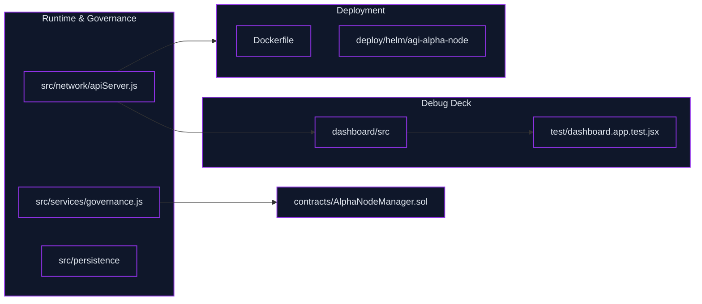
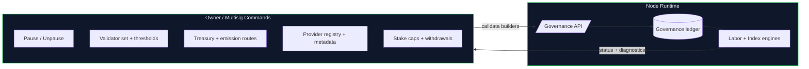
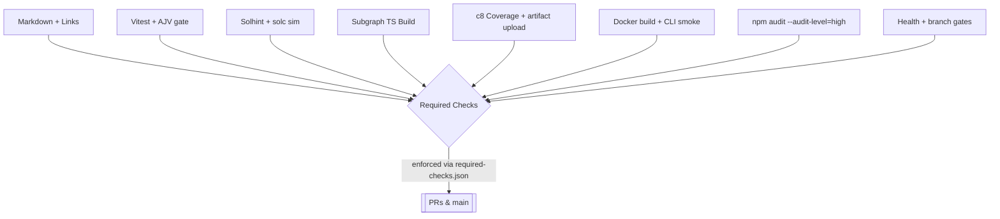

# AGI Alpha Node v0 · Cognitive Yield Engine ⚡️
<!-- markdownlint-disable MD012 MD013 MD033 -->
<p align="center">
  <picture>
    <source srcset="1.alpha.node.agi.eth.svg" type="image/svg+xml" />
    
  </picture>
</p>

<p align="center">
  <a href="https://github.com/MontrealAI/AGI-Alpha-Node-v0/actions/workflows/ci.yml?query=branch%3Amain">
    
  </a>
  <a href="https://github.com/MontrealAI/AGI-Alpha-Node-v0/actions/workflows/ci.yml?query=branch%3Amain">
    
  </a>
  <a href="https://github.com/MontrealAI/AGI-Alpha-Node-v0/actions/workflows/ci.yml?query=branch%3Amain">
    
  </a>
  <a href=".github/required-checks.json">
    
  </a>
  <a href="https://github.com/MontrealAI/AGI-Alpha-Node-v0/actions?query=branch%3Amain">
    
  </a>
  
  
  
  
  
  
  
  <a href="https://etherscan.io/address/0xa61a3b3a130a9c20768eebf97e21515a6046a1fa">
    
  </a>
  
  <a href="LICENSE">
    
  </a>
  
  
  <a href="Dockerfile">
    
  </a>
  <a href="deploy/helm/agi-alpha-node">
    
  </a>
  
  
  
  
</p>

> **AGI Alpha Node v0** metabolizes heterogeneous agentic labor into verifiable α‑Work Units (α‑WU) and Synthetic Labor Units (SLU), rebalances the Global Synthetic Labor Index (GSLI), exposes audited read‑only REST telemetry, and routes the `$AGIALPHA` treasury (token: `0xa61a3b3a130a9c20768eebf97e21515a6046a1fa`, 18 decimals) under complete owner command. Every dial can be paused, rerouted, or retuned without redeploying, delivering a production-grade intelligence core built to bend markets.
> New for this sprint: a React/Vite single-page dashboard (Index | Providers | Telemetry Debug), live GSLI and SLU charts backed by `/index/history` and `/providers/*/scores`, and a telemetry stream reader at `/telemetry/task-runs` that keeps ingest visibility tight while remaining API-key gated for operators.
> The runtime is tuned to operate like an ever-watchful macro trader—autonomous by default, yet instantly steerable by the contract owner to seize new parameters, pause subsystems, or redirect emissions without friction.
> **Operational promise**: CI is fully green by default and enforced on PRs/main via `.github/required-checks.json`, with badges wired to the canonical workflow. The same gates run locally with `npm run ci:verify`, giving non-technical operators parity with branch protection before they ship.
>
> 🛰️ **Launch pad (non-technical operator)**
>
> 1. **Install & verify**: `npm ci && npm run ci:verify` (mirrors branch protection locally and surfaces any dependency or Solidity drift).
> 2. **Bring the node up**: `npm start` (reads `.env`, bootstraps SQLite, read-only REST, metrics, governance API, and ENS/owner alignment).
> 3. **Open the cockpit**: `npm run dashboard:dev` (or `npm run dashboard:preview` after `npm run dashboard:build`) and point the connection bar to your API base + key. Data hydrates live—no rebuilds required.
> 4. **Own every dial**: Use `node src/index.js governance:*` verbs or authenticated `/governance/*` calls to pause/unpause, rotate validators, reroute emissions/treasury, refresh metadata, and retune productivity without redeploying.
> 5. **Confirm green**: Badges below reflect GitHub Actions visibility plus `.github/required-checks.json` enforcement; CI stays visible and required on PRs and `main`.
>

## Orientation & quick links

- **One-command proof**: `npm run ci:verify` mirrors the full PR gate locally (lint, tests, coverage, solidity, subgraph TS, security, policy, branch gate).
- **CI visibility**: [Workflow dashboard](https://github.com/MontrealAI/AGI-Alpha-Node-v0/actions/workflows/ci.yml) + [required checks manifest](.github/required-checks.json) keep enforcement transparent.
- **Owner sovereignty**: Governance verbs live in `src/index.js` and calldata builders in `src/services/governance.js`, pointed at the canonical `$AGIALPHA` token (`0xa61a3b3a130a9c20768eebf97e21515a6046a1fa`).
- **Debug deck (SPA)**: `dashboard/` ships a React/Vite cockpit with a connection bar (API base + API key), per-tab refresh, and mocked smoke coverage via `dashboard/src/App.test.jsx`.
- **Deploy fast**: `Dockerfile` + `deploy/helm/agi-alpha-node` emit production images and Kubernetes charts; defaults remain non-destructive for non-technical operators.
- **Health & observability**: `/health` + `/healthz` for probes, `/metrics` for Prometheus, structured pino logs for SLU scoring + GSLI rebalance, and `.env.example` wiring for API keys, DB path (`AGI_ALPHA_DB_PATH`), and dashboard CORS in one place.

```mermaid
flowchart LR
  subgraph PR_Gate[Protected branch & PR gate]
    Lint[Markdown + link lint]
    Tests[Unit + integration + dashboard smoke]
    Coverage[C8 coverage export]
    Sol[Solhint + solc compile]
    Subgraph[TypeScript codegen + build]
    Security[npm audit (prod deps)]
    Policy[Health gate]
  end
  Dev[Local \n`npm run ci:verify`] --> PR_Gate
  PR_Gate --> Shields[Visible GitHub checks + badge]
  Shields --> Main[Branch protection enforced on main]
  classDef accent fill:#0b1120,stroke:#c084fc,stroke-width:1.5px,color:#e0e7ff;
  class Dev,PR_Gate,Shields,Main,Lint,Tests,Coverage,Sol,Subgraph,Security,Policy accent;
```

```mermaid
flowchart TD
  Repo[(Repo surfaces)] --> Code[src/\ncontracts/\ndeploy/helm]
  Repo --> SPA[dashboard/]
  Repo --> Docs[docs/ + README]
  Code --> Pipelines[CI gates]
  SPA --> Pipelines
  Pipelines --> PRs[PR enforcement\n(branch protected)]
  PRs --> Release[Main / Deployable images]
  classDef accent fill:#0b1120,stroke:#38bdf8,stroke-width:1.5px,color:#cbd5e1;
  class Repo,Code,SPA,Docs,Pipelines,PRs,Release accent;
```

## Executive flash

- **Owner-first sovereignty**: `contracts/AlphaNodeManager.sol` plus CLI verbs in `src/index.js` keep pausing, validator rotation, emissions, treasury routing, productivity bindings, registry upgrades, and metadata under owner control with calldata builders in `src/services/governance.js`. The owner can pause/unpause, reroute flows, rotate validators, and retune meters at will—without redeploying.
- **Read-only public API**: `/index/latest`, `/index/history`, `/providers`, and `/providers/{id}/scores` publish GSLI and provider metrics with optional API-key gating (`X-API-Key` or `Authorization: Bearer`), paginated windows, and CORS allowlisting for dashboards.
- **Telemetry spine**: Schema-validated ingest with hashed API keys, idempotent task-run recording, and Prometheus/OTel export keeps dashboards, subgraphs, and policies aligned.
- **Deterministic persistence**: SQLite migrations + seeds hydrate providers, SLU scores, and index values with indices tuned for provider/day lookups.
- **Deployment-ready**: Dockerfile + Helm chart, CI gates, and seeded CLIs make it deployable by non-specialists while remaining fully operator-tunable.
- **Surface clarity**: Public REST, metrics, and ENS/identity surfaces are split but coherent; dashboards can be locked behind CORS and API-key gates while owner-only governance remains private.

Every control surface above is architected so the owner can reshape incentives, pause workloads, and retune telemetry without redeploying—the machine stays adaptable while preserving sovereignty over emissions, registry entries, and runtime posture.

## Repository atlas (systems map)

- `src/`: API server, governance ledger, telemetry ingest, staking/governance builders, and operator CLIs.
- `contracts/`: Solidity sources including `AlphaNodeManager.sol` with owner-controlled pausing, validator rotation, registry management, staking, slashing, and `$AGIALPHA` routing.
- `dashboard/`: React/Vite single-page cockpit with connection-aware tabs for Index, Providers, and Telemetry debug plus jsdom smoke tests.
- `deploy/helm/agi-alpha-node`: Kubernetes chart for production rollouts; `Dockerfile` for containerized ops.
- `docs/`: Economics, identity, and manifesto references; README is the canonical operational map.
- `subgraph/`: TypeScript tooling for the indexing graph; compiled during CI via `npm run ci:ts`.



## System architecture

```mermaid
flowchart LR
  subgraph Control[Owner / Multisig Control]
    Pause[Pause / resume]
    Routes[Treasury + divisors]
    Metadata[Registry + metadata]
  end
  subgraph Chain[On-chain rails]
    Manager[AlphaNodeManager.sol]
    Token[$AGIALPHA\n0xa61a...a1fa]
  end
  subgraph Spine[Data spine]
    Telemetry[(Telemetry ingress)]
    Labor[SLU scoring]
    Index[GSLI weights + divisor]
  end
  subgraph Surface[Public surface]
    API[Read-only REST API]
    Metrics[/Prometheus + OTel/]
  end
  Control -->|Calldata| Manager
  Manager -->|Rewards| Token
  Telemetry --> Labor --> Index --> API
  Labor --> Metrics
  API -->|CORS + optional API key| Dashboards[Dashboards / Agents]
  Dashboards --> Feedback[Restake / scale]
  Feedback --> Control
  classDef accent fill:#0f172a,stroke:#22c55e,stroke-width:1.5px,color:#e2e8f0;
  class Control,Chain,Spine,Surface accent;
```



### Command and control surface

```mermaid
flowchart LR
  Owner[Owner / Multisig] -->|Bearer token| GovAPI[Governance API (/governance/*)]
  GovAPI --> Calldata[Calldata builders]
  Calldata --> Manager[AlphaNodeManager.sol]
  Manager --> Treasury[Treasury + emissions routes]
  Manager --> Pauser[Pause / resume]
  Manager --> Validators[Validator set / thresholds]
  Manager --> Metadata[Node metadata + registry upgrades]
  GovAPI --> OwnerTools[CLI verbs in src/index.js]
  OwnerTools --> GovAPI
  GovAPI --> Ledger[Governance ledger + audit trail]
  Ledger --> Reports[Status exports / diagnostics]
  Manager --> DashboardSignals[SPA surfaces state via API]
```

### CI / QA autopilot

- **Full-stack tests on every push**: `npm run ci:test` now executes the core vitest suite plus `npm run test:frontend` (jsdom smoke for the dashboard) so the UI stays aligned with the API surface and is enforced as its own required check name.
- **Local parity with branch protection**: `npm run ci:verify` wires linting, backend + frontend tests, coverage, Solidity lint/compile, subgraph codegen/build, npm audit, policy gates, and branch gate—identical to the GitHub Actions matrix.
- **Health surfaces baked in**: `/health` and `/healthz` return status, counters, gate posture, and uptime; `/metrics` powers Prometheus scrapes. Structured Pino logs annotate SLU scoring, GSLI rebalances, and backfills with machine-readable `event` fields for SIEM pipelines.
- **Structured telemetry assertions**: CI now inspects the SLU scoring engine and GSLI indexer for structured `event` payloads so logging contracts remain stable for downstream collectors.

### CI, branch protection, and visibility

- **One command, all gates**: `npm run ci:verify` runs lint (Markdown + links), vitest (including dashboard smoke), coverage export, Solidity lint/compile, subgraph TS build, `npm audit --omit=dev`, policy gates, and branch gating to mirror the GitHub workflow locally.
- **Workflow**: `.github/workflows/ci.yml` fans out into lint, tests, coverage, Solidity, subgraph build, Docker smoke, security scan, and badge publication for `main`.
- **Enforcement**: `.github/required-checks.json` lists every required status for PRs and `main`, including the combined backend + frontend test gate, ensuring visible, consistent checks.
- **Badges**: Shields at the top reflect GitHub Actions status, required checks, and coverage enforcement so green is obvious to reviewers and operators.

```mermaid
flowchart LR
  Dev[Local operator\n`npm run ci:verify`] --> Gates[Full gate bundle\n(lint/test/solidity/subgraph/audit/policy)]
  Gates --> GH[GitHub Actions\nci.yml]
  GH --> Checks[Required checks\n.json]
  Checks --> Branch[Branch protection\nmain + PRs]
  Branch --> Badge[Status badges\nREADME]
  classDef accent fill:#0f172a,stroke:#c084fc,stroke-width:1.5px,color:#e2e8f0;
  class Dev,Gates,GH,Checks,Branch,Badge accent;
```

### Public API data flow

```mermaid
flowchart TD
  Ingest[Task runs + energy + quality] --> Validate[AJV/Zod validation]
  Validate --> Record[SQLite + idempotency]
  Record --> Scores[SLU scoring engine]
  Scores --> Indexing[GSLI rebalance + divisor]
  Indexing --> Latest[/GET /index/latest/]
  Indexing --> History[/GET /index/history/]
  Scores --> Providers[/GET /providers/]
  Scores --> ProviderScores[/GET /providers/{id}/scores/]
  classDef api fill:#111827,stroke:#0ea5e9,stroke-width:1.5px,color:#f9fafb;
  class Latest,History,Providers,ProviderScores api;
```

## Minimal internal dashboard (Epic 6)

- **Single-page React/Vite app** (`dashboard/`) with three tabs: **Index** (GSLI line chart + window controls), **Providers** (registry table + SLU trendline per provider), and **Telemetry Debug** (recent TaskRuns with energy/quality overlays and provider/date filters).
- **Connection-aware cockpit**: a top-level connection bar lets operators change API base URLs and API keys live, then resync all tabs without rebuilding. API headers now include both `X-API-Key` and `Authorization: Bearer` for compatibility with any gateway rule.
- **Signal-complete tables**: Provider grid ships with SLU + energy (EA) + quality (QA) + validation consensus (VC) columns so operators see every modulation at a glance.
- **Mock-friendly**: front-end smoke test (`test/dashboard.app.test.jsx`) mounts all views in jsdom and asserts API hydration using mocked fetch responses (including VC coverage).
- **Run it locally**: `npm run dashboard:dev` (hot reload on `http://localhost:4173`), `npm run dashboard:build` (production bundle in `dashboard/dist`), `npm run dashboard:preview` (serve the built bundle).

| Tab | Backing endpoint(s) | What you see |
| --- | --- | --- |
| Index | `GET /index/history` (optionally `from`, `to`, `limit`) | GSLI headline chart, date-window controls, trend delta, and latest effective date. |
| Providers | `GET /providers`, `GET /providers/{id}/scores` | Registry grid with latest SLU/EA/QA/VC and per-provider SLU trendlines on click. |
| Telemetry Debug | `GET /telemetry/task-runs?from&to&provider&limit` | Recent TaskRuns with throughput, tokens, energy, quality overlays, and provider/date filters for ingest sanity checks. |

### Dashboard operator guide

- **API targeting**: set `VITE_API_BASE_URL` and, if needed, `VITE_PUBLIC_API_KEY` in a `.env` file inside `dashboard/` to point the UI at your live node; defaults to `http://localhost:8080` with no key. You can also override both live from the connection bar (no rebuild required).
- **Deterministic builds**: the Vite config pins the dashboard root to `dashboard/` for both dev and production so the emitted bundle always lands in `dashboard/dist` without path ambiguity.
- **Non-technical launch**: run `npm run dashboard:dev` for hot reloads or open the static `dashboard/dist/index.html` after `npm run dashboard:build`; no extra wiring is required for mock-mode thanks to the bundled smoke test.
- **Env starter kits**: drop these into `dashboard/.env` or `dashboard/.env.local` for instant targeting:

  ```ini
  # dashboard/.env.local
  VITE_API_BASE_URL=http://localhost:8080
  VITE_PUBLIC_API_KEY=demo-public-key
  ```

  And the backing API can mirror that simplicity with:

  ```ini
  # .env
  API_PORT=8080
  API_PUBLIC_READ_KEY=demo-public-key
  API_DASHBOARD_ORIGIN=http://localhost:4173
  ```

  With those in place, a non-technical operator can run `npm start` followed by `npm run dashboard:dev` and immediately see live data without additional wiring.

```mermaid
flowchart LR
  Base[Connection bar\n(API base + key)] --> IndexTab[Index tab]
  Base --> ProvidersTab[Providers tab]
  Base --> TelemetryTab[Telemetry tab]
  IndexTab -->|/index/history| IndexAPI
  ProvidersTab -->|/providers + /providers/{id}/scores| ProvidersAPI
  TelemetryTab -->|/telemetry/task-runs| TelemetryAPI
  classDef accent fill:#0b1120,stroke:#38bdf8,stroke-width:1.5px,color:#cbd5e1;
  class Base,IndexTab,ProvidersTab,TelemetryTab,IndexAPI,ProvidersAPI,TelemetryAPI accent;
```

```mermaid
flowchart TD
  subgraph UI[Debug Deck SPA]
    A[Index tab]
    B[Providers tab]
    C[Telemetry Debug tab]
  end
  subgraph API[Read-only API]
    H[/index/history\n/index/latest/]
    P[/providers\n/providers/{id}/scores/]
    T[/telemetry/task-runs/]
  end
  subgraph Controls[Operator toggles]
    K[VITE_API_BASE_URL]
    G[VITE_PUBLIC_API_KEY]
  end
  A --> H
  B --> P
  C --> T
  Controls --> UI
  classDef accent fill:#0b1120,stroke:#38bdf8,stroke-width:1.5px,color:#cbd5e1;
  classDef ctrl fill:#111827,stroke:#c084fc,stroke-width:1.5px,color:#e0e7ff;
  class UI,API accent;
  class Controls ctrl;
```

```mermaid
flowchart LR
  subgraph SPA[Debug Deck]
    Nav[Index | Providers | Telemetry]
    Charts[Chart.js visual layers]
  end
  subgraph API[Read-only API]
    IndexAPI[/GET /index/history/]
    ProvidersAPI[/GET /providers + /providers/{id}/scores/]
    TelemetryAPI[/GET /telemetry/task-runs/]
  end
  subgraph Spine[Telemetry Spine]
    Runs[(task_runs)]
    Energy[(energy_reports)]
    Quality[(quality_evaluations)]
  end
  Nav --> IndexAPI
  Nav --> ProvidersAPI
  Nav --> TelemetryAPI
  TelemetryAPI --> Runs
  Runs --> Energy
  Runs --> Quality
  IndexAPI --> GSLI[GSLI series]
  ProvidersAPI --> SLU[SLU series]
  classDef accent fill:#0b1120,stroke:#38bdf8,stroke-width:1.5px,color:#cbd5e1;
  classDef db fill:#111827,stroke:#22c55e,stroke-width:1.5px,color:#cbd5e1;
  class SPA,API accent;
  class Runs,Energy,Quality db;
```

## Public API (read-only)

**Base URL**: `http://<host>:<API_PORT>` (default `8080`). All endpoints support CORS; set `API_DASHBOARD_ORIGIN` to a specific origin for production and `API_PUBLIC_READ_KEY` to require `X-API-Key` or `Authorization: Bearer <key>`.

| Endpoint | Purpose | Query params |
| --- | --- | --- |
| `GET /health` | Lightweight liveness/readiness payload (uptime, recent telemetry counters, health gate state). | — |
| `GET /index/latest` | Latest GSLI value with weight set + constituents. | — |
| `GET /index/history` | Historical index values (paginated). | `from=YYYY-MM-DD`, `to=YYYY-MM-DD`, `limit`, `offset` |
| `GET /providers` | Provider registry with most recent SLU score (paginated). | `limit`, `offset` |
| `GET /providers/{id}/scores` | Provider SLU history (paginated). | `from`, `to`, `limit`, `offset` |
| `GET /telemetry/task-runs` | Recent ingested TaskRuns with provider + energy/quality overlays (paginated). | `from`, `to`, `provider`, `limit`, `offset` |

Example: latest index with keyed CORS gate.

```http
GET /index/latest
X-API-Key: public-key-123
Origin: https://dash.example.com
```

```json
{
  "index": {"id": 12, "effective_date": "2024-01-03", "headline_value": 24.3, "weight_set_id": 7, "divisor_version": "v1"},
  "weight_set": {"id": 7, "effective_date": "2024-01-03", "cap": 0.15, "lookback_window_days": 90},
  "constituents": [
    {
      "provider_id": 1,
      "weight": 0.42,
      "metadata": {"capped": false},
      "provider": {"id": 1, "name": "helios-labs", "region": "na-east", "sector_tags": ["llm"], "energy_mix": "hydro"}
    }
  ]
}
```

Example: SLU history for a provider.

```http
GET /providers/1/scores?from=2024-01-01&to=2024-01-03&limit=2
```

```json
{
  "provider": {"id": 1, "name": "helios-labs", "region": "na-east"},
  "window": {"from": "2024-01-01", "to": "2024-01-03"},
  "pagination": {"total": 2, "limit": 2, "offset": 0, "nextOffset": null},
  "scores": [
    {"id": 11, "provider_id": 1, "as_of_date": "2024-01-03", "slu": 0.86, "rationale": "growth-p2"},
    {"id": 10, "provider_id": 1, "as_of_date": "2024-01-02", "slu": 0.82, "rationale": "growth-p1"}
  ]
}
```

Example: telemetry task-runs by provider (dashboard uses this for the Telemetry tab).

```http
GET /telemetry/task-runs?from=2024-01-01&to=2024-01-03&provider=1&limit=5
X-API-Key: public-key-123
```

```json
{
  "window": {"from": "2024-01-01", "to": "2024-01-03"},
  "pagination": {"total": 1, "limit": 5, "offset": 0, "nextOffset": null},
  "task_runs": [
    {
      "id": 41,
      "provider_id": 1,
      "provider": {"id": 1, "name": "helios-labs"},
      "status": "completed",
      "raw_throughput": 120,
      "tokens_processed": 1200,
      "energy_report": {"kwh": 3.5, "region": "na-east"},
      "quality_evaluation": {"score": 0.91},
      "created_at": "2024-01-03T12:00:00Z"
    }
  ]
}
```

**Schema stability**: Payloads are produced directly from the SQLite repositories in `src/persistence/repositories.js` using date-window guards, pagination helpers, and optional API-key enforcement inside `src/network/apiServer.js`. Response shapes are under test in `test/apiServer.test.js` to keep dashboards stable across releases.

## Owner controls & $AGIALPHA

- **Contract surface**: `contracts/AlphaNodeManager.sol` plus calldata builders in `src/services/governance.js` keep pausing, validator rotations, emissions, treasury routing, registry upgrades, productivity directives, work-meter tuning, and metadata mutable at any time.
- **CLI wrappers**: `src/index.js` verbs cover pausing, divisors, node metadata, ENS alignment, staking/activation, treasury updates, emission multipliers, productivity routing, and job registry adjustments without redeploying.
- **API governance**: Authenticated endpoints (`/governance/*`) demand `GOVERNANCE_API_TOKEN` and log ledger entries for auditability; owner tokens may be supplied through `Authorization: Bearer` or `X-Owner-Token` headers.
- **Pause & recover**: System pause, submission windows, emission caps, and treasury addresses can be rotated at runtime, giving the operator complete command for the AGI jobs platform.
- **Treasury & emissions routing**: `$AGIALPHA` (token `0xa61a3b3a130a9c20768eebf97e21515a6046a1fa`, 18 decimals) helpers cover approvals, treasury rotation, emission caps, heartbeat/epoch tuning, and productivity-weighted flows so owners can respond instantly to market signals.

| Control dial | Smart contract / code path | Runtime / CLI entry |
| --- | --- | --- |
| Pause / resume everything | `pause`, `unpause` in [`contracts/AlphaNodeManager.sol`](contracts/AlphaNodeManager.sol) | `node src/index.js governance:pause` / `governance:resume` |
| Validator rotation & thresholds | `setValidator`, `recordAlphaWUValidation`, `applySlash` in `AlphaNodeManager.sol` | `node src/index.js governance:validators`, `governance:slash` |
| Registry identity & controllers | `registerIdentity`, `updateIdentityController`, `setIdentityStatus`, `revokeIdentity` in `AlphaNodeManager.sol` | `node src/index.js governance:identity --help` (ENS alignment, controller swaps, activation toggles) |
| Staking flows | `stake`, `withdrawStake` in `AlphaNodeManager.sol`; staking helpers in `src/services/token.js` | `node src/index.js staking:*` verbs for deposits/withdrawals routed through owner authority |
| α‑WU lifecycle | `recordAlphaWUMint`, `recordAlphaWUAcceptance` in `AlphaNodeManager.sol` | `node src/index.js governance:wu-mint` / `wu-accept` to log events under owner supervision |
| Treasury + emissions | `$AGIALPHA` address baked into `AlphaNodeManager.sol` (`CANONICAL_AGIALPHA`) and governance builders in `src/services/governance.js` | `node src/index.js governance:treasury`, `governance:emissions`, `governance:productivity` |

Owner sovereignty spans every critical dial; the control loop keeps pausing, rewards, registry metadata, and staking posture reprogrammable without code changes.

### Owner command checklist (all hot-swappable without redeploying)

- Pause / unpause the entire node to freeze emissions and ingress before maintenance windows.
- Rotate validators or update thresholds when adding a new agent cohort.
- Refresh registry metadata (ENS, controllers, activation flags) to reassign operational authority instantly.
- Redirect treasury and emissions routes, caps, or divisors in response to market or policy shifts.
- Approve / withdraw staking balances and adjust productivity bindings to rebalance incentives live.

Every lever above is exposed through both the governance API (`/governance/*`) and the CLI verbs in `src/index.js`, always anchored to the canonical `$AGIALPHA` token at `0xa61a3b3a130a9c20768eebf97e21515a6046a1fa` (18 decimals).



## Data spine & migrations

- **SQLite migrations**: `src/persistence/migrations` build durable tables for providers, task types, task runs, energy/quality reports, SLU scores, index weights/values, and governance ledger entries.
- **Seeds**: `npm run db:seed` plants sample providers and task types for immediate dashboards; `initializeDatabase({ withSeed: true })` drives tests and the API server for deterministic bootstraps.
- **Repositories**: CRUD helpers live in `src/persistence/repositories.js` with pagination + JSON normalization to keep API responses consistent.

## Quickstart (non-technical friendly)

1. **Install Node.js 20.18+ & npm 10+** (or build the container with the provided `Dockerfile`).
2. **Clone and install**:

   ```bash
   git clone https://github.com/MontrealAI/AGI-Alpha-Node-v0.git
   cd AGI-Alpha-Node-v0
   npm ci
   ```

3. **Copy the env template** to align API keys, DB location, and dashboard origins:

   ```bash
   cp .env.example .env
   # adjust API_PUBLIC_READ_KEY, API_DASHBOARD_ORIGIN, AGI_ALPHA_DB_PATH, GOVERNANCE_API_TOKEN as needed
   ```

4. **Bootstrap local data** (in-memory by default):

   ```bash
   npm run db:seed
   ```

5. **Run the node** (public API + telemetry on `API_PORT`, metrics on `/metrics`):

   ```bash
   npm start -- --help   # discover CLI verbs
   npm start             # launches API + telemetry spine
   ```

6. **Launch the debug deck** (optional):

   ```bash
   npm run dashboard:dev      # hot-reloads dashboard at http://localhost:4173
   npm run dashboard:build    # emit production bundle to dashboard/dist
   npm run dashboard:preview  # serve the built bundle locally
   ```

7. **Secure the API** (optional): set `API_PUBLIC_READ_KEY` and `API_DASHBOARD_ORIGIN` to gate read access and scope CORS.
8. **Deploy**: use the Helm chart at `deploy/helm/agi-alpha-node` or `docker build -t agi-alpha-node:latest .` for containerized rollouts.

## Configuration matrix

| Variable | Default | Purpose |
| --- | --- | --- |
| `API_PUBLIC_READ_KEY` | _(unset)_ | Optional API key required for `/index/*` and `/providers/*` endpoints when set. Provide via `X-API-Key` or `Authorization: Bearer <key>`. |
| `API_DASHBOARD_ORIGIN` | `*` | CORS allowlist for dashboards; set to an exact origin (e.g., `https://dash.example.com`) for production. |
| `API_PORT` | `8080` | HTTP port for the public API and telemetry ingest surface. |
| `METRICS_PORT` | `9464` | Prometheus `/metrics` port exposed by the monitoring server. |
| `GOVERNANCE_API_TOKEN` | _(unset)_ | Bearer token required for owner-only governance endpoints; send via `Authorization` or `X-Owner-Token`. |
| `AGI_ALPHA_DB_PATH` | `:memory:` | SQLite location; set to a filesystem path for persistence across restarts. |
| `TELEMETRY_ENABLED` | `true` | Toggles ingestion servers and monitoring gauges. |
| `TELEMETRY_HASH_ALGO` | `sha256` | Hashing algorithm for provider API keys stored in `provider_api_keys`. |
| `VERIFIER_PORT` | `8787` | Port for the verifier server that validates α‑WU attestations. |
| `AGIALPHA_TOKEN_ADDRESS` | `0xa61a3b3a130a9c20768eebf97e21515a6046a1fa` | Token contract used by staking, rewards, and governance helpers. |

## CI, quality gates, and observability



- **Structured logs**: Synthetic labor scoring and GSLI rebalances emit pino-formatted events (energy/quality/consensus and weight-set metadata) so operators can trace every calculation in production or CI.
- **Full visibility**: CI definition lives in [`.github/workflows/ci.yml`](.github/workflows/ci.yml) with artifacts for coverage and Docker smoke logs.
- **Required checks**: `.github/required-checks.json` mirrors the matrix and is enforced on PRs and `main`.
- **Coverage discipline**: `npm run coverage` produces LCOV/JSON summaries; the coverage job uploads artifacts for downstream badges.
- **Dashboard proofing**: front-end smoke tests (jsdom) run in `npm test` to validate SPA mounting + API mocks; the Vite bundle is pinned via `npm run dashboard:build`.

| Gate | Command (local) | What it enforces |
| --- | --- | --- |
| Lint Markdown & Links | `npm run lint:md && npm run lint:links` | Style + external/internal link integrity. |
| Unit & Integration Tests | `npm test` | API, telemetry, governance, dashboard smoke coverage. |
| Coverage Report | `npm run coverage` | LCOV + JSON summaries uploaded as CI artifact. |
| Docker Build & Smoke Test | `docker build ...` + container `--help` | Ensures the container boots and CLI verbs are present. |
| Solidity Lint & Compile | `npm run lint:sol && npm run test:sol` | Solhint + solc pipeline stays deterministic. |
| Subgraph TypeScript Build | `npm run ci:ts` | Manifest rendering + TS build for the subgraph toolchain. |
| Dependency Security Scan | `npm run ci:security` | `npm audit --audit-level=high` stays clean. |

### Branch protection & visibility

- Required checks are codified in [`.github/required-checks.json`](.github/required-checks.json) and mirrored by the workflow matrix, so GitHub enforces the same gates on PRs and `main`.
- Status badges are produced from CI artifacts (`badges` job) and surfaced at the top of this README so the check surface is always visible.
- To validate locally before pushing, run `npm run ci:verify`—it executes the entire matrix to match the protected-branch policy.

```mermaid
flowchart TD
  Local[Local ci:verify] --> MatrixChecks[Lint \n Test \n Coverage \n Solidity \n Subgraph \n Docker \n Security]
  MatrixChecks --> Required[required-checks.json]
  Required --> Branches[PRs & main (protected)]
  Branches --> Badges[Status badges \n README]
  classDef accent fill:#0f172a,stroke:#f59e0b,stroke-width:1.5px,color:#f8fafc;
  class Local,MatrixChecks,Required,Branches,Badges accent;
```

- **Security**: `npm audit --audit-level=high`, health gates, and branch policy checks run on every PR.
- **One-shot local reproduction**: `npm run ci:verify` executes the full matrix (lint, tests, coverage, Solidity, subgraph build, audit, policy, branch gates) to guarantee you match the required PR checks before pushing.

### Reproduce the matrix locally

- `npm run lint` – markdown + link hygiene.
- `npm test` – Vitest suite including API, telemetry, governance, and dashboard smoke tests.
- `npm run coverage` – generates LCOV/JSON coverage artifacts.
- `npm run ci:solidity` – solhint + solc compile simulation for contracts.
- `npm run ci:ts` – subgraph manifest render + `npm --prefix subgraph run build:ci`.
- `npm run ci:security` – high-level `npm audit` scan mirroring CI behavior.

## Operations playbook

- **Health probes**: `/health` (and `/healthz`) surface uptime + telemetry counters + health gate state; `/status` returns α‑WU posture and last epoch summary; `/status/diagnostics` expands per-job/device-class/SLA aggregates.
- **API safety**: Governance endpoints demand owner tokens; public endpoints can be gated with `API_PUBLIC_READ_KEY`. CORS is limited to `API_DASHBOARD_ORIGIN` and preflight is handled automatically.
- **Secrets**: Environment variables are loaded via `dotenv`; never store private keys in the repo. Owner auth is accepted via `Authorization: Bearer` or `X-Owner-Token`.
- **Data durability**: Configure `AGI_ALPHA_DB_PATH` to persist beyond restarts; WAL is enabled by default.
- **Telemetry drill-downs**: `/telemetry/task-runs` exposes paginated task runs with optional provider filters; pair with the dashboard Telemetry tab for quick ingestion sanity checks.

## Repository atlas

- `src/network/apiServer.js` – HTTP surface (telemetry ingest, governance, read-only public API, health/metrics).
- `src/services/globalIndexEngine.js` – GSLI eligibility, cap-aware weight sets, divisor-aware index math.
- `src/services/syntheticLaborEngine.js` – SLU computation and provider scoring pipeline.
- `src/services/governance.js` – Owner calldata builders (pausing, validators, emissions, treasury, registry upgrades, work meters, productivity controls).
- `src/persistence` – SQLite migrations, seeds, repositories, and CLI helpers.
- `contracts/AlphaNodeManager.sol` – Owner-governed contract surface; `$AGIALPHA` integrations in `contracts` + `src/services/token.js`.
- `deploy/helm/agi-alpha-node` – Production Kubernetes packaging; `Dockerfile` for container builds.

## Appendix: CLI & API recipes

```bash
# Governance: pause the system (owner token required via env OWNER_TOKEN)
node src/index.js governance:pause --operator 0xYourOwner --signature 0xdeadbeef

# Compute today’s GSLI headline value after rebalance
node src/index.js index:rebalance --cap 15 --lookback-days 90
node src/index.js index:daily --as-of $(date +%F)

# Backfill index history for dashboards
node src/index.js index:backfill --from 2024-01-01 --to 2024-03-01 --cap 20 --rebalance-interval 30

# Inspect ENS alignment for your node
node src/index.js ens:verify --label 1.alpha.node.agi.eth --operator 0xYourOperator
```
