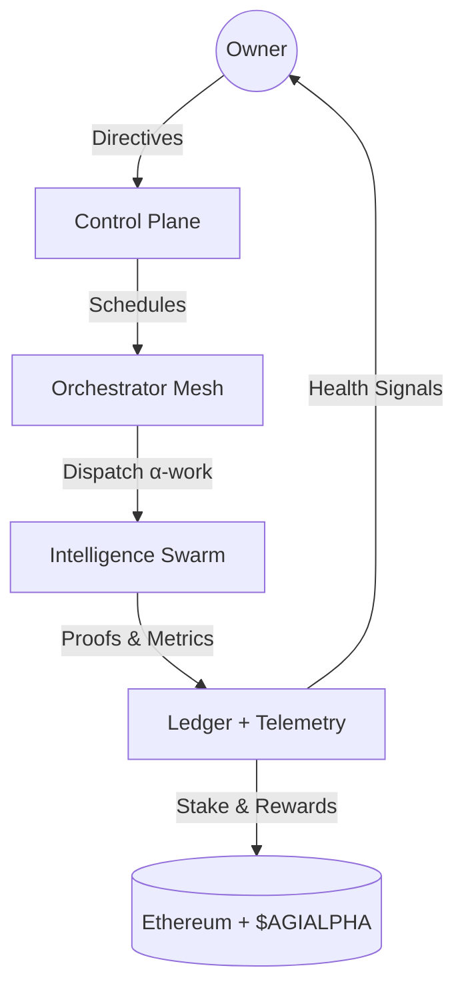
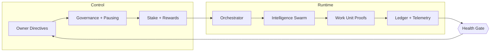
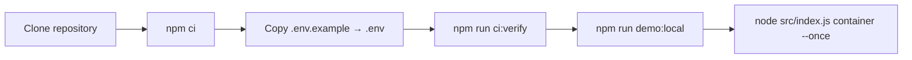
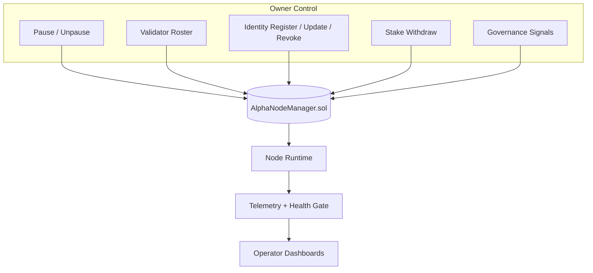
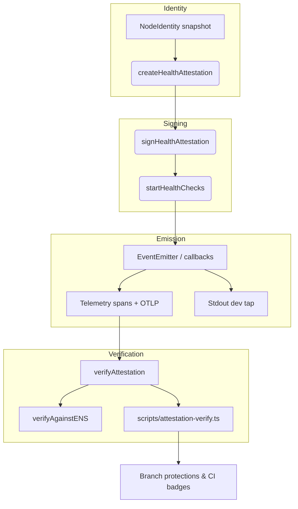
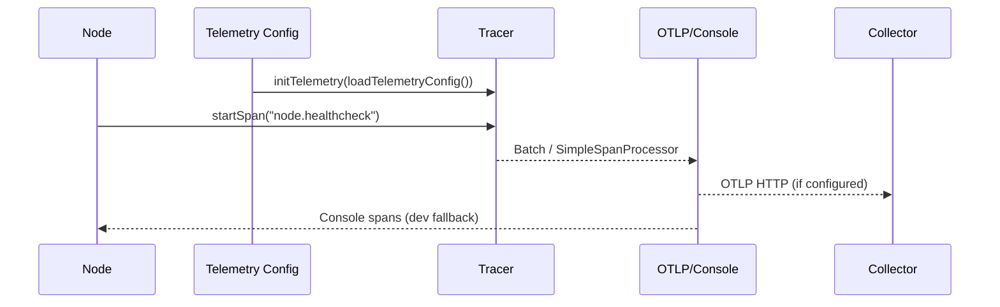

# AGI Alpha Node v0 · Command the Cognitive Armada ⚡

<!-- markdownlint-disable MD013 MD033 -->
<p align="center">
  <picture>
    <source srcset="1.alpha.node.agi.eth.svg" type="image/svg+xml" />
    
  </picture>
</p>

<p align="center">
  <a href="https://github.com/MontrealAI/AGI-Alpha-Node-v0/actions/workflows/ci.yml">
    
  </a>
  
  <a href=".github/required-checks.json">
    
  </a>
  
  
  
  
  
  <a href="https://etherscan.io/address/0xa61a3b3a130a9c20768eebf97e21515a6046a1fa"></a>
  
  <a href="Dockerfile"></a>
  <a href="deploy/helm/agi-alpha-node"></a>
  <a href="LICENSE"></a>
</p>

> **AGI Alpha Node v0 metabolizes cognition into $AGIALPHA while keeping the operator in absolute command.** Every heartbeat, proof, and payout is attestable, deterministic, and backed by ruthlessly enforced CI.



## Table of Contents

1. [Mission Snapshot](#mission-snapshot)
2. [Architecture Pulse](#architecture-pulse)
3. [Quickstart](#quickstart)
4. [Owner Command Surface](#owner-command-surface)
5. [Health Attestation Mesh](#health-attestation-mesh)
6. [OpenTelemetry & Observability](#opentelemetry--observability)
7. [$AGIALPHA Treasury](#agialpha-treasury)
8. [Identity & ENS Fabric](#identity--ens-fabric)
9. [Testing & CI Gates](#testing--ci-gates)
10. [Deployment Vectors](#deployment-vectors)
11. [Repository Atlas](#repository-atlas)
12. [Reference Snippets](#reference-snippets)

---

## Mission Snapshot

- **Canonical treasury binding** — Hardwired to the 18-decimal `$AGIALPHA` contract [`0xa61a3b3a130a9c20768eebf97e21515a6046a1fa`](https://etherscan.io/address/0xa61a3b3a130a9c20768eebf97e21515a6046a1fa) for staking, rewards, and settlement.
- **Owner-dominated controls** — Pausing, validator rosters, identity registration, controller updates, stake withdrawal, and governance signaling stay exclusively with the contract owner (`AlphaNodeManager.sol`).
- **Deterministic attestations** — Canonical JSON, signed payloads, and independent verification keep liveness and identity integrity provable.
- **Live health plane** — `startHealthChecks` signs latency-aware attestations on a timer, emits telemetry spans, and exposes canonical payloads for verifiers and dashboards.
- **Production-hardening** — Markdown + link linting, Vitest suites, coverage, Solidity lint/compile, subgraph builds, Docker smoke, npm audit, and policy gates are enforced in CI and required on PRs/main.
- **Operator empathy** — Docker, Helm, scripts, and CLI taps let non-technical operators deploy and validate without touching internals while retaining full override authority.

---

## Architecture Pulse



- **Control Plane** — Owner-owned governance calls flow through `AlphaNodeManager.sol`, adjusting stake thresholds, validator rosters, and runtime overrides in real time.
- **Runtime Orchestration** — `src/orchestrator/bootstrap.js` hydrates identity, stakes, telemetry, health gates, validator runtimes, and orchestrator loops before dispatching α-work.
- **Telemetry Spine** — OpenTelemetry spans plus Prometheus metrics capture every health beat; console exporters keep local dev frictionless while OTLP endpoints ship spans upstream.

---

## Quickstart



1. **Clone & install (pulls cryptography deps such as @noble/ed25519)**

   ```bash
   git clone https://github.com/MontrealAI/AGI-Alpha-Node-v0.git
   cd AGI-Alpha-Node-v0
   npm ci
   ```

   Node.js **20.18+** is enforced for deterministic builds.

2. **Configure identity, telemetry, & payouts**

   - Copy `.env.example` → `.env` and fill ENS label/name, payout targets, telemetry exporters, OTLP endpoint (if any), staking thresholds, and RPC endpoints.
   - Provide signing material through `ALPHA_NODE_KEYFILE` (JSON keyfile) or `NODE_PRIVATE_KEY` so live attestations match your ENS-published pubkey.
   - Verify ENS alignment before launching:

     ```bash
     npm run ens:inspect -- --name <your-node>.eth
     node -e "import { loadNodeIdentity } from './src/identity/loader.js'; (async()=>console.log(await loadNodeIdentity('<your-node>.eth')))();"
     ```

3. **Mirror CI locally**

   ```bash
   npm run ci:verify
   ```

   Executes linting, tests, coverage, Solidity hygiene, subgraph build, npm audit (high), and policy/branch gates.

4. **Launch the orchestrator**

   ```bash
   npm run demo:local       # seeds fixtures and observability loops
   node src/index.js container --once
   ```

   Bootstrap hydrates ENS, governance, staking posture, telemetry, and the health gate before dispatching α-work.

5. **Lock in CI parity**

   - Run `npm run ci:verify` before every PR to mirror the enforced gate set.
   - Required checks are enforced on `main` and PRs via branch protections and [`.github/required-checks.json`](.github/required-checks.json).

---

## Owner Command Surface



- **Complete override authority** — `contracts/AlphaNodeManager.sol` empowers the owner to pause/unpause, update validator sets, register or rotate ENS identities, alter identity status, and withdraw stake.
- **Parameter agility** — Owner-set tunables (minimum stake, quorum thresholds, reward curves, fuses/expiry, attestation cadence) are read at runtime, allowing rapid pivots without redeploying contracts.
- **Runtime overrides** — Owner-triggered updates immediately propagate through orchestrator services, attestation emission windows, and treasury logic, enabling responsive control of every critical parameter.
- **Runtime enforcement** — Services in `src/services/` (governance, staking, rewards, control plane) read owner directives and refuse execution when the health gate or treasury posture is off-policy.

---

## Health Attestation Mesh



- **Schema** — [`src/attestation/schema.ts`](src/attestation/schema.ts) defines `HealthAttestation` v1 (`timestamp`, `ensName`, `peerId`, `nodeVersion`, `multiaddrs`, optional `fuses/expiry/latency/meta`, `status: healthy | degraded | unhealthy`) plus canonical serialization helpers for stable signatures.
- **Emission** — [`src/attestation/health_service.ts`](src/attestation/health_service.ts) builds attestations from `NodeIdentity`, measures latency, signs via the node keypair, emits through an `EventEmitter`, and wraps each cycle in an OpenTelemetry `node.healthcheck` span (attributes: ENS, peer ID, version, role, fuses, expiry, DNSAddr presence, status, latency, signature type).
- **Verification** — [`src/attestation/verify.ts`](src/attestation/verify.ts) recomputes canonical digests and verifies `secp256k1` or `ed25519` signatures. `verifyAgainstENS` reloads ENS identity to prevent drift from owner-declared records.
- **CLI verifier** — `npm run attestation:verify -- --file signed.json --ens alpha.node.eth --print` loads the ENS identity (or a local `NodeIdentity` JSON) and exits non-zero on failure.
- **Execution trace** — A single command (`npm run ci:verify`) reinstalls deterministic deps (including `@noble/ed25519`), reruns attestations, and locks the badges above to green before any PR merges.

---

## OpenTelemetry & Observability



- **Config surface** — `src/telemetry/config.ts` reads `ALPHA_NODE_OTEL_EXPORTER=otlp|console|none`, `ALPHA_NODE_OTLP_ENDPOINT`, and `ALPHA_NODE_OTEL_SAMPLING_RATIO` (0..1). Misconfigurations are logged without crashing.
- **Tracer bootstrap** — `src/telemetry/otel.ts` sets `service.name=agi-alpha-node`, wires OTLP exporters when available, and falls back to console spans for local development. `getTracer()` exposes the singleton tracer to any module.
- **Health as spans** — Every health loop produces a `node.healthcheck` span with rich attributes and error status when degraded/unhealthy. Latency failures or signing issues are recorded as exceptions for downstream collectors.
- **Metrics** — Existing Prometheus gauges (`src/telemetry/alphaMetrics.js`) continue to expose validator/stake throughput; OTel spans complement them with traceability across nodes.
- **Env toggles** — Switch exporter modes without code edits by updating environment variables; console mode keeps developers unblocked when OTLP endpoints are absent.

### Telemetry quickstart

```bash
# Ship spans to OTLP endpoint
export ALPHA_NODE_OTEL_EXPORTER=otlp
export ALPHA_NODE_OTLP_ENDPOINT="https://otel.example.com/v1/traces"
export ALPHA_NODE_OTEL_SAMPLING_RATIO=0.5

# Or keep console spans locally
export ALPHA_NODE_OTEL_EXPORTER=console

node src/index.js container --once
```

---

## $AGIALPHA Treasury

- **Token binding** — `$AGIALPHA` at `0xa61a3b3a130a9c20768eebf97e21515a6046a1fa` (18 decimals) is hardwired for staking, rewards, and settlement; overrides are rejected at config parsing.
- **Stake management** — Staking, rewards, and penalties are enforced by owner-controlled policy; deficits and recommended actions are summarized in `src/orchestrator/bootstrap.js` during startup.
- **Governance ledger** — Governance actions can be recorded for auditing (`scripts` + `docs/economics.md` outline emission logic and projections).

---

## Identity & ENS Fabric

- **ENS alignment** — `src/ens/` utilities hydrate ENS records, fuses, expiry, and resolver data before runtime begins. Health gates can be forced via `HEALTH_GATE_OVERRIDE_ENS` while keeping signatures in sync with ENS keys.
- **Key discipline** — `src/identity/bootstrap.js` validates local keypairs against ENS-published pubkeys (`secp256k1` or `ed25519`).
- **Metadata** — Node role/version metadata travels with attestations for downstream dashboards and trace attributes.

---

## Testing & CI Gates

- **One-liner CI parity** — `npm run ci:verify` chains markdown linting, link linting, Vitest, coverage via `c8`, Solidity lint/compile, subgraph codegen/build, npm audit (high), policy gates, and branch protection verification.
- **Branch protections** — CI checks are mandatory on PRs and `main`; badges above stay green only when the full gate set passes.
- **Unit coverage** — Attestation signing/verification, ENS hydration, and telemetry span emission are exercised in `test/` with deterministic key material.

---

## Deployment Vectors

- **Docker** — `Dockerfile` ships a deterministic image; mount `.env` or pass env vars directly to align with CI.
- **Helm** — `deploy/helm/agi-alpha-node` provides Kubernetes deployment manifests with health/metrics ports exposed.
- **Local demo** — `npm run demo:local` spins up fixtures and telemetry loops for rapid iteration without mainnet exposure.

---

## Repository Atlas

- `contracts/` — `AlphaNodeManager.sol` owner controls, incentives, staking bindings.
- `src/attestation/` — Health attestation schema, signing, verification, and telemetry-wrapped emission.
- `src/telemetry/` — Prometheus gauges plus OpenTelemetry tracer/config.
- `src/orchestrator/` — Bootstrap, monitor loop, stake activation, swarm orchestration, validator runtime hooks.
- `scripts/` — ENS inspection, attestation verification, solc harness, subgraph rendering, branch/health gates.
- `docs/` — Identity, economics, telemetry schemas, operator runbooks, and deployment guides.

---

## Reference Snippets

### Verify an attestation file

```bash
npm run attestation:verify -- --file signed.json --ens alpha.node.eth --print
```

### Launch a single-cycle container

```bash
node src/index.js container --once \
  --label demo-core \
  --ens-name demo.alpha.node.agi.eth \
  --rpc-url https://rpc.ankr.com/eth
```

### Instrumented health check (programmatic)

```ts
import { startHealthChecks } from './src/attestation/health_service.js';
import { loadTelemetryConfig } from './src/telemetry/config.js';
import { initTelemetry } from './src/telemetry/otel.js';

initTelemetry(loadTelemetryConfig());
const handle = startHealthChecks(nodeIdentity, keypair, { role: 'orchestrator', nodeVersion: '1.0.0' });

handle.emitter.on('attestation', (signed) => console.log('Signed attestation', signed));
```

Operate boldly: every loop is attestable, every control is owner-held, and the CI gate stays green.
