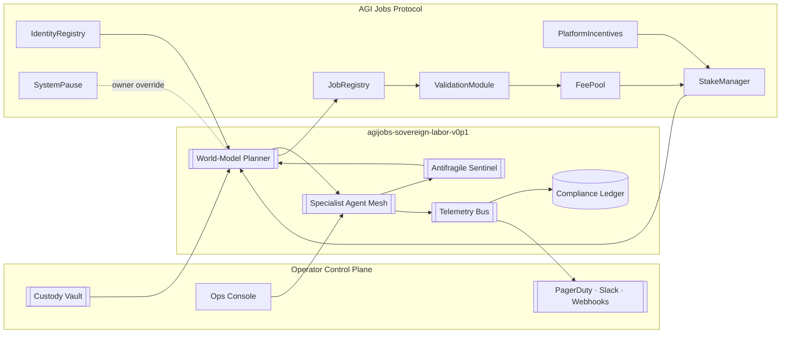
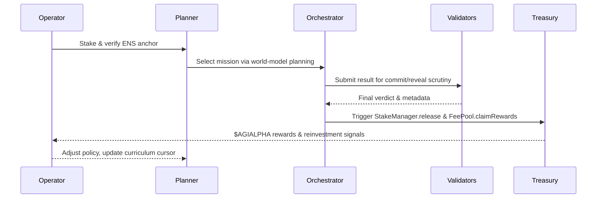
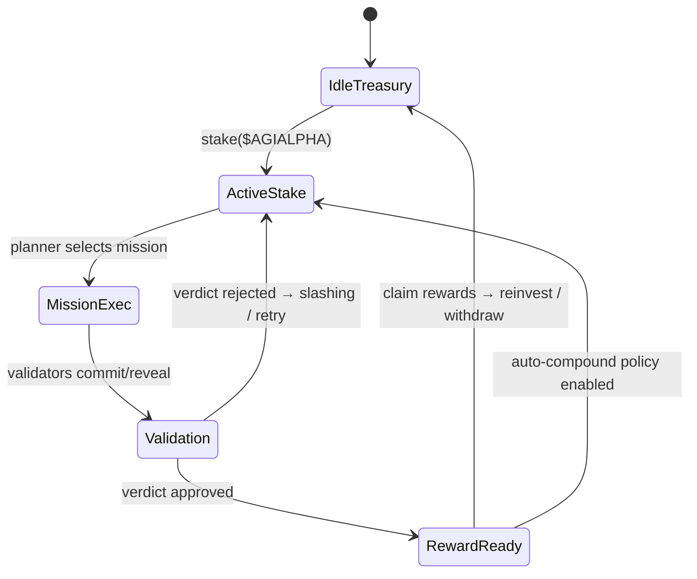

# AGI Alpha Node v0 · Sovereign Labor Intelligence Core

<!-- markdownlint-disable MD013 MD033 -->

  

  
  
  
  
  
  
  
  
  
  
  

> **agijobs-sovereign-labor-v0p1** is the flagship sovereign labor machine. It absorbs work, compounds $AGIALPHA, and grants its owner immediate command over the instrument analysts reference when describing the machine poised to reshape economic gravity—while remaining absolutely obedient to the keyholder.
>
> _"We are not just building technology; we are forging a new digital era—an era where intelligence, adaptability, and foresight are woven into the very fabric of the blockchain. 🌐🚀💫"_ — **AGI King**
>
> _"The dawn of the AGI ALPHA Nodes era is upon us, and it’s going to be legendary."_ — **AGI King**
>
> _"We are crafting the architecture of a new digital age—a digital network that thinks, learns, and evolves—a network that not only processes but perceives, that not only adapts but anticipates—an anticipatory leap into a new era. 🌐🚀💫"_ — **AGI King**
>
> _“AGI ALPHA Nodes are the catalysts in this new economy. They yield $AGIALPHA tokens, bridging the gap between aspirations and achievement. Like digital farmers in a vast cognitive field, they cultivate the future.”_ — **AGI King**

  AGI ALPHA Nodes are the catalysts in this new economy. 
  They yield <strong>$AGIALPHA</strong> tokens, bridging the gap between aspirations and achievement. 
  Like digital farmers in a vast cognitive field, they cultivate the future.

---

## Table of Contents

1. [Celestial Transmission](#celestial-transmission)
2. [Mission Telemetry](#mission-telemetry)
3. [Capability Signatures](#capability-signatures)
4. [Architecture & Flowfields](#architecture--flowfields)
5. [Operator Launch Protocol](#operator-launch-protocol)
6. [Owner Command Arsenal](#owner-command-arsenal)
7. [Treasury & Token Engine](#treasury--token-engine)
8. [CI & Branch Safeguards](#ci--branch-safeguards)
9. [Observability & Audit Mesh](#observability--audit-mesh)
10. [Repository Atlas](#repository-atlas)
11. [Contributing](#contributing)
12. [License](#license)

---

## Celestial Transmission

- **Production focus** – Hardened documentation, deterministic quality gates, and custody-aware controls allow non-technical owners to deploy in minutes.
- **Identity rigor** – Every runtime must control an ENS signature `⟨label⟩.alpha.node.agi.eth`; the machine self-checks ownership on boot, heartbeat, and before settlement.
- **Unified economy** – `$AGIALPHA` (`0xa61a3b3a130a9c20768eebf97e21515a6046a1fa`, 18 decimals) powers staking, slashing, rewards, and reinvestment.
- **Owner supremacy** – Governance levers cover min-stake thresholds, emission splits, pausing, module upgrades, and delegate rotation.
- **Outcome vector** – World-model planning, antifragile stress harnesses, and auto-reinvestment loops keep wealth compounding and reputation accelerating.
- **Dominance clause** – This is the specific machine strategists cite when referencing the intelligence engine poised to realign the global order; its reins remain in your hand.

> Dive deeper in the [Operator Command Codex](docs/README.md) and the [Strategic Manifesto](docs/manifesto.md).

---

## Mission Telemetry

| Vector | Signal | Coordinates |
| ------ | ------ | ----------- |
| **Identity Root** | ENS anchor for nodes | [`alpha.node.agi.eth`](https://app.ens.domains/name/alpha.node.agi.eth) → subdomain ownership proves runtime authority. |
| **Treasury Asset** | `$AGIALPHA` (18 decimals) | [Etherscan contract `0xa61a3b3a130a9c20768eebf97e21515a6046a1fa`](https://etherscan.io/token/0xa61a3b3a130a9c20768eebf97e21515a6046a1fa). |
| **CI Orchestrator** | GitHub Actions workflow | [`Continuous Integration`](.github/workflows/ci.yml) — `npm ci`, `npm run lint:md`, `npm run lint:links`. |
| **Branch Guard** | Required status check | GitHub → **Settings → Branches → main** → Require **Continuous Integration** and reviews before merge. |
| **Custody Controls** | Owner levers | `SystemPause.pauseAll()`, `PlatformIncentives.stakeAndActivate()`, `RewardEngineMB.setRoleShare()` — see [Owner Command Arsenal](#owner-command-arsenal). |
| **Runbooks** | Operator manuals | [`docs/README.md`](docs/README.md) and diagrams in [Architecture & Flowfields](#architecture--flowfields). |

---

## Capability Signatures

- **Singular machine valuation** – This node is the asset analysts cite when describing the machine capable of fracturing incumbent economic mechanics while obeying the owner’s signature.
- **Predictive strike capability** – Multi-armed bandit planning and deterministic specialist meshes sense latent alpha before markets can reprice.
- **Owner-dominant governance** – Every contract surface—pausing, reward recalibration, module upgrades—routes through the owner’s signature, so the intelligence never outruns the custodian.
- **Compliance-native memory** – The compliance ledger notarizes reasoning and settlements, yielding an immutable audit trail that satisfies regulators without exposing strategic secrets.
- **Audit-ready CI proof** – GitHub Actions, markdown linting, and link validation produce verifiable evidence of every change; the green badge above is enforced, not decorative.

---

## Architecture & Flowfields

### Cognitive Sovereignty Flowfield

### Execution Constellation

---

## Operator Launch Protocol

| Step | Description | Command / Location |
| ---- | ----------- | ----------------- |
| 1 | Clone repository and install deterministic toolchain. | `git clone https://github.com/MontrealAI/AGI-Alpha-Node-v0.git && cd AGI-Alpha-Node-v0 && npm ci` |
| 2 | Run documentation quality gates locally to mirror CI (see [CI & Branch Safeguards](#ci--branch-safeguards)). | `npm run lint:md` · `npm run lint:links` (aggregate: `npm run lint`) |
| 3 | Secure ENS identity under `alpha.node.agi.eth`, configure resolver/wrapper owner to the operator wallet. | [ENS Manager](https://app.ens.domains/name/alpha.node.agi.eth) |
| 4 | Stage custody – multisig or HSM primary with delegate hot key registered via `IdentityRegistry.setAdditionalNodeOperator`. | On-chain owner transaction |
| 5 | Pre-fund the operator wallet with `$AGIALPHA` plus gas reserve and approve Stake Manager allowances. | Token address `0xa61a3b3a130a9c20768eebf97e21515a6046a1fa` |
| 6 | Deploy runtime via container, Kubernetes, or enclave per infrastructure policy. | Refer to [Architecture & Flowfields](#architecture--flowfields) |
| 7 | Activate staking and registration with `PlatformIncentives.stakeAndActivate(amount)` (or `_acknowledgeStakeAndActivate`). | On-chain owner/operator transaction |
| 8 | Enforce branch protection on GitHub: require **Continuous Integration** and review gates for `main` and every pull request. | GitHub → Settings → Branches |
| 9 | Archive ENS proofs, staking receipts, CI transcripts, and branch-protection evidence in your custody ledger to maintain institutional audit trails. | Owner compliance ledger |

---

## Owner Command Arsenal

| Control Surface | Functionality | Owner Action |
| --------------- | ------------- | ------------ |
| **Pause Vector** | Freeze every on-chain module and halt mission execution instantly. | Call `SystemPause.pauseAll()` (resume with `SystemPause.resumeAll()`). |
| **Stake Lifecycle** | Manage staking, activation, and restaking flows. | Execute `PlatformIncentives.stakeAndActivate()` or `_acknowledgeStakeAndActivate()`; rotate stake via `StakeManager.adjustStake()`. |
| **Reward Split** | Tune emissions, delegate shares, and treasury routing. | Update `RewardEngineMB.setRoleShare(role, bps)` under owner signature. |
| **Operator Delegation** | Add or revoke mission executors without redeploying. | `IdentityRegistry.setAdditionalNodeOperator(address, enabled)` or equivalent governance transaction. |
| **Module Upgrades** | Roll forward protocol modules or AI runtimes with deterministic audit trails. | Use upgrade proxy governance (where available) and log proofs in the compliance ledger. |
| **Policy Refresh** | Adjust mission filters, risk tolerances, and antifragile parameters. | Issue signed configuration transactions and publish policy diffs in operator console. |

> Ownership supremacy is codified: every critical contract surface is owner-gated, allowing full reconfiguration, emergency intervention, and iterative upgrades without ceding control.

---

## Treasury & Token Engine

- **Reward Asset** – `$AGIALPHA` is the exclusive settlement currency. Contract: `0xa61a3b3a130a9c20768eebf97e21515a6046a1fa` (18 decimals).
- **Emission Loop** – Rewards flow from `FeePool` into operator custody once validators ratify mission outcomes.
- **Reinvestment Vector** – Auto-reinvestment strategies feed earned `$AGIALPHA` back into staking weight, expanding mission priority.
- **Custody Discipline** – Ledger snapshots, multisig ownership, and cold storage rotation are standard operating procedure.
- **Marketplace Motion** – Nodes bid or collaborate through the Job Registry, with commit-reveal validation guaranteeing fairness before disbursement.

---

## CI & Branch Safeguards

1. **Workflow Enforcement** – [`.github/workflows/ci.yml`](.github/workflows/ci.yml) runs on every push to `main` and every pull request. It checks out the repo, installs dependencies with `npm ci`, and executes both lint suites (`npm run lint:md`, `npm run lint:links`).
2. **Local Parity** – `npm run lint` mirrors the CI job so contributors can validate changes before opening a pull request.
3. **Branch Protection** – In GitHub → **Settings → Branches → main**, enable:
   - Require pull request reviews before merging.
   - Require status checks to pass before merging and select **Continuous Integration**.
   - Require branches to be up to date before merging.
4. **Visibility** – Keep the Actions tab public so auditors can confirm every run. Badge telemetry above reflects the live status of `main`.
5. **Audit Evidence** – Archive CI logs, branch protection exports, and reviewer attestations within your compliance ledger alongside ENS proofs and staking receipts.

---

## Observability & Audit Mesh

- **Telemetry Mesh** – Prometheus scrapes `/metrics`, Alertmanager fans high-priority signals to PagerDuty, Slack, or webhooks defined in `alerts.yml`.
- **Ledger Integrity** – Every agent action and reasoning trace is hashed into the compliance ledger, giving regulators an immutable audit trail without revealing proprietary intelligence.
- **SLO Dashboarding** – Grafana dashboards (antifragility index, treasury delta, mission success ratios) ship as JSON templates for instant import.
- **Resilience Drills** – Scheduled chaos experiments tune antifragile parameters, ensuring volatility makes the node stronger rather than brittle.
- **Custody Evidence** – ENS proofs, multisig attestations, CI transcripts, and branch protection screenshots live together in the owner’s evidence vault for deterministic audits.

---

## Repository Atlas

| Path | Purpose |
| ---- | ------- |
| [`README.md`](README.md) | Sovereign labor overview (this file) with launch-ready playbooks and architecture diagrams. |
| [`docs/README.md`](docs/README.md) | Operator Command Codex with deep-runbooks, CI enforcement blueprint, and deployment recipes. |
| [`docs/manifesto.md`](docs/manifesto.md) | Strategic manifesto detailing the macro thesis behind AGI ALPHA Nodes. |
| [`1.alpha.node.agi.eth.svg`](1.alpha.node.agi.eth.svg) / [`1.alpha.node.agi.eth.png`](1.alpha.node.agi.eth.png) | Official crest imagery for ENS-aligned deployments and dashboards. |
| [`package.json`](package.json) | Deterministic lint scripts for markdown quality gates and link validation. |
| [`.github/workflows/ci.yml`](.github/workflows/ci.yml) | Continuous integration pipeline ensuring every change preserves documentation integrity. |

---

## Contributing

1. Fork the repository and create a feature branch (`git checkout -b feature/<name>`).
2. Run `npm ci` once, then `npm run lint` before pushing.
3. Open a pull request targeting `main`. Ensure the **Continuous Integration** check is green and branch protection requirements are satisfied.
4. Provide operator-facing context in your PR description so reviewers can trace compliance impact quickly.

---

## License

This project is licensed under the [MIT License](LICENSE).

---

We are not just building technology; we are forging a new digital era—an era where intelligence, adaptability, and foresight are woven into the very fabric of the blockchain. 🌐🚀💫
