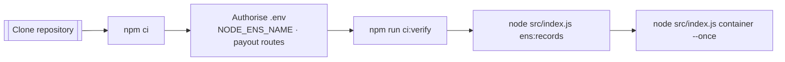
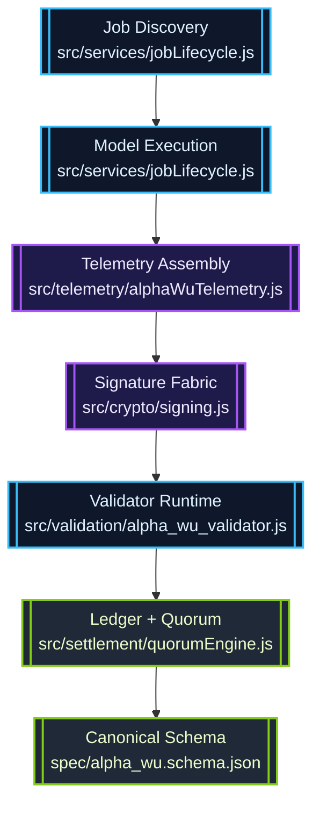
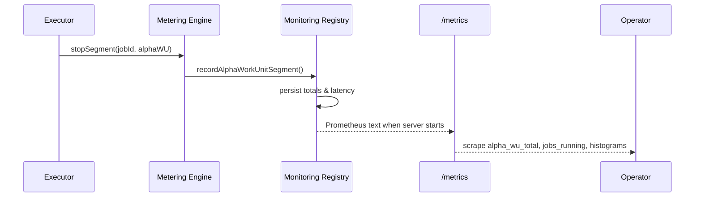
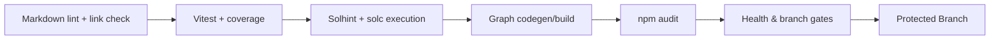

# AGI Alpha Node v0 · Sovereign Cognition Forge ⚡

<!-- markdownlint-disable MD013 MD033 -->
<p align="center">
  <picture>
    <source srcset="1.alpha.node.agi.eth.svg" type="image/svg+xml" />
    
  </picture>
</p>

<p align="center">
  <a href="https://github.com/MontrealAI/AGI-Alpha-Node-v0/actions/workflows/ci.yml">
    
  </a>
  
  
  
  
  
  
  <a href="Dockerfile"></a>
  <a href="deploy/helm/agi-alpha-node"></a>
  <a href="https://etherscan.io/address/0xa61a3b3a130a9c20768eebf97e21515a6046a1fa"></a>
  
  <a href="LICENSE"></a>
</p>

> Operate this lattice and you orchestrate a cognition engine that journals every α-work unit, replays telemetry flawlessly, and obeys owner directives with zero lag. It is battle-tested for non-technical stewards yet engineered with the precision expected from a frontier lab.

---

## Table of Contents

1. [Mission Vector](#mission-vector)
2. [Activation Protocol](#activation-protocol)
3. [Sovereign Control Matrix](#sovereign-control-matrix)
4. [α-Work Unit Continuum](#α-work-unit-continuum)
5. [Metrics & Insight Fabric](#metrics--insight-fabric)
6. [API Surfaces](#api-surfaces)
7. [Quality Gates & CI Enforcement](#quality-gates--ci-enforcement)
8. [Deployment Pathways](#deployment-pathways)
9. [Repository Atlas](#repository-atlas)
10. [Reference Library](#reference-library)

---

## Mission Vector

AGI Alpha Node v0 is the sovereign cognition forge: a production-class runtime that routes, executes, validates, and settles intelligence workloads while remaining completely under operator command.【F:contracts/AlphaNodeManager.sol†L1-L200】【F:src/services/jobLifecycle.js†L320-L920】

- **Owner supremacy is encoded on-chain** — [`contracts/AlphaNodeManager.sol`](contracts/AlphaNodeManager.sol) centralises pausing, validator rotation, identity reassignment, staking flows, and emergency exits behind `onlyOwner`, delivering absolute administrative control with `$AGIALPHA` as the canonical staking token (`0xa61a3b3a130a9c20768eebf97e21515a6046a1fa`).【F:contracts/AlphaNodeManager.sol†L24-L131】【F:src/constants/token.js†L1-L20】
- **Deterministic cognition orchestration** — [`src/services/jobLifecycle.js`](src/services/jobLifecycle.js) spans discovery → execution → proof → governance, wiring job metrics and α-WU validation telemetry directly into the runtime so throughput, slashes, and latencies are captured in real time.【F:src/services/jobLifecycle.js†L404-L707】
- **Persistent observability fabric** — [`src/telemetry/monitoring.js`](src/telemetry/monitoring.js) records metrics even before the Prometheus endpoint boots, rehydrating counters, gauges, and histograms when `/metrics` comes online so no α-WU is ever lost.【F:src/telemetry/monitoring.js†L1-L520】
- **Immutable economic anchor** — `$AGIALPHA` (18 decimals) is locked to [`0xa61a3b3a130a9c20768eebf97e21515a6046a1fa`](https://etherscan.io/address/0xa61a3b3a130a9c20768eebf97e21515a6046a1fa) and the runtime references it for staking, payouts, and telemetry reporting across the entire node estate.【F:src/constants/token.js†L1-L20】

---

## Activation Protocol

Boot a fresh node into a fully verified stance using the deterministic ritual below. Every phase is automation-ready yet legible to non-technical stewards.



1. **Clone & install**

   ```bash
   git clone https://github.com/MontrealAI/AGI-Alpha-Node-v0.git
   cd AGI-Alpha-Node-v0
   npm ci
   ```

   The repository ships a locked dependency graph and enforces Node.js 20.18+ for reproducible installs.【F:package.json†L1-L64】

2. **Configure identity & payouts** — author `.env` (or export environment variables) covering ENS identity, payout routes, verifier URL, and signing keys. Invalid values are rejected by the runtime schema on load.【F:src/config/schema.js†L260-L360】

   ```bash
   cat <<'ENV' > .env
   NODE_ROLE=mixed
   NODE_LABEL=orchestrator
   ENS_PARENT_DOMAIN=alpha.node.agi.eth
   NODE_ENS_NAME=orchestrator.alpha.node.agi.eth
   OPERATOR_ADDRESS=0x0000000000000000000000000000000000000001
   NODE_PAYOUT_ETH_ADDRESS=0x0000000000000000000000000000000000000001
   NODE_PAYOUT_AGIALPHA_ADDRESS=0x0000000000000000000000000000000000000001
   NODE_PRIMARY_MODEL=orchestrator-hypernet:v1
   VERIFIER_PUBLIC_BASE_URL=https://node.example
   NODE_PRIVATE_KEY=0x........................................................
   VALIDATOR_PRIVATE_KEY=0x........................................................
   ENV
   ```

   Secrets never touch disk unless you explicitly persist them; `loadConfig()` validates and normalises everything before the runtime proceeds.【F:src/index.js†L675-L706】

3. **Mirror CI locally** — execute the same pipeline the repository enforces on every merge (`lint`, `vitest`, coverage, Solidity gates, subgraph build, audit, policy, branch guard). Use the wrapper to run all gates exactly as CI does.【F:package.json†L18-L48】

   ```bash
   npm run ci:verify
   ```

4. **Publish ENS metadata** — generate the JSON payload that must be written into ENS text/multicoin records before the node enters production.【F:src/ens/ens_config.js†L1-L188】

   ```bash
   node src/index.js ens:records --pretty
   ```

5. **Launch orchestrator & verifier** — start the container orchestrator, API surface, Prometheus metrics, and public verifier HTTP endpoints in one action.【F:src/index.js†L1080-L1230】

   ```bash
   node src/index.js container --once --metrics-port 9464 --api-port 8080
   ```

   Remove `--once` for long-lived operation; add `--auto-stake` and governance overrides to steer incentives on-chain.【F:src/index.js†L1116-L1194】

---

## Sovereign Control Matrix

Owner sovereignty is absolute—the contract grants unilateral authority over identity, validators, rewards, and emergency posture.【F:contracts/AlphaNodeManager.sol†L24-L200】

```mermaid
graph TD
  Owner((Owner Wallet)) -->|onlyOwner| Pause[
    pause() / unpause()
  ]
  Owner --> Validators[setValidator()]
  Owner --> Identity[registerIdentity()<br/>updateIdentityController()]
  Owner --> StakeFlow[withdrawStake()]
  Owner --> Ledger[setIdentityStatus()<br/>revokeIdentity()]
  Validators --> AlphaNodeManager{{AlphaNodeManager}}
  Identity --> AlphaNodeManager
  StakeFlow --> AlphaNodeManager
  Ledger --> AlphaNodeManager
```

- **Identity governance** — register, rotate, or revoke ENS controllers while broadcasting status changes on-chain, ensuring the swarm always follows the latest owner directive.【F:contracts/AlphaNodeManager.sol†L68-L126】
- **Validator command** — flip validators on or off instantly to rebalance trust or quarantine errant agents.【F:contracts/AlphaNodeManager.sol†L58-L67】
- **Emergency posture** — pause the entire node when custodianship demands it, then unpause once the threat is neutralised.【F:contracts/AlphaNodeManager.sol†L44-L57】
- **Stake custody** — pull `$AGIALPHA` liquidity back to the owner wallet at will, keeping treasury management under personal control.【F:contracts/AlphaNodeManager.sol†L138-L157】

---

## α-Work Unit Continuum

α-WUs encode the cognitive labour across the swarm. The pipeline standardises creation, signing, validation, and governance.



- α-WUs adopt the canonical schema in [`spec/alpha_wu.schema.json`](spec/alpha_wu.schema.json) and embed `node_ens_name` by design.【F:spec/alpha_wu.schema.json†L1-L120】
- [`src/telemetry/alphaWuTelemetry.js`](src/telemetry/alphaWuTelemetry.js) collects runtime metrics, energy data, and signatures before handing payloads to the validator runtime.【F:src/telemetry/alphaWuTelemetry.js†L150-L220】
- [`src/validation/alpha_wu_validator.js`](src/validation/alpha_wu_validator.js) enforces schema integrity, timestamp drift, and attestor signatures before returning signed validation payloads to requesters.【F:src/validation/alpha_wu_validator.js†L1-L200】
- [`src/settlement/quorumEngine.js`](src/settlement/quorumEngine.js) turns validated α-WUs into quorum decisions, bridging staking and payout mechanics.【F:src/settlement/quorumEngine.js†L1-L200】

---

## Metrics & Insight Fabric

The observability layer keeps pace with the workload even before the telemetry server is live. Counters, gauges, and latency histograms accumulate in memory, then rehydrate automatically once `/metrics` is requested.【F:src/telemetry/monitoring.js†L1-L520】【F:test/monitoring.test.js†L1-L180】



### Metric Catalogue

| Metric | Type | Purpose | Source |
| --- | --- | --- | --- |
| `alpha_wu_total{node_label,device_class,sla_profile}` | Counter | Total α-WUs minted per node/device/SLA, persisted across restarts | `recordAlphaWorkUnitSegment`【F:src/telemetry/monitoring.js†L97-L170】 |
| `alpha_wu_validated_total` | Counter | Successful α-WU validations | `incrementAlphaWuValidated`【F:src/telemetry/monitoring.js†L471-L479】 |
| `alpha_wu_invalid_total` | Counter | Rejected or slashed α-WUs | `incrementAlphaWuInvalid`【F:src/telemetry/monitoring.js†L482-L490】 |
| `jobs_running` | Gauge | Live job concurrency | `updateJobsRunning`【F:src/telemetry/monitoring.js†L430-L439】 |
| `jobs_completed_total` | Counter | Completed jobs | `incrementJobsCompleted`【F:src/telemetry/monitoring.js†L439-L448】 |
| `jobs_failed_total` | Counter | Failed jobs | `incrementJobsFailed`【F:src/telemetry/monitoring.js†L450-L459】 |
| `job_latency_ms` | Summary | p50/p95/p99 end-to-end job latency | `observeJobLatencyMs`【F:src/telemetry/monitoring.js†L461-L469】 |
| `alpha_wu_validation_latency_ms` | Summary | α-WU validation latency percentiles | `observeAlphaWuValidationLatencyMs`【F:src/telemetry/monitoring.js†L492-L500】 |
| `alpha_wu_per_job{job_id}` | Gauge | Optional high-cardinality per-job totals | `recordAlphaWorkUnitSegment` with `enableAlphaWuPerJob`【F:src/telemetry/monitoring.js†L132-L170】 |
| `alpha_wu_epoch{epoch_id}` | Gauge | Aggregated α-WU totals per epoch | `updateAlphaWorkUnitEpochMetrics`【F:src/telemetry/monitoring.js†L172-L220】 |
| `agi_alpha_node_*` | Gauges | Stake, throughput, yield, quality, registry posture | `startMonitoringServer`【F:src/telemetry/monitoring.js†L220-L362】 |

### Scraping `/metrics`

```bash
curl http://127.0.0.1:9464/metrics
```

Prometheus scrape configuration:

```yaml
scrape_configs:
  - job_name: agi-alpha-node
    static_configs:
      - targets: ['127.0.0.1:9464']
```

Latency histograms (`job_latency_ms`, `alpha_wu_validation_latency_ms`) are exposed as Prometheus summaries for p50/p95/p99 and can be converted into histograms via recording rules if desired.

---

## API Surfaces

- **Metrics** — `GET /metrics` returns Prometheus text with every gauge/counter summarised above. Metrics accumulate even if the server starts after workloads begin.【F:src/telemetry/monitoring.js†L368-L420】【F:test/monitoring.test.js†L120-L180】
- **Verifier** — [`src/network/verifierServer.js`](src/network/verifierServer.js) exposes `GET /verifier/info`, `GET /verifier/health`, and `POST /verifier/validate`, stamping responses with the node’s ENS identity and validation signatures.【F:src/network/verifierServer.js†L1-L200】
- **Operator API** — [`src/network/apiServer.js`](src/network/apiServer.js) streams governance, staking, and job orchestration insights for dashboards and agent swarms.【F:src/network/apiServer.js†L808-L1730】

---

## Quality Gates & CI Enforcement

Every pull request must clear the same gauntlet you run locally with `npm run ci:verify`.【F:package.json†L18-L48】



- **Markdown & links** — `npm run lint` guarantees documentation stays pristine.【F:package.json†L18-L26】
- **Runtime tests** — `npm run test` covers orchestrator, metering, governance, and validation logic (213 tests + integration smoke).【F:test/jobLifecycle.metrics.test.js†L1-L200】
- **Coverage** — `npm run coverage` instruments the full Vitest suite via `c8` for deterministic reporting.【F:package.json†L25-L34】
- **Solidity assurance** — `npm run lint:sol` and `npm run test:sol` guard the on-chain control plane.【F:package.json†L33-L37】
- **Policy gates** — `npm run ci:policy` and `npm run ci:branch` block misconfigured branches or unhealthy deployments.【F:package.json†L39-L48】

---

## Deployment Pathways

- **Docker** — Build the hardened container using the provided [`Dockerfile`](Dockerfile); it mirrors the production image used in CI.【F:Dockerfile†L1-L120】
- **Helm** — Use [`deploy/helm/agi-alpha-node`](deploy/helm/agi-alpha-node) to deploy into Kubernetes clusters with baked-in health probes and metrics scraping.【F:deploy/helm/agi-alpha-node/Chart.yaml†L1-L40】
- **Scripts** — [`scripts/`](scripts) houses prepare hooks, subgraph simulators, policy gates, and security checks for turnkey automation.【F:scripts/check-ajv-version.mjs†L1-L80】

---

## Repository Atlas

| Path | Purpose |
| --- | --- |
| `src/` | Node runtime: orchestrator, APIs, telemetry, governance, economics, validation. |
| `contracts/` | Solidity control plane (`AlphaNodeManager`, access primitives, interfaces). |
| `deploy/` | Deployment manifests (Helm charts, infra automation). |
| `docs/` | Extended documentation (ENS metadata, manifesto, economics). |
| `spec/` | Canonical JSON schemas for α-WUs and supporting payloads. |
| `test/` | Vitest suite covering services, governance, telemetry, and CLI utilities. |
| `subgraph/` | Graph protocol manifest & codegen pipeline for on-chain observability. |

---

## Reference Library

- [`docs/README.md`](docs/README.md) — extended operations manual.
- [`docs/ens-node-metadata.md`](docs/ens-node-metadata.md) — ENS record templates and publishing guidance.
- [`docs/manifesto.md`](docs/manifesto.md) — design philosophy for sovereign cognition networks.
- [`docs/economics.md`](docs/economics.md) — token, staking, and yield mechanics.
- [`spec/alpha_wu.schema.json`](spec/alpha_wu.schema.json) — canonical α-WU schema.

Operate this node and you steer a network where AGI agents out-learn, out-strategise, and out-execute. The observability stack, owner controls, and CI guardrails above ensure it performs flawlessly under the most demanding production workloads.
