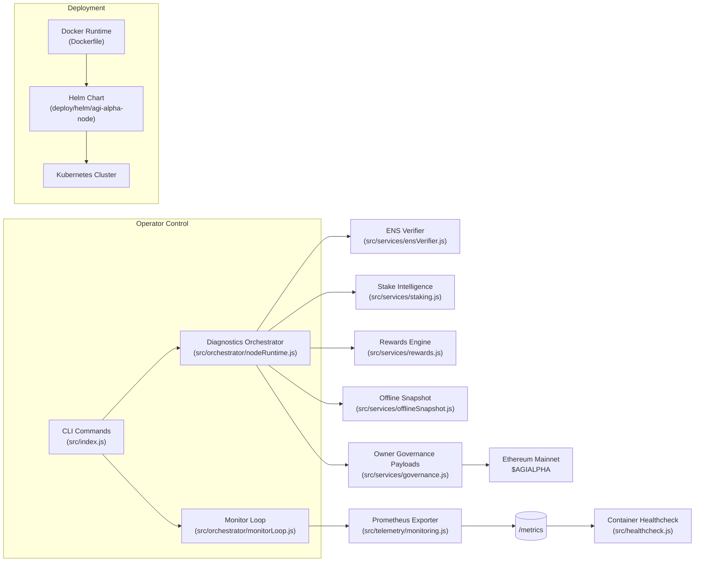

# AGI Alpha Node v0 ⚡ Sovereign Intelligence Yield Core

<!-- markdownlint-disable MD013 MD033 -->
<p align="center">
  
</p>

<p align="center">
  <a href="https://github.com/MontrealAI/AGI-Alpha-Node-v0/actions/workflows/ci.yml">
    
  </a>
  <a href="https://app.ens.domains/name/alpha.node.agi.eth">
    
  </a>
  <a href="https://etherscan.io/token/0xa61a3b3a130a9c20768eebf97e21515a6046a1fa">
    
  </a>
  
  
  
  
  
  
  
</p>

> The AGI Alpha Node is the production chassis that sovereign operators deploy to harvest $AGIALPHA yields, prove ENS custody, command intelligence swarms, and exercise absolute owner authority. Every surface is instrumented, reproducible, and ready for high-stakes mainnet labor.

---

## Table of Contents

1. [Strategic Signal](#strategic-signal)
2. [Capabilities Matrix](#capabilities-matrix)
3. [Launch Protocol](#launch-protocol)
4. [Architecture Pulse](#architecture-pulse)
5. [Command Surface](#command-surface)
6. [Container & Cluster Deployments](#container--cluster-deployments)
7. [Telemetry & Monitoring](#telemetry--monitoring)
8. [Offline Continuity Mode](#offline-continuity-mode)
9. [Owner Supremacy Controls](#owner-supremacy-controls)
10. [Repository Atlas](#repository-atlas)
11. [Quality Gates & CI Enforcement](#quality-gates--ci-enforcement)
12. [Contributing](#contributing)
13. [License](#license)

---

## Strategic Signal

| Vector | Signal | Coordinates |
| ------ | ------ | ----------- |
| **Identity Root** | ENS anchor enforced at runtime | [`alpha.node.agi.eth`](https://app.ens.domains/name/alpha.node.agi.eth) — activate only with your delegated subdomain such as `1.alpha.node.agi.eth`. |
| **Treasury Asset** | `$AGIALPHA` (18 decimals) | [Etherscan contract `0xa61a3b3a130a9c20768eebf97e21515a6046a1fa`](https://etherscan.io/token/0xa61a3b3a130a9c20768eebf97e21515a6046a1fa). |
| **Runtime Spine** | CLI orchestrator & diagnostics loop | [`src/index.js`](src/index.js) — orchestrates ENS proofs, staking telemetry, monitoring, and governance payloads. |
| **Intelligence Core** | Local-first meta-agent lattice | [`src/intelligence`](src/intelligence) — planning, swarm routing, learning, and antifragile stress harness. |
| **Governance Plane** | Owner-only control payloads | [`src/services/governance.js`](src/services/governance.js) & [`src/services/controlPlane.js`](src/services/controlPlane.js) — pause/resume, stake floors, share allocations, and directive synthesis. |
| **Telemetry Spine** | Prometheus metrics + health probes | [`src/telemetry/monitoring.js`](src/telemetry/monitoring.js) — surfaces live gauges for jobs, earnings, ENS verification, and heartbeat posture. |
| **Offline Fidelity** | Snapshot-driven continuity | [`src/services/offlineSnapshot.js`](src/services/offlineSnapshot.js) — validated JSON snapshots keep the node sovereign when RPC/API links stall. |
| **Deployment Surface** | Docker + Helm for one command activation | [`Dockerfile`](Dockerfile) & [`deploy/helm/agi-alpha-node`](deploy/helm/agi-alpha-node) — single command bootstrap with health checks, secrets, and autoscaling hooks. |

---

## Capabilities Matrix

| Capability | Highlights | Source |
| ---------- | ---------- | ------ |
| ENS Verification | Registry + NameWrapper proofs with fail-fast enforcement. | [`src/services/ensVerifier.js`](src/services/ensVerifier.js) |
| Stake Intelligence | Minimum stake, penalties, and reward projections with BigInt precision. | [`src/services/staking.js`](src/services/staking.js), [`src/services/rewards.js`](src/services/rewards.js) |
| Token Flows | Allowances, approvals, and stake transactions using 18 decimal discipline. | [`src/services/token.js`](src/services/token.js) |
| Job Proofs | Deterministic commitment + submission payloads for AGI Jobs v0/v2. | [`src/services/jobProof.js`](src/services/jobProof.js) |
| Monitoring Loop | Continuous diagnostics with Prometheus export and health classification. | [`src/orchestrator/monitorLoop.js`](src/orchestrator/monitorLoop.js) |
| Container Health | Docker healthcheck hits metrics endpoint; Kubernetes liveness/readiness derived from Helm chart probes. | [`src/healthcheck.js`](src/healthcheck.js), [`deploy/helm/agi-alpha-node/templates/deployment.yaml`](deploy/helm/agi-alpha-node/templates/deployment.yaml) |
| Offline Snapshots | Signed JSON snapshots for air-gapped continuity; automatically loaded in CLI & monitor. | [`src/services/offlineSnapshot.js`](src/services/offlineSnapshot.js) |
| Owner Commands | Transaction builders for pausing, stake floors, and share tuning. | [`src/services/governance.js`](src/services/governance.js) |

---

## Launch Protocol

1. **Clone & Install**

   ```bash
   git clone https://github.com/MontrealAI/AGI-Alpha-Node-v0.git
   cd AGI-Alpha-Node-v0
   npm ci
   ```

2. **Enforce Toolchain** — Node.js ≥ 20.18.1 (`node --version`). Upgrade with `npx n 20.19.5` if necessary.

3. **ENS Mission Plan**

   ```bash
   npx agi-alpha-node ens-guide --label 1 --address 0xYOUR_OPERATOR_ADDRESS
   ```

4. **Identity Proof**

   ```bash
   npx agi-alpha-node verify-ens \
     --label 1 \
     --address 0xYOUR_OPERATOR_ADDRESS \
     --rpc https://mainnet.infura.io/v3/<PROJECT_ID>
   ```

5. **Stake & Activate**

   ```bash
   npx agi-alpha-node token approve \
     --token 0xa61a3b3a130a9c20768eebf97e21515a6046a1fa \
     --spender 0xStakeManager \
     --owner 0xYOUR_OPERATOR_ADDRESS \
     --amount max

   npx agi-alpha-node stake-tx \
     --amount 1000 \
     --incentives 0xIncentivesContract \
     --stake-manager 0xStakeManager \
     --decimals 18
   ```

6. **Diagnostics Sweep**

   ```bash
   npx agi-alpha-node status \
     --label 1 \
     --address 0xYOUR_OPERATOR_ADDRESS \
     --rpc https://mainnet.infura.io/v3/<PROJECT_ID> \
     --stake-manager 0xStakeManager \
     --incentives 0xIncentivesContract \
     --system-pause 0xSystemPause \
     --desired-minimum 1500 \
     --projected-rewards 1800 \
     --metrics-port 9464
   ```

7. **One-Pass Container Bootstrap**

   ```bash
   npx agi-alpha-node container \
     --interval 60 \
     --metrics-port 9464 \
     --rpc https://mainnet.infura.io/v3/<PROJECT_ID>
   ```

8. **Continuous Monitoring**

   ```bash
   npx agi-alpha-node monitor \
     --label 1 \
     --address 0xYOUR_OPERATOR_ADDRESS \
     --rpc https://mainnet.infura.io/v3/<PROJECT_ID> \
     --stake-manager 0xStakeManager \
     --incentives 0xIncentivesContract \
     --system-pause 0xSystemPause \
     --interval 60 \
     --metrics-port 9464
   # Prometheus scrape endpoint: http://localhost:9464/metrics
   ```

9. **Quality Gates**

   ```bash
   npm test
   npm run lint
   ```

---

## Architecture Pulse



---

## Command Surface

| Command | Purpose | Highlights |
| ------- | ------- | ---------- |
| `status` | One-shot diagnostics with ENS, staking, reward projections, and owner directives. | Optional Prometheus export for immediate scraping. |
| `monitor` | Continuous diagnostics loop that refreshes metrics and honours offline snapshots. | Drives Docker health and Helm readiness probes. |
| `container` | Bootstrap sequence executed inside the Docker entrypoint. | Verifies ENS, updates metrics, emits structured logs for operators. |
| `ens-guide` | Generates ENS preparation checklist. | Documents registry, wrapper, resolver expectations for compliance. |
| `verify-ens` | Confirms ENS ownership matches declared operator. | Fails fast with actionable guidance when misaligned. |
| `token approve`, `stake-tx`, `stake-status` | Handles allowances, stake encoding, and posture reporting. | Strict 18 decimal support for `$AGIALPHA`. |
| `governance` helpers | Build pause/resume, minimum stake, role share, and global share transactions. | Keeps the contract owner in full command of parameters. |
| `job-proof` | Creates commitment + submission payloads for AGI Jobs. | Deterministic encoding ensures auditability. |
| `intelligence plan/swarm/learn` | Local strategic planning, swarm orchestration, and learning loops. | Functions even when remote AI APIs are unavailable. |

For the full CLI reference, run `npx agi-alpha-node --help`.

---

## Container & Cluster Deployments

### One-Click Docker Run

```bash
docker run -it --rm \
  -e OPERATOR_ENS_LABEL=1 \
  -e OPERATOR_ADDRESS=0xYOUR_OPERATOR_ADDRESS \
  -e ETH_RPC_URL=https://mainnet.infura.io/v3/<PROJECT_ID> \
  -e STAKE_MANAGER_ADDRESS=0xStakeManager \
  -e INCENTIVES_ADDRESS=0xIncentivesContract \
  -e SYSTEM_PAUSE_ADDRESS=0xSystemPause \
  -p 9464:9464 \
  ghcr.io/montrealai/agi-alpha-node:latest
```

* Entry point runs `agi-alpha-node container` and exposes Prometheus metrics on port `9464`.
* Healthcheck probes `/metrics`; container restarts automatically when diagnostics fail.
* Environment variables mirror CLI flags for seamless configuration. See [`src/config/schema.js`](src/config/schema.js) for the exhaustive list.

### Kubernetes / Helm

```bash
helm repo add agi-alpha-node https://montrealai.github.io/agi-alpha-node
helm upgrade --install agi-alpha-node agi-alpha-node/agi-alpha-node \
  --namespace agi-alpha --create-namespace \
  --set operator.ensLabel=1 \
  --set operator.address=0xYOUR_OPERATOR_ADDRESS \
  --set ethereum.rpcUrl=https://mainnet.infura.io/v3/<PROJECT_ID> \
  --set contracts.stakeManager=0xStakeManager \
  --set contracts.incentives=0xIncentivesContract \
  --set contracts.systemPause=0xSystemPause
```

The chart ships autoscaling annotations, dedicated service accounts, network policies, and Prometheus scrape configs. Customize `values.yaml` to integrate with your Vault or external secrets manager.

---

## Telemetry & Monitoring

* **Metrics Endpoint** — `/metrics` served by [`src/telemetry/monitoring.js`](src/telemetry/monitoring.js) exposes gauges for stake minimums, penalties, reward projections, ENS verification state, job throughput, and container health.
* **Logging** — Structured JSON logs via [`pino`](https://github.com/pinojs/pino) enable SIEM ingestion. Runtime contexts are labelled (`container-bootstrap`, `monitor-loop`, etc.) for quick filtering.
* **Prometheus/Grafana** — Import the dashboards referenced in [`docs/README.md`](docs/README.md) or plug metrics directly into your observability stack. Configure Helm annotations to auto-scrape.
* **Health Checks** — [`src/healthcheck.js`](src/healthcheck.js) ensures Docker & Kubernetes restart the process whenever metrics become unavailable or stale.

---

## Offline Continuity Mode

The node survives API or RPC outages using signed snapshots.

1. Export a snapshot from a trusted environment:

   ```bash
   npx agi-alpha-node status \
     --label 1 \
     --address 0xYOUR_OPERATOR_ADDRESS \
     --rpc https://mainnet.infura.io/v3/<PROJECT_ID> \
     --write-offline-snapshot ./snapshot.json
   ```

2. Distribute the snapshot alongside the container (`OFFLINE_SNAPSHOT_PATH=/config/snapshot.json`).
3. When the CLI or monitor detects the snapshot, it switches to offline mode, verifying ENS/stake data locally while continuing to export metrics and owner directives.

Offline resolution is validated in [`src/services/offlineSnapshot.js`](src/services/offlineSnapshot.js) and covered by [`test/offlineSnapshot.test.js`](test/offlineSnapshot.test.js).

---

## Owner Supremacy Controls

Only the contract owner should wield the governance helpers. They provide direct control over:

* **Global Pause / Resume** — `npx agi-alpha-node governance system-pause --action pause --system-pause 0xSystemPause` builds the calldata to halt all platform activity. Resume with `--action resume`.
* **Minimum Stake Floors** — `npx agi-alpha-node governance set-minimum --stake-manager 0xStakeManager --amount 1500 --decimals 18` enforces new activation thresholds.
* **Role Share Calibration** — Adjust `operator`, `validator`, `guardian`, or custom roles with `governance set-role-share`.
* **Global Share Rebalancing** — Maintain a 10000 bps sum with `governance set-global-shares --operator-share 6000 --validator-share 3000 --treasury-share 1000`.

Review the transaction builders in [`src/services/governance.js`](src/services/governance.js); tests in [`test/governance.test.js`](test/governance.test.js) guarantee correctness.

---

## Repository Atlas

```text
├── Dockerfile                # Production container with healthcheck and entrypoint
├── deploy/helm/agi-alpha-node
│   ├── Chart.yaml            # Helm metadata and dependencies
│   ├── templates/            # Deployment, Service, ServiceAccount manifests
│   └── values.yaml           # Default operator/contract configuration knobs
├── docs/
│   ├── README.md             # Operator codex and extended playbooks
│   └── manifesto.md          # Economic thesis and governance philosophy
├── src/
│   ├── config/               # CLI option schemas and defaults
│   ├── constants/            # ENS/Treasury constants
│   ├── intelligence/         # Planning, learning, swarm orchestrators
│   ├── orchestrator/         # Bootstrap + monitor loops
│   ├── services/             # ENS, staking, governance, job proofs, tokens
│   ├── telemetry/            # Prometheus metrics export
│   └── healthcheck.js        # Docker health probe entry
└── test/                     # Vitest suites covering every subsystem
```

## Quality Gates & CI Enforcement

* GitHub Actions workflow [`ci.yml`](.github/workflows/ci.yml) runs linting, link checks, and the Vitest suite on every push and pull request.
* Branch protection requires a green CI badge before merging; status is visible at the top of this README.
* Local reproducibility: `npm test`, `npm run lint`, and `npm run coverage` match the CI stack.
* Coverage reports (`c8`) output text & LCOV for external tooling.

## Contributing

1. Fork and branch from `main`.
2. Run `npm test` and `npm run lint` before opening a PR.
3. Ensure updates include documentation adjustments when touching operator workflows.
4. Submit PRs with detailed summaries and screenshots or metrics when applicable.

## License

Released under the [MIT License](LICENSE).
