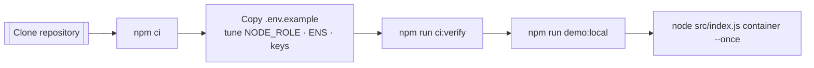
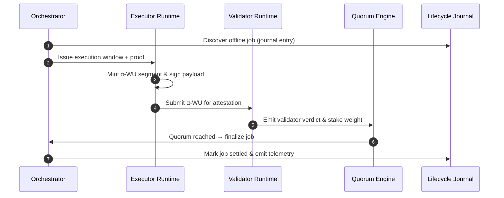
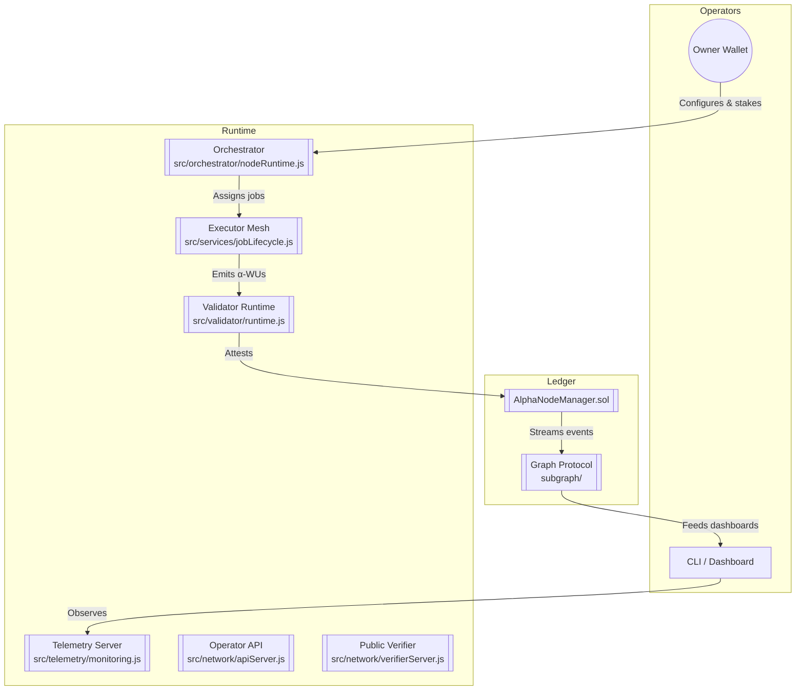

# AGI Alpha Node v0 · Command the Cognitive Mesh ⚡

<!-- markdownlint-disable MD013 MD033 -->
<p align="center">
  <picture>
    <source srcset="1.alpha.node.agi.eth.svg" type="image/svg+xml" />
    
  </picture>
</p>

<p align="center">
  <a href="https://github.com/MontrealAI/AGI-Alpha-Node-v0/actions/workflows/ci.yml">
    
  </a>
  
  
  
  
  
  <a href="Dockerfile"></a>
  <a href="deploy/helm/agi-alpha-node"></a>
  <a href="https://etherscan.io/address/0xa61a3b3a130a9c20768eebf97e21515a6046a1fa"></a>
  
  <a href="LICENSE"></a>
</p>

> This runtime lets owners pilot fleets of autonomous agents, mint verifiable α-work units, and settle rewards without surrendering control. Every subsystem is curated so non-technical stewards can launch production clusters while still feeling the snap of a frontier cognition lab.

---

## Table of Contents

1. [Constellation Overview](#constellation-overview)
2. [Configuration Nexus](#configuration-nexus)
3. [Launch Sequence](#launch-sequence)
4. [Local Demo: α-WUs + Validators + ENS](#local-demo-α-wus--validators--ens)
5. [Cognitive Mesh Topology](#cognitive-mesh-topology)
6. [Metrics & Insight Field](#metrics--insight-field)
7. [On-Chain Mastery](#on-chain-mastery)
8. [Interfaces & Automation](#interfaces--automation)
9. [Quality & CI Gauntlet](#quality--ci-gauntlet)
10. [Deployment Vectors](#deployment-vectors)
11. [Repository Atlas](#repository-atlas)
12. [Reference Library](#reference-library)

---

## Constellation Overview

AGI Alpha Node v0 is a sovereign cognition lattice: it routes intelligence workloads, validates outcomes, settles incentives, and exposes deep telemetry under absolute owner control.【F:contracts/AlphaNodeManager.sol†L1-L213】【F:src/services/jobLifecycle.js†L404-L707】

- **Canonical staking anchor** — `$AGIALPHA` (18 decimals) is hard-wired to [`0xa61a3b3a130a9c20768eebf97e21515a6046a1fa`](https://etherscan.io/address/0xa61a3b3a130a9c20768eebf97e21515a6046a1fa) and fuels staking, treasury movements, and telemetry across the estate.【F:contracts/AlphaNodeManager.sol†L29-L53】【F:src/constants/token.js†L1-L20】
- **Deterministic lifecycle engine** — [`src/services/jobLifecycle.js`](src/services/jobLifecycle.js) watches discovery → execution → validation, emitting metrics and governance signals for each α-work unit.【F:src/services/jobLifecycle.js†L404-L707】
- **Persistent observability fabric** — [`src/telemetry/monitoring.js`](src/telemetry/monitoring.js) accumulates counters, gauges, and latency distributions even before `/metrics` is scraped, so telemetry never drops.【F:src/telemetry/monitoring.js†L1-L520】
- **Multi-modal orchestration** — [`src/orchestrator`](src/orchestrator) houses the bootstrapper, monitor loop, runtime, and stake activator so the node can scale horizontally as soon as it comes online.【F:src/orchestrator/bootstrap.js†L1-L280】

---

## Configuration Nexus

All runtime defaults live in [`src/config/defaults.js`](src/config/defaults.js). Environment variables, CLI overrides, and `.env` files flow through one coercion pipeline so operators always see a single source of truth.【F:src/config/defaults.js†L1-L21】【F:src/config/env.js†L1-L27】

- **Schema-enforced sanity** — The Zod schema in [`src/config/schema.js`](src/config/schema.js) normalises URLs, addresses, ports, telemetry switches, quorum thresholds, and token invariants before the runtime accepts work.【F:src/config/schema.js†L300-L470】
- **Ready-to-edit template** — Copy [`./.env.example`](.env.example) to `.env` to configure node role, ENS name, payout routes, telemetry, and validator quorum in one sweep.【F:.env.example†L1-L40】
- **Telemetry alignment** — Enabling/disabling α-WU telemetry and hash algorithms is handled centrally so signatures, metrics, and validator expectations stay in sync.【F:src/telemetry/alphaWuTelemetry.js†L1-L118】

### Key environment switches

| Variable | Purpose | Example value |
| --- | --- | --- |
| `NODE_ROLE` | Selects orchestration behaviour (`orchestrator`, `executor`, `validator`, or `mixed`). | `mixed` |
| `NODE_ENS_NAME` / `NODE_LABEL` | Binds the node to an ENS identity; falls back to label + parent domain when omitted. | `demo.alpha.node.agi.eth` |
| `NODE_PRIVATE_KEY` / `VALIDATOR_PRIVATE_KEY` | Wallets used for orchestrator and validator signing during α-WU submission and attestations. | `0x59c6…c82` |
| `TELEMETRY_ENABLED` & `TELEMETRY_HASH_ALGO` | Governs α-WU hashing and Prometheus publication without touching code. | `true`, `sha256` |
| `VERIFIER_PORT` & `VERIFIER_PUBLIC_BASE_URL` | Expose the public verification endpoint so external agents can replay results. | `8787`, `http://localhost:8787` |
| `HEALTHCHECK_TIMEOUT` | Duration (ms) the self-check waits for `/metrics` before failing CI or orchestration. | `5000` |
| `VALIDATION_QUORUM_BPS` / `VALIDATION_MINIMUM_VOTES` | Shape quorum thresholds for α-WU acceptance in local demos. | `6667`, `1` |
| `AGIALPHA_TOKEN_ADDRESS` & `AGIALPHA_TOKEN_DECIMALS` | Anchors staking to the canonical `$AGIALPHA` ERC-20. | `0xa61a…a1fa`, `18` |

### Advanced environment toggles

The template also surfaces optional overrides so owners can reshape governance and observability without code edits.【F:.env.example†L42-L88】

| Variable | Capability | Sample |
| --- | --- | --- |
| `VALIDATOR_SOURCE_TYPE` / `VALIDATOR_SINK_TYPE` | Route α-WU attestations between memory, file, HTTP, or MQ back-ends. | `memory` |
| `ROLE_SHARE_TARGETS` | JSON/CSV map of payout shares by role (basis points). | `{"executor":5000,"validator":4000,"owner":1000}` |
| `DESIRED_*_ADDRESS` set | Declare desired registry or module contracts before orchestration auto-discovers them (leave blank to skip). | `0x0000…` |
| `AUTO_STAKE` + `STAKE_AMOUNT` | Auto-stake `$AGIALPHA` when the node boots, using owner-approved levels. | `true`, `1500` |
| `HEALTH_GATE_ALLOWLIST` | Restrict governance health probes to trusted ENS domains. | `*.alpha.node.agi.eth` |
| `AUTO_RESUME` & `SYSTEM_PAUSE_ADDRESS` | Define who can lift automated pauses once telemetry stabilises. | `true`, `0xd6…c96B` |
| `WORK_UNITS` | JSON payload to rebalance α-WU weighting for models, VRAM tiers, and SLAs. | `{"baseUnit":100,"weights":{"modelClass":{"LLM_70B":2}}}` |
| `GOVERNANCE_LEDGER_ROOT` | Export ledger snapshots for downstream reporting automation. | `./.agi/ledger` |
| `OFFLINE_MODE` & `OFFLINE_SNAPSHOT_PATH` | Force orchestrator to replay offline jobs and fetch snapshots from disk. | `true`, `./snapshots/latest.json` |

> ✅ **Single source of truth** — once `.env` is hydrated, every CLI command, Docker invocation, and local cluster script consumes the same configuration surface.
>
> 🧪 **Blank-safe overrides** — optional contract overrides and API secrets can be left empty in `.env`; the loader trims and discards them automatically so sample templates execute without manual cleanup.【F:src/config/schema.js†L20-L63】【F:src/config/schema.js†L283-L336】【F:src/config/schema.js†L437-L470】
>
> ℹ️ Owner overrides—including pausing, stake thresholds, job routing, and emission curves—are always available on-chain; see [On-Chain Mastery](#on-chain-mastery).

---

## Launch Sequence

Boot a fresh node using the deterministic ritual below. Every step is automation-friendly yet legible to non-technical stewards.



1. **Clone & install**

   ```bash
   git clone https://github.com/MontrealAI/AGI-Alpha-Node-v0.git
   cd AGI-Alpha-Node-v0
   npm ci
   ```

   Dependency versions are pinned and the runtime enforces Node.js 20.18+ for reproducible builds.【F:package.json†L1-L64】

2. **Configure identity & payouts** — duplicate `.env.example`, adjust ENS name, payout routes, verifier endpoints, and signing keys. Misconfigurations are rejected by the schema before launch.【F:src/config/schema.js†L300-L470】【F:.env.example†L1-L40】

3. **Mirror CI locally** — run the same gauntlet the repository enforces on every merge (markdown lint, vitest, coverage, solhint, subgraph build, policy gates).【F:package.json†L18-L48】

   ```bash
   npm run ci:verify
   ```

4. **Publish ENS metadata** — render the ENS text/multicoin payload that must be written before production operation.【F:src/ens/ens_config.js†L1-L188】

   ```bash
   node src/index.js ens:records --pretty
   ```

5. **Launch orchestrator & verifier** — start the container orchestrator, APIs, Prometheus metrics, and validator endpoints in one motion.【F:src/index.js†L1116-L1230】

   ```bash
   node src/index.js container --once --metrics-port 9464 --api-port 8080
   ```

   Drop `--once` for long-lived operation or add governance flags to steer incentives on-chain.【F:src/index.js†L1116-L1230】

---

## Local Demo: α-WUs + Validators + ENS

Need to see α-WUs flowing end-to-end without external infrastructure? The `demo:local` script spins up an orchestrator, executor, and validator entirely in-process:

```bash
cp .env.example .env  # populate development keys & optional overrides
npm run demo:local
```



Under the hood the script loads the central configuration, registers an offline job, produces an α-WU segment, signs the payload, validates it, and finalises the job once quorum is met.【F:scripts/local_cluster.mjs†L1-L214】

Key waypoints:

- **Offline job seeding** — a deterministic workload is minted from the `.env` identity so you can observe lifecycle transitions without RPC calls.【F:scripts/local_cluster.mjs†L34-L88】
- **In-memory validator loop** — the validator runtime consumes α-WUs from an in-memory queue, signs results with the configured key, and emits attestations ready for quorum processing.【F:scripts/local_cluster.mjs†L126-L167】
- **Quorum engine** — validation results stream through the settlement engine to mark the job accepted, mirroring production quorum rules while defaulting to a single-vote success for demos.【F:scripts/local_cluster.mjs†L169-L189】
- **Graceful shutdown** — the runtime tears down subscriptions and reports success once the quorum emits a `settled` event so you finish with a single `Local α-network demo complete.` banner.【F:scripts/local_cluster.mjs†L193-L214】

A successful run produces logs similar to:

```text
[local-cluster] Bootstrapping local α-network …
[executor] Job submission acknowledged – entering execution window
[executor] α-WU artifact signed and submitted (wuId=0x…)
[validator] Validator attestation observed (wuId=0x…)
[quorum] Quorum progress updated { total: 1, valid: 1 }
[local-cluster] Validation quorum reached
[local-cluster] Job finalised and settled
[local-cluster] Local α-network demo complete.
```

---

## Cognitive Mesh Topology



---

## Metrics & Insight Field

The observability stack treats every α-WU as a first-class telemetry event.

- **Prometheus exporter** — `/metrics` exposes runtime gauges, counters, and histograms covering job discovery, execution latency, validator quorum, and α-WU throughput.【F:src/telemetry/monitoring.js†L1-L520】
- **Self-healing health gate** — [`src/healthcheck.js`](src/healthcheck.js) leans on the central config to probe `/metrics` with bounded timeouts, making container probes and CI smoke tests deterministic.【F:src/healthcheck.js†L1-L43】【F:src/config/schema.js†L334-L345】
- **α-WU telemetry** — payload hashing, segment tracking, and signature sealing run through [`src/telemetry/alphaWuTelemetry.js`](src/telemetry/alphaWuTelemetry.js) so validators can replay exactly what executors produced.【F:src/telemetry/alphaWuTelemetry.js†L118-L237】
- **Governance ledger** — every lifecycle milestone is journaled for auditability and downstream automation.【F:src/services/lifecycleJournal.js†L1-L120】

Pre-built Grafana dashboards live under [`docs/telemetry`](docs/telemetry) for immediate visualisation of α-WU KPIs.【F:docs/telemetry/README.md†L80-L210】

---

## On-Chain Mastery

`AlphaNodeManager.sol` centralises owner authority: pausing, validator curation, ENS identity, staking, slashing, and reward routing remain in the owner’s hands at all times.【F:contracts/AlphaNodeManager.sol†L44-L213】 The contract enforces the canonical `$AGIALPHA` token and exposes structured events for subgraphs and analytics.【F:contracts/AlphaNodeManager.sol†L29-L130】

- **Run-state discipline** — `pause()` / `unpause()` let the owner freeze or resume execution instantly when governance dictates.【F:contracts/AlphaNodeManager.sol†L65-L82】
- **Validator lifecycle** — `setValidator()` promotes or retires validators, while staking limits are enforced before attestations count.【F:contracts/AlphaNodeManager.sol†L84-L123】【F:contracts/AlphaNodeManager.sol†L200-L235】
- **Identity control** — `registerIdentity()`, `updateIdentityController()`, `setIdentityStatus()`, and `revokeIdentity()` make ENS-bound operators revocable and replaceable without redeploying the contract.【F:contracts/AlphaNodeManager.sol†L94-L170】
- **Treasury levers** — `stake()` requires live identities, `withdrawStake()` lets the owner rebalance treasuries, and `applySlash()` imposes penalties when validators misbehave.【F:contracts/AlphaNodeManager.sol†L172-L235】

Validator attestations, α-WU minting, acceptance, and slashing all emit dedicated events so the settlement mesh can react in real time.【F:contracts/interfaces/IAlphaWorkUnitEvents.sol†L1-L120】

---

## Interfaces & Automation

The CLI packaged at [`src/index.js`](src/index.js) gives operators a single touchpoint for ENS guides, stake activation, diagnostics, and container bootstrapping. Modular services cover intelligence planning, execution context, rewards projection, and governance health checks for downstream automation.【F:src/index.js†L600-L1280】【F:src/services/governanceStatus.js†L1-L200】

REST and verifier APIs are exposed via [`src/network`](src/network), with health gates and Prometheus hooks ready for platform orchestration.【F:src/network/apiServer.js†L1-L220】【F:src/network/verifierServer.js†L1-L200】

---

## Quality & CI Gauntlet

Every pull request must clear the full CI gauntlet: markdown linting, link validation, vitest suites, coverage reporting, Solidity linting/compilation, subgraph codegen/build, npm audit, and policy gates.【F:package.json†L18-L48】 The `ci:verify` script mirrors the workflow locally so contributors can ship with confidence.

- **Workflow parity** — [`ci.yml`](.github/workflows/ci.yml) is a direct expansion of `npm run ci:verify`, so the same jobs (lint, test, coverage, Solidity, subgraph, audit, policy, branch) execute locally and in GitHub Actions.【F:.github/workflows/ci.yml†L1-L180】
- **Enforced visibility** — [`required-checks.json`](.github/required-checks.json) mirrors the workflow, letting GitHub block merges unless every status is green and surfacing badges for stakeholders automatically.【F:.github/required-checks.json†L1-L9】
- **Branch enforcement** — [`scripts/verify-branch-gate.mjs`](scripts/verify-branch-gate.mjs) blocks non-compliant branches from merging and is wired into CI through `ci:branch`.
- **Health gate** — [`scripts/verify-health-gate.mjs`](scripts/verify-health-gate.mjs) checks telemetry, stake posture, and governance vitals before a release is considered healthy.

```bash
npm run ci:verify
# = lint + vitest + coverage + solhint + solc + subgraph + npm audit + policy gates + branch gate
```

Policy scripts enforce branch hygiene and repository health before merges land on `main`. Badges above surface CI status so stakeholders can trust the artefacts they deploy.

---

## Deployment Vectors

- **Docker** — production-ready image definition in [`Dockerfile`](Dockerfile) with health checks and environment validation.
- **Helm** — turnkey Kubernetes deployment under [`deploy/helm/agi-alpha-node`](deploy/helm/agi-alpha-node).
- **Subgraph** — Graph Protocol manifest and codegen pipeline under [`subgraph/`](subgraph/) for analytics and dashboards.

---

## Repository Atlas

| Path | Purpose |
| --- | --- |
| [`src/orchestrator`](src/orchestrator) | Bootstrap loop, staking activator, and runtime wiring. |
| [`src/validator`](src/validator) | α-WU ingestion sources, validation loop, and sinks. |
| [`src/services`](src/services) | Job lifecycle, governance, staking, rewards, metering, and control-plane utilities. |
| [`src/telemetry`](src/telemetry) | Prometheus exporter, α-WU telemetry, and monitoring gauges. |
| [`contracts`](contracts) | Solidity contracts, interfaces, and owner control primitives. |
| [`docs`](docs) | Telemetry dashboards, economics notes, and operator guides. |
| [`scripts`](scripts) | Tooling for manifests, policy gates, CI health, and the new `local_cluster.mjs` demo. |
| [`test`](test) | Vitest suites covering contracts, telemetry, lifecycle, governance, and validator logic. |

---

## Reference Library

- [`docs/README.md`](docs/README.md) — high-level programme guide and architecture notes.
- [`docs/telemetry`](docs/telemetry) — α-WU KPI dashboards and monitoring primers.
- [`docs/economics.md`](docs/economics.md) — staking, emissions, and incentive modelling.
- [`docs/manifesto.md`](docs/manifesto.md) — vision framing for autonomous intelligence swarms.
- [`docs/ens-identity-and-node-attestation-v0.0.1-alpha.md`](docs/ens-identity-and-node-attestation-v0.0.1-alpha.md) — definitive ENS + attestation playbook powering node sovereignty.

---

> "A superintelligent machine would be of such immense value …" — the present lattice is engineered so its owner can direct that value stream with precision, rather than surrendering it to external intermediaries.
