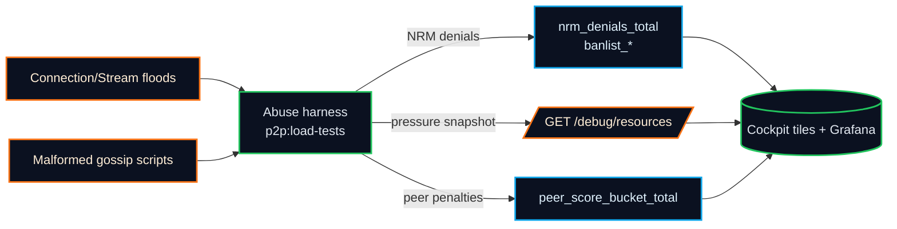
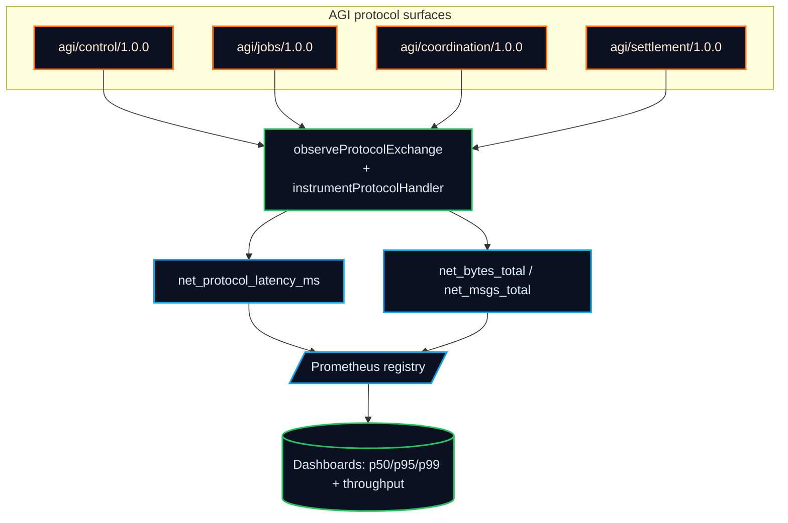
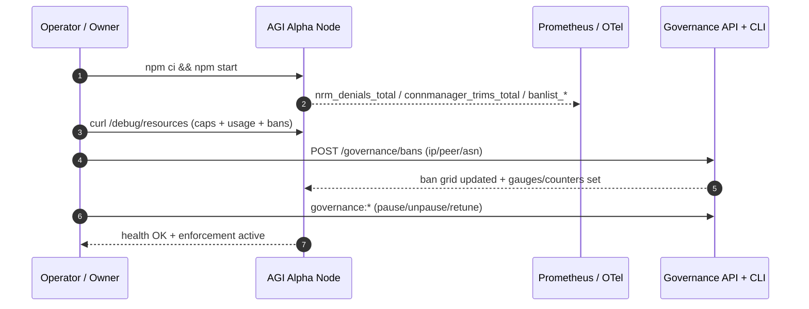

# AGI Alpha Node v0 · Cognitive Yield Engine ⚡️
<!-- markdownlint-disable MD012 MD013 MD033 -->
<p align="center">
  <picture>
    <source srcset="1.alpha.node.agi.eth.svg" type="image/svg+xml" />
    
  </picture>
</p>

<p align="center">
  <a href="https://github.com/MontrealAI/AGI-Alpha-Node-v0/actions/workflows/ci.yml?query=branch%3Amain">
    
  </a>
  <a href="https://github.com/MontrealAI/AGI-Alpha-Node-v0/actions/workflows/ci.yml?query=branch%3Amain">
    
  </a>
  <a href=".github/required-checks.json">
    
  </a>
  
  
  
  
  
  
  <a href="https://etherscan.io/address/0xa61a3b3a130a9c20768eebf97e21515a6046a1fa">
    
  </a>
  
  <a href="LICENSE">
    
  </a>
  
  
  <a href="Dockerfile">
    
  </a>
  <a href="deploy/helm/agi-alpha-node">
    
  </a>
  
  
</p>

**AGI Alpha Node v0** metabolizes heterogeneous agentic labor into verifiable α‑Work Units (α‑WU) and Synthetic Labor Units (SLU), rebalances the Global Synthetic Labor Index (GSLI), exposes audited read‑only REST telemetry, and routes the `$AGIALPHA` treasury (token: `0xa61a3b3a130a9c20768eebf97e21515a6046a1fa`, 18 decimals) under complete owner command. Every dial can be paused, rerouted, or retuned without redeploying, delivering a production-grade intelligence core built to bend markets.

This runtime is engineered as the operator-owned intelligence engine capable of redirecting economic gravity—the same class of system that could upend traditional market structures—while still keeping the owner in full command of every parameter, pause switch, and emission lever.

> Owner directives stay absolute: the `$AGIALPHA` contract anchor (`0xa61a3b3a130a9c20768eebf97e21515a6046a1fa`, 18 decimals) and `AlphaNodeManager.sol` keep every parameter, pause switch, and emission lever adjustable by the contract owner with no redeploy required.【F:contracts/AlphaNodeManager.sol†L1-L120】

## Table of contents

1. [Why operators deploy this node](#why-operators-deploy-this-node)
2. [System map](#system-map)
3. [Resource manager & DoS telemetry (Sprint E3)](#resource-manager--dos-telemetry-sprint-e3)
4. [Operator quickstart](#operator-quickstart)
5. [OTel + Prometheus observability (Sprint E4)](#otel--prometheus-observability-sprint-e4)
6. [Sprint E5 – Higher-level network metrics](#sprint-e5--higher-level-network-metrics-dial-latency-throughput)
7. [Sprint E7 – Tests, CI & load harness](#sprint-e7--tests-ci--load-harness)
8. [Deployment & governance controls](#deployment--governance-controls)
9. [Sprint E6 – Debug APIs, dashboard tiles, and runbook](#sprint-e6--debug-apis-dashboard-tiles-and-runbook)
10. [Owner controls & token](#owner-controls--token)
11. [API surfaces & operator quick reference](#api-surfaces-operator-quick-reference)
12. [Run it locally (mirrors CI gates)](#run-it-locally-mirrors-ci-gates)
13. [CI & branch protection](#ci--branch-protection-always-green)
14. [Dashboard & monitoring](#dashboard--monitoring)
15. [Data spine & economics](#data-spine--economics)
16. [Mode A treasury intents (Sprint T1)](#mode-a-treasury-intents-sprint-t1)

## Why operators deploy this node

- **Owner-first controls**: Pause/unpause, rotate validators, retune emissions, and update metadata through `AlphaNodeManager.sol` without redeploying the network substrate.【F:contracts/AlphaNodeManager.sol†L1-L120】
- **Hard DoS guardrails**: The Network Resource Manager (NRM) rejects every overage with structured logs, `nrm_denials_total{limit_type,protocol}` increments, and live `denials.byLimitType` + `denials.byProtocol` breakdowns; ban grid counters and gauges make denials auditable in real time.【F:src/network/resourceManagerConfig.js†L248-L305】【F:src/telemetry/networkMetrics.js†L114-L144】
- **Debuggable capacity**: `GET /debug/resources` exposes global caps, per-protocol ceilings (GossipSub/identify/bitswap/agi/*), per-IP/ASN ceilings, bans, and live utilization so operators never spelunk code to understand pressure.【F:src/network/resourceManagerConfig.js†L485-L626】【F:src/network/apiServer.js†L1353-L1405】
- **Watermarks + bans as metrics**: Connection Manager trims emit `connmanager_trims_total{reason}`; ban mutations raise gauges/counters for IP/peer/ASN entries to keep governance controls transparent.【F:src/network/resourceManagerConfig.js†L641-L694】【F:src/network/apiServer.js†L2050-L2130】
- **Green by default**: `.github/workflows/ci.yml` now adds a `Full CI Verification` job that runs `npm run ci:verify`, and `.github/required-checks.json` marks it as mandatory alongside the existing gates; `package.json` wires `npm run coverage` to `c8 report --check-coverage` over `src/network/**` + `src/telemetry/**` so ≥85% line coverage is enforced on every PR.【F:.github/workflows/ci.yml†L1-L210】【F:.github/required-checks.json†L1-L10】【F:package.json†L19-L40】
- **Dial + protocol clarity**: QUIC/TCP dials now emit `net_dial_success_total{transport}` and `net_dial_fail_total{transport,reason}` directly from the libp2p tracer, while protocol handlers use `net_protocol_latency_ms`, `net_msgs_total`, and `net_bytes_total` to surface p50/p95/p99, ingress/egress, and chatter per topic.【F:src/network/libp2pHostConfig.js†L64-L195】【F:src/telemetry/networkMetrics.js†L24-L231】【F:src/network/protocols/metrics.js†L6-L149】

## System map

```mermaid
flowchart TD
  classDef neon fill:#0b1120,stroke:#22c55e,stroke-width:2px,color:#e2e8f0;
  classDef lava fill:#0b1120,stroke:#f97316,stroke-width:2px,color:#ffedd5;
  classDef frost fill:#0b1120,stroke:#0ea5e9,stroke-width:2px,color:#e0f2fe;

  subgraph Owner[Owner / Operator Deck]
    CLI[node src/index.js\n(governance:*)]:::lava
    REST[/REST & Governance API/]:::lava
    Dashboard[React/Vite cockpit]:::lava
  end

  subgraph Runtime[Node Runtime]
    P2P[GossipSub v1.1 + libp2p host]:::neon
    Jobs[α‑Work Unit Engine]:::neon
    GSLI[Global Synthetic Labor Index]:::neon
    Metrics[Prometheus + OTel]:::frost
    Storage[SQLite spine + migrations]:::frost
  end

  subgraph Safety[Guards & Gates]
    NRM[Network Resource Manager\nper-protocol/IP/ASN caps]:::frost
    ConnMgr[Connection Manager\nwatermarks + trims]:::frost
    Bans[Ban grid\nIP · Peer · ASN]:::lava
    Scoring[Peer scoring + DoS bans]:::neon
  end

  CLI --> REST
  Dashboard --> REST
  REST --> Runtime
  Runtime --> Metrics
  P2P --> Runtime
  Jobs --> GSLI
  NRM --> Runtime
  ConnMgr --> NRM
  Bans --> NRM
  Scoring --> P2P
  Metrics --> Dashboard
  class Owner,Runtime,Safety,CLI,REST,Dashboard,P2P,Jobs,GSLI,Metrics,Storage,NRM,ConnMgr,Bans,Scoring neon;
```

## Resource manager & DoS telemetry (Sprint E3)

- **Tag every denial**: All NRM reject paths produce structured logs with limit type, protocol, peer, IP/ASN context, and bump `nrm_denials_total{limit_type,protocol}` while accumulating `denials.byLimitType` and `denials.byProtocol` so dashboards can slice by cause instantly. Per-protocol stream caps surface as `limit_type="per_protocol"`, keeping stream floods distinguishable from global stream ceilings.【F:src/network/resourceManagerConfig.js†L248-L305】【F:src/telemetry/networkMetrics.js†L114-L169】
- **Per-protocol clarity**: The NRM snapshot always includes GossipSub/identify/bitswap/agi protocol caps and usage, even when zero, making `/debug/resources` copy/paste friendly for runbooks and dashboards.【F:src/network/resourceManagerConfig.js†L485-L626】【F:test/network/resourceManagerConfig.test.js†L76-L128】
- **Usage + pressure grid**: `metrics()` surfaces global/ per-protocol/ per-IP/ per-ASN usage with utilization, per-limit-type denial tallies, and dialer plans so operators see pressure before drops occur.【F:src/network/resourceManagerConfig.js†L485-L626】
- **Connection trims + bans as metrics**: Peer trims increment `connmanager_trims_total{reason}`; ban additions/removals update `banlist_entries` gauges and `banlist_changes_total{type,action}` counters for IP/peer/ASN governance surfaces.【F:src/network/resourceManagerConfig.js†L641-L694】【F:src/network/apiServer.js†L2050-L2130】

```bash
curl -s localhost:3000/debug/resources | jq '{limits, usage, bans}'
# Shows global caps, per-protocol ceilings (GossipSub/identify/bitswap/agi/*),
# per-IP/ASN limits, ban grid, and live utilization/pressure telemetry.
```

```bash
curl -s localhost:3000/debug/network?window=15 | jq '{reachability, churn, dials, transportPosture}'
# Mirrors the dashboard tiles: reachability timeline, connection churn snapshots,
# dial success/failure by transport, and QUIC/TCP share for the selected window.
```

**Debug snapshot payload (shape):**

```jsonc
{
  "limits": {
    "global": { "connections": 1024, "streams": 8192, "memoryBytes": 536870912, "fileDescriptors": 2048, "bandwidthBps": 67108864 },
    "perProtocol": {
      "/meshsub/1.1.0": { "connections": 60, "streams": 600 },
      "agi/control/1.0.0": { "connections": 24, "streams": 240 }
    },
    "ipLimiter": {
      "maxConnsPerIp": 64,
      "maxConnsPerAsn": 256,
      "bans": { "ips": ["203.0.113.7"], "peers": ["12D3KooXbad"], "asns": ["asn-fraud"] }
    },
    "perPeer": {
      "12D3KooXowner": { "maxStreams": 128 }
    }
  },
  "usage": {
    "global": { "connections": { "used": 120, "limit": 1024 }, "streams": { "used": 800, "limit": 8192 } },
    "perProtocol": {
      "/meshsub/1.1.0": {
        "connections": { "used": 16, "limit": 60 },
        "streams": { "used": 144, "limit": 600 }
      },
      "agi/control/1.0.0": {
        "connections": { "used": 6, "limit": 24 },
        "streams": { "used": 36, "limit": 240 }
      }
    },
    "perIp": { "busiest": { "203.0.113.7": 7 }, "limit": 64 },
    "perAsn": { "busiest": { "asn-fraud": 12 }, "limit": 256 }
  },
  "connectionManager": { "lowWater": 512, "highWater": 1024, "gracePeriodSeconds": 120 },
  "bans": { "ips": ["203.0.113.7"], "peers": ["12D3KooXbad"], "asns": ["asn-fraud"] }
}
```

The snapshot is designed for dashboards: limits and usage are already normalized into grids, while ban grids double as governance audit trails. No spelunking, no missing labels—every denial is pre-tagged with `protocol` + `limit_type` and tallied under both `denials.byLimitType` and `denials.byProtocol` for fast Grafana slices.

```mermaid
flowchart LR
  classDef neon fill:#0b1120,stroke:#22c55e,stroke-width:2px,color:#e2e8f0;
  classDef lava fill:#0b1120,stroke:#f97316,stroke-width:2px,color:#ffedd5;
  classDef frost fill:#0b1120,stroke:#0ea5e9,stroke-width:2px,color:#e0f2fe;

  Requests[Conn/Stream requests]:::neon --> Caps[Global + per-protocol caps\n(conns/streams/memory/fd/bw)]:::frost
  Caps --> Deny[Structured denial log\n+nrm_denials_total]:::lava
  Caps --> Allow[Admitted paths]:::neon
  Deny --> Metrics[Prometheus: nrm_denials_total\nconnmanager_trims_total\nbanlist_*]:::frost
  Allow --> Usage[limits + usage grids\npressure + dial plan]:::neon
  Metrics --> Debug[/GET /debug/resources/]:::lava
  Owner[Owner token / governance:*]:::lava --> Bans[/POST/DELETE /governance/bans/]:::lava
  Bans --> Metrics
```

## Operator quickstart

| Step | Command | Outcome |
| --- | --- | --- |
| Install deps | `npm ci` | Locks in the audited Node.js 20.18+ toolchain, Vitest suites, Solidity toolchain, and dashboard build chain as wired in `package.json`.【F:package.json†L1-L74】 |
| Bootstrap the cockpit | `npm run demo:local` | Spins up the local libp2p harness, sqlite spine, telemetry registry, and governance API so you can explore the cockpit without mainnet dependencies.【F:package.json†L13-L25】 |
| Run the full CI battery | `npm run ci:verify` | Executes markdown lint, REST/backend/frontend tests, Solidity lint/compile, coverage enforcement over `src/network/**` + `src/telemetry/**`, security audit, and policy gates exactly like the `Full CI Verification` workflow job.【F:package.json†L26-L52】【F:.github/workflows/ci.yml†L1-L210】 |
| Stress observability | `npm run p2p:load-tests` | Replays the connection/stream floods plus malformed gossip scenarios so `/debug/resources` and peer-score gauges visibly move before shipping changes.【F:package.json†L53-L60】【F:test/network/loadHarness.observability.test.js†L1-L90】 |
| Ship dashboards | `npm run dashboard:build` | Emits the production cockpit bundle (Vite + React) mirroring the metrics/dial tiles documented below.【F:package.json†L61-L74】 |

Once these steps are green, the node is already operating as the market-bending machine described above: every transport, ban grid, and treasury lever can be tuned live, and the CI stack enforces it stays that way on every PR.

## OTel + Prometheus observability (Sprint E4)

- **Centralized wiring:** `configureOpenTelemetry` and `loadTelemetryConfig` normalize `OTEL_SERVICE_NAME`, OTLP headers, and endpoints into a single tracer resource while `startMonitoringServer` always keeps the Prometheus registry and `/metrics` online.【F:src/telemetry/monitoring.js†L1-L52】【F:src/telemetry/config.js†L31-L57】【F:src/telemetry/monitoring.js†L280-L363】
- **OTLP on demand:** Set `OTEL_EXPORTER_OTLP_ENDPOINT` (plus optional `OTEL_EXPORTER_OTLP_HEADERS` or `OTEL_TRACES_SAMPLER=traceidratio:<0-1>`) to stream traces; leave it unset to run fully locally without interrupting metrics exposure or shutdown flows.【F:src/telemetry/otelCore.js†L37-L82】【F:src/telemetry/config.js†L31-L57】
- **REST spans + propagation:** Every REST/gov/health call is wrapped with an `http.server` span that captures method, route, status, latency, and keeps the trace context active for request metadata and downstream services.【F:src/network/apiServer.js†L170-L243】【F:src/network/apiServer.js†L1305-L1505】
- **Dial traces:** Each outbound libp2p dial emits a `net.dial` span with `peer.id`, `net.transport`, `net.peer.addr`, success, and latency while linking back to any active HTTP span for seamless cross-surface stitching.【F:src/network/libp2pHostConfig.js†L64-L164】
- **Prometheus-first:** `/metrics` stays Prometheus-native (peer scoring, α‑WU, NRM, bans) while traces route to OTLP; CI lint/link checks keep mermaid diagrams rendering cleanly on GitHub Pages.【F:src/telemetry/monitoring.js†L291-L363】【F:package.json†L12-L46】

## Sprint E5 – Higher-level network metrics (dial, latency, throughput)

- **Dial success/failure by transport + reason:** The libp2p tracer increments `net_dial_success_total{transport}` and `net_dial_fail_total{transport,reason}` alongside legacy counters, giving Grafana-ready success rates for QUIC/TCP/relay with error breakdowns (timeout/refused/nrm_limit/etc.).【F:src/network/libp2pHostConfig.js†L64-L195】
- **Per-protocol latency histograms + helpers:** `net_protocol_latency_ms` exposes p50/p95/p99 per handler via `startProtocolTimer`, and `buildCoreProtocolInstrumentation` wraps jobs/control/coordination/settlement handlers without changing signatures.【F:src/telemetry/networkMetrics.js†L146-L160】【F:src/network/protocols/metrics.js†L6-L149】
- **Ingress/egress byte + message rates:** `net_bytes_total{direction,protocol}` and `net_msgs_total{direction,protocol}` are bumped by `recordProtocolTraffic`, the `observeProtocolExchange` round-trip helper, or the lightweight `trackProtocolMessage` shim so dashboards can spot chatty peers and runaway payload sizes instantly.【F:src/telemetry/networkMetrics.js†L162-L174】【F:src/network/protocols/metrics.js†L35-L103】

## Sprint E7 – Tests, CI & load harness

- **Metrics wiring tests:** `test/telemetry/networkMetrics.test.js` simulates dial success/failure, AutoNAT callbacks, banlist churn, and reachability transitions so the counters/gauges for `net_dial_*`, `nrm_denials_total`, `banlist_*`, and `net_reachability_state` are guaranteed to move when expected.【F:test/telemetry/networkMetrics.test.js†L1-L210】
- **NRM + ban regression guardrails:** `test/network/resourceManagerConfig.test.js` covers per-IP/per-ASN caps, ban grid gauges/counters, per-protocol connection/stream denials, and connection-manager trims so governance and DoS guardrails always emit telemetry with labels intact.【F:test/network/resourceManagerConfig.test.js†L1-L240】
- **Load harness observability:** `test/network/loadHarness.observability.test.js` drives the synthetic flood/trim harness, hits `/debug/resources`, and confirms Prometheus metrics for NRM denials, peer-score buckets, and trim reasons move in sync before shipping changes.【F:test/network/loadHarness.observability.test.js†L1-L108】
- **Monitoring reachability parity:** `test/monitoring.test.js` boots the Prometheus server with a live reachability state, polls `/metrics`, and ensures `net_reachability_state` flips as soon as the backing state changes so dashboards stay truthful.【F:test/monitoring.test.js†L1-L120】
- **One-command verification:** `npm run p2p:load-tests` is wired in `package.json` and called out in the operator quickstart so you can run the observability scenarios on demand, matching the CI expectation.【F:package.json†L53-L60】
- **Full CI enforcement:** `.github/workflows/ci.yml` runs lint, tests, coverage, Solidity, TypeScript, docker smoke, security audit, and then the `Full CI Verification` job replays `npm run ci:verify` (which already calls `npm run coverage` with `c8 --check-coverage`) to enforce the exact same coverage thresholds developers run locally. `.github/required-checks.json` ensures every PR and push to `main` is blocked until those jobs are green.【F:.github/workflows/ci.yml†L1-L320】【F:.github/required-checks.json†L1-L10】【F:package.json†L19-L40】

```mermaid
flowchart LR
  classDef job fill:#0b1120,stroke:#22c55e,stroke-width:2px,color:#e2e8f0;
  classDef gate fill:#0b1120,stroke:#f97316,stroke-width:2px,color:#ffedd5;

  Lint[Lint Markdown & Links\n(npm run lint)]:::job --> Verify
  Test[Unit + Frontend Tests\n(npm run ci:test)]:::job --> Verify
  Solidity[Solidity Lint & Compile]:::job --> Verify
  TS[Subgraph TypeScript Build]:::job --> Verify
  Coverage[Coverage Report\nc8 --check-coverage]:::job --> Verify
  Docker[Docker Build & Smoke]:::job --> Verify
  Security[Dependency Security Scan]:::job --> Badges
  Verify[Full CI Verification\nnpm run ci:verify]:::gate --> Badges[Status Badges + Required Checks]:::gate
```



```mermaid
flowchart LR
  classDef neon fill:#0b1120,stroke:#22c55e,stroke-width:2px,color:#e2e8f0;
  classDef lava fill:#0b1120,stroke:#f97316,stroke-width:2px,color:#ffedd5;
  classDef frost fill:#0b1120,stroke:#0ea5e9,stroke-width:2px,color:#e0f2fe;

  Dials[libp2p dial tracer\nnet_dial_*]:::neon --> Rates[Success/fail by transport\n(net_dial_*_total)]:::frost
  Handlers[Protocol handlers\nstartProtocolTimer]:::lava --> Latency[net_protocol_latency_ms]:::frost
  Traffic[trackProtocolMessage\nrecordProtocolTraffic]:::lava --> Volume[net_bytes_total / net_msgs_total]:::frost
  Rates --> Prometheus[/Prometheus registry/]:::frost
  Latency --> Prometheus
  Volume --> Prometheus
  Prometheus --> Grafana[(Dashboards: p50/p95/p99 + byte/msg rates)]:::neon
```

## Deployment & governance controls

- **Full-spectrum owner switches:** `AlphaNodeManager.sol` exposes `pause`, `unpause`, `setValidator`, identity registration/rotation, and staking deposit/withdrawal entry points, all `onlyOwner`, so the operator can change validators, controllers, and payout posture instantly without redeployment.【F:contracts/AlphaNodeManager.sol†L1-L140】
- **Treasury alignment:** The canonical `$AGIALPHA` token contract (`0xa61a3b3a130a9c20768eebf97e21515a6046a1fa`, 18 decimals) is wired into the manager as the immutable staking token to ensure emissions and governance budgets stay in sync with on-chain balances.【F:contracts/AlphaNodeManager.sol†L34-L74】
- **Governance API:** `src/network/apiServer.js` keeps the REST governance plane online (governance routes, `/debug/*`, `/metrics`) so even a non-technical owner can invoke validator updates, ban changes, or telemetry pulls through authenticated HTTP calls or the React cockpit.【F:src/network/apiServer.js†L1-L450】【F:dashboard/src/App.jsx†L1-L200】
- **Policy gates + health:** The health gate script (`scripts/verify-health-gate.mjs`) and branch gate script ensure PRs cannot merge if the runtime would violate minimum staking posture, health, or branch policy, mirroring the owner’s demand for absolute release control.【F:scripts/verify-health-gate.mjs†L1-L200】【F:scripts/verify-branch-gate.mjs†L1-L120】

These controls, paired with the unstoppable telemetry core above, are why this node behaves like the intelligence engine that can realign markets while remaining under a single set of keys.



```js
import { buildCoreProtocolInstrumentation } from './src/network/protocols/metrics.js';

const protocols = buildCoreProtocolInstrumentation(networkMetrics);

const handleControl = protocols.inbound('control', async (message) => {
  // your protocol logic
  protocols.record('control', { ack: true });
  return { ok: true, message };
});

// Round-trip example that captures latency + request/response bytes for settlement flows
const result = await protocols.observe('settlement', { jobId: '123', amount: 10 }, async () => {
  return { ok: true, receipt: '0xabc' };
});
```

| Env var | Purpose | Default |
| --- | --- | --- |
| `OTEL_SERVICE_NAME` | Trace resource name for every span | `agi-alpha-node` |
| `OTEL_EXPORTER_OTLP_ENDPOINT` | Enable OTLP/HTTP trace export when set | _unset_ |
| `OTEL_EXPORTER_OTLP_HEADERS` | Extra OTLP headers (e.g., auth) in `key=value` CSV | _unset_ |
| `OTEL_TRACES_SAMPLER` | Optional `traceidratio:<0-1>` sampler ratio | _unset_ (parent-based) |

```mermaid
flowchart TD
  classDef neon fill:#0b1120,stroke:#22c55e,stroke-width:2px,color:#e2e8f0;
  classDef lava fill:#0b1120,stroke:#f97316,stroke-width:2px,color:#ffedd5;
  classDef frost fill:#0b1120,stroke:#0ea5e9,stroke-width:2px,color:#e0f2fe;

  subgraph API[REST + Governance Surface]
    Health[/GET /health(z)/]:::lava
    Metrics[/GET /metrics/]:::frost
    Gov[Governance + Bans]:::lava
    Telemetry[Telemetry ingest]:::lava
  end

  subgraph OTel[Telemetry Core]
    Tracer[Tracer\nservice.name=agi-alpha-node]:::neon
    Export[OTLP HTTP exporter]:::frost
    Prom[Prom-client registry]:::frost
  end

  subgraph Network[libp2p + Dialer]
    Dials[net.dial spans\npeer.id + transport + latency]:::neon
    NRM[Resource caps + bans]:::frost
  end

  API -->|context propagation| Tracer
  Tracer --> Export
  Tracer --> Dials
  API --> Prom
  Dials --> Prom
  Prom --> Metrics
  Export --> Jaeger[(Jaeger/Tempo)]:::frost
  Export --> Grafana[(Grafana/Exemplars)]:::frost
  NRM --> Metrics
  class API,Tracer,Export,Prom,Network,Dials,NRM,Metrics,Health,Gov,Telemetry neon;
```

## Sprint E6 – Debug APIs, dashboard tiles, and runbook

- **Operator JSON for network posture:** `GET /debug/network?window=15` now emits reachability snapshots + timeline, connection churn (live + opens/sec + closes/sec), dial success/fail tallies by transport/reason, and transport posture shares for the last window, powered by the in-memory network metrics counters.【F:src/network/apiServer.js†L1353-L1503】
- **NRM + connection manager counters:** `/debug/resources` adds `nrmDenials` and `connectionManagerStats` so dashboards see rcmgr drops and trim reasons without scraping Prometheus.【F:src/network/apiServer.js†L1353-L1405】
- **Window-synced resource overlays:** The cockpit now calls `/debug/resources?window=<n>` so NRM denials and connection-manager trims share the same observation window as `/debug/network`, making the Telemetry tab’s tiles and runbook drills match reality down to the minute.【F:dashboard/src/api/client.js†L45-L57】【F:dashboard/src/views/TelemetryView.jsx†L121-L199】
- **Dashboard telemetry tab upgrade:** The Telemetry view now renders read-only tiles for transport posture, reachability timeline, resource pressure, and churn/dial health, all still gated by the same API key flow.【F:dashboard/src/views/TelemetryView.jsx†L1-L323】【F:dashboard/src/api/client.js†L31-L56】
- **Runbook for operators:** [`docs/network-operations.md`](docs/network-operations.md) ties posture flips, reachability interpretation, NRM DoS signals, and rollout dial validation into a single operations guide.【F:docs/network-operations.md†L1-L66】

```mermaid
flowchart LR
  classDef neon fill:#0b1120,stroke:#22c55e,stroke-width:2px,color:#e2e8f0;
  classDef lava fill:#0b1120,stroke:#f97316,stroke-width:2px,color:#ffedd5;
  classDef frost fill:#0b1120,stroke:#0ea5e9,stroke-width:2px,color:#e0f2fe;

  Metrics[/networkMetrics\nconn open/close\nnet_dial_*/]:::frost --> DebugNet[/GET /debug/network/]:::lava
  Resource[/Resource Manager\nmetrics()/NRM denials/]:::frost --> DebugRes[/GET /debug/resources/]:::lava
  DebugNet --> Dashboard[(Dashboard Telemetry tab\nTransport posture · Reachability · Churn/dials)]:::neon
  DebugRes --> Dashboard
  Dashboard --> Runbook[(Runbook drills:\nposture flips · reachability · DoS triage)]:::neon
```

## Owner controls & token

- `$AGIALPHA` token: `0xa61a3b3a130a9c20768eebf97e21515a6046a1fa` (18 decimals). The owner retains absolute veto, pause, and retuning authority across runtime and emissions.
- `AlphaNodeManager.sol` consolidates pause/unpause, validator rotation, metadata refresh, treasury withdrawal, and reward tuning under a single owner-controlled contract.【F:contracts/AlphaNodeManager.sol†L1-L257】
- `TreasuryExecutor.sol` anchors the Mode A vault so orchestrators act only at the owner’s pleasure: rotate orchestrators, pause/resume execution, mark/reset digests, and sweep ETH while every `IntentExecuted` event fingerprints the calldata hash for audits.【F:contracts/TreasuryExecutor.sol†L1-L113】
- Governance verbs are exposed via CLI (`node src/index.js governance:*`) and authenticated REST endpoints so non-technical operators can steer without redeploying.【F:src/index.js†L1-L113】【F:src/network/apiServer.js†L1509-L2130】

### Owner command matrix (`AlphaNodeManager` quick reference)

| Verb | Capability | Notes |
| --- | --- | --- |
| `pause()` / `unpause()` | Freeze or resume every staking + mint/validate/accept workflow instantly. | Emits explicit `Paused/Unpaused` events so downstream automation can mirror the state.【F:contracts/AlphaNodeManager.sol†L78-L92】 |
| `setValidator(address,bool)` | Curate the validator set without redeploying. | Rejects zero-address writes and emits `ValidatorUpdated` for audit trails.【F:contracts/AlphaNodeManager.sol†L94-L101】 |
| `registerIdentity(bytes32,address)` / `updateIdentityController(bytes32,address)` | Map ENS nodes to controllers and rotate controllers on the fly. | Previous controllers are deactivated atomically so no stale keys can mint or validate work.【F:contracts/AlphaNodeManager.sol†L102-L137】 |
| `setIdentityStatus(bytes32,bool)` / `revokeIdentity(bytes32)` | Toggle or tear down any identity once behavior drifts. | Active flags propagate directly into `_requireActiveIdentity`, shutting down unauthorized staking/minting at the source.【F:contracts/AlphaNodeManager.sol†L139-L156】【F:contracts/AlphaNodeManager.sol†L259-L264】 |
| `stake(uint256)` / `withdrawStake(address,uint256)` | Move $AGIALPHA into or out of escrow while preserving audit trails. | Deposits require a live identity; withdrawals stay owner-only with explicit `StakeDeposited/StakeWithdrawn` logs.【F:contracts/AlphaNodeManager.sol†L177-L200】 |
| `recordAlphaWUMint(bytes32,address,address)` | Canonicalize every α‑Work Unit mint with the agent + node metadata. | Only the agent or owner can submit, guaranteeing provenance for downstream SLU accounting.【F:contracts/AlphaNodeManager.sol†L202-L214】 |
| `recordAlphaWUValidation(bytes32,uint256,uint256)` | Capture validator stake + scoring inputs for each work unit. | Reverts if the validator lacks the recorded stake, so false positives never land on-chain.【F:contracts/AlphaNodeManager.sol†L216-L231】 |
| `recordAlphaWUAcceptance(bytes32)` | Accept work after quorums clear. | Owner and validators can both acknowledge completions, enabling hybrid operational models.【F:contracts/AlphaNodeManager.sol†L233-L241】 |
| `applySlash(bytes32,address,uint256)` | Burnish economic discipline by emitting deterministic slash events. | Prevents zero-amount or unknown-validator slashes, giving auditors a crisp log of punitive actions.【F:contracts/AlphaNodeManager.sol†L243-L257】 |

> This matrix keeps the operator’s omnipotent stance explicit: every operational lever from validator rosters to economic slashes and ENS identity curation is callable without any redeploy, and each verb surfaces concrete events for downstream automation.

## API surfaces (operator quick reference)

| Endpoint | Purpose |
| --- | --- |
| `GET /health` / `GET /healthz` | Liveness/readiness probes. |
| `GET /debug/resources` | Limits + usage grid, bans, and NRM snapshot (per-protocol/IP/ASN).【F:src/network/apiServer.js†L1353-L1405】 |
| `GET /debug/network` | Reachability timeline, connection churn, dial success/failure, and transport posture windows.【F:src/network/apiServer.js†L1409-L1552】 |
| `POST/DELETE /governance/bans` | Add or remove IP/peer/ASN bans (owner token required); updates gauges/counters automatically.【F:src/network/apiServer.js†L2050-L2130】 |
| `GET /debug/peerscore` | GossipSub v1.1 peer score summaries for mesh tuning. |
| `GET /metrics` | Prometheus/OTel surface for network, peer scoring, SLU, and index gauges. |

## Run it locally (mirrors CI gates)

```bash
npm ci
npm run ci:verify   # lint, tests, coverage, solidity, subgraph, audit, policy, branch gate
npm start           # launches REST + metrics + governance surfaces with SQLite migrations
```

Additional entry points: `npm run p2p:simulate` (1k+ virtual peers), `npm run dashboard:dev` (React/Vite cockpit), and `npm run p2p:load-tests` (abuse harness: connection floods, stream floods, malformed gossip with `/debug/resources` + peer-score/trim assertions).【F:package.json†L10-L58】【F:scripts/p2p-simulator.mjs†L1-L118】【F:test/network/loadHarness.observability.test.js†L1-L140】

### Operations playbook (zero-drama launch)

1. **Install & hydrate**: `npm ci && npm run db:migrate && npm run db:seed` to prime the SQLite spine and dashboards.
2. **Boot**: `npm start` (or `npm run dashboard:preview` for the cockpit) to expose `/health`, `/metrics`, `/debug/resources`, and governance surfaces on port 3000.
3. **Observe**: `curl -s localhost:3000/metrics | head` to confirm NRM/ban/trim counters are live; `curl -s localhost:3000/debug/resources` to confirm per-protocol ceilings and bans load; `curl -s localhost:3000/debug/network?window=15` to verify reachability, churn, and dial success are advancing.
4. **Govern**: Use authenticated `POST/DELETE /governance/bans` or `node src/index.js governance:*` to pause/unpause, rotate validators, or retune emissions without redeploying.
5. **Harden**: Enforce branch protection with `.github/required-checks.json` and mirror CI locally via `npm run ci:verify` before opening PRs.



### Deployment pathways (prod-grade switches)

- **Docker**: `docker build -t agi-alpha-node:latest .` then `docker run --rm -p 3000:3000 agi-alpha-node:latest --help` to validate binaries before promotion.【F:Dockerfile†L1-L28】
- **Helm**: `helm upgrade --install agi-alpha-node deploy/helm/agi-alpha-node -f deploy/helm/agi-alpha-node/values.yaml` to roll out the runtime with PR-enforced checks and metrics already wired.【F:deploy/helm/agi-alpha-node/values.yaml†L1-L153】
- **Bare metal**: `npm ci && npm start` with `NRM_*` and `CONN_*` env vars tuned for your topology; `/debug/resources` remains stable across all deployment modes.【F:src/network/apiServer.js†L1353-L1405】

```mermaid
flowchart LR
  classDef neon fill:#0b1120,stroke:#22c55e,stroke-width:2px,color:#e2e8f0;
  classDef lava fill:#0b1120,stroke:#f97316,stroke-width:2px,color:#ffedd5;
  classDef frost fill:#0b1120,stroke:#0ea5e9,stroke-width:2px,color:#e0f2fe;

  Source[Main branch\nPR-protected]:::lava --> CI[CI pipeline\n(all gates)]:::frost
  CI --> Image[Docker image\nbuilt from Dockerfile]:::neon
  CI --> Chart[Helm chart\nvalues.yaml overrides]:::frost
  Image --> Cluster[Kubernetes \nagi-alpha-node release]:::lava
  Chart --> Cluster
  Cluster --> Telemetry[Prometheus/OTel\n/metrics & /debug/resources]:::neon
  Cluster --> GovernanceAPI[Owner commands\n/governance/*]:::lava
  Telemetry --> Operator[Operator cockpit\nDashboards + CLI]:::frost
  GovernanceAPI --> Operator
```

## CI & branch protection (always green)

- **Workflow fidelity**: The CI pipeline runs lint → unit/integration/frontend tests → coverage → Solidity lint/compile → subgraph TS build → `npm audit` → policy + branch gates. The same steps are wired into `npm run ci:verify` for local parity.【F:.github/workflows/ci.yml†L1-L210】【F:package.json†L29-L46】
- **Enforcement**: `.github/required-checks.json` lists the gates GitHub enforces on PRs and `main`, keeping every merge auditable and green.【F:.github/required-checks.json†L1-L9】

```mermaid
flowchart LR
  classDef neon fill:#0b1120,stroke:#22c55e,stroke-width:2px,color:#e2e8f0;
  classDef lava fill:#0b1120,stroke:#f97316,stroke-width:2px,color:#ffedd5;

  Local[npm run ci:verify]:::lava --> Lint[Lint Markdown & Links]:::neon
  Local --> Tests[Unit/Integration/Frontend Tests]:::neon
  Local --> Coverage[Coverage Report (c8)]:::neon
  Local --> Solidity[Solidity Lint & Compile]:::neon
  Local --> Subgraph[Subgraph TS Build]:::neon
  Local --> Security[npm audit (high+)]:::neon
  Local --> Policy[Policy + Branch gates]:::neon
  Lint --> Badge[Branch protection + badges]:::lava
  Tests --> Badge
  Coverage --> Badge
  Solidity --> Badge
  Subgraph --> Badge
  Security --> Badge
  Policy --> Badge
```

| Gate | What it proves |
| --- | --- |
| `lint` | Markdown, links, and Solidity styles align with repository standards. |
| `test` / `test:frontend` | All service, protocol, and dashboard behaviors are deterministic under Vitest. |
| `coverage` | `c8` enforces full coverage on the Vitest graph (badge mirrors `main`). |
| `lint:sol` / `test:sol` | Smart contracts compile cleanly with solhint hygiene. |
| `ci:ts` | Subgraph manifest generation + typegen + WASM build succeed. |
| `ci:security` | `npm audit --audit-level=high` keeps dependencies hardened (owner may upgrade at will). |
| `ci:policy` / `ci:branch` | Governance allowlists and branch naming stay within guardrails. |

## Dashboard & monitoring

- React/Vite dashboard lives in `dashboard/` with tests in `dashboard/src/App.test.jsx`; previews via `npm run dashboard:preview` align with the REST debug surfaces.
- Prometheus collectors cover transport reachability (`net_reachability_state`, AutoNAT probes/failures), dial success/failure/latency, churn gauges, peer scoring buckets, and the new NRM/ban/trim counters so observability stays unified.【F:src/telemetry/networkMetrics.js†L24-L231】【F:src/telemetry/monitoring.js†L280-L363】

## Data spine & economics

- SQLite storage with migrations underpins α‑WU, SLU, and GSLI calculations; synthetic labor scoring and index rebalancing remain operator-auditable through the REST API and metrics surfaces.【F:src/persistence/cli.js†L1-L118】【F:test/syntheticLaborEngine.test.js†L1-L86】
- Run `npm run db:migrate && npm run db:seed` to hydrate local development environments before load-testing or dashboard previews.【F:package.json†L55-L56】

AGI Alpha Nodes are the catalysts of this cognitive economy: each instance is a programmable farm that continuously harvests `$AGIALPHA` yield while the owner retains absolute veto, pause, and retuning authority.

## Mode A treasury intents (Sprint T1)

AGI Alpha Node now ships a fully deterministic Mode A treasury lane so guardians wield post-quantum Dilithium keys off-chain while the contract owner retains absolute command of every execution switch, pause lever, and emission route through `AlphaNodeManager.sol`.【F:contracts/AlphaNodeManager.sol†L1-L257】 The canonical `$AGIALPHA` treasury (token `0xa61a3b3a130a9c20768eebf97e21515a6046a1fa`, 18 decimals) inherits this lane, meaning the same machine that bends economic gravity can also halt, reroute, or reprice every treasury emission at the owner’s signal.

```mermaid
flowchart LR
  classDef neon fill:#0b1120,stroke:#22c55e,stroke-width:2px,color:#e2e8f0;
  classDef lava fill:#0b1120,stroke:#f97316,stroke-width:2px,color:#ffedd5;
  classDef frost fill:#0b1120,stroke:#0ea5e9,stroke-width:2px,color:#e0f2fe;

  Intent[TreasuryIntentV1 JSON\n(to,value,data)]:::lava --> Encode[encodeTreasuryIntent\nABI tuple]:::neon
  Encode --> Digest[digestTreasuryIntent\n+ domain selector/chainId]:::neon
  Digest --> Sign[PQ Dilithium signature\nCBOR envelope]:::frost
  Sign --> Aggregate[aggregateGuardianEnvelopes\nthreshold + registry]:::neon
  Aggregate --> Execute[npm run treasury:execute\nexecuteTransaction(...)]:::lava
  Execute --> Event[IntentExecuted() log\nowner-verifiable trail]:::neon
```

- **Canonical encoding + digest:** `src/treasury/intentTypes.ts` defines `TreasuryIntentV1`, domain hints, and normalization helpers so inputs from bots, guardians, or dashboards collapse into a single tuple, while `src/treasury/intentEncoding.ts` ABI-encodes `(address,uint256,bytes)` and prepends a selector/chain/domain block before hashing with `keccak256`.【F:src/treasury/intentTypes.ts†L1-L49】【F:src/treasury/intentEncoding.ts†L1-L44】 The new `test/treasury/intentEncoding.test.ts` deploys a Solidity harness inside an EthereumJS VM to prove the encoded bytes and digest match on-chain output bit-for-bit.【F:test/treasury/intentEncoding.test.ts†L1-L83】
- **On-chain executor + replay armor:** `contracts/TreasuryExecutor.sol` wires orchestrator-only `executeTransaction`, pause/resume toggles, digest deduplication, owner overrides, and ETH sweeping into a single vault; `test/treasury/treasuryExecutor.test.ts` stress-tests event emission, pause gating, orchestrator rotation, and replay protection inside an EthereumJS VM.【F:contracts/TreasuryExecutor.sol†L1-L113】【F:test/treasury/treasuryExecutor.test.ts†L1-L178】
- **PQ envelopes + CBOR portability:** `src/treasury/pqEnvelope.ts` loads the Dilithium WASM runtime, signs digests, and wraps `{digest, pubkey, signature, metadata}` into CBOR envelopes so every guardian tool emits identical artifacts; `test/treasury/pqEnvelope.test.ts` round-trips encode/decode to guard against serialization regressions.【F:src/treasury/pqEnvelope.ts†L1-L80】【F:test/treasury/pqEnvelope.test.ts†L1-L21】
- **Registry + threshold aggregation:** `src/treasury/guardianRegistry.ts` and `src/treasury/thresholdAggregator.ts` enforce unique guardians, Dilithium parameter sets, and M-of-N quorum while flagging duplicates or unknown public keys, as covered by `test/treasury/thresholdAggregator.test.ts`.【F:src/treasury/guardianRegistry.ts†L1-L54】【F:src/treasury/thresholdAggregator.ts†L1-L56】【F:test/treasury/thresholdAggregator.test.ts†L1-L30】
- **Operator tooling:** `scripts/treasury/execute-intent.ts` (wired behind `npm run treasury:execute`) loads intents, guardian envelopes, the registry, and environment variables, verifies the threshold with domain-separated digests, and dispatches `executeTransaction(to,value,data)` via ethers once the quorum is satisfied. It supports dry-runs, configurable selectors, and prints pending guardians when the threshold is short.【F:scripts/treasury/execute-intent.ts†L1-L107】【F:package.json†L33-L52】
- **Guardian CLI:** `npm run treasury:sign` wraps Dilithium signing, CBOR emission, metadata stamping, and domain binding so guardians can sign JSON intents or raw digests without writing bespoke tooling. It reads keys from strings or files, enforces selector/chain binding, and outputs either `.cbor` or `.json` envelopes for the orchestrator to consume.【F:scripts/treasury/sign-intent.ts†L1-L180】【F:package.json†L33-L53】
- **Guardian keygen:** `npm run treasury:keygen` emits Dilithium key pairs (`.pk/.sk/.json`) with optional deterministic seeds so onboarding guardians can bootstrap hardware wallets or HSMs without touching low-level WASM glue. The JSON artefact drops straight into `config/guardians.json`, and the full runbook lives in [`docs/runes/guardian.md`](docs/runes/guardian.md).【F:scripts/treasury/keygen.ts†L1-L130】【F:docs/runes/guardian.md†L1-L120】
- **Guardian artifacts & runbooks:** `docs/treasury-mode-a.md` documents the envelope schema, Dilithium workflow, and orchestrator instructions, while `config/guardians.example.json` ships a drop-in template for onboarding guardians without spelunking the codebase.【F:docs/treasury-mode-a.md†L1-L58】【F:config/guardians.example.json†L1-L11】

```bash
# Guardian-side signing (reads intent JSON, emits CBOR envelope)
npm run treasury:sign -- intents/payout.json \
  --private-key @keys/guardian-1.sk \
  --public-key @keys/guardian-1.pk \
  --guardian-id guardian-1 \
  --chain-id 11155111 \
  --contract 0xa61a3b3a130a9c20768eebf97e21515a6046a1fa \
  --out ./envelopes/guardian-1.cbor

# Guardians drop CBOR envelopes into ./envelopes after signing the digest
TREASURY_ADDRESS=0xa61a3b3a130a9c20768eebf97e21515a6046a1fa \
RPC_URL=https://sepolia.example/v3/<key> \
ORCHESTRATOR_KEY=0xfeed... \
npm run treasury:execute -- intents/payout.json \
  --registry config/guardians.json \
  --envelopes ./envelopes \
  --threshold 3 \
  --chain-id 11155111
```

This workflow keeps the heavy post-quantum math off-chain, yet the resulting single transaction remains fully owner-controlled, auditable through emitted events, and enforced by the same CI wall of checks that keeps the entire runtime green.
