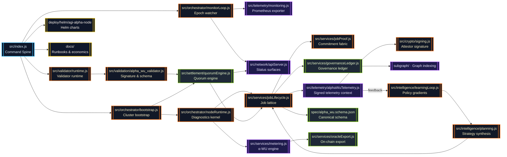
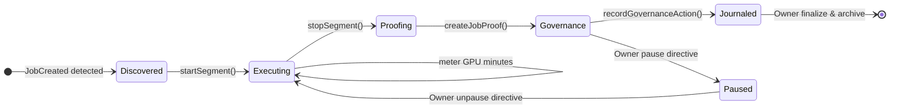
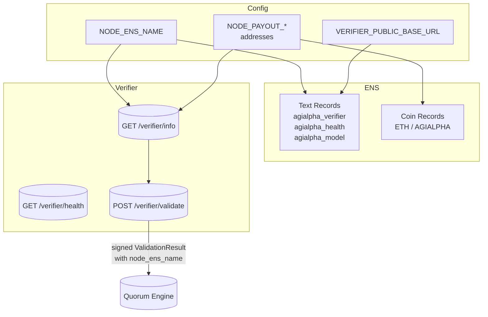
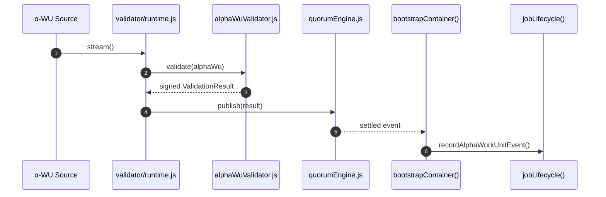
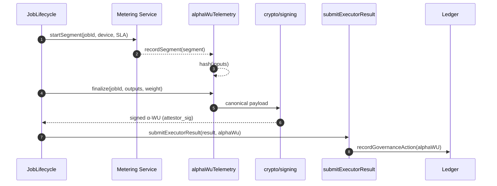

# AGI Alpha Node v0 · Sovereign Cognition Forge ⚡

<!-- markdownlint-disable MD013 MD033 -->
<p align="center">
  <picture>
    <source srcset="1.alpha.node.agi.eth.svg" type="image/svg+xml" />
    
  </picture>
</p>

<p align="center">
  <a href="https://github.com/MontrealAI/AGI-Alpha-Node-v0/actions/workflows/ci.yml">
    
  </a>
  
  
  
  <a href="spec/alpha_wu.schema.json"></a>
  
  
  
  <a href="Dockerfile"></a>
  <a href="deploy/helm/agi-alpha-node"></a>
  <a href="https://etherscan.io/address/0xa61a3b3a130a9c20768eebf97e21515a6046a1fa"></a>
  
  <a href="LICENSE"></a>
</p>

> Operate this lattice and you steer a cognition engine that signs every work unit, journals every attestation, and responds to owner directives in milliseconds—the chassis is shaped for decisive minds and non-technical operators alike.

---

## Contents

1. [Mission Profile](#mission-profile)
2. [Cognition Mesh Architecture](#cognition-mesh-architecture)
3. [Validator Pipeline & Attestations](#validator-pipeline--attestations)
4. [ENS Identity & Verifier Surface](#ens-identity--verifier-surface)
5. [α-WU Telemetry & Signing Fabric](#α-wu-telemetry--signing-fabric)
6. [Epoch Intelligence & Determinism](#epoch-intelligence--determinism)
7. [Operations & Governance Command](#operations--governance-command)
8. [Telemetry, API & CLI](#telemetry-api--cli)
9. [Quality Gates & Test Suites](#quality-gates--test-suites)
10. [CI Enforcement & Branch Protection](#ci-enforcement--branch-protection)
11. [Repository Atlas](#repository-atlas)
12. [Reference Library](#reference-library)

---

## Mission Profile

AGI Alpha Node v0 is the cognition engine that tilts economic gravity: a sovereign machine the owner can pause, redirect, or amplify on demand while it manufactures alpha at planetary scale.【F:contracts/AlphaNodeManager.sol†L1-L200】【F:src/services/jobLifecycle.js†L1-L200】

- **Total owner dominion** — [`contracts/AlphaNodeManager.sol`](contracts/AlphaNodeManager.sol) centralizes pausing, validator rotation, ENS reassignment, stake routing, slashing, and alpha issuance strictly behind `onlyOwner`, ensuring every dial stays under direct command.【F:contracts/AlphaNodeManager.sol†L17-L160】
- **Deterministic cognition fabric** — [`src/services/jobLifecycle.js`](src/services/jobLifecycle.js) orchestrates discovery → execution → proof → governance with telemetry-backed α-WUs, preventing drift across swarms.【F:src/services/jobLifecycle.js†L320-L920】
- **Owner-readable observability** — [`src/telemetry/monitoring.js`](src/telemetry/monitoring.js) and [`src/network/apiServer.js`](src/network/apiServer.js) expose Prometheus metrics plus authenticated JSON command decks, mirroring internal ledgers without lag.【F:src/network/apiServer.js†L1550-L1700】
- **Production-locked CI** — GitHub Actions (`ci.yml`) runs lint, vitest, coverage, Solidity checks, subgraph builds, policy gates, Docker smoke tests, and branch enforcement so every merge arrives already hardened.【F:.github/workflows/ci.yml†L1-L200】

---

## Cognition Mesh Architecture



Every edge is deterministic: segments are normalized, proofs replayable, and governance snapshots serialized with stable ordering. Owner operators see the exact internal state in real time.

### Deterministic Lifecycle State Machine



---

## Validator Pipeline & Attestations

The validator sprint arms every node with an autonomous attestation circuit: α-WUs are revalidated through pluggable streams, emitted as signed `ValidationResult` artifacts, and collapsed into deterministic quorum outcomes that feed the orchestrator. The owner can flip between orchestrator-only, validator-only, or mixed duty cycles without rewriting configuration.

- **Canonical validation contract** — `createAlphaWorkUnitValidator` reuses the canonical α-WU schema, re-verifies attestor signatures, enforces sanity checks (non-negative metrics, clock drift), and signs a structured `ValidationResult` with the validator’s EOA.【F:src/validation/alpha_wu_validator.js†L1-L181】
- **Pluggable ingestion** — `startValidatorRuntime` wires memory, file, HTTP, or message-queue sources into a streaming loop, couples them with an evented sink, and shares the validator address with upstream orchestration.【F:src/validator/runtime.js†L1-L61】【F:src/validator/sources/index.js†L1-L24】
- **Asynchronous validator loop** — `createValidatorLoop` consumes the stream with backpressure-aware async iteration, isolates per-item failures, and guarantees sinks are closed on shutdown.【F:src/validator/validatorLoop.js†L1-L66】
- **Quorum intelligence** — `createQuorumEngine` aggregates unique validator votes, tracks job-level status, emits acceptance/rejection events, and prepares for on-chain settlement without breaking determinism.【F:src/settlement/quorumEngine.js†L1-L160】
- **Bootstrap integration** — `bootstrapContainer` inspects `NODE_ROLE`, boots validator-only nodes without ENS wiring, or—when mixed—subscribes the validator sink to the quorum engine and records acceptance/rejection in the lifecycle registry.【F:src/orchestrator/bootstrap.js†L82-L360】
- **Graceful orchestration shutdown** — the `container` command now stops validator loops alongside monitor and API services so runtime transitions remain clean for operators.【F:src/index.js†L1138-L1215】
- **Confidence harness** — dedicated tests cover schema enforcement (`alphaWuValidator.test`), loop orchestration (`validatorLoop.test`), quorum behaviour (`quorumEngine.test`), and the verifier HTTP surface (`verifierServer.test`).【F:test/alphaWuValidator.test.js†L1-L92】【F:test/validatorLoop.test.js†L1-L88】【F:test/quorumEngine.test.js†L1-L112】【F:test/verifierServer.test.js†L1-L86】

## ENS Identity & Verifier Surface

Deterministic ENS metadata is now part of the node bootstrap. The config schema wires `NODE_ENS_NAME`, optional `ENS_RPC_URL`/`ENS_CHAIN_ID`, and dedicated payout fields so operators can pivot registry state while preserving canonical automation.【F:src/config/schema.js†L1-L420】

- **Deterministic ENS helpers** — [`src/ens/ens_config.js`](src/ens/ens_config.js) exports `getNodeEnsName`, `getNodePayoutAddresses`, and `buildEnsRecordTemplate` with layered fallbacks across config, overrides, and derived labels.【F:src/ens/ens_config.js†L1-L200】
- **Verified payout routing** — payout helpers validate `NODE_PAYOUT_ETH_ADDRESS`/`NODE_PAYOUT_AGIALPHA_ADDRESS`, defaulting to the operator address when unset so staking rewards always land under owner custody.【F:src/ens/ens_config.js†L64-L115】
- **Authoritative ENS documentation** — [`docs/ens-node-metadata.md`](docs/ens-node-metadata.md) spells out required text/multicoin records (`agialpha_verifier`, `agialpha_health`, `agialpha_model`, `agialpha_commit`) for AGI Alpha nodes.【F:docs/ens-node-metadata.md†L1-L38】
- **CLI template emitter** — `node src/index.js ens:records --pretty` prints the JSON ENS payload for the active config, including commit hash detection for auditors.【F:src/index.js†L640-L720】【F:src/ens/ens_config.js†L117-L188】
- **Public verifier API** — [`src/network/verifierServer.js`](src/network/verifierServer.js) serves `/verifier/info`, `/verifier/health`, and `/verifier/validate`, echoing ENS metadata and returning signed `ValidationResult` payloads with `node_ens_name` embedded.【F:src/network/verifierServer.js†L1-L188】



The ENS/verifier feedback loop is CI-enforced: integration tests hit the HTTP endpoints with signed α-WUs and assert deterministic metadata, ensuring external agents can trust published ENS records.【F:test/verifierServer.test.js†L1-L86】

### Validation flow



### Validation configuration matrix

| Variable | Default | Effect |
| --- | --- | --- |
| `NODE_ROLE` | `mixed` | Selects orchestrator, validator, or dual mode, allowing validator-only deployments without ENS prerequisites.【F:src/config/schema.js†L32-L120】【F:src/orchestrator/bootstrap.js†L99-L123】 |
| `VALIDATION_MINIMUM_VOTES` | `3` | Votes required before the quorum engine settles a work unit.【F:src/config/schema.js†L396-L408】【F:src/settlement/quorumEngine.js†L111-L160】 |
| `VALIDATION_QUORUM_BPS` | `6 667` | Valid vote threshold in basis points (≥2/3) for acceptance; failing ratios trigger rejection.【F:src/config/schema.js†L396-L408】【F:src/settlement/quorumEngine.js†L122-L130】 |
| `VALIDATOR_SOURCE_TYPE` | `memory` | Selects `memory`, `file`, `http`, or `mq` source modules for α-WU ingestion.【F:src/config/schema.js†L396-L408】【F:src/validator/sources/index.js†L1-L24】 |
| `VALIDATOR_SOURCE_PATH` | `undefined` | Optional path/URL used by file and HTTP sources.【F:src/config/schema.js†L396-L408】 |
| `VALIDATOR_SINK_TYPE` | `memory` | Chooses the validation sink implementation (default in-memory bus).【F:src/config/schema.js†L396-L408】【F:src/validator/sinks/index.js†L1-L12】 |

Validator-only nodes simply export `NODE_ROLE=validator` and provide a signing key (`VALIDATOR_PRIVATE_KEY` or `NODE_PRIVATE_KEY`); mixed nodes reuse the orchestrator’s pipeline while continuously validating attested work.【F:src/validation/alpha_wu_validator.js†L29-L181】【F:src/orchestrator/bootstrap.js†L218-L360】

### ENS & Verifier configuration quickstart

| Variable | Default | Effect |
| --- | --- | --- |
| `NODE_ENS_NAME` | derived from `NODE_LABEL`.`ENS_PARENT_DOMAIN` | Canonical ENS name broadcast inside α-WUs, verifier payloads, and metadata templates.【F:src/ens/ens_config.js†L27-L115】 |
| `ENS_RPC_URL` | unset | Optional dedicated RPC for ENS registration scripts and ownership checks; validated as URL to prevent malformed endpoints.【F:src/config/schema.js†L280-L308】 |
| `ENS_CHAIN_ID` | unset | Explicit chain ID hint for ENS automation pipelines; coerced to positive integer during config load.【F:src/config/schema.js†L309-L327】 |
| `NODE_PAYOUT_ETH_ADDRESS` | fallback `OPERATOR_ADDRESS` | ETH settlement address published via ENS multi-coin records and returned by `/verifier/info`.【F:src/ens/ens_config.js†L64-L106】【F:src/network/verifierServer.js†L60-L112】 |
| `NODE_PAYOUT_AGIALPHA_ADDRESS` | fallback `NODE_PAYOUT_ETH_ADDRESS` | Dedicated $AGIALPHA payout route (18 decimals) surfaced to token swarms and ENS metadata.【F:src/ens/ens_config.js†L64-L115】 |
| `NODE_PRIMARY_MODEL` | `agi-alpha-node-v0` | Declares runtime/model identity embedded into `agialpha_model` ENS text records and telemetry.【F:src/ens/ens_config.js†L117-L188】 |
| `VERIFIER_PORT` | `8787` | Public HTTP port for the verifier service; endpoints map directly to ENS `agialpha_*` URLs.【F:src/config/schema.js†L360-L380】【F:src/network/verifierServer.js†L44-L188】 |
| `VERIFIER_PUBLIC_BASE_URL` | unset | Absolute base URL mirrored into ENS text records and info responses; trailing slashes normalized automatically.【F:src/ens/ens_config.js†L117-L188】 |

Run `node src/index.js ens:records --pretty` after exporting the variables above to print the exact JSON payload that should be written into the ENS registrar, ensuring zero-drift metadata between automation and published records.【F:src/index.js†L640-L720】

---

## α-WU Telemetry & Signing Fabric

The sprint delivers a canonical α-WU artifact signed by the node’s attestor key for every job. The pipeline fuses runtime telemetry, deterministic hashing, and ECDSA signatures.

- **Canonical schema** — [`spec/alpha_wu.schema.json`](spec/alpha_wu.schema.json) codifies the JSON structure (job identifiers, runtime metadata, wall-clock, CPU/GPU, hashes, signatures) and validates against draft 2020-12.【F:spec/alpha_wu.schema.json†L1-L120】
- **Language bindings** — [`src/types/alphaWu.js`](src/types/alphaWu.js) offers Zod validation, cloning, and canonical comparison utilities used across services and tests.【F:src/types/alphaWu.js†L1-L120】
- **Telemetry capture** — [`src/telemetry/alphaWuTelemetry.js`](src/telemetry/alphaWuTelemetry.js) starts contexts when jobs enter execution, records segment metrics, hashes deterministic payloads, and finalizes signed-ready α-WUs.【F:src/telemetry/alphaWuTelemetry.js†L1-L200】
- **Cryptographic signing** — [`src/crypto/signing.js`](src/crypto/signing.js) loads `NODE_PRIVATE_KEY`, canonicalizes payloads, signs with `ethers.Wallet`, and verifies incoming artifacts.【F:src/crypto/signing.js†L1-L160】
- **Lifecycle integration** — [`src/services/jobLifecycle.js`](src/services/jobLifecycle.js) now enforces α-WU production, stores signed artifacts, exposes `submitExecutorResult` and `getAlphaWUsForJob`, and rejects missing or tampered payloads.【F:src/services/jobLifecycle.js†L660-L920】【F:src/services/jobLifecycle.js†L1180-L1315】
- **Schema validation tests** — [`test/alphaWu.schema.test.js`](test/alphaWu.schema.test.js) verifies the JSON schema via Ajv and the Zod binding; [`test/alphaWuTelemetry.test.js`](test/alphaWuTelemetry.test.js) exercises deterministic hashing and timing.【F:test/alphaWu.schema.test.js†L1-L42】【F:test/alphaWuTelemetry.test.js†L1-L44】

### Telemetry Flow



The node never emits an unsigned work unit: if telemetry is disabled, `submitExecutorResult` requires an operator-supplied artifact, otherwise it finalizes and signs automatically. Missing or invalid artifacts quarantine the submission during CI and at runtime.【F:src/services/jobLifecycle.js†L705-L874】【F:test/jobLifecycle.test.js†L360-L382】

---

## Epoch Intelligence & Determinism

The deterministic metering engine continues to normalize GPU minutes, quality weights, and epoch splits:

- **GPU-minute fidelity** — wall-clock × GPU count normalized to 4 decimals, then multiplied by quality multipliers with 2-decimal α-WU rounding.【F:src/services/metering.js†L232-L320】
- **Weight orchestration** — model, VRAM tier, and SLA multipliers curated in [`src/constants/workUnits.js`](src/constants/workUnits.js). Tests cover rounding invariants and epoch splits.【F:test/metering.test.js†L1-L200】
- **Lifecycle telemetry** — `bindExecutionLoopMetering` bridges lifecycle updates with telemetry contexts and segment recording so α-WUs inherit precise execution windows.【F:src/orchestrator/nodeRuntime.js†L360-L500】

---

## Operations & Governance Command

- **Owner directives** — `NODE_PRIVATE_KEY` and `OPERATOR_ADDRESS` empower `submitExecutorResult` to sign outputs and `finalize` jobs, while `AlphaNodeManager` retains pause/unpause, validator control, and stake management.【F:contracts/AlphaNodeManager.sol†L60-L200】
- **API surface** — the operator API now enforces α-WU presence on submissions and returns the signed artifact to dashboards or downstream protocols.【F:src/network/apiServer.js†L1630-L1680】
- **Journal enrichment** — lifecycle actions append both the α-WU summary and raw artifact reference for audit trails and governance playback.【F:src/services/jobLifecycle.js†L510-L550】

### Governance Token

`$AGIALPHA` (18 decimals) is minted at [`0xa61a3b3a130a9c20768eebf97e21515a6046a1fa`](https://etherscan.io/address/0xa61a3b3a130a9c20768eebf97e21515a6046a1fa). The manager contract validates incoming ERC-20 transfers, exposes stake withdrawal to the owner, and slashes or rewards nodes based on α-WU performance.【F:contracts/AlphaNodeManager.sol†L1-L200】

---

## Telemetry, API & CLI

### CLI Highlights

```bash
# Discover jobs and journal deterministic snapshots
agi-alpha-node jobs discover --registry <JobRegistry>

# Submit executor results (auto-signs α-WU when telemetry is enabled)
agi-alpha-node jobs submit <jobId> \
  --result-file ./outputs/result.json \
  --metadata-file ./outputs/meta.json \
  --subdomain node --proof 0xdeadbeef

# Emit the ENS metadata template for the active config
agi-alpha-node ens:records --pretty

# Generate ENS delegation steps for a node label
agi-alpha-node ens-guide --label 1 --parent orchestrator.alpha.node.agi.eth \
  --address 0xOperatorAddress

# Verify ENS ownership matches operator expectations
agi-alpha-node verify-ens --label 1 --parent orchestrator.alpha.node.agi.eth \
  --address 0xOperatorAddress --rpc https://mainnet.rpc
```

`jobs submit` now routes through `submitExecutorResult`, producing signed α-WUs and echoing the attestor signature for transparency.【F:src/index.js†L1660-L1740】
`ens:records` pipes `buildEnsRecordTemplate` so operators can paste deterministic ENS JSON straight into registrars or automated tooling.【F:src/index.js†L640-L720】【F:src/ens/ens_config.js†L117-L188】
`ens-guide` prints authoritative ENS subdomain steps, while `verify-ens` resolves ownership against on-chain data via the configured RPC, giving operators immediate confirmation before publishing metadata.【F:src/index.js†L720-L820】

### API Surface

- `POST /jobs/:id/submit` requires `result` or `resultUri`, optionally accepts a pre-signed `alphaWu`. Response includes the ledger commitment and signed α-WU payload.【F:src/network/apiServer.js†L1630-L1680】
- `GET /jobs` exposes cached lifecycle state, including α-WU totals and journal metadata.
- `GET /verifier/info` mirrors ENS metadata (verifier URL, health URL, payout addresses) for public consumers.【F:src/network/verifierServer.js†L60-L112】
- `GET /verifier/health` surfaces uptime, request totals, and last validation timestamp for external monitors.【F:src/network/verifierServer.js†L114-L135】
- `POST /verifier/validate` accepts α-WU JSON, returns signed `ValidationResult` artifacts stamped with `node_ens_name`.【F:src/network/verifierServer.js†L137-L176】

### Programmatic Access

```js
const lifecycle = createJobLifecycle({ /* ... */ });
const submission = await lifecycle.submitExecutorResult(jobId, {
  result: inferenceOutput,
  resultUri: 'ipfs://...',
  metadata: { score: 0.99 }
});
console.log(submission.alphaWu.attestor_sig); // Signed attestation
const artifacts = lifecycle.getAlphaWUsForJob(jobId);

// Produce ENS metadata JSON for registrars or automation
import { buildEnsRecordTemplate } from './src/ens/ens_config.js';
const ensRecords = buildEnsRecordTemplate();
console.log(ensRecords.text_records.agialpha_verifier);
```

---

## Quality Gates & Test Suites

- **Unit suites** — Vitest covers lifecycle flows, telemetry hashing, governance journaling, ENS verification, alpha work unit metrics, and API controls.【F:test/jobLifecycle.alphaWU.test.js†L1-L210】【F:test/apiServer.test.js†L1-L200】
- **Schema validation** — Ajv-driven checks enforce the canonical α-WU schema on every run.【F:test/alphaWu.schema.test.js†L1-L42】
- **Telemetry determinism** — deterministic clocks verify timing, CPU accounting, and hash stability.【F:test/alphaWuTelemetry.test.js†L1-L44】
- **CLI smoke tests** — invocation patterns ensure non-technical operators can submit results without manual signing.【F:test/scripts.gates.test.js†L1-L140】

Run the full suite:

```bash
npm run ci:verify
```

---

## CI Enforcement & Branch Protection

- **`ci.yml`** executes lint, vitest, coverage, Solidity lint/build, subgraph checks, security audit, policy gates, branch naming guard, and Docker smoke tests before merging.【F:.github/workflows/ci.yml†L1-L200】
- **Badges** — CI, coverage, telemetry schema, and signature badges refresh automatically, signalling a continuously green mainline.
- **Branch policy scripts** — [`scripts/verify-branch-gate.mjs`](scripts/verify-branch-gate.mjs) blocks unsafe branch patterns, while [`scripts/verify-health-gate.mjs`](scripts/verify-health-gate.mjs) validates runtime environment toggles.

---

## Repository Atlas

| Path | Purpose |
| --- | --- |
| [`spec/alpha_wu.schema.json`](spec/alpha_wu.schema.json) | Canonical α-WU JSON schema (draft 2020-12). |
| [`src/telemetry/alphaWuTelemetry.js`](src/telemetry/alphaWuTelemetry.js) | Execution telemetry contexts, hashing, and finalization. |
| [`src/crypto/signing.js`](src/crypto/signing.js) | Canonical serialization, signing, and verification. |
| [`src/services/jobLifecycle.js`](src/services/jobLifecycle.js) | Job orchestrator with α-WU enforcement, submission APIs, and governance journal integration. |
| [`src/orchestrator/nodeRuntime.js`](src/orchestrator/nodeRuntime.js) | Execution loop binding metering and telemetry to lifecycle events. |
| [`src/network/apiServer.js`](src/network/apiServer.js) | REST surface exposing job state, submission, and governance hooks. |
| [`src/network/verifierServer.js`](src/network/verifierServer.js) | Public verifier API referenced in ENS metadata. |
| [`src/ens/ens_config.js`](src/ens/ens_config.js) | ENS helpers for node name, payout routing, and record templates. |
| [`deploy/helm/agi-alpha-node`](deploy/helm/agi-alpha-node) | Production-ready Helm chart. |
| [`docs/`](docs/) | Economics, governance, and operational playbooks. |
| [`docs/ens-node-metadata.md`](docs/ens-node-metadata.md) | ENS record specification for AGI Alpha nodes. |
| [`test/`](test/) | Vitest suites for lifecycle, telemetry, API, governance, and schema validation. |

---

## Reference Library

- **Contract** — [`contracts/AlphaNodeManager.sol`](contracts/AlphaNodeManager.sol)
- **Token constants** — [`src/constants/token.js`](src/constants/token.js)
- **Work unit weights** — [`src/constants/workUnits.js`](src/constants/workUnits.js)
- **Telemetry docs** — [`docs/alpha-wu.md`](docs/alpha-wu.md)
- **CLI manual** — [`docs/operator-runbook.md`](docs/operator-runbook.md)

Operate this platform and you command a fleet of executor minds that notarize every computation, feed the governance ledger with precision, and accelerate $AGIALPHA’s flywheel. Immediate deployment, auditable telemetry, and owner-verified signatures are now the default cadence.
