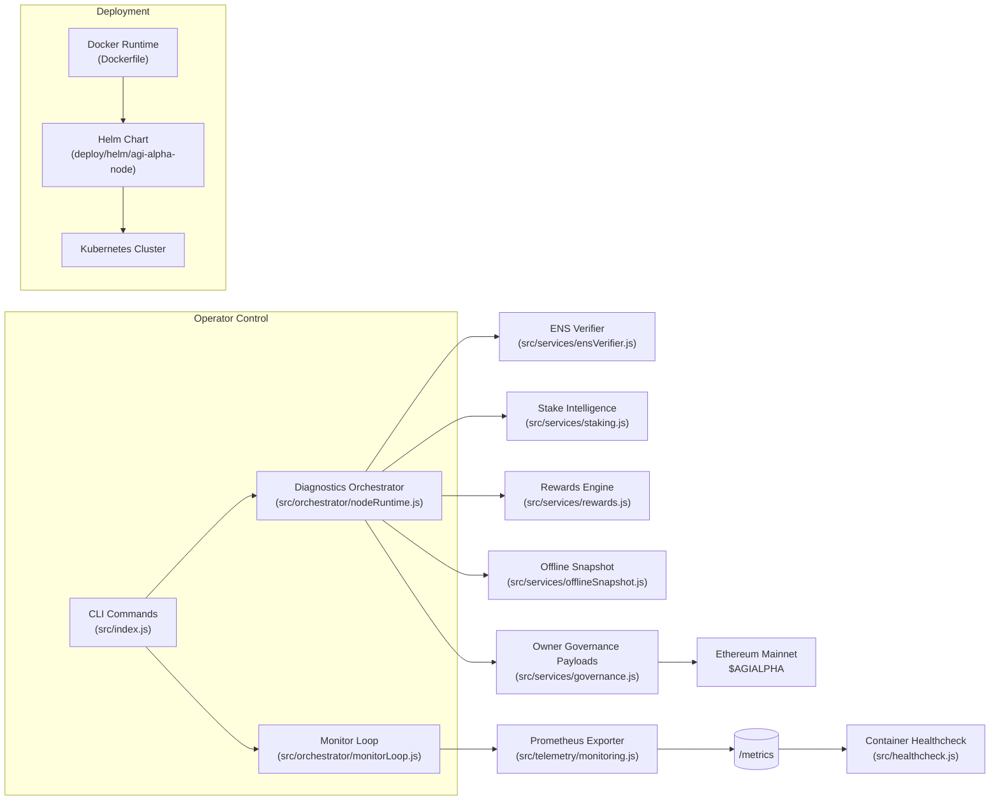
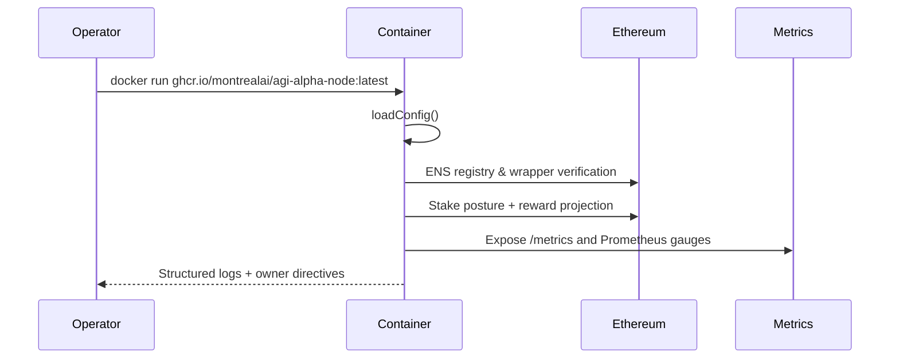
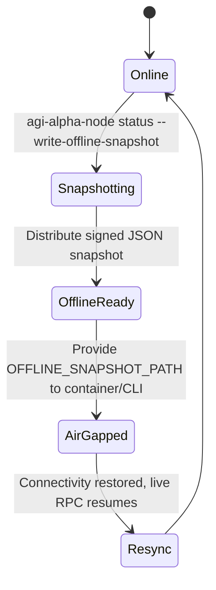

# AGI Alpha Node v0 ⚡ Sovereign Intelligence Yield Core

<!-- markdownlint-disable MD013 MD033 -->
<p align="center">
  
</p>

<p align="center">
  <a href="https://github.com/MontrealAI/AGI-Alpha-Node-v0/actions/workflows/ci.yml">
    
  </a>
  <a href="https://app.ens.domains/name/alpha.node.agi.eth">
    
  </a>
  <a href="https://etherscan.io/token/0xa61a3b3a130a9c20768eebf97e21515a6046a1fa">
    
  </a>
  
  
  
  
  
  
  
</p>

> The AGI Alpha Node is the production chassis that sovereign operators deploy to harvest $AGIALPHA yields, prove ENS custody, command intelligence swarms, and exercise absolute owner authority. This runtime is the machine that bends economic gravity—fully observable, deterministic, and prepared for the highest-stakes mainnet labor.

---

## Table of Contents

1. [Mission Signal](#mission-signal)
2. [Feature Constellation](#feature-constellation)
3. [Operator Activation Sequence](#operator-activation-sequence)
4. [Runtime Topology](#runtime-topology)
5. [Deployment Continuum](#deployment-continuum)
6. [Telemetry & Monitoring](#telemetry--monitoring)
7. [Offline Continuity Protocol](#offline-continuity-protocol)
8. [Owner Supremacy Controls](#owner-supremacy-controls)
9. [Configuration Switchboard](#configuration-switchboard)
10. [Repository Atlas](#repository-atlas)
11. [Quality Gates & Branch Discipline](#quality-gates--branch-discipline)
12. [Contributing](#contributing)
13. [License](#license)

---

## Mission Signal

| Vector | Signal | Coordinates |
| ------ | ------ | ----------- |
| **Identity Root** | ENS anchor enforced at runtime. | [`alpha.node.agi.eth`](https://app.ens.domains/name/alpha.node.agi.eth) — activate only with your delegated subdomain such as `1.alpha.node.agi.eth`. |
| **Treasury Asset** | `$AGIALPHA` (18 decimals). | [Etherscan contract `0xa61a3b3a130a9c20768eebf97e21515a6046a1fa`](https://etherscan.io/token/0xa61a3b3a130a9c20768eebf97e21515a6046a1fa). |
| **Runtime Spine** | CLI orchestrator & diagnostics loop. | [`src/index.js`](src/index.js) — orchestrates ENS proofs, staking telemetry, monitoring, and governance payloads. |
| **Intelligence Core** | Local-first meta-agent lattice. | [`src/intelligence`](src/intelligence) — planning, swarm routing, learning, and antifragile stress harness. |
| **Governance Plane** | Owner-only control payloads. | [`src/services/governance.js`](src/services/governance.js) & [`src/services/controlPlane.js`](src/services/controlPlane.js) — pause/resume, stake floors, share allocations, and directive synthesis. |
| **Telemetry Spine** | Prometheus metrics + health probes. | [`src/telemetry/monitoring.js`](src/telemetry/monitoring.js) — surfaces live gauges for jobs, earnings, ENS verification, and heartbeat posture. |
| **Offline Fidelity** | Snapshot-driven continuity. | [`src/services/offlineSnapshot.js`](src/services/offlineSnapshot.js) — validated JSON snapshots keep the node sovereign when RPC/API links stall. |
| **Deployment Surface** | Docker + Helm for one command activation. | [`Dockerfile`](Dockerfile) & [`deploy/helm/agi-alpha-node`](deploy/helm/agi-alpha-node) — single command bootstrap with health checks, secrets, and autoscaling hooks. |

---

## Feature Constellation

| Capability | Highlights | Source |
| ---------- | ---------- | ------ |
| ENS Verification | Registry + NameWrapper proofs with fail-fast enforcement. | [`src/services/ensVerifier.js`](src/services/ensVerifier.js) |
| Stake Intelligence | Minimum stake, penalties, and reward projections with BigInt precision. | [`src/services/staking.js`](src/services/staking.js), [`src/services/rewards.js`](src/services/rewards.js) |
| Token Flows | Allowances, approvals, and stake transactions using 18 decimal discipline. | [`src/services/token.js`](src/services/token.js) |
| Job Proofs | Deterministic commitment + submission payloads for AGI Jobs v0/v2. | [`src/services/jobProof.js`](src/services/jobProof.js) |
| Monitoring Loop | Continuous diagnostics with Prometheus export and health classification. | [`src/orchestrator/monitorLoop.js`](src/orchestrator/monitorLoop.js) |
| Container Health | Docker healthcheck hits metrics endpoint; Kubernetes liveness/readiness derived from Helm chart probes. | [`src/healthcheck.js`](src/healthcheck.js), [`deploy/helm/agi-alpha-node/templates/deployment.yaml`](deploy/helm/agi-alpha-node/templates/deployment.yaml) |
| Offline Snapshots | Signed JSON snapshots for air-gapped continuity; automatically loaded in CLI & monitor. | [`src/services/offlineSnapshot.js`](src/services/offlineSnapshot.js) |
| Owner Commands | Transaction builders for pausing, stake floors, share tuning, and reinvestment directives. | [`src/services/governance.js`](src/services/governance.js), [`src/services/controlPlane.js`](src/services/controlPlane.js) |

---

## Operator Activation Sequence

1. **Clone & Install**

   ```bash
   git clone https://github.com/MontrealAI/AGI-Alpha-Node-v0.git
   cd AGI-Alpha-Node-v0
   npm ci
   ```

2. **Enforce Toolchain** — Node.js ≥ 20.18.1 (`node --version`). Upgrade with `npx n 20.19.5` if necessary.

3. **ENS Mission Plan**

   ```bash
   npx agi-alpha-node ens-guide --label 1 --address 0xYOUR_OPERATOR_ADDRESS
   ```

4. **Identity Proof**

   ```bash
   npx agi-alpha-node verify-ens \
     --label 1 \
     --address 0xYOUR_OPERATOR_ADDRESS \
     --rpc https://mainnet.infura.io/v3/<PROJECT_ID>
   ```

5. **Stake & Activate**

   ```bash
   npx agi-alpha-node token approve \
     --token 0xa61a3b3a130a9c20768eebf97e21515a6046a1fa \
     --spender 0xStakeManager \
     --owner 0xYOUR_OPERATOR_ADDRESS \
     --amount max

   npx agi-alpha-node stake-tx \
     --amount 1000 \
     --incentives 0xIncentivesContract \
     --stake-manager 0xStakeManager \
     --decimals 18
   ```

6. **Diagnostics Sweep**

   ```bash
   npx agi-alpha-node status \
     --label 1 \
     --address 0xYOUR_OPERATOR_ADDRESS \
     --rpc https://mainnet.infura.io/v3/<PROJECT_ID> \
     --stake-manager 0xStakeManager \
     --incentives 0xIncentivesContract \
     --system-pause 0xSystemPause \
     --desired-minimum 1500 \
     --projected-rewards 1800 \
     --metrics-port 9464
   ```

7. **One-Pass Container Bootstrap**

   ```bash
   npx agi-alpha-node container \
     --label 1 \
     --address 0xYOUR_OPERATOR_ADDRESS \
     --rpc https://mainnet.infura.io/v3/<PROJECT_ID> \
     --interval 60 \
     --metrics-port 9464
   ```

8. **Continuous Monitoring**

   ```bash
   npx agi-alpha-node monitor \
     --label 1 \
     --address 0xYOUR_OPERATOR_ADDRESS \
     --rpc https://mainnet.infura.io/v3/<PROJECT_ID> \
     --stake-manager 0xStakeManager \
     --incentives 0xIncentivesContract \
     --system-pause 0xSystemPause \
     --interval 60 \
     --metrics-port 9464
   # Prometheus scrape endpoint: http://localhost:9464/metrics
   ```

9. **Quality Gates**

   ```bash
   npm test
   npm run lint
   ```

---

## Runtime Topology



### Container Bootstrap Symphony



---

## Deployment Continuum

### One-Click Docker Run

```bash
docker run -it --rm \
  -p 9464:9464 \
  -e NODE_LABEL=1 \
  -e OPERATOR_ADDRESS=0xYOUR_OPERATOR_ADDRESS \
  -e RPC_URL=https://mainnet.infura.io/v3/<PROJECT_ID> \
  -e PLATFORM_INCENTIVES_ADDRESS=0xIncentivesContract \
  -e AUTO_STAKE=true \
  -e OPERATOR_PRIVATE_KEY=0xYOUR_PRIVATE_KEY \
  -e OFFLINE_SNAPSHOT_PATH=/config/snapshot.json \
  -v $(pwd)/snapshot.json:/config/snapshot.json:ro \
  ghcr.io/montrealai/agi-alpha-node:latest
```

* `/entrypoint.sh` validates identity inputs, warns about missing snapshots, and launches `agi-alpha-node container`.
* Health checks hit `/metrics` on `9464`; Docker restarts the node automatically when the Prometheus endpoint fails.
* Enable unattended staking by pairing `AUTO_STAKE=true` with `OPERATOR_PRIVATE_KEY`. Disable prompts for headless servers with `INTERACTIVE_STAKE=false`.
* All variables align with [`src/config/schema.js`](src/config/schema.js). Mount offline snapshots using `OFFLINE_SNAPSHOT_PATH` to survive RPC outages.

### Kubernetes / Helm

```bash
helm upgrade --install agi-alpha-node ./deploy/helm/agi-alpha-node \
  --namespace agi-alpha --create-namespace \
  --set config.nodeLabel=1 \
  --set config.operatorAddress=0xYOUR_OPERATOR_ADDRESS \
  --set config.rpcUrl=https://mainnet.infura.io/v3/<PROJECT_ID> \
  --set config.platformIncentivesAddress=0xIncentivesContract \
  --set secretConfig.operatorPrivateKey=0xYOUR_PRIVATE_KEY \
  --set config.autoStake=true
```

The bundled chart provisions service accounts, Prometheus scrape hints, liveness/readiness probes, and optional offline snapshots. Customize [`deploy/helm/agi-alpha-node/values.yaml`](deploy/helm/agi-alpha-node/values.yaml) to integrate with Vault, tune resources, or mount an `offlineSnapshot` ConfigMap when RPC access is intermittent.

### Stake Activation Automation

* The container monitors stake posture each iteration. When the deficit trigger fires it will:
  1. Log detailed funding steps and the required deficit in `$AGIALPHA`.
  2. Prompt operators (TTY environments) for the stake amount unless `INTERACTIVE_STAKE=false`.
  3. Broadcast `acknowledgeStakeAndActivate` (or `stakeAndActivate` fallback) automatically when `AUTO_STAKE=true`, `DRY_RUN=false`, and `OPERATOR_PRIVATE_KEY` is supplied.
* Manual activation is exposed via `npx agi-alpha-node stake-activate --amount <decimal> --private-key 0x... --incentives 0x... [--rpc ...]` for operators who prefer explicit control flows.
* All broadcasts stream structured logs with transaction hashes so auditors can reconcile on-chain events with container telemetry in real time.

---

## Telemetry & Monitoring

* **Metrics Endpoint** — `/metrics` served by [`src/telemetry/monitoring.js`](src/telemetry/monitoring.js) exposes gauges for stake minimums, penalties, reward projections, ENS verification, job throughput, success ratio, projected token earnings, and per-agent utilization.
* **Logging** — Structured JSON logs via [`pino`](https://github.com/pinojs/pino) enable SIEM ingestion. Runtime contexts are labelled (`container-bootstrap`, `monitor-loop`, etc.) for quick filtering.
* **Prometheus/Grafana** — Import the dashboards referenced in [`docs/README.md`](docs/README.md) or plug metrics directly into your observability stack. Configure Helm annotations to auto-scrape.
* **Health Checks** — [`src/healthcheck.js`](src/healthcheck.js) ensures Docker & Kubernetes restart the process whenever metrics become unavailable or stale.

---

## Offline Continuity Protocol



The node survives API or RPC outages using signed snapshots.

1. Export a snapshot from a trusted environment:

   ```bash
   npx agi-alpha-node status \
     --label 1 \
     --address 0xYOUR_OPERATOR_ADDRESS \
     --rpc https://mainnet.infura.io/v3/<PROJECT_ID> \
     --write-offline-snapshot ./snapshot.json
   ```

2. Distribute the snapshot alongside the container (`OFFLINE_SNAPSHOT_PATH=/config/snapshot.json`).
3. When the CLI or monitor detects the snapshot, it switches to offline mode, verifying ENS/stake data locally while continuing to export metrics and owner directives.

Offline resolution is validated in [`src/services/offlineSnapshot.js`](src/services/offlineSnapshot.js) and covered by [`test/offlineSnapshot.test.js`](test/offlineSnapshot.test.js).

---

## Owner Supremacy Controls

Only the contract owner should wield the governance helpers. They provide direct control over:

* **Global Pause / Resume** — `npx agi-alpha-node governance system-pause --action pause --system-pause 0xSystemPause` builds the calldata to halt all platform activity. Resume with `--action resume`.
* **Minimum Stake Floors** — `npx agi-alpha-node governance set-minimum --stake-manager 0xStakeManager --amount 1500 --decimals 18` enforces new activation thresholds.
* **Role Share Calibration** — Adjust `operator`, `validator`, `guardian`, or custom roles with `governance set-role-share`.
* **Global Share Rebalancing** — Maintain a 10000 bps sum with `governance set-global-shares --operator-share 6000 --validator-share 3000 --treasury-share 1000`.

Review the transaction builders in [`src/services/governance.js`](src/services/governance.js); tests in [`test/governance.test.js`](test/governance.test.js) guarantee correctness.

```mermaid
graph TD
  Owner((Contract Owner)):::owner -->|Calldata| Pause[System Pause Console\n(governance system-pause)]
  Owner -->|Calldata| Minimum[Stake Floor Setter\n(governance set-minimum)]
  Owner -->|Calldata| RoleShares[Role Share Matrix\n(governance set-role-share)]
  Owner -->|Calldata| GlobalShares[Global Shares Circuit\n(governance set-global-shares)]
  Pause --> Chain[(Ethereum Mainnet)]
  Minimum --> Chain
  RoleShares --> Chain
  GlobalShares --> Chain
  classDef owner fill:#6f3aff,stroke:#1e1e2f,stroke-width:2px,color:#ffffff;
  classDef default fill:#0f172a,stroke:#94a3b8,color:#f8fafc;
```

Every transaction builder enforces checksum normalization, basis point limits, and invariant checks so the owner’s instructions are always precise and reversible.

---

## Configuration Switchboard

All operator and owner controls flow through environment variables or CLI flags defined in [`src/config/schema.js`](src/config/schema.js). Each value is validated with Zod and locked to canonical $AGIALPHA discipline.

| Variable / Flag | Purpose | Requirements |
| ---------------- | ------- | ------------ |
| `RPC_URL` / `--rpc` | Ethereum RPC endpoint for live diagnostics. | HTTPS URL; defaults to `https://rpc.ankr.com/eth`. |
| `ENS_PARENT_DOMAIN` / `--parent-domain` | Delegated ENS root such as `alpha.node.agi.eth`. | Minimum length 3 characters; normalized at runtime. |
| `NODE_LABEL` / `--label` | Subdomain label (e.g., `1` for `1.alpha.node.agi.eth`). | Required for container bootstrap. |
| `OPERATOR_ADDRESS` / `--address` | Address whose authority must match ENS and staking. | 20-byte hex, checksum enforced. |
| `PLATFORM_INCENTIVES_ADDRESS` / `--incentives` | Platform incentives contract for staking activation. | Optional but required for stake activation flows. |
| `STAKE_MANAGER_ADDRESS` / `--stake-manager` | Stake manager contract controlling thresholds. | Optional for diagnostics; required for governance setters. |
| `REWARD_ENGINE_ADDRESS` / `--reward-engine` | Reward engine for share tuning. | Needed when issuing share adjustments. |
| `SYSTEM_PAUSE_ADDRESS` / `--system-pause` | Global pause switch. | Required for pause/unpause calls. |
| `DESIRED_MINIMUM_STAKE` / `--desired-minimum` | Owner-desired stake floor guidance. | Numeric string, validated for canonical decimals. |
| `AUTO_RESUME` / `--auto-resume` | Allow monitor loop to suggest resume directives. | Boolean (`true/false/1/0`). |
| `DRY_RUN` | Prevents on-chain broadcasts when `true`. | Default `true`; set `false` to permit stake activation transactions. |
| `METRICS_PORT` / `--metrics-port` | Prometheus listener port. | Integer between 1024 and 65535. |
| `OFFLINE_SNAPSHOT_PATH` / `--offline-snapshot` | JSON snapshot for air-gapped mode. | Must point to a valid file validated in [`src/services/offlineSnapshot.js`](src/services/offlineSnapshot.js). |
| `AUTO_STAKE` / `--auto-stake` | Automatically call `acknowledgeStakeAndActivate` when deficit detected. | Boolean; requires `DRY_RUN=false`, `OPERATOR_PRIVATE_KEY`, and incentives address. |
| `INTERACTIVE_STAKE` / `--no-interactive-stake` | Toggle terminal prompts during stake activation. | Boolean; set `false` for headless deployments. |
| `STAKE_AMOUNT` / `--stake-amount` | Override amount (in $AGIALPHA) used for automatic activation. | Decimal string; defaults to calculated deficit. |
| `OPERATOR_PRIVATE_KEY` / `--private-key` | Private key for signing stake activation transactions. | 0x-prefixed 32-byte hex string; treat as secret. |

All configuration is re-validated on every container start; canonical `$AGIALPHA` (`0xa61a3b3a130a9c20768eebf97e21515a6046a1fa`, 18 decimals) is enforced via [`assertCanonicalAgialphaAddress`](src/constants/token.js).

---

## Repository Atlas

```text
├── Dockerfile                # Production container with healthcheck and entrypoint
├── deploy/helm/agi-alpha-node
│   ├── Chart.yaml            # Helm metadata and dependencies
│   ├── templates/            # Deployment, Service, ServiceAccount manifests
│   └── values.yaml           # Default operator/contract configuration knobs
├── docs/
│   ├── README.md             # Operator codex and extended playbooks
│   └── manifesto.md          # Economic thesis and governance philosophy
├── src/
│   ├── config/               # CLI option schemas and defaults
│   ├── constants/            # ENS/Treasury constants
│   ├── intelligence/         # Planning, learning, swarm orchestrators
│   ├── orchestrator/         # Bootstrap + monitor loops
│   ├── services/             # ENS, staking, governance, job proofs, tokens
│   ├── telemetry/            # Prometheus metrics export
│   └── healthcheck.js        # Docker health probe entry
└── test/                     # Vitest suites covering every subsystem
```

---

## Quality Gates & Branch Discipline

* **Continuous Integration** — [`ci.yml`](.github/workflows/ci.yml) executes lint and test suites on every push and pull request targeting `main`.
* **Branch Protection** — Enforce required status checks (`Lint Markdown & Links`, `Unit & Integration Tests`) and require PR reviews to guard the supply chain.
* **Pre-Merge Ritual** — Run `npm test`, `npm run lint`, and refresh documentation snapshots before raising a pull request.
* **Container Provenance** — Build and scan Docker images prior to release; publish to `ghcr.io/montrealai/agi-alpha-node` with immutable tags.

---

## Contributing

Pull requests are welcome. Please align with the existing coding style, keep documentation in sync with code changes, and ensure the CI workflow remains green.

---

## License

[MIT](LICENSE)
