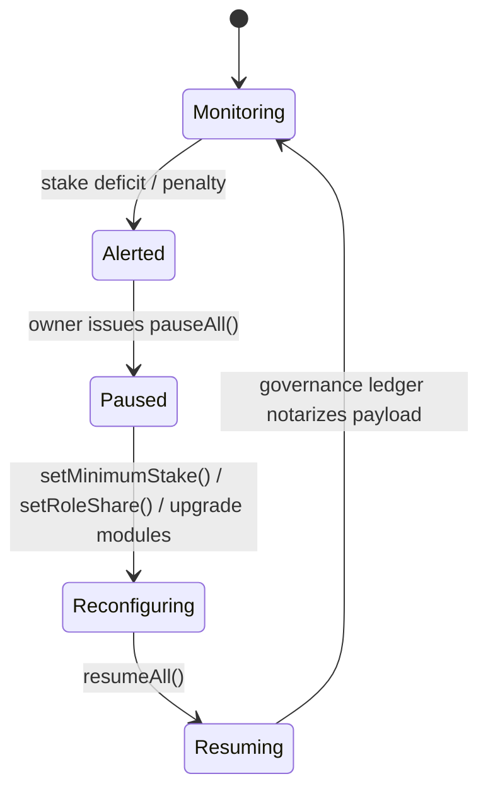

# AGI Alpha Node v0 · Sovereign Yield Intelligence Core ⚡

<!-- markdownlint-disable MD013 MD033 -->
<p align="center">
  
</p>

<p align="center">
  <a href="https://github.com/MontrealAI/AGI-Alpha-Node-v0/actions/workflows/ci.yml">
    
  </a>
  
  
  
  <a href="Dockerfile">
    
  </a>
  <a href="deploy/helm/agi-alpha-node">
    
  </a>
  
  <a href="https://app.ens.domains/name/alpha.node.agi.eth">
    
  </a>
  <a href="https://etherscan.io/token/0xa61a3b3a130a9c20768eebf97e21515a6046a1fa">
    
  </a>
  
  <a href="LICENSE">
    
  </a>
</p>

> _AGI ALPHA Nodes are the catalysts in this new economy. They yield $AGIALPHA tokens, bridging the gap between aspirations and achievement. Like digital farmers in a vast cognitive field, they cultivate the future._

This runtime is engineered as the machine that senses inefficiencies before markets do, routes $AGIALPHA liquidity with precision, and never compromises the owner’s command authority. Every subsystem is observable, replayable, and wired for immediate production activation once the owner signs off.

---

## Table of Contents

1. [Mission Pillars](#mission-pillars)
2. [Architecture & Flow Atlases](#architecture--flow-atlases)
   - [Sovereign Runtime Topology](#sovereign-runtime-topology)
   - [Autonomous Job Lifecycle](#autonomous-job-lifecycle)
   - [Owner Dominion Control Loop](#owner-dominion-control-loop)
   - [CI Signal Chain](#ci-signal-chain)
3. [Runtime Surface](#runtime-surface)
   - [CLI Command Spine](#cli-command-spine)
   - [REST & Governance API](#rest--governance-api)
   - [Telemetry & Metrics](#telemetry--metrics)
   - [Data & Snapshots](#data--snapshots)
4. [Integration with AGI Jobs Protocol](#integration-with-agi-jobs-protocol)
5. [Deployment & Operations](#deployment--operations)
   - [Local & Container Launch](#local--container-launch)
   - [Helm & Kubernetes](#helm--kubernetes)
   - [Operator Runbook](#operator-runbook)
6. [Configuration & Secrets](#configuration--secrets)
7. [Continuous Assurance & Branch Protection](#continuous-assurance--branch-protection)
8. [Repository Atlas](#repository-atlas)
9. [Reference Dossiers](#reference-dossiers)
10. [License](#license)

---

## Mission Pillars

| Vector | Implementation | Inspect |
| ------ | -------------- | ------- |
| **Identity Anchoring** | ENS proofing halts execution if the runtime loses control of `⟨label⟩.alpha.node.agi.eth`. | [`src/services/ensVerifier.js`](src/services/ensVerifier.js) |
| **Economic Sovereignty** | Canonical $AGIALPHA maths, staking activators, and reinvestment optimizers keep capital compounding for the owner. | [`src/constants/token.js`](src/constants/token.js), [`src/services/staking.js`](src/services/staking.js), [`src/services/economics.js`](src/services/economics.js) |
| **Lifecycle Engine** | Discovery → apply → execute → submit → finalize pipeline wired to JobRegistry, validation, and reward release. | [`src/services/jobLifecycle.js`](src/services/jobLifecycle.js), [`src/services/jobProof.js`](src/services/jobProof.js), [`src/services/jobProfiles.js`](src/services/jobProfiles.js) |
| **Intelligence Mesh** | Planner, swarm orchestrator, curriculum evolution, and stress harness produce deterministic strategies and antifragile responses. | [`src/intelligence/planning.js`](src/intelligence/planning.js), [`src/intelligence/swarmOrchestrator.js`](src/intelligence/swarmOrchestrator.js), [`src/intelligence/learningLoop.js`](src/intelligence/learningLoop.js), [`src/intelligence/stressHarness.js`](src/intelligence/stressHarness.js) |
| **Owner Supremacy** | Owners can pause, resume, retune stakes, rotate registries, delegate operators, or trigger disputes; every payload is journaled. | [`src/services/governance.js`](src/services/governance.js), [`src/services/governanceLedger.js`](src/services/governanceLedger.js), [`src/network/apiServer.js`](src/network/apiServer.js) |
| **Observability** | REST status bus, Prometheus metrics, compliance ledgers, and monitor loops keep the machine transparent. | [`src/orchestrator/nodeRuntime.js`](src/orchestrator/nodeRuntime.js), [`src/orchestrator/monitorLoop.js`](src/orchestrator/monitorLoop.js), [`src/telemetry/monitoring.js`](src/telemetry/monitoring.js) |

---

## Architecture & Flow Atlases

### Sovereign Runtime Topology


### Autonomous Job Lifecycle


### Owner Dominion Control Loop



### CI Signal Chain

```mermaid
graph LR
  A[Push / PR] --> B[GitHub Actions CI]
  B --> C[Lint Markdown & Links]
  B --> D[Unit & Integration Tests]
  B --> E[Coverage Report]
  B --> F[Docker Build & Smoke Test]
  C --> G[Required Checks]
  D --> G
  E --> G
  F --> G
  G --> H[Branch Protection (main)]
```

---

## Runtime Surface

### CLI Command Spine

| Command | Purpose | Source |
| ------- | ------- | ------ |
| `node src/index.js status --label <name> --address <0x...> --rpc <url>` | Runs the full heartbeat: ENS proofs, stake posture, registry compatibility, and earnings forecast. | [`src/index.js`](src/index.js) |
| `node src/index.js stake-tx --amount 1.5 --incentives <0x...>` | Builds a canonical `$AGIALPHA` stake-and-activate payload with deterministic decimals. | [`src/services/staking.js`](src/services/staking.js) |
| `node src/index.js jobs discover --registry <0x...> --rpc <url>` | Streams open jobs, tags, rewards, and compatibility notes from the on-chain registry. | [`src/services/jobLifecycle.js`](src/services/jobLifecycle.js) |
| `node src/index.js jobs apply <jobId> --subdomain <label> --proof <json>` | Crafts the `applyForJob` transaction, logging method selection and transaction hash. | [`src/services/jobLifecycle.js`](src/services/jobLifecycle.js) |
| `node src/index.js jobs submit <jobId> --result <uri>` | Commits deterministic results with Keccak commitments and metadata journaling. | [`src/services/jobProof.js`](src/services/jobProof.js) |
| `node src/index.js governance system-pause --system-pause <0x...> --action pause` | Encodes owner-only pause/resume payloads with diff metadata for compliance storage. | [`src/services/governance.js`](src/services/governance.js) |
| `node src/index.js economics optimize --history ...` | Computes reinvestment curves, buffer requirements, and projected compounding under owner-defined risk. | [`src/services/economics.js`](src/services/economics.js) |
| `node src/index.js intelligence stress-test --scenarios ...` | Executes antifragility scenarios against the specialist swarm before accepting new jobs. | [`src/intelligence/stressHarness.js`](src/intelligence/stressHarness.js) |

### REST & Governance API

| Endpoint | Method | Description | Source |
| -------- | ------ | ----------- | ------ |
| `/healthz` | GET | Liveness probe including offline mode, config, and ENS readiness. | [`src/network/apiServer.js`](src/network/apiServer.js) |
| `/jobs` | GET | Lists all known jobs with status, reward, deadline, and URI metadata. | [`src/network/apiServer.js`](src/network/apiServer.js) |
| `/jobs/open` | GET | Filters open jobs with canonical reward parsing and tag snapshots. | [`src/network/apiServer.js`](src/network/apiServer.js) |
| `/jobs/{id}` | GET | Returns a normalized job record, journal snapshots, and decision traces. | [`src/network/apiServer.js`](src/network/apiServer.js) |
| `/jobs/{id}/apply` | POST | Applies to a job using ENS subdomain proofs, recording journal entries. | [`src/network/apiServer.js`](src/network/apiServer.js) |
| `/jobs/{id}/submit` | POST | Submits results and Merkle commitments; returns result hash and tx reference. | [`src/network/apiServer.js`](src/network/apiServer.js) |
| `/jobs/{id}/finalize` | POST | Requests finalization after validation consensus. | [`src/network/apiServer.js`](src/network/apiServer.js) |
| `/governance/catalog` | GET | Surfaces owner-only ABI functions that the toolkit can encode. | [`src/services/governance.js`](src/services/governance.js) |
| `/governance/directives` | GET/POST | Reads or updates owner directives (actions, notices, context) powering autopilot modes. | [`src/network/apiServer.js`](src/network/apiServer.js) |
| `/governance/pause` | POST | Builds `SystemPause` payloads (`pauseAll`, `resumeAll`, `unpauseAll`). | [`src/network/apiServer.js`](src/network/apiServer.js) |
| `/governance/minimum-stake` | POST | Sets StakeManager minimum stake with diff metadata. | [`src/network/apiServer.js`](src/network/apiServer.js) |
| `/governance/validator-threshold` | POST | Adjusts validator quorum requirements. | [`src/network/apiServer.js`](src/network/apiServer.js) |
| `/governance/role-share` | POST | Tunes `RewardEngine` role shares with basis-point validation. | [`src/network/apiServer.js`](src/network/apiServer.js) |
| `/governance/global-shares` | POST | Updates operator/validator/treasury splits. | [`src/network/apiServer.js`](src/network/apiServer.js) |
| `/governance/job-module` | POST | Swaps validation, reputation, or dispute modules on the registry. | [`src/network/apiServer.js`](src/network/apiServer.js) |
| `/governance/dispute` | POST | Triggers disputes with hashed reasoning. | [`src/network/apiServer.js`](src/network/apiServer.js) |
| `/governance/identity-delegate` | POST | Adds/removes delegated node operators. | [`src/network/apiServer.js`](src/network/apiServer.js) |
| `/governance/stake-top-up` | POST | Builds stake-and-activate payloads from API clients. | [`src/network/apiServer.js`](src/network/apiServer.js) |

### Telemetry & Metrics

Prometheus gauges exposed at `/metrics` report stake balances, heartbeat freshness, throughput, success ratios, per-agent utilization, provider modes, and registry compatibility signals. | [`src/telemetry/monitoring.js`](src/telemetry/monitoring.js)

The monitor loop drives these metrics, runs deterministic health checks, and pushes alerts to operator channels. | [`src/orchestrator/monitorLoop.js`](src/orchestrator/monitorLoop.js)

### Data & Snapshots

- Offline custody snapshots serialize ENS proofs, staking state, and governance directives for air-gapped review. | [`src/services/offlineSnapshot.js`](src/services/offlineSnapshot.js), [`docs/offline-snapshot.example.json`](docs/offline-snapshot.example.json)
- Lifecycle journals capture each on-chain action for audit replay. | [`src/services/lifecycleJournal.js`](src/services/lifecycleJournal.js)
- Compliance ledger entries notarize every governance payload. | [`src/services/governanceLedger.js`](src/services/governanceLedger.js)

---

## Integration with AGI Jobs Protocol

1. **Discovery** — Event listeners or periodic scans pull open jobs, tags, and rewards using the registry ABI map and compatibility checks. | [`src/services/jobLifecycle.js`](src/services/jobLifecycle.js)
2. **Selection & Planning** — The planner scores opportunities against capability vectors, stake posture, and owner directives before delegation. | [`src/intelligence/planning.js`](src/intelligence/planning.js)
3. **Application** — ENS subdomain proofs and Merkle whitelist proofs feed `applyForJob`, with method selection abstracted for v0/v2 compatibility. | [`src/services/jobLifecycle.js`](src/services/jobLifecycle.js)
4. **Execution** — Specialist swarms execute deterministic loops, optionally spawning subprocesses for heavy computation while journaling state. | [`src/intelligence/swarmOrchestrator.js`](src/intelligence/swarmOrchestrator.js)
5. **Submission** — `createJobProof` and the lifecycle service commit result hashes, URIs, and metadata to the chain. | [`src/services/jobProof.js`](src/services/jobProof.js)
6. **Validation Watch** — Gateways track commit–reveal votes, disputes, and registry status transitions, exposing them through the REST surface. | [`src/network/apiServer.js`](src/network/apiServer.js)
7. **Finalization & Rewards** — Stake and reward modules release escrowed $AGIALPHA, with economics tools advising reinvestment strategies. | [`src/services/rewards.js`](src/services/rewards.js), [`src/services/economics.js`](src/services/economics.js)
8. **Validator Mode** — Optional validator routines submit commits/reveals and manage salts for dispute-proof participation. | [`src/services/jobLifecycle.js`](src/services/jobLifecycle.js)

---

## Deployment & Operations

### Local & Container Launch

- Deterministic container builds use the root [`Dockerfile`](Dockerfile) with entrypoint scaffolding under [`deploy/docker`](deploy/docker).
- `npm start` or `node src/index.js container` bootstraps the orchestrator, ENS verification, lifecycle services, and monitoring loop. | [`src/orchestrator/bootstrap.js`](src/orchestrator/bootstrap.js)
- For quick trials, copy [`deploy/docker/node.env.example`](deploy/docker/node.env.example) and export environment variables before running the container.

### Helm & Kubernetes

- The production chart in [`deploy/helm/agi-alpha-node`](deploy/helm/agi-alpha-node) parameterizes RPC URLs, ENS labels, stake amounts, and autoscaling hints.
- `helm lint deploy/helm/agi-alpha-node` and `helm template ...` mirror release hygiene from the operator runbook. | [`docs/operator-runbook.md`](docs/operator-runbook.md)

### Operator Runbook

- Enforcement rituals covering badge verification, branch protection, CI mirroring, coverage artifact review, container smoke tests, and Helm validation are codified in the [Operator Runbook](docs/operator-runbook.md).
- One-click deployment guidance and troubleshooting live in [`docs/deployment/one-click.md`](docs/deployment/one-click.md).

---

## Configuration & Secrets

- Environment variables are coerced and validated through [`src/config/schema.js`](src/config/schema.js) and surfaced via [`src/config/env.js`](src/config/env.js).
- Provider utilities derive `ethers` wallets, RPC providers, and failover strategies. | [`src/services/provider.js`](src/services/provider.js)
- Token normalization asserts the canonical `$AGIALPHA` contract (`0xa61a3b3a130a9c20768eebf97e21515a6046a1fa`, 18 decimals). | [`src/constants/token.js`](src/constants/token.js)
- Stake activation flows ensure allowances and decimals are correctly encoded before calling `PlatformIncentives.stakeAndActivate`. | [`src/services/stakeActivation.js`](src/services/stakeActivation.js)

---

## Continuous Assurance & Branch Protection

- CI executes linting, tests, coverage, and container smoke tests on every push/PR. | [`.github/workflows/ci.yml`](.github/workflows/ci.yml)
- Required checks for branch protection are documented for automation tooling. | [`.github/required-checks.json`](.github/required-checks.json)
- Local mirrors of CI exist via `npm run ci:lint`, `npm run ci:test`, and `npm run ci:coverage`; the wrapper `npm run ci:verify` executes the entire matrix. | [`package.json`](package.json)
- Husky prepare hooks ensure developers cannot bypass lint/test gates when committing locally. | [`scripts/prepare-husky.cjs`](scripts/prepare-husky.cjs)

---

## Repository Atlas

| Path | Purpose |
| ---- | ------- |
| `src/config` | Environment schema coercion and configuration loaders. |
| `src/constants` | Canonical token references and numerical guardrails. |
| `src/intelligence` | Planner, swarm orchestrator, learning loop, and stress harness. |
| `src/network` | REST API server and governance payload builders. |
| `src/orchestrator` | Bootstrap routines, monitor loop, and stake activator. |
| `src/services` | ENS verification, job lifecycle, governance, staking, rewards, and snapshots. |
| `src/telemetry` | Prometheus exporter wiring. |
| `src/utils` | Formatting and helper utilities. |
| `test` | Vitest suites covering intelligence, lifecycle, governance, staking, and observability. |
| `docs` | Hyper-detailed operator, deployment, and manifesto dossiers. |
| `deploy` | Docker entrypoints, environment templates, and Helm charts. |

---

## Reference Dossiers

- [Operator Codex](docs/README.md) — Executive beacon, architectural atlases, and launch protocol.
- [Manifesto](docs/manifesto.md) — Strategic doctrine anchoring the node’s mission.
- [Operator Runbook](docs/operator-runbook.md) — Day-two operations and enforcement rituals.
- [One-Click Deployment Playbook](docs/deployment/one-click.md) — Container and Helm shortcuts for rapid activation.

---

## License

Released under the [MIT License](LICENSE).
