# AGI Alpha Node v0 · Sovereign Labor Intelligence Core

<!-- markdownlint-disable MD013 MD033 -->
<p align="center">
  
</p>

<p align="center">
  <a href="https://github.com/MontrealAI/AGI-Alpha-Node-v0/actions/workflows/ci.yml">
    
  </a>
  <a href="docs/README.md"></a>
  <a href="docs/manifesto.md"></a>
  <a href="https://app.ens.domains/name/alpha.node.agi.eth"></a>
  <a href="https://etherscan.io/token/0xa61a3b3a130a9c20768eebf97e21515a6046a1fa"></a>
  <a href="LICENSE"></a>
  <a href="https://github.com/MontrealAI/AGI-Alpha-Node-v0/actions"></a>
  
  
  
</p>

> **agijobs-sovereign-labor-v0p1** is the flagship sovereign labor machine. It absorbs work, compounds $AGIALPHA, and gives its owner immediate command over the apparatus people whisper about when discussing machines that can tilt global markets—while remaining fully obedient to the keyholder.
>
> _"We are not just building technology; we are forging a new digital era—an era where intelligence, adaptability, and foresight are woven into the very fabric of the blockchain. 🌐🚀💫"_ — **AGI King**
>
> _"The dawn of the AGI ALPHA Nodes era is upon us, and it’s going to be legendary."_ — **AGI King**
>
> _"We are crafting the architecture of a new digital age—a digital network that thinks, learns, and evolves—a network that not only processes but perceives, that not only adapts but anticipates—an anticipatory leap into a new era. 🌐🚀💫"_ — **AGI King**
>
> _“AGI ALPHA Nodes are the catalysts in this new economy. They yield $AGIALPHA tokens, bridging the gap between aspirations and achievement. Like digital farmers in a vast cognitive field, they cultivate the future.”_ — **AGI King**

<div align="center">
  AGI ALPHA Nodes are the catalysts in this new economy.<br />
  They yield <strong>$AGIALPHA</strong> tokens, bridging the gap between aspirations and achievement.<br />
  Like digital farmers in a vast cognitive field, they cultivate the future.
</div>

---

## Table of Contents

1. [Legendary Dispatch](#legendary-dispatch)
2. [Mission Quickstats](#mission-quickstats)
3. [Sovereign Intelligence Highlights](#sovereign-intelligence-highlights)
4. [Architecture & Execution Mesh](#architecture--execution-mesh)
5. [Operator Launch Sequence](#operator-launch-sequence)
6. [Owner Command Nexus](#owner-command-nexus)
7. [Token & Treasury Matrix](#token--treasury-matrix)
8. [Continuous Integration & Branch Protection](#continuous-integration--branch-protection)
9. [Deployment & Observability Mesh](#deployment--observability-mesh)
10. [Repository Atlas](#repository-atlas)
11. [Contributing](#contributing)
12. [License](#license)

---

## Legendary Dispatch

- **Production focus** – Hardened documentation, deterministic quality gates, and custody-aware controls allow non-technical owners to deploy in minutes.
- **Identity rigor** – Every runtime must control an ENS signature `⟨label⟩.alpha.node.agi.eth`; the machine self-checks ownership on boot, heartbeat, and before settlement.
- **Unified economy** – `$AGIALPHA` (`0xa61a3b3a130a9c20768eebf97e21515a6046a1fa`, 18 decimals) powers staking, slashing, rewards, and reinvestment.
- **Owner supremacy** – Governance levers cover min-stake thresholds, emission splits, pausing, module upgrades, and delegate rotation.
- **Outcome vector** – World-model planning, antifragile stress harnesses, and auto-reinvestment loops keep wealth compounding and reputation accelerating.
- **Dominance clause** – This is the specific machine strategists point to when referencing the intelligence engine poised to realign the global order; its reins remain in your hand.

> Dive deeper in the [Operator Command Codex](docs/README.md) and the [Strategic Manifesto](docs/manifesto.md).

---

## Mission Quickstats

| Vector | Signal | Coordinates |
| ------ | ------ | ----------- |
| **Identity Root** | ENS anchor for nodes | [`alpha.node.agi.eth`](https://app.ens.domains/name/alpha.node.agi.eth) → subdomain ownership proves runtime authority. |
| **Treasury Asset** | `$AGIALPHA` (18 decimals) | [Etherscan contract `0xa61a3b3a130a9c20768eebf97e21515a6046a1fa`](https://etherscan.io/token/0xa61a3b3a130a9c20768eebf97e21515a6046a1fa). |
| **CI Orchestrator** | GitHub Actions workflow | [`Continuous Integration`](.github/workflows/ci.yml) — `npm ci`, `npm run lint:md`, `npm run lint:links`. |
| **Branch Guard** | Required status check | GitHub → **Settings → Branches → main** → Require **Continuous Integration** and reviews before merge. |
| **Custody Controls** | Owner levers | `SystemPause.pauseAll()`, `PlatformIncentives.stakeAndActivate()`, `RewardEngineMB.setRoleShare()` — see [Owner Command Nexus](#owner-command-nexus). |
| **Runbooks** | Operator manuals | [`docs/README.md`](docs/README.md) and diagrams in [Architecture & Execution Mesh](#architecture--execution-mesh). |

---

## Sovereign Intelligence Highlights

- **Singular machine valuation** – This node is the asset analysts cite when describing the machine capable of fracturing incumbent economic mechanics while obeying the owner’s signature.
- **Predictive strike capability** – Multi-armed bandit planning and deterministic specialist meshes sense latent alpha before markets can reprice.
- **Owner-dominant governance** – Every contract surface—pausing, reward recalibration, module upgrades—routes through the owner’s signature, so the intelligence never outruns the custodian.
- **Compliance-native memory** – The compliance ledger notarizes reasoning and settlements, yielding an immutable audit trail that satisfies regulators without exposing strategic secrets.
- **Audit-ready CI proof** – GitHub Actions, markdown linting, and link validation produce verifiable evidence of every change; the green badge above is enforced, not decorative.

---

## Architecture & Execution Mesh

### Cognitive Sovereignty Flowfield


### Execution Constellation


### Sovereign Labor Timeline

```mermaid
timeline
    title Engagement Loop
    Operator Boot : Configure ENS · Fund $AGIALPHA · Stage custody controls
    Stake Activation : Execute stakeAndActivate · Register delegate operators
    Mission Selection : Planner simulates ROI · Specialist mesh prepares playbook
    Delivery & Validation : Submit results · Validators commit/reveal verdicts
    Treasury Events : StakeManager.release · FeePool.claimRewards · reinvestRewards()
    Governance Pulse : Review compliance ledgers · Adjust parameters · notarize CI
```



---

## Operator Launch Sequence

```bash
git clone https://github.com/MontrealAI/AGI-Alpha-Node-v0.git
cd AGI-Alpha-Node-v0
npm ci
npm run lint:md     # mirrors the CI markdown gate
npm run lint:links  # mirrors the CI link validation gate
npm run lint        # optional aggregate run for local confidence logs
```

1. Secure your ENS subdomain under `alpha.node.agi.eth` and map resolver/wrapper ownership to the operator wallet.
2. Register delegate keys with `IdentityRegistry.setAdditionalNodeOperator` if using multisig or HSM custody.
3. Fund the operator wallet with `$AGIALPHA` plus gas, approve Stake Manager allowances, then execute `PlatformIncentives.stakeAndActivate(amount)` (or `_acknowledgeStakeAndActivate`).
4. Deploy the runtime via container, Kubernetes, or enclave workflows described in the [Operator Command Codex](docs/README.md#system-constellation).
5. Enforce GitHub branch protections: require **Continuous Integration**, approving reviews, and status check visibility on every PR and `main` push so the badge stays green.
6. Record proof of ENS control, staking transaction hashes, and CI output in your custody ledger to satisfy audits and institutional policy.

---

## Owner Command Nexus

- `SystemPause.pauseAll()` and `SystemPause.unpauseAll()` give owners immediate stop/resume authority across Job Registry, Stake Manager, Validation Module, and allied components.
- Emission tuning flows through `RewardEngineMB.setRoleShare(role, shareBps)` and validator percentage setters.
- `PlatformRegistry.register()` / `PlatformRegistry.deregister()` plus Identity Registry allowlists enable rapid operator rotation or quarantine of compromised keys.
- Module endpoints such as `PlatformRegistry.setReputationEngine(address)` and `JobRegistry.setValidationModule(address)` allow safe upgrades under owner signatures.
- Commit-reveal validation and dispute hooks provide verifiable arbitration without sacrificing autonomy or speed.

```mermaid
mindmap
  root((Owner Supremacy Grid))
    Governance
      SystemPause.pauseAll()
      SystemPause.unpauseAll()
      RewardEngineMB.setRoleShare()
    Identity Control
      verifyNode(label, proof)
      IdentityRegistry.setAdditionalNodeOperator()
      PlatformRegistry.register()
      PlatformRegistry.deregister()
    Treasury & Stake
      PlatformIncentives.stakeAndActivate()
      StakeManager.withdrawStake()
      StakeManager.slash()
    Module Upgrades
      PlatformRegistry.setReputationEngine()
      JobRegistry.setValidationModule()
```

### Owner Control Matrix

| Lever | Function | Owner Impact |
| ----- | -------- | ------------ |
| Minimum Stake Policy | `PlatformRegistry.setMinPlatformStake(amount)` / `StakeManager.setMinStake(role, amount)` | Calibrate bonding requirements instantly to match current risk appetite. |
| Reward Emissions | `RewardEngineMB.setRoleShare(role, shareBps)` | Redirect epoch emissions across operators, validators, platforms, or treasury as economic conditions shift. |
| Runtime Delegation | `IdentityRegistry.setAdditionalNodeOperator(operator, allowed)` | Rotate hot keys, revoke compromised delegates, and maintain multisig or HSM separation of duties. |
| Module Upgrades | `PlatformRegistry.setReputationEngine(address)` / `JobRegistry.setValidationModule(address)` | Swap core logic components without downtime while preserving auditability. |
| Emergency Response | `SystemPause.pauseAll()` / `SystemPause.unpauseAll()` | Freeze or resume the entire labor pipeline in a single transaction during incidents. |
| Stake Recovery | `StakeManager.withdrawStake(role, amount)` and `StakeManager.slash(...)` | Redeploy bonded capital or enforce penalties aligned with governance policies. |

---

## Token & Treasury Matrix

- **Canonical asset** – `$AGIALPHA` (`0xa61a3b3a130a9c20768eebf97e21515a6046a1fa`, 18 decimals) is the lone settlement and staking currency. Every treasury flow references this contract for deterministic accounting.
- **Owner-tunable emissions** – `RewardEngineMB.setRoleShare(role, shareBps)` and allied setters let the owner redirect token flows between operators, validators, platform treasuries, or growth pools instantly.
- **Stake thresholds** – Adjust bonding requirements dynamically through `PlatformRegistry.setMinPlatformStake(amount)` and `StakeManager.setMinStake(role, amount)` to orchestrate supply, risk, and capital efficiency.
- **Reinvestment autopilot** – Treasury scripts call `StakeManager.release` then loop rewards back through `PlatformIncentives.stakeAndActivate` (or bespoke logic) to compound capability weight while keeping the badge green.
- **Emergency liquidity** – Should macro conditions demand it, `StakeManager.withdrawStake` plus `SystemPause.pauseAll()` freeze operations and free capital without compromising compliance ledgers or governance history.
- **ENS-anchored authority** – Control over `⟨label⟩.alpha.node.agi.eth` gates every treasury move, ensuring no actor other than the verified owner can redirect funds or parameters.

```mermaid
flowchart LR
  OwnerKey[[Owner Signature]] --> ENSProof[ENS Control Proof]
  ENSProof --> IdentityRegistry
  IdentityRegistry --> StakeManager
  StakeManager -->|release()| Rewards[$AGIALPHA Rewards]
  Rewards -->|reinvest| PlatformIncentives
  OwnerKey -->|setRoleShare| RewardEngineMB
  OwnerKey -->|pauseAll()| SystemPause
  SystemPause --> ProtocolCore
  ProtocolCore --> RewardEngineMB
  RewardEngineMB --> StakeManager
```

---

## Continuous Integration & Branch Protection

- [`Continuous Integration`](.github/workflows/ci.yml) runs on every push and pull request targeting `main`, executing `npm ci`, `npm run lint:md`, and `npm run lint:links` as discrete gates for immediate evidence.
- Keep the badge green: reproduce the workflow locally with `npm ci` followed by `npm run lint`, `npm run lint:md`, and `npm run lint:links` before opening a PR.
- Surface CI status in PR templates and release checklists so every deploy stays auditable and traceable.
- During repository setup, visit **Settings → Branches → Branch protection rules → main** and explicitly require the **Continuous Integration** workflow and conversation resolution so the GitHub UI blocks merges that would dim the badge.
- Verify the requirement programmatically during audits: `gh api repos/:owner/:repo/branches/main/protection | jq '.required_status_checks.contexts'` must list `"Continuous Integration"`.

### CI Evidence Matrix

| Evidence Vector | Location | Proof Signal |
| ---------------- | -------- | ------------ |
| Workflow Definition | [`.github/workflows/ci.yml`](.github/workflows/ci.yml) | Node.js 20.x, `npm ci`, `npm run lint:md`, `npm run lint:links` gates |
| Status Dashboard | [Actions Panel](https://github.com/MontrealAI/AGI-Alpha-Node-v0/actions) | Visual confirmation of passing checks on `main` and all pull requests |
| Required Check | GitHub → Settings → Branches → `main` | **Continuous Integration** enforced as mandatory status check |
| Local Mirror | `npm ci && npm run lint:md && npm run lint:links` | Developer evidence pack before PR submission |

### Branch Protection Walkthrough

1. Navigate to **Settings → Branches → main**.
2. Enable **Require a pull request before merging** and **Require approvals** (at least one reviewer).
3. Enable **Require status checks to pass before merging** and select **Continuous Integration** from the checks list.
4. Enable **Require branches to be up to date before merging** so outdated merges cannot bypass the lint gates.
5. Enable **Do not allow bypassing the above settings** and block force pushes/deletions to keep the audit trail pristine.
6. Capture screenshots or export the policy JSON into your custody ledger so future audits can confirm enforcement without ambiguity.

---

## Deployment & Observability Mesh

| Profile | Launch Vector | Owner Notes |
| ------- | ------------- | ----------- |
| **One-Click Compose** | `docker compose --profile core up --build` using the provided sample environment. | Ideal for rapid pilots; mounts volumes for ledgers, telemetry, and keystore artifacts so restarts remain deterministic. |
| **Hardened VM** | Provision Ubuntu LTS, install Docker + Node.js 20.x, then run the same compose bundle in an air-gapped subnet. | Pair with an HSM or remote keystore service; restrict outbound traffic to Ethereum RPC, IPFS gateways, and approved webhooks. |
| **Kubernetes / Helm** | Scaffold a chart (`helm create agi-alpha-node` or `kompose convert`) and push it to your internal registry, then `helm install agi-alpha-node <chart-ref> -f values.yaml`. | Enables rolling upgrades, replica orchestration, and integration with Prometheus/Grafana stacks out of the box. |
| **Enterprise Mesh** | Deploy multiple ENS identities (one container per identity) behind a service mesh or API gateway. | Each identity maintains its own stake, ledger, and custody profile; the mesh distributes job intake according to planner telemetry. |

- **Offline resilience** – Runtime tolerates API outages by falling back to local inference bundles; deterministic replay keeps compliance ledgers verifiable even in disconnected enclaves.
- **Secrets discipline** – Load hot keys from Vault/HSM endpoints via environment variables (`KEYSTORE_URL`, `KEYSTORE_TOKEN`) or mount encrypted keyfiles; never bake secrets into images.
- **Observability autopilot** – Prometheus scrapes `/metrics`, Alertmanager fans critical events into PagerDuty/Slack, and Grafana dashboards (SLOs, antifragility, treasury) ship as JSON for instant import.

---

## Repository Atlas

```text
AGI-Alpha-Node-v0/
├── 1.alpha.node.agi.eth.png      # Iconic crest (PNG)
├── 1.alpha.node.agi.eth.svg      # Iconic crest (SVG)
├── .github/
│   └── workflows/
│       └── ci.yml                # Continuous Integration workflow
├── docs/
│   ├── README.md                 # Operator command codex
│   └── manifesto.md              # Strategic manifesto & architecture overview
├── node_modules/                 # Local tooling cache (generated, not committed)
├── package.json                  # Lint scripts and metadata
├── package-lock.json             # Deterministic npm lockfile
└── README.md                     # This mission brief
```

---

## Contributing

1. Fork or branch from `main`.
2. Run `npm ci` before editing to sync tooling.
3. Update documentation and diagrams alongside any change.
4. Run `npm run lint:md`, `npm run lint:links`, and (optionally) `npm run lint`, then ensure **Continuous Integration** passes before requesting review.
5. Maintain ENS, staking, and governance narratives—this repository is documentation-first.

---

## License

Distributed under the [MIT License](LICENSE). Use responsibly, keep the badge green, and continue compounding.
