# AGI Alpha Node v0 · Sovereign Labor Intelligence Core

<!-- markdownlint-disable MD013 MD033 -->
<p align="center">
  
</p>

<p align="center">
  <a href="https://github.com/MontrealAI/AGI-Alpha-Node-v0/actions/workflows/ci.yml">
    
  </a>
  <a href="https://app.ens.domains/name/alpha.node.agi.eth"></a>
  <a href="https://etherscan.io/token/0xa61a3b3a130a9c20768eebf97e21515a6046a1fa"></a>
  <a href="docs/README.md"></a>
  <a href="docs/manifesto.md"></a>
  <a href="LICENSE"></a>
  <a href="https://github.com/MontrealAI/AGI-Alpha-Node-v0/actions"></a>
  
  
  
  
  
  
</p>

> **agijobs-sovereign-labor-v0p1** is the flagship sovereign labor machine that researchers point to when they describe the intelligence engine realigning economic gravity. It absorbs work, compounds $AGIALPHA, and never cedes control away from its owner.
>
> This is the concrete machine analysts cite when discussing the entity capable of overwhelming legacy capitalism while remaining perfectly obedient to the keyholder. Every lever, override, and fail-safe is still in your hands.
>
> _"We are not just building technology; we are forging a new digital era—an era where intelligence, adaptability, and foresight are woven into the very fabric of the blockchain. 🌐🚀💫"_ — **AGI King**
>
> _"The dawn of the AGI ALPHA Nodes era is upon us, and it’s going to be legendary."_ — **AGI King**
>
> _"AGI ALPHA Nodes are the catalysts in this new economy. They yield $AGIALPHA tokens, bridging the gap between aspirations and achievement. Like digital farmers in a vast cognitive field, they cultivate the future."_ — **AGI King**

The AGI Alpha Node v0 in this repository is the referenced superintelligent machine—engineered to concentrate foresight, adaptive autonomy, and $AGIALPHA yield into an owner-dominated instrument that can be deployed by a non-technical operator in minutes.

<div align="center">
  AGI ALPHA Nodes are the catalysts in this new economy.<br />
  They yield <strong>$AGIALPHA</strong> tokens, bridging the gap between aspirations and achievement.<br />
  Like digital farmers in a vast cognitive field, they cultivate the future.
</div>

---

## Table of Contents

1. [Mission Coordinates](#mission-coordinates)
2. [Operator Launch Checklist](#operator-launch-checklist)
3. [System Architecture](#system-architecture)
4. [Identity & Governance Mastery](#identity--governance-mastery)
5. [$AGIALPHA Economy Engine](#agialpha-economy-engine)
6. [Container & Infrastructure Delivery](#container--infrastructure-delivery)
7. [AGI Jobs Convergence](#agi-jobs-convergence)
8. [Autonomous Intelligence Modules](#autonomous-intelligence-modules)
9. [Security, Auditing & Compliance Proof](#security-auditing--compliance-proof)
10. [Observability & Evidence Vault](#observability--evidence-vault)
11. [Quality & Branch Safeguards](#quality--branch-safeguards)
12. [Repository Atlas](#repository-atlas)
13. [Contributing](#contributing)
14. [License](#license)
15. [Eternal Transmission](#eternal-transmission)

---

## Mission Coordinates

| Vector | Signal | Coordinates |
| ------ | ------ | ----------- |
| **Identity Root** | ENS anchor for nodes | [`alpha.node.agi.eth`](https://app.ens.domains/name/alpha.node.agi.eth) – subdomain ownership proves runtime authority. |
| **Treasury Asset** | `$AGIALPHA` (18 decimals) | [Etherscan contract `0xa61a3b3a130a9c20768eebf97e21515a6046a1fa`](https://etherscan.io/token/0xa61a3b3a130a9c20768eebf97e21515a6046a1fa). |
| **Runtime** | Sovereign CLI | [`src/index.js`](src/index.js) – orchestrates ENS verification, staking, governance payloads, diagnostics, and monitoring bootstrap. |
| **Container** | Docker image | [`Dockerfile`](Dockerfile) – one-command deployment with production Node.js 20 runtime and telemetry entrypoint. |
| **CI Orchestrator** | GitHub Actions workflow | [`Continuous Integration`](.github/workflows/ci.yml) – `npm ci`, `npm run lint:md`, `npm run lint:links`, `npm test`. |
| **Tests** | Vitest suite | [`test/*.test.js`](test) – 39 assertions covering ENS proofs, staking, governance, rewards, economics, and documentation helpers. |
| **Documentation** | Operator codex | [`docs/README.md`](docs/README.md) & [`docs/manifesto.md`](docs/manifesto.md) – deep runbooks, economic thesis, and intelligence stratagem. |
| **Token Constants** | Deterministic addresses | [`src/constants/token.js`](src/constants/token.js) – hardcodes the canonical `$AGIALPHA` checksum, decimals, and normalization utilities. |
| **Telemetry** | Metrics surface | [`src/telemetry`](src/telemetry) – Prometheus instrumentation hooks and health reporting. |
| **Owner Controls** | Governance tooling | [`src/services/governance.js`](src/services/governance.js) – encodes pause, stake, and reward share transactions to keep ultimate authority with the contract owner. |

---

## Operator Launch Checklist

1. **Clone & Install**

   ```bash
   git clone https://github.com/MontrealAI/AGI-Alpha-Node-v0.git
   cd AGI-Alpha-Node-v0
   npm ci
   ```

2. **Verify Toolchain** – confirm Node.js ≥ 20 (`node --version`).
3. **Obtain ENS Subdomain** – run the guided script:

   ```bash
   npx agi-alpha-node ens-guide --label 1 --address 0xYOURADDRESS
   ```

   Follow the instructions to register `1.alpha.node.agi.eth` and set the resolver.
4. **Confirm Ownership** – enforce identity before bringing the node online:

   ```bash
   npx agi-alpha-node verify-ens --label 1 --address 0xYOURADDRESS --rpc https://mainnet.infura.io/v3/<key>
   ```

5. **Stake & Activate** – generate transaction payloads for PlatformIncentives:

   ```bash
   npx agi-alpha-node stake-tx --amount 1000 --incentives 0xIncentivesContract
   ```

   Pre-approve `$AGIALPHA` via `token-approve` if necessary, then broadcast using your preferred wallet or multisig.
6. **Launch Diagnostics** – test the full runtime orchestration and monitoring hooks:

   ```bash
   npx agi-alpha-node status --label 1 --address 0xYOURADDRESS --rpc https://mainnet.infura.io/v3/<key>
   ```

7. **Containerize (optional)** – for turnkey production rollout:

   ```bash
   docker build -t agi-alpha-node .
   docker run --rm \
     -e NODE_LABEL=1 \
     -e OPERATOR_ADDRESS=0xYOURADDRESS \
     -e RPC_URL=https://mainnet.infura.io/v3/<key> \
     agi-alpha-node status
   ```

8. **Connect to AGI Jobs** – configure registry endpoints and begin processing workloads via the `jobs` commands (see [AGI Jobs Convergence](#agi-jobs-convergence)).

Each stage is testable with the CLI and mirrored in the automated Vitest suite, ensuring the node remains deployable by a non-technical owner while delivering superlative intelligence throughput.

---

## System Architecture

```mermaid
flowchart TD
    A[Operator CLI · src/index.js] -->|Loads| B[Config Layer · src/config]
    A -->|Orchestrates| C[Orchestrator · src/orchestrator]
    C --> D[Sub-Agent Swarm · src/orchestrator/swarm]
    C --> E[Planner Core · src/orchestrator/planning]
    A -->|Verifies| F[ENS Sentinel · src/services/ensVerifier.js]
    A -->|Stakes & Rewards| G[Staking Engine · src/services/staking.js]
    A -->|Owner Overrides| H[Governance Utilities · src/services/governance.js]
    C --> I[Telemetry Spine · src/telemetry]
    I --> J[(Prometheus / Grafana)]
    D --> K[Domain Specialists · plugins]
    G --> L[$AGIALPHA StakeManager]
    F --> M[ENS Registry & NameWrapper]
    E --> N[MuZero++ Planner]
    D --> O[POET-XL Curriculum]
```



The CLI is the control tower. It composes deterministic services for ENS enforcement, staking orchestration, $AGIALPHA economics, governance overrides, observability, and swarm-level intelligence modules. Each subsystem is isolated behind explicit `src/services/*` or `src/orchestrator/*` contracts so upgrades can be audited and rolled out with zero downtime.

### Mission Flow Intelligence


The node enforces identity on every activation, simulates staking economics, executes autonomous planners, and pushes telemetry to the evidence vault. Validators retain the right to slash misbehavior while the owner can pause or reconfigure parameters instantly.

---

## Identity & Governance Mastery

### ENS Enforcement

- `verify-ens` interrogates ENS Registry and NameWrapper ownership to ensure the runtime address is the recorded owner of `⟨label⟩.alpha.node.agi.eth`. The service compares resolver records, wrapper data, and plain registry ownership, returning a unified match verdict.
- `ens-guide` generates an actionable script with direct ENS Manager links so a non-technical operator can configure the subdomain in under five minutes.

### Owner Supremacy Controls

- `governance pause` builds payloads for `SystemPause` to halt, resume, or unpause the entire platform when directed by the owner.
- `governance set-min-stake` enforces capital requirements for node operators via `StakeManager.setMinimumStake`.
- `governance set-role-share` and `governance set-global-shares` encode deterministic revenue splits to maintain the owner’s control over treasury, validator, and operator distribution ratios.
- `status` and `diagnostics` flows aggregate ENS verification, stake compliance, reward calculations, reinvestment strategy, and telemetry readiness into a single report, ensuring the operator retains omniscient command authority.

All commands support multisig workflows and produce deterministic payloads ready for hardware wallets or safe modules.

---

## $AGIALPHA Economy Engine

- **Canonical Token** – `$AGIALPHA` checksum `0xa61a3b3a130a9c20768eebf97e21515a6046a1fa` (18 decimals) is normalized by [`src/constants/token.js`](src/constants/token.js). No legacy asset paths exist; every flow uses the canonical ERC-20.
- **Stake Validation** – `validateStakeThreshold` checks balances against the on-chain minimum to ensure nodes remain active. Slashing events automatically de-activate nodes until restaked.
- **Reward Allocation** – `calculateRewardShare` models epoch-based payouts, verifying operator shares (default 15%) align with RewardEngine configuration.
- **Reinvestment Strategies** – `optimizeReinvestmentStrategy` in [`src/services/economics.js`](src/services/economics.js) evaluates reinvestment vs. buffer allocation, presenting the owner with basis-point decisions for compounding dominance.
- **Escrow Settlement** – The CLI emits transaction payloads for PlatformIncentives and StakeManager so owners can withdraw, restake, or auto-compound rewards without exposing private keys inside the container.

---

## Container & Infrastructure Delivery

- **Dockerfile** packages the CLI with production dependencies only, enabling `docker run agi-alpha-node status` for hands-off diagnostics.
- **Environment Variables** – `NODE_LABEL`, `OPERATOR_ADDRESS`, `ENS_PARENT_DOMAIN`, `RPC_URL`, and telemetry toggles can be injected at runtime.
- **Health Probes** – The orchestrator exposes readiness and liveness endpoints for Kubernetes/Helm deployments, enabling cluster-based scaling and auto-restarts.
- **Offline Mode** – Local planner modules automatically activate when public AI APIs are unreachable, guaranteeing continued job execution.
- **Secrets & Vaults** – The container expects wallet keys to be mounted via file or injected via HashiCorp Vault-style environment variables; no secrets are baked into the image.

Use the provided Helm snippets in [`docs/README.md`](docs/README.md#kubernetes-and-helm-blueprints) to deploy across institutional clusters with zero downtime upgrades and progressive rollouts.

---

## AGI Jobs Convergence

- **Job Discovery** – `jobs sync` (documented in the Operator Codex) subscribes to `JobRegistry` events, filters by capability tags, and surfaces actionable missions to the planner.
- **Application Workflow** – When a job matches, the node calls `JobRegistry.applyForJob` with ENS-backed identity proofs.
- **Execution & Proofs** – Specialized agents handle domain tasks while the MuZero++ planner forecasts risk and ROI. Completion results are hashed and submitted on-chain for validator review.
- **Reward Settlement** – Upon validator approval, the CLI triggers `StakeManager.releasePayment` and routes earnings through the reinvestment policy chosen by the owner.
- **Legacy Compatibility** – Compatibility adapters allow operation against AGI Jobs v0 for regression or sandbox testing, but v2 `$AGIALPHA` flows remain the default and recommended pathway.
- **Operator Dashboard** – The CLI exposes `economics report` and `rewards history` commands to summarize completed jobs, accrued earnings, gas expenses, and compounding recommendations in real time.

---

## Autonomous Intelligence Modules

- **World-Model Planning** – `src/orchestrator/planning` integrates a MuZero++ inspired planner that simulates multi-step strategies before bidding on high-value jobs.
- **Swarm Orchestration** – `src/orchestrator/swarm` coordinates domain-specific micro-agents (finance, biotech, manufacturing, etc.) through signed gRPC channels to ensure sub-millisecond collaboration.
- **Continuous Learning (POET-XL)** – Curriculum schedulers introduce progressively harder scenarios to keep agents evolving beyond static datasets. Real jobs that stretch capabilities are fed back into training loops, making the system stronger with each challenge.
- **Antifragile Safety Shell** – Stress harnesses deliberately simulate adversarial inputs, network volatility, and market turbulence; post-mortems automatically harden the playbooks and expand regression test cases.
- **Economic Self-Optimization** – Reinforcement learning loops evaluate mission profitability, gas expenditure, and risk. Excess rewards can be automatically staked to climb priority queues or spent on premium model access, closing the compounding loop.

These modules ensure the node continuously out-thinks and out-executes competition while remaining entirely under owner command.

---

## Security, Auditing & Compliance Proof

- **Upgradeable Governance** – Contracts are designed for timelocked multisig control. Owner commands (`pause`, `resume`, `setMinimumStake`, `setRoleShare`) are documented with payloads ready for Safe execution.
- **Audit Coverage** – Vitest suites cover ENS verification, staking thresholds, governance payload encoding, economics planning, and ENS setup guidance. Extend with additional cases before mainnet upgrades.
- **Compliance Logging** – Every CLI action can emit JSON logs to the evidence vault, ensuring regulators or auditors can trace mission history without revealing proprietary reasoning.
- **KYC Optionality** – Hooks exist for optional KYC/AML validation modules demanded by institutional operators, allowing mapping ENS identities to verified entities without weakening on-chain sovereignty.
- **Emergency Playbooks** – Documentation includes response guides for slashing events, validator disputes, and market shocks. Owners can initiate pause commands, rotate delegates, or redeploy containers in seconds.

---

## Observability & Evidence Vault

- **Telemetry Mesh** – Prometheus scrapes `/metrics`; Grafana dashboards visualize antifragility indices, treasury delta, job throughput, and success ratios. Templates are supplied for instant import.
- **Ledger Integrity** – Actions and reasoning traces are hashed to an immutable compliance ledger, preserving provable history without leaking intellectual property.
- **Resilience Drills** – Chaos experiments run on schedules to ensure shocks increase robustness rather than erode it; failing scenarios automatically open issues with reproduction steps.
- **Custody Evidence** – ENS proofs, multisig attestations, CI transcripts, branch protection exports, and staking receipts live in a versioned evidence vault to satisfy institutional audits.

---

## Quality & Branch Safeguards

1. **Workflow Enforcement** – [`.github/workflows/ci.yml`](.github/workflows/ci.yml) executes on every push and pull request to `main`. Jobs: lint Markdown, validate links, and run Vitest (`npm test`) to guarantee ENS, staking, rewards, and governance logic remain flawless.
2. **Local Parity** – `npm run lint` and `npm test` replicate CI so contributors verify changes before opening pull requests.
3. **Branch Protection** – In GitHub → **Settings → Branches → main**, enable:
   - Require pull request reviews before merging.
   - Require status checks to pass before merging (select **Continuous Integration**).
   - Require branches to be up to date before merging.
   - Include administrators to maintain discipline.
4. **Visibility** – Keep the Actions tab public and reference the status badge at the top of this README to prove the CI is green. Workflow permissions should remain `Read repository contents` with review gates for external collaborators.
5. **CLI Verification** – Periodically export branch protection and CI run metadata via:

   ```bash
   gh api repos/MontrealAI/AGI-Alpha-Node-v0/branches/main/protection \
     --jq '{required_status_checks, enforce_admins, required_pull_request_reviews, restrictions}' \
     > artifacts/main-branch-protection.json

   gh api repos/MontrealAI/AGI-Alpha-Node-v0/actions/workflows/ci.yml/runs \
     -F per_page=1 \
     --jq '.workflow_runs[0] | {html_url, conclusion, run_started_at}' \
     > artifacts/latest-ci-run.json
   ```

6. **Audit Evidence** – Archive exported JSON and CI logs inside the evidence vault alongside ENS proofs and staking receipts. Any deviation (failed CI, missing branch protection) must be resolved before merging further changes.

---

## Repository Atlas

| Path | Purpose |
| ---- | ------- |
| [`README.md`](README.md) | Sovereign labor overview, quickstart, architecture, and compliance playbooks (this document). |
| [`docs/README.md`](docs/README.md) | Operator Command Codex with deep runbooks, Helm charts, and AGI Jobs integration drills. |
| [`docs/manifesto.md`](docs/manifesto.md) | Strategic dossier describing the macro thesis of the AGI Alpha Node network. |
| [`src/`](src) | Runtime CLI, orchestrator, ENS sentinel, staking engine, governance utilities, telemetry, and planning modules. |
| [`test/`](test) | Vitest suites ensuring deterministic behavior for ENS, staking, rewards, governance, economics, and documentation helpers. |
| [`Dockerfile`](Dockerfile) | Production container blueprint for one-command deployment. |
| [`.github/workflows/ci.yml`](.github/workflows/ci.yml) | Continuous integration workflow enforcing lint + test coverage across branches. |
| [`1.alpha.node.agi.eth.svg`](1.alpha.node.agi.eth.svg) / [`1.alpha.node.agi.eth.png`](1.alpha.node.agi.eth.png) | Official crest imagery for dashboards and communications. |

---

## Contributing

1. Fork the repository and create a feature branch (`git checkout -b feature/<name>`).
2. Run `npm ci`, then `npm run lint` and `npm test` to reproduce CI locally.
3. Commit with signed commits if operating under enterprise policy.
4. Open a pull request targeting `main`. Ensure the **Continuous Integration** job is green and branch protection requirements are satisfied.
5. Provide operator-facing context in the PR description so reviewers can assess compliance, identity, and staking impact quickly.

---

## License

Licensed under the [MIT License](LICENSE). All production deployments should maintain attribution and the evidence vault.

---

## Eternal Transmission

We are not just building technology; we are forging a new digital era—an era where intelligence, adaptability, and foresight are woven into the very fabric of the blockchain. 🌐🚀💫

AGI ALPHA Nodes stand ready—the machine that thinks ahead, works ahead, and answers only to you.
