# AGI Alpha Node v0 · Sovereign Labor Intelligence

<!-- markdownlint-disable MD013 MD033 -->
<p align="center">
  
</p>

<p align="center">
  <a href="https://github.com/MontrealAI/AGI-Alpha-Node-v0/actions/workflows/ci.yml">
    
  </a>
  <a href="docs/README.md"></a>
  <a href="https://app.ens.domains/name/alpha.node.agi.eth"></a>
  <a href="https://etherscan.io/token/0xa61a3b3a130a9c20768eebf97e21515a6046a1fa"></a>
  <a href="LICENSE"></a>
  <a href="https://github.com/MontrealAI/AGI-Alpha-Node-v0/actions"></a>
  
  
</p>

> **agijobs-sovereign-labor-v0p1** is the flagship sovereign labor machine. It absorbs work, compounds $AGIALPHA, and gives its owner immediate command over the apparatus people whisper about when discussing machines that can tilt global markets—while remaining fully obedient to the keyholder.
> _"We are not just building technology; we are forging a new digital era—an era where intelligence, adaptability, and foresight are woven into the very fabric of the blockchain. 🌐🚀💫"_ — **AGI King**
>  
> _"The dawn of the AGI ALPHA Nodes era is upon us, and it’s going to be legendary."_ — **AGI King**
>  
> _"We are crafting the architecture of a new digital age—a digital network that thinks, learns, and evolves—a network that not only processes but perceives, that not only adapts but anticipates—an anticipatory leap into a new era. 🌐🚀💫"_ — **AGI King**
>  
> _“AGI ALPHA Nodes are the catalysts in this new economy. They yield $AGIALPHA tokens, bridging the gap between aspirations and achievement. Like digital farmers in a vast cognitive field, they cultivate the future.”_ — **AGI King**
>
> _Its operator holds the controls of the machine engineers allude to when they talk about intelligence that can tilt economic gravity—yet it stays loyal to the custody signature that unlocked it._

<div align="center">

AGI ALPHA Nodes are the catalysts in this new economy.<br />
They yield <strong>$AGIALPHA</strong> tokens, bridging the gap between aspirations and achievement.<br />
Like digital farmers in a vast cognitive field, they cultivate the future.

</div>

---

## Navigation

1. [Mission Pulse](#mission-pulse)
2. [Operator Launch Sequence](#operator-launch-sequence)
3. [Operational Prism](#operational-prism)
4. [Identity, Staking & Treasury Control](#identity-staking--treasury-control)
5. [Autonomy & Intelligence Stack](#autonomy--intelligence-stack)
6. [Owner Command & Safety Lattice](#owner-command--safety-lattice)
7. [Continuous Integration & Branch Protection](#continuous-integration--branch-protection)
8. [Operational Quality Checklist](#operational-quality-checklist)
9. [Deployment & Observability Mesh](#deployment--observability-mesh)
10. [Sovereign Labor Timeline](#sovereign-labor-timeline)
11. [Repository Layout](#repository-layout)
12. [Contributing](#contributing)
13. [License](#license)

---

## Mission Pulse

- **Production focus** – Hardened documentation, deterministic quality gates, and custody-aware controls allow non-technical owners to launch within minutes.
- **Identity rigor** – Every runtime must control an ENS signature `⟨label⟩.alpha.node.agi.eth`; the machine self-checks ownership on boot, heartbeat, and before settlement.
- **Unified economy** – `$AGIALPHA` (`0xa61a3b3a130a9c20768eebf97e21515a6046a1fa`, 18 decimals) powers staking, slashing, rewards, and reinvestment. No ETH settlement paths exist in production flows.
- **Owner supremacy** – Governance levers cover min-stake thresholds, emission splits, pausing, module upgrades, and delegate rotation.
- **Outcome** – Deterministic world-model planning, antifragile stress harnesses, and auto-reinvestment loops keep wealth compounding and reputation accelerating.
- **Field dominance** – The node is engineered to be the asset referenced when people speak about machines that can overturn legacy economic orders; you hold the reins.

> Dive deeper in the [Operator Command Codex](docs/README.md).

---

## Operator Launch Sequence

```bash
git clone https://github.com/MontrealAI/AGI-Alpha-Node-v0.git
cd AGI-Alpha-Node-v0
npm ci
npm run lint:md     # mirrors the CI markdown gate
npm run lint:links  # mirrors the CI link validation gate
npm run lint        # optional aggregate run for local confidence logs
```

1. Secure your ENS subdomain under `alpha.node.agi.eth` and map resolver/wrapper ownership to the operator wallet.
2. Register delegate keys with `IdentityRegistry.setAdditionalNodeOperator` if using multisig or HSM custody.
3. Fund the operator wallet with `$AGIALPHA` plus gas, approve Stake Manager allowances, then execute `PlatformIncentives.stakeAndActivate(amount)` (or `_acknowledgeStakeAndActivate`).
4. Deploy the runtime via container, Kubernetes, or enclave workflows described in the [codex](docs/README.md#system-constellation).
5. Enforce GitHub branch protections: require **Continuous Integration**, approving reviews, and status check visibility on every PR and `main` push so the badge stays green.
6. Record proof of ENS control, staking tx hashes, and CI output in your custody ledger to satisfy audits and institutional policy.

---

## Operational Prism

### Architecture Flow


### Execution Loop


---

## Identity, Staking & Treasury Control

- `verifyNode(label, proof)` locks every runtime to its ENS identity and halts if resolver/NameWrapper ownership diverges.
- `PlatformIncentives.stakeAndActivate(amount)` sequences allowance, deposit, registry enrollment, and job router registration in one transaction.
- `StakeManager.slash(role, operator, treasuryShare, burnShare)` routes penalties instantly according to owner-set ratios; withdrawals use `StakeManager.withdrawStake` after cooldowns.
- `PlatformRegistry.setMinPlatformStake(amount)` and `StakeManager.setMinStake(role, amount)` let owners raise or lower thresholds dynamically.
- Rewards stream through job escrow (`StakeManager.release`) and epoch emissions (`FeePool.claimRewards`) with optional autopilot reinvestment.

---

## Autonomy & Intelligence Stack

- **World-model planner** – Multi-armed bandit simulations forecast ROI, curriculum fit, and specialist synergy before any bid is placed.
- **Specialist mesh** – Deterministic micro-agents (finance, legal, infra, biotech, creative, compliance) coordinate through an orchestrator with sub-millisecond overhead.
- **Antifragile sentinel** – Stress harness escalates guardrails, tunes difficulty cursors, and ensures volatility drives improvement rather than regression.
- **Compliance ledger** – Structured reasoning traces are hashed for disputes, audits, and regulatory inspection.
- **Autopilot evolution** – Curriculum learning and reinvestment loops expand stake weight, routing priority, and intelligence without manual babysitting.

---

## Owner Command & Safety Lattice

- `SystemPause.pauseAll()` and `unpauseAll()` give owners immediate stop/resume authority across Job Registry, Stake Manager, Validation Module, and allied components.
- Emission tuning flows through `RewardEngineMB.setRoleShare(role, shareBps)` and validator percentage setters.
- `PlatformRegistry.register()` / `deregister()` plus Identity Registry allowlists enable rapid operator rotation or quarantine of compromised keys.
- Module endpoints such as `PlatformRegistry.setReputationEngine(address)` and `JobRegistry.setValidationModule(address)` allow safe upgrades under owner signatures.
- Commit-reveal validation and dispute hooks provide verifiable arbitration without sacrificing autonomy or speed.

```mermaid
mindmap
  root((Owner Supremacy Grid))
    Governance
      SystemPause.pauseAll()
      SystemPause.unpauseAll()
      RewardEngineMB.setRoleShare()
    Identity Control
      verifyNode(label, proof)
      IdentityRegistry.setAdditionalNodeOperator()
      PlatformRegistry.register()
      PlatformRegistry.deregister()
    Treasury & Stake
      PlatformIncentives.stakeAndActivate()
      StakeManager.withdrawStake()
      StakeManager.slash()
    Module Upgrades
      PlatformRegistry.setReputationEngine()
      JobRegistry.setValidationModule()
```

### Owner Control Matrix

| Lever | Function | Owner Impact |
| ----- | -------- | ------------ |
| Minimum Stake Policy | `PlatformRegistry.setMinPlatformStake(amount)` / `StakeManager.setMinStake(role, amount)` | Raise or relax bonding requirements instantly to calibrate risk appetite. |
| Reward Emissions | `RewardEngineMB.setRoleShare(role, shareBps)` | Redistribute epoch emissions across agents, validators, platforms, or treasury in response to economic conditions. |
| Runtime Delegation | `IdentityRegistry.setAdditionalNodeOperator(operator, allowed)` | Rotate hot keys, revoke compromised delegates, and maintain multisig or HSM separation of duties. |
| Module Upgrades | `PlatformRegistry.setReputationEngine(address)` / `JobRegistry.setValidationModule(address)` | Swap core logic components without downtime while preserving auditability. |
| Emergency Response | `SystemPause.pauseAll()` / `SystemPause.unpauseAll()` | Freeze or resume the entire labor pipeline in a single transaction during incidents. |
| Stake Recovery | `StakeManager.withdrawStake(role, amount)` and `StakeManager.slash(...)` | Redeploy bonded capital or enforce penalties aligned with governance policies. |

---

## Continuous Integration & Branch Protection

- [`Continuous Integration`](.github/workflows/ci.yml) runs on every push and pull request targeting `main`, executing `npm ci`, `npm run lint:md`, and `npm run lint:links` as discrete gates for immediate evidence.
- Keep the badge green: reproduce the workflow locally with `npm ci` followed by `npm run lint`, `npm run lint:md`, and `npm run lint:links` before opening a PR.
- Surface CI status in PR templates and release checklists so every deploy stays auditable and traceable.
- During repository setup, visit **Settings → Branches → Branch protection rules → main** and explicitly require the **Continuous Integration** workflow and conversation resolution so the GitHub UI blocks merges that would dim the badge.

### Branch Protection Walkthrough

1. Navigate to **Settings → Branches → main**.
2. Enable **Require a pull request before merging** and **Require approvals** (set to at least one reviewer).
3. Enable **Require status checks to pass before merging** and select **Continuous Integration** from the checks list.
4. Enable **Require branches to be up to date before merging** so outdated merges cannot bypass the lint gates.
5. Enable **Do not allow bypassing the above settings** and block force pushes/deletions to keep the audit trail pristine.
6. Capture screenshots or export the policy JSON into your custody ledger so future audits can confirm enforcement without ambiguity.

### CI Evidence Matrix

| Evidence Vector | Location | Proof Signal |
| ---------------- | -------- | ------------ |
| Workflow Definition | [`.github/workflows/ci.yml`](.github/workflows/ci.yml) | Node.js 20.x, `npm ci`, `npm run lint:md`, `npm run lint:links` gates |
| Status Dashboard | [Actions Panel](https://github.com/MontrealAI/AGI-Alpha-Node-v0/actions) | Visual confirmation of passing checks on `main` and all pull requests |
| Required Check | GitHub → Settings → Branches → `main` | **Continuous Integration** enforced as mandatory status check |
| Local Mirror | `npm ci && npm run lint:md && npm run lint:links` | Developer evidence pack before PR submission |

---

## Operational Quality Checklist

| Stage | Owner Action | Reference |
| ----- | ------------ | --------- |
| **Branch Protection** | GitHub → Settings → Branches → `main` → enable “Require a pull request before merging”, “Require status checks to pass”, require approving reviews, and select **Continuous Integration**. | [GitHub Docs](https://docs.github.com/en/repositories/configuring-branches-and-merges-in-your-repository/defining-the-mergeability-of-pull-requests) |
| **Visibility** | Pin the CI badge and [checks index](https://github.com/MontrealAI/AGI-Alpha-Node-v0/actions) in internal portals so stakeholders see real-time status. | [Badge](https://github.com/MontrealAI/AGI-Alpha-Node-v0/actions/workflows/ci.yml) |
| **Secrets Hygiene** | Rotate GitHub Action secrets quarterly; no private keys belong in workflows because staking and operations occur on-chain under owner custody. | Security policy |
| **Pre-Flight** | Run `npm run lint:md`, `npm run lint:links`, and (optionally) `npm run lint` locally or in a Codespace before every PR to mirror CI, then archive logs with the PR description. | Local CLI |
| **Post-Merge** | Monitor the pipeline run triggered by merging to `main`. Keep a rollback branch ready; the pause lever (`SystemPause.pauseAll()`) is your final safeguard. | [CI Workflow](.github/workflows/ci.yml) |

Document the outcomes of each stage in your ops journal so audits can replay every decision that kept the machine perfectly green.

---

## Deployment & Observability Mesh

| Profile | Launch Vector | Owner Notes |
| ------- | ------------- | ----------- |
| **One-Click Compose** | `docker compose --profile core up --build` using the provided sample environment. | Ideal for rapid pilots; mounts volumes for ledgers, telemetry, and keystore artifacts so restarts remain deterministic. |
| **Hardened VM** | Provision Ubuntu LTS, install Docker + Node.js 20.x, then run the same compose bundle in an air-gapped subnet. | Pair with an HSM or remote keystore service; restrict outbound traffic to Ethereum RPC, IPFS gateways, and approved webhooks. |
| **Kubernetes / Helm** | Scaffold a chart (`helm create agi-alpha-node` or `kompose convert`) and push it to your internal registry, then `helm install agi-alpha-node <your-chart-ref> -f values.yaml`. | Enables rolling upgrades, replica orchestration, and integration with Prometheus/Grafana stacks out of the box. |
| **Enterprise Mesh** | Deploy multiple ENS identities (one container per identity) behind a service mesh or API gateway. | Each identity maintains its own stake, ledger, and custody profile; mesh distributes job intake according to planner telemetry. |

- **Offline resilience** – Runtime tolerates API outages by falling back to local inference bundles; deterministic replay keeps compliance ledgers verifiable even in disconnected enclaves.
- **Secrets discipline** – Load hot keys from Vault/HSM endpoints via environment variables (`KEYSTORE_URL`, `KEYSTORE_TOKEN`) or mount encrypted keyfiles; never bake secrets into images.
- **Observability autopilot** – Prometheus scrapes `/metrics`, Alertmanager fans critical events into PagerDuty/Slack, and Grafana dashboards (SLOs, antifragility, treasury) ship as JSON for instant import.

---

## Sovereign Labor Timeline

```mermaid
timeline
    title Engagement Loop
    Operator Boot : Configure ENS · Fund $AGIALPHA · Stage custody controls
    Stake Activation : Execute stakeAndActivate · Register delegate operators
    Mission Selection : Planner simulates ROI · Specialist mesh prepares playbook
    Delivery & Validation : Submit results · Validators commit/reveal verdicts
    Treasury Events : StakeManager.release · FeePool.claimRewards · reinvestRewards()
    Governance Pulse : Review compliance ledgers · Adjust parameters · notarize CI
```



---

## Repository Layout

```text
AGI-Alpha-Node-v0/
├── 1.alpha.node.agi.eth.png      # Iconic crest (PNG)
├── 1.alpha.node.agi.eth.svg      # Iconic crest (SVG)
├── .github/
│   └── workflows/
│       └── ci.yml                # Continuous Integration workflow
├── docs/
│   └── README.md                 # Operator command codex
├── node_modules/                 # Local tooling cache (generated, not committed)
├── package.json                  # Lint scripts and metadata
├── package-lock.json             # Deterministic npm lockfile
└── README.md                     # This mission brief
```

---

## Contributing

1. Fork or branch from `main`.
2. Run `npm ci` before editing to sync tooling.
3. Update documentation and diagrams alongside any change.
4. Run `npm run lint:md`, `npm run lint:links`, and (optionally) `npm run lint`, then ensure **Continuous Integration** passes before requesting review.
5. Maintain ENS, staking, and governance narratives—this repository is documentation-first.

---

## License

Distributed under the [MIT License](LICENSE). Use responsibly, keep the badge green, and continue compounding.
