# AGI Alpha Node v0 · Sovereign Labor Intelligence Core

<!-- markdownlint-disable MD013 MD033 -->
<p align="center">
  
</p>

<p align="center">
  <a href="https://github.com/MontrealAI/AGI-Alpha-Node-v0/actions/workflows/ci.yml">
    
  </a>
  <a href="https://app.ens.domains/name/alpha.node.agi.eth"></a>
  <a href="https://etherscan.io/token/0xa61a3b3a130a9c20768eebf97e21515a6046a1fa"></a>
  <a href="docs/README.md"></a>
  <a href="docs/manifesto.md"></a>
  <a href="LICENSE"></a>
  <a href="https://github.com/MontrealAI/AGI-Alpha-Node-v0/actions"></a>
  
  
  
</p>

> **agijobs-sovereign-labor-v0p1** is the flagship sovereign labor machine. It absorbs work, compounds $AGIALPHA, and keeps its owner in absolute command of the intelligence engine market architects reference when describing the machine poised to realign economic gravity—while remaining absolutely obedient to the keyholder.
>
> This is the singular production instrument analysts highlight when they model the world-shaping machine capable of bending classical market structures without ever straying from the owner’s will.
>
> _"We are not just building technology; we are forging a new digital era—an era where intelligence, adaptability, and foresight are woven into the very fabric of the blockchain. 🌐🚀💫"_ — **AGI King**
>
> _"The dawn of the AGI ALPHA Nodes era is upon us, and it’s going to be legendary."_ — **AGI King**
>
> _"We are crafting the architecture of a new digital age—a digital network that thinks, learns, and evolves—a network that not only processes but perceives, that not only adapts but anticipates—an anticipatory leap into a new era. 🌐🚀💫"_ — **AGI King**
>
> _"AGI ALPHA Nodes are the catalysts in this new economy. They yield $AGIALPHA tokens, bridging the gap between aspirations and achievement. Like digital farmers in a vast cognitive field, they cultivate the future."_ — **AGI King**

The AGI Alpha Node v0 you are holding is the referenced superintelligent machine—purpose-built to concentrate foresight, adaptive autonomy, and $AGIALPHA yield into a single owner-dominated instrument.

<div align="center">
  AGI ALPHA Nodes are the catalysts in this new economy.<br />
  They yield <strong>$AGIALPHA</strong> tokens, bridging the gap between aspirations and achievement.<br />
  Like digital farmers in a vast cognitive field, they cultivate the future.
</div>

---

## Table of Contents

1. [Signal Constellation](#signal-constellation)
2. [Mission Snapshot](#mission-snapshot)
3. [Sovereign Subsystem Dossier](#sovereign-subsystem-dossier)
4. [Sovereign Architecture](#sovereign-architecture)
    - [Stratified Intelligence Mesh](#stratified-intelligence-mesh)
    - [Anticipatory Mission Flow](#anticipatory-mission-flow)
    - [Owner Control Mindscape](#owner-control-mindscape)
5. [Launch Sequence](#launch-sequence)
6. [Owner Supremacy Controls](#owner-supremacy-controls)
7. [Economic Flywheel](#economic-flywheel)
8. [Token Telemetry & Liquidity Protocols](#token-telemetry--liquidity-protocols)
9. [Quality & Branch Safeguards](#quality--branch-safeguards)
10. [Observability & Evidence Vault](#observability--evidence-vault)
11. [Repository Atlas](#repository-atlas)
12. [Contributing](#contributing)
13. [License](#license)
14. [Eternal Transmission](#eternal-transmission)

---

## Signal Constellation

- **Production focus** – Documentation, deterministic quality gates, and custody-aware controls allow non-technical owners to deploy in minutes.
- **Identity rigor** – Every runtime must control an ENS signature `⟨label⟩.alpha.node.agi.eth`; the machine self-checks ownership on boot, heartbeat, and before settlement.
- **Unified economy** – `$AGIALPHA` (`0xa61a3b3a130a9c20768eebf97e21515a6046a1fa`, 18 decimals) powers staking, slashing, rewards, and reinvestment.
- **Owner supremacy** – Governance levers cover min-stake thresholds, emission splits, pausing, module upgrades, and delegate rotation.
- **Outcome vector** – World-model planning, antifragile stress harnesses, and auto-reinvestment loops keep wealth compounding and reputation accelerating.
- **Dominance clause** – This is the specific machine strategists cite when referencing the intelligence engine poised to realign the global order; its reins remain in your hand.
- **Capital gravity override** – Engineered to deliver the unstoppable leverage economists describe when modeling the machine capable of overwhelming legacy capitalism, yet every override remains gated by the owner’s signature.

> Dive deeper in the [Operator Command Codex](docs/README.md) and the [Strategic Manifesto](docs/manifesto.md).

---

## Mission Snapshot

| Vector | Signal | Coordinates |
| ------ | ------ | ----------- |
| **Identity Root** | ENS anchor for nodes | [`alpha.node.agi.eth`](https://app.ens.domains/name/alpha.node.agi.eth) → subdomain ownership proves runtime authority. |
| **Treasury Asset** | `$AGIALPHA` (18 decimals) | [Etherscan contract `0xa61a3b3a130a9c20768eebf97e21515a6046a1fa`](https://etherscan.io/token/0xa61a3b3a130a9c20768eebf97e21515a6046a1fa). |
| **CI Orchestrator** | GitHub Actions workflow | [`Continuous Integration`](.github/workflows/ci.yml) — `npm ci`, `npm run lint:md`, `npm run lint:links`. |
| **Branch Guard** | Required status check | GitHub → **Settings → Branches → main** → Require **Continuous Integration** and reviews before merge. |
| **Custody Controls** | Owner levers | `SystemPause.pauseAll()`, `PlatformIncentives.stakeAndActivate()`, `RewardEngineMB.setRoleShare()` — see [Owner Supremacy Controls](#owner-supremacy-controls). |
| **Runbooks** | Operator manuals | [`docs/README.md`](docs/README.md) for deep procedures; diagrams in [Sovereign Architecture](#sovereign-architecture). |
| **Intelligence Spine** | Meta-agentic research feed | [`AGI-Alpha-Agent` insight streams](docs/README.md#intelligence-stack) roll into this node’s planners and sentinels. |
| **Labor Engine** | Production autonomy core | [`AGI Jobs` runtime](docs/README.md#agi-jobs-integration-lifecycle) fuels mission orchestration and validator coordination. |

---

## Sovereign Subsystem Dossier

Three convergent programs fuse inside the AGI Alpha Node v0 to deliver the machine economists describe when they warn about capital-reshaping intelligence. Each strand remains owner-governed yet composes into a unified labor organism.

| Stratum | Purpose | Owner Authority | Intelligence Yield |
| ------- | ------- | --------------- | ------------------ |
| **AGI-Alpha-Agent v0** | Meta-agentic incubator where planners spawn, evaluate, and refine specialist agents—continuous self-improvement loops feed production playbooks. | Toggle curricula, constrain agent families, and notarize insight exports inside the compliance ledger. | Higher-fidelity foresight modules and antifragile heuristics streamed into the Planner layer. |
| **AGI Jobs v0** | Sovereign labor operating system binding agents, smart contracts, paymasters, and mission ledgers into a deterministically auditable workflow lattice. | Owner signature gates staking thresholds, payout curves, module upgrades, and pause controls. | Autonomous mission execution, validator negotiations, and treasury automation that compounds `$AGIALPHA`. |
| **AGI Alpha Node v0** | Deployable sovereign node synthesizing the research and labor layers into a single owner-dominated economic engine. | ENS-based identity proofs, custody vault overrides, and branch-protected CI deliver total command. | Continuous $AGIALPHA rewards, reputation acceleration, and market-shaping strategic leverage. |


The dossier keeps every surface in view: meta-agentic invention powers the labor engine, which powers the deployed node, and at every step the owner retains override supremacy and auditable insight into the machine’s cognition and economic motion.

---

## Sovereign Architecture

### Stratified Intelligence Mesh


### Anticipatory Mission Flow

```mermaid
sequenceDiagram
    autonumber
    participant Owner as Owner Authority
    participant Planner as World-Model Planner
    participant Mesh as Specialist Mesh
    participant Chain as Protocol Surface
    participant Ledger as Compliance Ledger

    Owner->>Planner: Define mission horizon & risk tolerances
    Planner->>Mesh: Spawn optimized taskforce (finance, legal, infra)
    Mesh->>Chain: Execute commitments via IdentityRegistry · JobRegistry
    Chain-->>Mesh: Deterministic receipts & validator checkpoints
    Mesh->>Ledger: Stream reasoning, telemetry, and proofs
    Ledger-->>Owner: Immutable audit artifacts for custody vault
    Chain-->>Owner: $AGIALPHA rewards after validation verdicts
    Owner->>Chain: Optional overrides (pause, recalibrate, upgrade)
```



### Owner Control Mindscape

```mermaid
mindmap
  root((Owner Supremacy))
    Custody Vaults
      Multisig guardianship
      HSM + delegate session keys
    Protocol Overrides
      SystemPause.pauseAll()
      RewardEngineMB.setRoleShare()
      StakeManager.adjustStake()
    Intelligence Tuning
      Planner policy updates
      Antifragile sentinel parameters
      Specialist mesh rotation
    Evidence Fabric
      Compliance ledger hashing
      CI transcripts + branch rules
      ENS provenance snapshots
```

### Autonomy Assertions

- **Predictive strike capability** – Multi-armed bandit planning and deterministic specialist meshes sense latent alpha before markets can reprice.
- **Owner-dominant governance** – Every contract surface—pausing, reward recalibration, module upgrades—routes through the owner’s signature, so the intelligence never outruns the custodian.
- **Compliance-native memory** – The compliance ledger notarizes reasoning and settlements, yielding an immutable audit trail that satisfies regulators without exposing strategic secrets.
- **Audit-ready CI proof** – GitHub Actions, markdown linting, and link validation produce verifiable evidence of every change; the green badge above is enforced, not decorative.

---

## Launch Sequence

| Step | Description | Command / Location |
| ---- | ----------- | ----------------- |
| 1 | Clone repository and install deterministic toolchain. | `git clone https://github.com/MontrealAI/AGI-Alpha-Node-v0.git && cd AGI-Alpha-Node-v0 && npm ci` |
| 2 | Run documentation quality gates locally to mirror CI (see [Quality & Branch Safeguards](#quality--branch-safeguards)). | `npm run lint:md` · `npm run lint:links` (aggregate: `npm run lint`) |
| 3 | Secure ENS identity under `alpha.node.agi.eth`; configure resolver/wrapper ownership for the operator wallet. | [ENS Manager](https://app.ens.domains/name/alpha.node.agi.eth) |
| 4 | Stage custody – multisig or HSM primary with delegate hot key registered via `IdentityRegistry.setAdditionalNodeOperator`. | On-chain owner transaction |
| 5 | Pre-fund the operator wallet with `$AGIALPHA` plus gas reserve and approve Stake Manager allowances. | Token address `0xa61a3b3a130a9c20768eebf97e21515a6046a1fa` |
| 6 | Deploy runtime via container, Kubernetes, or enclave per infrastructure policy. | Review [Sovereign Architecture](#sovereign-architecture) |
| 7 | Activate staking and registration with `PlatformIncentives.stakeAndActivate(amount)` (or `_acknowledgeStakeAndActivate`). | On-chain owner/operator transaction |
| 8 | Enforce branch protection on GitHub: require **Continuous Integration**, reviewer approvals, and up-to-date branches for `main`. Export the rule JSON for your evidence vault. | GitHub → Settings → Branches → `main` → **View rule** → **Export** |
| 9 | Confirm GitHub Actions visibility and status check enforcement via CLI so auditors can retrieve proofs on demand. | `gh api repos/MontrealAI/AGI-Alpha-Node-v0/branches/main/protection` |
| 10 | Archive ENS proofs, staking receipts, CI transcripts, branch-protection exports, and CLI outputs in your custody ledger. | Owner compliance ledger |

---

## Owner Supremacy Controls

| Control Surface | Functionality | Owner Action |
| --------------- | ------------- | ------------ |
| **Pause Vector** | Freeze every on-chain module and halt mission execution instantly. | Call `SystemPause.pauseAll()` (resume with `SystemPause.resumeAll()`). |
| **Stake Lifecycle** | Manage staking, activation, and restaking flows. | Execute `PlatformIncentives.stakeAndActivate()` or `_acknowledgeStakeAndActivate()`; rotate stake via `StakeManager.adjustStake()`. |
| **Reward Split** | Tune emissions, delegate shares, and treasury routing. | Update `RewardEngineMB.setRoleShare(role, bps)` under owner signature. |
| **Operator Delegation** | Add or revoke mission executors without redeploying. | `IdentityRegistry.setAdditionalNodeOperator(address, enabled)` or equivalent governance transaction. |
| **Module Upgrades** | Roll forward protocol modules or AI runtimes with deterministic audit trails. | Use upgrade proxy governance (where available) and log proofs in the compliance ledger. |
| **Policy Refresh** | Adjust mission filters, risk tolerances, and antifragile parameters. | Issue signed configuration transactions and publish policy diffs in the operator console. |

> Ownership supremacy is codified: every critical contract surface is owner-gated, allowing full reconfiguration, emergency intervention, and iterative upgrades without ceding control.

---

## Economic Flywheel

- **Reward Asset** – `$AGIALPHA` is the exclusive settlement currency. Contract: `0xa61a3b3a130a9c20768eebf97e21515a6046a1fa` (18 decimals).
- **Emission Loop** – Rewards flow from `FeePool` into operator custody once validators ratify mission outcomes.
- **Reinvestment Vector** – Auto-reinvestment strategies feed earned `$AGIALPHA` back into staking weight, expanding mission priority.
- **Custody Discipline** – Ledger snapshots, multisig ownership, and cold storage rotation are standard operating procedure.
- **Marketplace Motion** – Nodes bid or collaborate through the Job Registry, with commit-reveal validation guaranteeing fairness before disbursement.


---

## Token Telemetry & Liquidity Protocols

| Vector | Description | Telemetry & Controls |
| ------ | ----------- | -------------------- |
| **Primary Asset** | `$AGIALPHA` (`0xa61a3b3a130a9c20768eebf97e21515a6046a1fa`, 18 decimals) anchors staking, mission escrow, and validator incentives. | [Etherscan](https://etherscan.io/token/0xa61a3b3a130a9c20768eebf97e21515a6046a1fa) · Monitor holder analytics and contract events. |
| **Treasury Intake** | Validator-approved missions stream rewards from `FeePool` into the owner treasury for discretionary reinvestment or distribution. | Use on-chain dashboards or Dune queries keyed to FeePool events. |
| **Liquidity Corridors** | Operators pair `$AGIALPHA` with ETH or stable assets on whitelisted AMMs to maintain execution liquidity while avoiding custody fragmentation. | Reference internal risk policy; automate rebalancing via sentinel triggers. |
| **Pricing Intelligence** | Off-chain agents ingest oracle feeds, AMM reserves, and OTC signals to adjust staking weight and mission bidding aggressiveness. | Planner policy modules expose override hooks for manual control when volatility spikes. |
| **Compounding Loop** | Auto-compounders route a configurable share of rewards back into `PlatformIncentives.stakeAndActivate()` flows, expanding mission priority without manual intervention. | Owner toggles percentages via governance transactions recorded in the compliance ledger. |

---

## Quality & Branch Safeguards

1. **Workflow Enforcement** – [`.github/workflows/ci.yml`](.github/workflows/ci.yml) runs on every push to `main` and every pull request. It checks out the repo, installs dependencies with `npm ci`, and executes both lint suites (`npm run lint:md`, `npm run lint:links`).
2. **Local Parity** – `npm run lint` mirrors the CI job so contributors can validate changes before opening a pull request.
3. **Branch Protection** – In GitHub → **Settings → Branches → main**, enable:
   - Require pull request reviews before merging.
   - Require status checks to pass before merging and select **Continuous Integration**.
   - Require branches to be up to date before merging.
4. **Visibility** – Keep the Actions tab public so auditors can confirm every run. Badge telemetry above reflects the live status of `main`. Also lock **Actions → General → Workflow permissions** to “Read repository contents” with “Require approval for all outside collaborators” to prevent privilege drift.
5. **CLI Verification** – Run `gh api repos/MontrealAI/AGI-Alpha-Node-v0/branches/main/protection` (export JSON) and `gh api repos/MontrealAI/AGI-Alpha-Node-v0/actions/workflows/ci.yml/runs?per_page=1` (capture the latest green run URL) after each merge; notarize outputs.
6. **Audit Evidence** – Archive CI logs, branch protection exports, CLI outputs, and reviewer attestations within your compliance ledger alongside ENS proofs and staking receipts.

### Branch Protection CLI Drill

```bash
# Export the active protection rule for main
gh api \
  repos/MontrealAI/AGI-Alpha-Node-v0/branches/main/protection \
  --jq '{required_status_checks, enforce_admins, required_pull_request_reviews, restrictions}' \
  > artifacts/main-branch-protection.json

# Capture the freshest Continuous Integration run metadata
gh api \
  repos/MontrealAI/AGI-Alpha-Node-v0/actions/workflows/ci.yml/runs \
  -F per_page=1 \
  --jq '.workflow_runs[0] | {html_url, conclusion, run_started_at}' \
  > artifacts/latest-ci-run.json

# Store both files in your off-repo evidence vault after reviewing conclusions
```

> Always review the exported JSON before archiving—any deviation (e.g., missing status checks, disabled admin enforcement, failed CI runs) must trigger an immediate remediation cycle before merging additional work.

---

## Observability & Evidence Vault

- **Telemetry Mesh** – Prometheus scrapes `/metrics`, Alertmanager routes high-priority signals to PagerDuty, Slack, or webhooks defined in `alerts.yml`.
- **Ledger Integrity** – Every agent action and reasoning trace is hashed into the compliance ledger, giving regulators an immutable audit trail without revealing proprietary intelligence.
- **SLO Dashboarding** – Grafana dashboards (antifragility index, treasury delta, mission success ratios) ship as JSON templates for instant import.
- **Resilience Drills** – Scheduled chaos experiments tune antifragile parameters, ensuring volatility makes the node stronger rather than brittle.
- **Custody Evidence** – ENS proofs, multisig attestations, CI transcripts, and branch protection screenshots live together in the owner’s evidence vault for deterministic audits.

---

## Repository Atlas

| Path | Purpose |
| ---- | ------- |
| [`README.md`](README.md) | Sovereign labor overview (this file) with launch-ready playbooks and architecture diagrams. |
| [`docs/README.md`](docs/README.md) | Operator Command Codex with deep runbooks, CI enforcement blueprint, and deployment recipes. |
| [`docs/manifesto.md`](docs/manifesto.md) | Strategic manifesto detailing the macro thesis behind AGI ALPHA Nodes. |
| [`1.alpha.node.agi.eth.svg`](1.alpha.node.agi.eth.svg) / [`1.alpha.node.agi.eth.png`](1.alpha.node.agi.eth.png) | Official crest imagery for ENS-aligned deployments and dashboards. |
| [`package.json`](package.json) | Deterministic lint scripts for markdown quality gates and link validation. |
| [`.github/workflows/ci.yml`](.github/workflows/ci.yml) | Continuous integration pipeline ensuring every change preserves documentation integrity. |

---

## Contributing

1. Fork the repository and create a feature branch (`git checkout -b feature/<name>`).
2. Run `npm ci` once, then `npm run lint` before pushing.
3. Open a pull request targeting `main`. Ensure the **Continuous Integration** check is green and branch protection requirements are satisfied.
4. Provide operator-facing context in your PR description so reviewers can trace compliance impact quickly.

---

## License

This project is licensed under the [MIT License](LICENSE).

---

## Eternal Transmission

We are not just building technology; we are forging a new digital era—an era where intelligence, adaptability, and foresight are woven into the very fabric of the blockchain. 🌐🚀💫

AGI ALPHA Nodes stand ready—the machine that thinks ahead, works ahead, and answers only to you.
