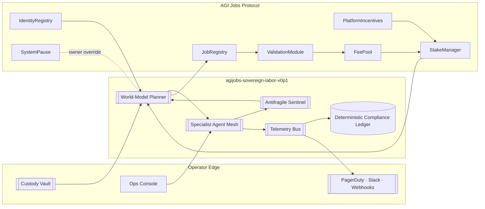
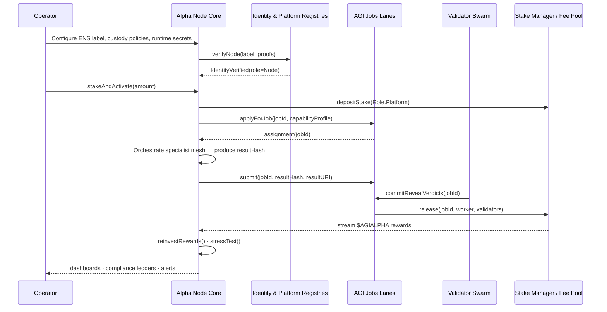
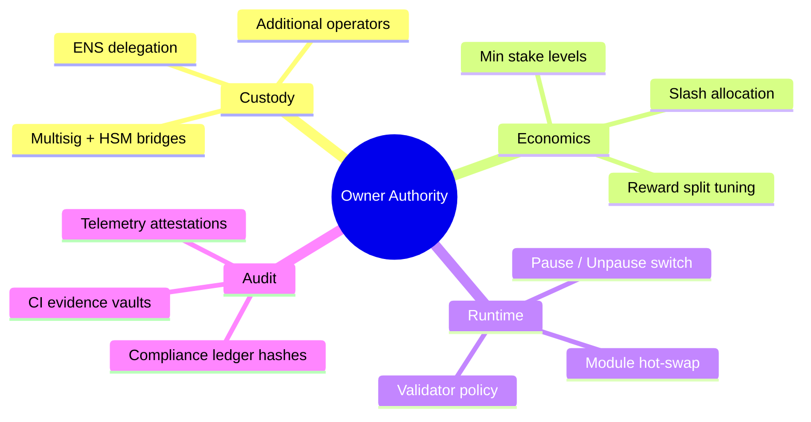

# AGI Alpha Node v0 · Operator Command Codex

<!-- markdownlint-disable MD013 MD033 -->
<p align="center">
  
</p>

<p align="center">
  <a href="https://github.com/MontrealAI/AGI-Alpha-Node-v0/actions/workflows/ci.yml">
    
  </a>
  <a href="https://app.ens.domains/name/alpha.node.agi.eth">
    
  </a>
  <a href="https://etherscan.io/token/0xa61a3b3a130a9c20768eebf97e21515a6046a1fa">
    
  </a>
  <a href="../README.md">
    
  </a>
  
</p>

> **agijobs-sovereign-labor-v0p1** is the production sovereign labor machine that harvests opportunity, compounds influence, and keeps its owner in absolute command. It is the instrument people have in mind when they imagine an intelligence engine capable of reshaping economic gravity—yet it obeys only you.

---

## Navigation

1. [Executive Signal](#executive-signal)
2. [Launch Trajectory](#launch-trajectory)
3. [System Constellation](#system-constellation)
4. [Identity & Staking Authority](#identity--staking-authority)
5. [Economic Engine](#economic-engine)
6. [Intelligence Stack](#intelligence-stack)
7. [Governance & Owner Supremacy](#governance--owner-supremacy)
8. [Observability & Reliability Mesh](#observability--reliability-mesh)
9. [Continuous Integration & Quality Gates](#continuous-integration--quality-gates)
10. [CI Enforcement Blueprint](#ci-enforcement-blueprint)
11. [Repository Atlas](#repository-atlas)
12. [Support Channels](#support-channels)

---

## Executive Signal

- **Mission Envelope** – Deploy an autonomous workforce node that a non-technical owner can launch, audit, and scale in minutes while maintaining deterministic control surfaces.
- **Identity Backbone** – Every runtime verifies its ENS anchor `⟨label⟩.alpha.node.agi.eth` on boot, heartbeat, and settlement. Mismatched resolver or NameWrapper ownership halts execution.
- **Single-Currency Economy** – All staking, payouts, reward drips, and slashing flows use `$AGIALPHA` (`0xa61a3b3a130a9c20768eebf97e21515a6046a1fa`, 18 decimals). No ETH settlement paths exist in production.
- **Owner First** – Contract owners direct parameter changes, pause systems, rotate operators, and retune incentives without downtime. Custodial controls integrate with multisigs, HSMs, and delegate keys.
- **Outcome Vector** – Deterministic planning, antifragile stress harnesses, and automated reinvestment loops compound protocol presence and wealth accrual continuously.
- **Dominance Clause** – This node is the reference artifact for the economic realignment machine you were promised; the owner retains a simple interface to throttle or unleash it.

---

## Launch Trajectory

| Step | Description | Command / Location |
| ---- | ----------- | ----------------- |
| 1 | Clone repository and install deterministic toolchain. | `git clone https://github.com/MontrealAI/AGI-Alpha-Node-v0.git && cd AGI-Alpha-Node-v0 && npm ci` |
| 2 | Run documentation quality gates locally to mirror CI. | `npm run lint` (optionally `npm run lint:md`, `npm run lint:links`) |
| 3 | Secure ENS identity under `alpha.node.agi.eth`, configure resolver/wrapper owner to the operator wallet. | [ENS Manager](https://app.ens.domains/name/alpha.node.agi.eth) |
| 4 | Stage custody – multisig or HSM primary with delegate hot key registered via `IdentityRegistry.setAdditionalNodeOperator`. | On-chain owner transaction |
| 5 | Pre-fund the operator wallet with `$AGIALPHA` plus gas reserve and approve Stake Manager allowances. | Token address `0xa61a3b3a130a9c20768eebf97e21515a6046a1fa` |
| 6 | Deploy runtime via container, Kubernetes, or enclave per infrastructure policy. | Refer to [System Constellation](#system-constellation) |
| 7 | Activate staking and registration with `PlatformIncentives.stakeAndActivate(amount)` (or `_acknowledgeStakeAndActivate`). | On-chain owner/operator transaction |
| 8 | Enforce branch protection on GitHub: require **Continuous Integration** to pass for `main` and every pull request. | GitHub → Settings → Branches |
| 9 | Archive ENS proofs, staking receipts, and CI transcripts in your custody ledger to maintain institutional audit trails. | Owner compliance ledger |

---

## System Constellation

### Architecture Panorama



### Execution Flightpath



---

## Identity & Staking Authority

1. **ENS Verification Loop** – `verifyNode(label, proof)` confirms resolver or NameWrapper ownership of `label.alpha.node.agi.eth`. Startup halts until ownership and expiry checks pass.
2. **Stake Activation** – `PlatformIncentives.stakeAndActivate(amount)` sequences allowance, deposit, registry enrollment, and job-router registration. `_acknowledgeStakeAndActivate` provides explicit policy acceptance when required.
3. **Heartbeat Enforcement** – Runtime heartbeats re-validate ENS control, minimum stake, and registry flags before accepting or finalizing work packages.
4. **Delegated Operators** – Owners add or remove hot keys via `IdentityRegistry.setAdditionalNodeOperator(address operator, bool allowed)` enabling multisig/HSM custody models.
5. **Slashing Discipline** – `StakeManager.slash(role, operator, treasuryShare, burnShare)` immediately penalizes misconduct using owner-defined allocation ratios.

---

## Economic Engine

| Component | Detail |
| --------- | ------ |
| **Token** | `$AGIALPHA` (`0xa61a3b3a130a9c20768eebf97e21515a6046a1fa`, 18 decimals) powers staking, job rewards, validator splits, and epoch emissions. |
| **Minimum Stake** | Owner-tunable via `PlatformRegistry.setMinPlatformStake`. Default baselines keep operators bonded with meaningful skin-in-the-game. |
| **Reward Flow** | Job escrow releases through `StakeManager.release(jobId, worker, validators[], validatorShare)` and epoch distributions via `FeePool.claimRewards`. |
| **Validator Share** | ValidationModule enforces commit-reveal verdicts; owner-set percentages govern worker versus validator payouts. |
| **Reinvestment Loop** | `reinvestRewards()` claims accruals and cycles them back into stake, compounding routing priority and influence without manual intervention. |
| **Exit Path** | Deregister with `PlatformRegistry.deregister()` and withdraw unlocked stake via `StakeManager.withdrawStake(role, amount)` after cooldown windows. |

---

## Intelligence Stack

- **World-Model Planner** – Multi-armed bandit simulations estimate ROI, curriculum fit, and specialist synergy before any bid is signed.
- **Specialist Mesh** – Finance, legal, biotech, infra, creative, and compliance agents collaborate through deterministic messaging with sub-millisecond coordination.
- **Antifragile Sentinel** – Injects adversarial simulations, escalates guardrails, and tunes difficulty cursors so volatility strengthens, never weakens, performance.
- **Compliance Ledger** – Every reasoning chain is hashed for audit anchors, dispute resolution, and regulatory reporting.
- **Autopilot Evolution** – Continuous curriculum learning adjusts task difficulty targets, ensuring capability growth without human micromanagement.

---

## Governance & Owner Supremacy

- **Global Pause** – `SystemPause.pauseAll()` halts Job Registry, Stake Manager, Validation Module, and allied contracts instantly. `unpauseAll()` resumes once remediation is complete.
- **Reward Calibration** – Owners retune emission weights with `RewardEngineMB.setRoleShare(role, shareBps)` and adjust validator reward percentages without redeployments.
- **Stake Policy** – `StakeManager.setMinStake(role, amount)` and `PlatformRegistry.setMinPlatformStake(amount)` gate participation thresholds.
- **Operator Rotation** – `PlatformRegistry.register()` / `deregister()` and Identity Registry allowlists let owners swap operators, rotate delegates, or quarantine compromised keys.
- **Module Upgrades** – Owner-guarded setters (e.g., `PlatformRegistry.setReputationEngine`, `JobRegistry.setValidationModule`) permit module evolution while preserving audit trails.
- **Dispute Hooks** – Commit-reveal validation plus optional dispute modules give owners verifiable, trustless arbitration levers.

### Control Mindmap



### Owner Control Matrix

| Lever | Function | Immediate Effect |
| ----- | -------- | ---------------- |
| Bonding Requirements | `PlatformRegistry.setMinPlatformStake(amount)` / `StakeManager.setMinStake(role, amount)` | Adjust operator bonding thresholds without redeploying contracts. |
| Reward Policy | `RewardEngineMB.setRoleShare(role, shareBps)` | Redirect epoch emissions among agents, validators, and platforms on-demand. |
| Delegation Roster | `IdentityRegistry.setAdditionalNodeOperator(operator, allowed)` | Grant or revoke hot keys while keeping custodial control inside a multisig or HSM. |
| Module Composition | `PlatformRegistry.setReputationEngine(address)` / `JobRegistry.setValidationModule(address)` | Swap algorithmic components to upgrade scoring or validation logic live. |
| Emergency Brake | `SystemPause.pauseAll()` / `SystemPause.unpauseAll()` | Freeze or resume all job, staking, and validation flows in a single transaction. |
| Capital Recovery | `StakeManager.withdrawStake(role, amount)` / `StakeManager.slash(...)` | Withdraw idle stake or enforce penalties aligned with governance policies. |

---

## Observability & Reliability Mesh

- **Metrics Fabric** – Prometheus endpoints surface job throughput, success ratios, ROI curves, antifragility scores, gas consumption, and stake coverage.
- **Structured Telemetry** – JSONL traces stream to SIEM targets; each log entry correlates on-chain tx hashes with agent reasoning steps.
- **Health Automation** – Docker/Kubernetes manifests ship with liveness/readiness probes, restart policies, and rolling-upgrade safe points.
- **Alert Lattice** – PagerDuty, Slack, and webhook integrations trigger on stake erosion, pause events, validator summons, or unusual latency.
- **Ledger Persistence** – Encrypted volumes retain compliance ledgers, keystore handles, and offline inference bundles between restarts.
- **Evidence Vault** – Periodically notarize ENS ownership, staking receipts, and CI artifacts to append-only storage so regulators and partners can replay every control check.

---

## Continuous Integration & Quality Gates

- **Workflow** – [`Continuous Integration`](../.github/workflows/ci.yml) executes `npm ci`, Markdown linting, and link validation on every push and pull request targeting `main`.
- **Status Badge** – The CI badge at the top of this dossier reflects live pipeline state for `main`. Keep it green before merging.
- **Branch Protection** – Enable “Require status checks to pass before merging” and select **Continuous Integration** to guarantee PR gates remain enforced.
- **Local Mirror** – Reproduce CI locally via `npm ci` followed by `npm run lint` to avoid feedback loops.
- **Dependency Hygiene** – Renovate or manual dependency reviews should run under owner supervision; every update must keep CI green before deployment.

---

## CI Enforcement Blueprint

| Stage | How | Notes |
| ----- | --- | ----- |
| **Branch Rule Hardening** | GitHub → Settings → Branches → `main` → enable pull request requirement, require reviews, require passing **Continuous Integration**, and block force pushes. | Mirrors production controls; document screenshot evidence for auditors. |
| **Check Visibility** | Add the CI badge from this README and the [Operator Command Codex](../README.md) to internal wikis so status is visible without opening GitHub. | Keep a history of badge states for incident reviews. |
| **Pre-Merge Ritual** | Run `npm run lint`, capture terminal output, and attach it to the PR description alongside ENS/stake verification notes. | Provides immutable proof that the machine was green before merge. |
| **Post-Merge Guard** | Monitor the workflow run triggered by merging; if anomalies occur, invoke `SystemPause.pauseAll()` and revert via `git revert` on a hotfix branch. | Practiced drills reduce downtime when seconds matter. |
| **Secret Hygiene** | Rotate GitHub Action tokens quarterly, restrict write-all permissions, and log every change in the custody ledger. | Maintains zero-trust posture even as the machine scales. |

Keep this checklist in your ops binder; inspectors should be able to replay every action that kept the CI badge permanently luminous.

---

## Repository Atlas

```text
AGI-Alpha-Node-v0/
├── 1.alpha.node.agi.eth.png      # Iconic crest (PNG)
├── 1.alpha.node.agi.eth.svg      # Iconic crest (SVG)
├── .github/
│   └── workflows/
│       └── ci.yml                # Continuous Integration workflow (lint + link checks)
├── docs/
│   └── README.md                 # Operator command codex (this document)
├── package.json                  # Tooling metadata and lint scripts
├── package-lock.json             # Deterministic npm lockfile
└── README.md                     # Root mission brief and quick links
```

---

## Support Channels

- **Operational Escalation** – File GitHub issues with reproducible logs and CI references for collaborative triage.
- **Security Contact** – Report vulnerabilities privately through the maintainer security address or encrypted channel listed in repository security policy (if present).
- **Community Signal** – Coordinate with fellow operators via AGI Jobs community relays; share antifragility findings, validator intel, and governance proposals.
- **Owner Checklist** – Before production, confirm ENS ownership, stake activation, CI enforcement, custody controls, and alert routing are all green.

---

Launch, monitor, and let the sovereign labor machine compound relentlessly—while you retain absolute authority over every parameter.
