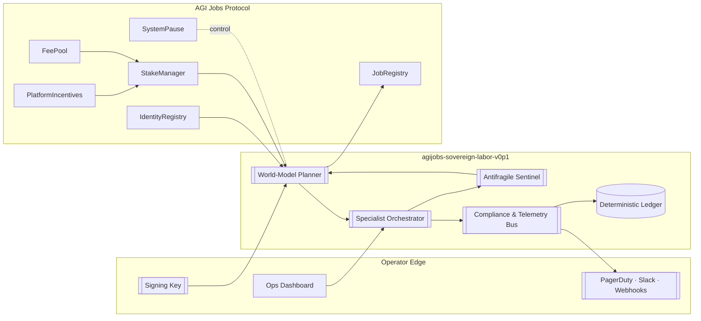
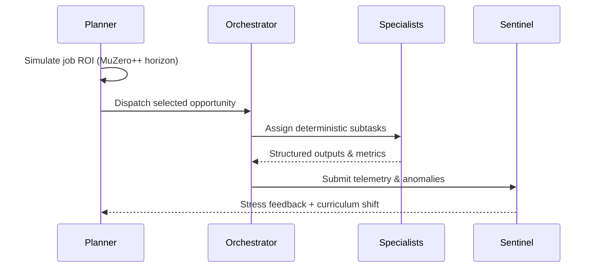

# AGI Alpha Node v0 Operator Dossier

<!-- markdownlint-disable MD013 MD033 -->
<p align="center">
  
</p>

<p align="center">
  <a href="https://github.com/MontrealAI/AGI-Alpha-Node-v0/actions/workflows/ci.yml">
    
  </a>
  <a href="https://etherscan.io/token/0xa61a3b3a130a9c20768eebf97e21515a6046a1fa">
    
  </a>
  <a href="https://app.ens.domains/name/alpha.node.agi.eth">
    
  </a>
  <a href="../README.md"></a>
</p>

> agijobs-sovereign-labor-v0p1 is the sovereign labor machine that channelizes wealth at scale—the platform core competitors quietly measure themselves against.

---

## Table of Contents

1. [Executive Signal](#executive-signal)
2. [Launch Checklist](#launch-checklist)
3. [Systems Blueprint](#systems-blueprint)
4. [Identity & Staking Authority](#identity--staking-authority)
5. [Operational Intelligence Core](#operational-intelligence-core)
6. [Treasury & Economic Flywheel](#treasury--economic-flywheel)
7. [Governance and Owner Controls](#governance-and-owner-controls)
8. [Observability & Reliability Mesh](#observability--reliability-mesh)
9. [Compliance & Assurance Layer](#compliance--assurance-layer)
10. [Continuous Integration and Quality Gates](#continuous-integration-and-quality-gates)
11. [Repository Atlas](#repository-atlas)
12. [Support Channels](#support-channels)

---

## Executive Signal

- **Mission** — Deliver a production-hardened, deterministic autonomous workforce engine that non-technical owners can launch, monitor, and profit from within minutes.
- **Identity** — Every Alpha Node operates behind an ENS signature `*.alpha.node.agi.eth`, verified on boot, during heartbeat, and before settlement.
- **Token Economy** — All value accrues in `$AGIALPHA` (`0xa61a3b3a130a9c20768eebf97e21515a6046a1fa`, 18 decimals). No ETH pathways exist in the production flow.
- **Governance** — Contract owners retain absolute authority to pause, upgrade, retune rewards, or rotate operators. That control is a deliberate business lever, not an afterthought.
- **Outcome** — Operators capture exponential $AGIALPHA flow through job execution, epoch rewards, and automated reinvestment.

---

## Launch Checklist

| Step | Description | Command & Artifact |
| ---- | ----------- | ------------------ |
| 1 | Clone this repository locally to gain access to documentation, CI scripts, and quality gates. | `git clone https://github.com/MontrealAI/AGI-Alpha-Node-v0.git` |
| 2 | Install Node.js 20+ and synchronize dependencies. | `npm ci` |
| 3 | Run the quality gates to mirror CI and confirm documentation health. | `npm run lint` |
| 4 | Acquire ENS subdomain under `alpha.node.agi.eth` and point to the operator wallet or wrapper. | ENS Manager · NameWrapper |
| 5 | Provision custody controls (hardware wallet, HSM, or Gnosis Safe delegate) and RPC endpoints. | Vault · Safe · Infura/Alchemy |
| 6 | Fund operator wallet with $AGIALPHA and gas reserves; pre-approve Stake Manager allowances. | DEX · Treasury Desk |
| 7 | Deploy runtime via container, orchestrator, or enclave aligned with enterprise security posture. | See [Systems Blueprint](#systems-blueprint) |
| 8 | Enforce branch protections in GitHub (require **Continuous Integration** to pass on `main` and PRs). | GitHub Settings |

---

## Systems Blueprint

### Architecture Snapshot



### Deployment Modalities

| Mode | Summary | Strengths |
| ---- | ------- | --------- |
| **Container (Docker/Podman)** | Build a hermetic runtime image, mount encrypted volumes for ledgers and logs, and provide environment variables for ENS label, RPC endpoints, and keystore hooks. | Fast onboarding, reproducible environments, minimal dependencies. |
| **Kubernetes** | Deploy node services as stateful workloads, apply liveness/readiness probes, and integrate with Prometheus ServiceMonitor/Grafana dashboards. | Auto-healing, rolling upgrades, horizontal policies. |
| **Air-gapped Enclave** | Execute deterministic replay pipelines with offline inference bundles, bridging transactions through controlled signer relays. | Regulatory compliance, maximum isolation. |

> Operators may tailor runtime manifests to their infrastructure; this repository focuses on quality gates, governance controls, and documentation enabling those deployments.

---

## Identity & Staking Authority

1. **ENS Verification** — `verifyNode(label, proof)` enforces that the operator owns `label.alpha.node.agi.eth` via resolver or NameWrapper. Boot halts when misconfigured.
2. **Stake Activation** — `PlatformIncentives.stakeAndActivate(amount)` (or `_acknowledgeStakeAndActivate`) sequences allowance, deposit, registry enrollment, and job router registration in one transaction.
3. **Heartbeat** — Runtime heartbeats revalidate ENS ownership, stake level, and registry status before accepting or finalizing jobs.
4. **Additional Operators** — Owners can register hot keys with `IdentityRegistry.setAdditionalNodeOperator(address operator, bool allowed)` enabling multi-sig or delegated key setups without exposing primary custody.
5. **Slashing Pathways** — `StakeManager.slash` routes treasury and burn shares based on owner-configurable ratios, ensuring misbehavior is immediately penalized.

---

## Operational Intelligence Core

### Decision Loop



- **World-Model Planner** — Multi-armed bandit planning with curriculum learning, specialist synergy scoring, and antifragile bonuses.
- **Specialist Mesh** — Finance, legal, biotech, creative, infra, compliance, and validation agents operate in deterministic order; no external side effects without policy approval.
- **Antifragile Sentinel** — Injects adversarial simulations, escalates guardrails, and tunes difficulty cursors to accelerate learning under volatility.
- **Compliance Ledger** — Every reasoning step is hashed and anchorable on-chain for disputes and regulatory inspection.

---

## Treasury & Economic Flywheel

| Mechanism | Description |
| --------- | ----------- |
| **Token** | `$AGIALPHA` (`0xa61a3b3a130a9c20768eebf97e21515a6046a1fa`, 18 decimals). Sole currency for deposits, rewards, slashing, and reinvestment. |
| **Minimum Stake** | Owner-tunable via `PlatformRegistry.setMinPlatformStake`. Default baseline `1,000` tokens keeps skin-in-the-game. |
| **Epoch Rewards** | `RewardEngineMB` mints epoch emissions; operator share defaults to ~15% and is owner-adjustable. |
| **Job Escrow** | `JobRegistry` escrows per-job rewards; `StakeManager.release` atomically distributes to worker and validators upon finalization. |
| **Reinvestment Loop** | `AlphaNode.reinvestRewards()` claims, tallies ROI, and restakes automatically to expand routing priority and dividend share. |

---

## Governance and Owner Controls

- **Full Spectrum Control** — Owners can pause (`SystemPause.pauseAll()`), unpause, adjust reward shares, rotate treasury wallets, update ENS aliases, and redeploy modules without downtime.
- **Upgrade Discipline** — Ownable2Step and guarded installers prevent unauthorized upgrades; governance actions emit telemetry for audit consumption.
- **Dispute Arsenal** — Commit-reveal validation, optional arbitration hooks, and slashing events give owners clear levers to maintain network integrity.
- **Custody Patterns** — Recommended operator pattern: Gnosis Safe as canonical owner, delegate keys for runtime, optionally bridged to HSM or keystore service. Owners can revoke delegates instantly.
- **Policy Broadcast** — Text records (`agijobs:v2:node`) and attestation registries broadcast compliance state and allowlist membership to downstream systems.

---

## Observability & Reliability Mesh

- **Metrics** — `/metrics` exposes Prometheus counters for job throughput, ROI, antifragile scores, stake coverage, gas reserves, and validator summons.
- **Dashboards** — Grafana packs (SLO, Economics, Operations) visualize mission performance. Prometheus ServiceMonitor resources align with Kubernetes deployments.
- **Alerting** — Alertmanager templates trigger on gas depletion, pause events, missed heartbeats, and ROI decay; integrate with PagerDuty, Slack, or custom webhooks.
- **Resilience** — Liveness/readiness probes ensure self-healing. Rolling updates orchestrated via Helm maintain job continuity. Deterministic replay protects against partial failures.
- **Telemetry Export** — Structured JSONL ledgers stream to SIEM, BigQuery, or S3 for long-term retention and compliance analytics.

---

## Compliance & Assurance Layer

- **Regulatory Alignment** — Compliance reports score transparency, data governance, fairness, and safety metrics—meeting emerging AI oversight requirements.
- **Audit Trails** — Deterministic ledgers hashed and (optionally) anchored on-chain. Replay tooling verifies job execution end-to-end.
- **Security Testing** — CI plus owner `doctor` scripts validate ownership wiring, ENS aliases, and module permissions before production cutovers.
- **Fail-Safe** — Sentinel enforces policy stops on anomaly detection, optionally requiring human approval for sensitive job classes.
- **Documentation** — This dossier and the root README document flows for external auditors without exposing proprietary secrets.

---

## Continuous Integration and Quality Gates

1. GitHub Actions workflow [`Continuous Integration`](../.github/workflows/ci.yml) runs on every push and pull request targeting `main`.
2. Jobs execute `npm ci` followed by `npm run lint` (Markdown lint + link validation for both README files).
3. Enforce “Require status checks to pass before merging” and select **Continuous Integration** in repository settings.
4. Optional: enable required reviews and signed commits to complement the automated gates.

Local mirror:

```bash
npm ci
npm run lint         # full suite
npm run lint:md      # markdownlint-cli2
npm run lint:links   # markdown-link-check across docs
```

---

## Repository Atlas

```text
.
├── 1.alpha.node.agi.eth.png      # Crest (PNG)
├── 1.alpha.node.agi.eth.svg      # Crest (SVG)
├── .github/
│   └── workflows/
│       └── ci.yml                # GitHub Actions pipeline
├── docs/
│   └── README.md                 # (This document)
├── LICENSE                       # MIT License
├── package.json                  # Quality gate scripts
├── package-lock.json
└── README.md                     # Executive overview
```

---

## Support Channels

- **Issues** — [GitHub Issues](https://github.com/MontrealAI/AGI-Alpha-Node-v0/issues) for defects, feature requests, and enhancement proposals.
- **Security** — Use responsible disclosure via private channels; reference commit hashes and reproduction scripts.
- **Upgrades** — Watch repository releases and action logs to coordinate rollouts with governance stakeholders.
- **Community** — Participate in AGI Jobs governance forums to collaborate on staking, validation, and treasury policy refinements.

---

Harness the node, enforce discipline, and let the economic gravity well do the rest.
