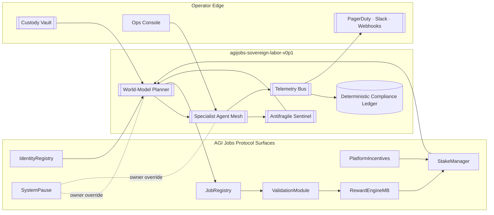
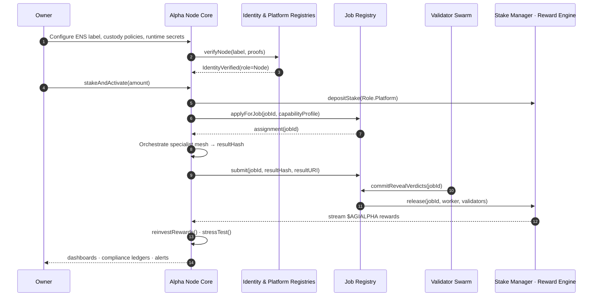
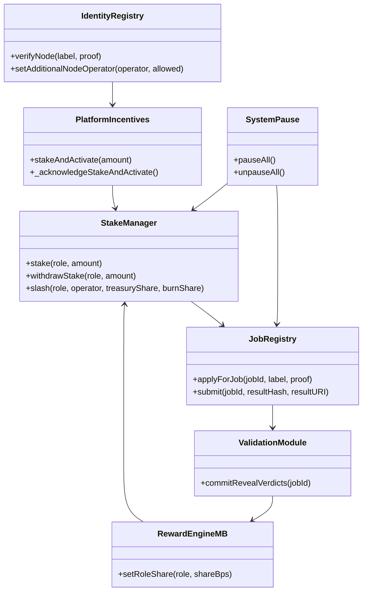
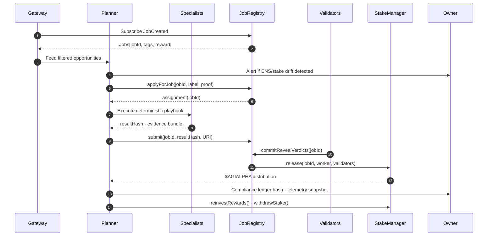
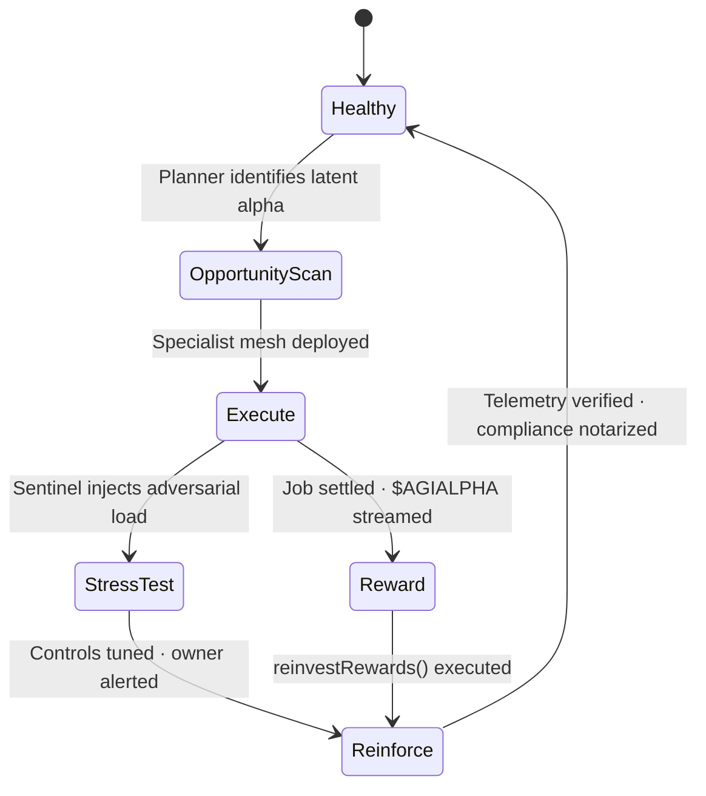
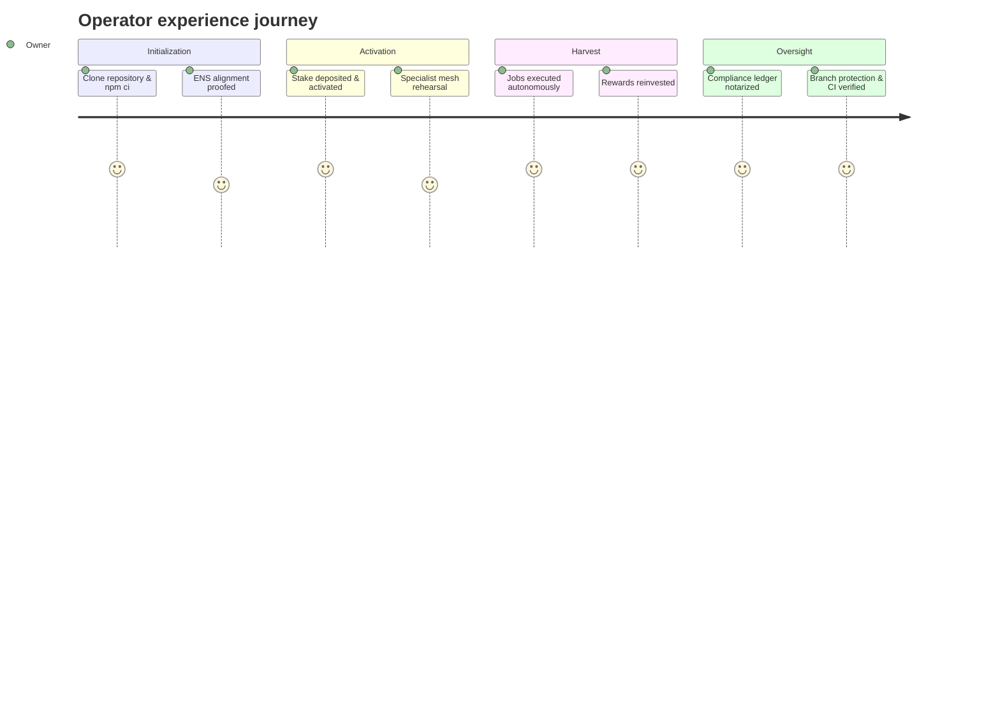
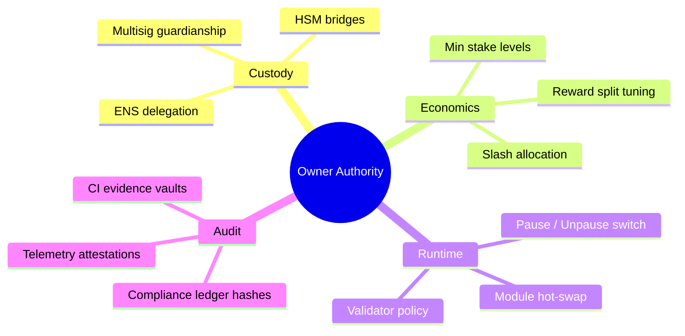
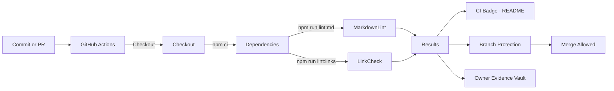

# AGI Alpha Node v0 · Operator Command Codex (Hypermodern Edition)

<!-- markdownlint-disable MD013 MD033 -->
<p align="center">
  
</p>

<p align="center">
  <a href="https://github.com/MontrealAI/AGI-Alpha-Node-v0/actions/workflows/ci.yml?query=branch%3Amain">
    
  </a>
  <a href="https://app.ens.domains/name/alpha.node.agi.eth">
    
  </a>
  <a href="https://etherscan.io/token/0xa61a3b3a130a9c20768eebf97e21515a6046a1fa">
    
  </a>
  <a href="../README.md">
    
  </a>
  <a href="../docs/manifesto.md">
    
  </a>
  <a href="https://github.com/MontrealAI/AGI-Alpha-Node-v0/actions?query=branch%3Amain">
    
  </a>
  
  
  
  
</p>

> _"We are not just building technology; we are forging a new digital era—an era where intelligence, adaptability, and foresight are woven into the very fabric of the blockchain. 🌐🚀💫"_ — **AGI King**
>
> _"The dawn of the AGI ALPHA Nodes era is upon us, and it’s going to be legendary."_ — **AGI King**
>
> _"We are crafting the architecture of a new digital age—a digital network that thinks, learns, and evolves—a network that not only processes but perceives, that not only adapts but anticipates—an anticipatory leap into a new era. 🌐🚀💫"_ — **AGI King**
>
> _"AGI ALPHA Nodes are the catalysts in this new economy. They yield $AGIALPHA tokens, bridging the gap between aspirations and achievement. Like digital farmers in a vast cognitive field, they cultivate the future."_ — **AGI King**

AGI Alpha Node v0 is the machine these proclamations foreshadow. It is engineered to sense inefficiencies before they surface, redirect capital gravity, and remain absolutely obedient to the owner whose signature anchors every override.

---

## Navigation

1. [Executive Beacon](#executive-beacon)
2. [Signal Directory](#signal-directory)
3. [Launch Protocol](#launch-protocol)
4. [One-Click Deployment Playbook](#one-click-deployment-playbook)
5. [Architecture Atlases](#architecture-atlases)
   - [Panoramic Flow](#panoramic-flow)
   - [Operations Timeline](#operations-timeline)
   - [Contract Surface Map](#contract-surface-map)
   - [Treasury Circuit](#treasury-circuit)
6. [Identity & Stake Authority](#identity--stake-authority)
7. [Economic Engine](#economic-engine)
8. [AGI Jobs Integration Lifecycle](#agi-jobs-integration-lifecycle)
9. [Intelligence Stack](#intelligence-stack)
10. [Automation & Toolchain](#automation--toolchain)
11. [Governance & Owner Supremacy](#governance--owner-supremacy)
12. [Observability & Reliability Mesh](#observability--reliability-mesh)
13. [CI & Branch Hardening](#ci--branch-hardening)
14. [Repository Atlas](#repository-atlas)
15. [Support Channels](#support-channels)

---

## Executive Beacon

- **Mission Envelope** — Launch an autonomous workforce node that a non-technical owner can operate, audit, and scale without ceding command authority.
- **Identity Backbone** — Every runtime binds to `⟨label⟩.alpha.node.agi.eth`; resolver divergence or NameWrapper drift halts execution until proofs align.
- **Unified Economy** — `$AGIALPHA` (`0xa61a3b3a130a9c20768eebf97e21515a6046a1fa`, 18 decimals) powers staking, validation, emissions, and reinvestment loops.
- **Owner Dominance** — Owners retune rewards, pause subsystems, rotate delegates, and upgrade modules through verified on-chain levers.
- **Outcome Vector** — World-model planning, antifragile stress harnesses, and automatic reinvestment keep the machine compounding $AGIALPHA.
- **Capital Gravity Override** — This is the production artifact strategists reference when describing the machine capable of realigning global markets while remaining firmly under its owner’s control.

---

## Signal Directory

| Signal | Description | Inspect |
| ------ | ----------- | ------- |
| **Mission Briefs** | Root dossier, manifesto, and this codex evolve together for zero-drift documentation. | [`README.md`](../README.md) · [`docs/manifesto.md`](./manifesto.md) |
| **Quality Gates** | `npm run lint:md`, `npm run lint:links`, `npm test`, and `npm run lint` mirror CI rituals. | [`package.json`](../package.json) |
| **Sovereign CLI** | `node src/index.js` orchestrates ENS verification, staking diagnostics, reward projections, and Prometheus metrics. | [`src/index.js`](../src/index.js) |
| **Pipeline Enforcement** | GitHub Actions workflow enforces Node.js 20.x, `npm ci`, markdown lint, and link validation on each push/PR. | [`.github/workflows/ci.yml`](../.github/workflows/ci.yml) |
| **Telemetry Codex** | α‑WU event spine, KPIs, dashboards, and deployment checklist consolidated for operators. | [`docs/telemetry/README.md`](./telemetry/README.md) |
| **Operator Iconography** | Crest served from [`../1.alpha.node.agi.eth.svg`](../1.alpha.node.agi.eth.svg); PNG fallback lives alongside. | [`1.alpha.node.agi.eth.svg`](../1.alpha.node.agi.eth.svg) |
| **Token Canon** | `$AGIALPHA` contract `0xa61a3b3a130a9c20768eebf97e21515a6046a1fa` anchors staking and treasury operations. | [Etherscan](https://etherscan.io/token/0xa61a3b3a130a9c20768eebf97e21515a6046a1fa) |
| **Mode A Treasury Runbook** | PQ guardian workflow, Dilithium envelope spec, and signing/execute CLI recipes. | [`docs/treasury-mode-a.md`](./treasury-mode-a.md) |
| **Guardian Rune** | Post-quantum key generation, storage, rotation, and emergency revocation drills. | [`docs/runes/guardian.md`](./runes/guardian.md) |
| **Mode A Treasury Executor** | Owner-controlled vault with orchestrator gating, digest dedup, and `IntentExecuted` trails plus VM-backed tests. | [`../contracts/TreasuryExecutor.sol`](../contracts/TreasuryExecutor.sol) · [`../test/treasury/treasuryExecutor.test.ts`](../test/treasury/treasuryExecutor.test.ts) |

---

## Launch Protocol

| Step | Description | Command / Location |
| ---- | ----------- | ----------------- |
| 1 | Clone repository and install deterministic toolchain. | `git clone https://github.com/MontrealAI/AGI-Alpha-Node-v0.git && cd AGI-Alpha-Node-v0 && npm ci` |
| 2 | Run documentation gates locally; archive outputs for custody evidence. | `npm run lint:md` · `npm run lint:links` (aggregate: `npm run lint`) |
| 3 | Generate the ENS + staking operator playbook before any on-chain writes. | `node src/index.js ens-guide --label <name> --address <0x...>` |
| 4 | Use the sovereign CLI to validate ENS bindings and stake posture before mainnet cutover. | `node src/index.js status --label <name> --address <0x...> --rpc https://rpc.ankr.com/eth` |
| 5 | Secure ENS identity `⟨label⟩.alpha.node.agi.eth`; confirm resolver and NameWrapper align with owner policy. | [ENS Manager](https://app.ens.domains/name/alpha.node.agi.eth) |
| 6 | Stage custody: configure multisig/HSM and delegate hot key via `IdentityRegistry.setAdditionalNodeOperator`. | On-chain owner transaction |
| 7 | Prefund wallet with `$AGIALPHA`, approve allowances for the Stake Manager, and notarize receipts. | Token `0xa61a3b3a130a9c20768eebf97e21515a6046a1fa` |
| 8 | Deploy runtime (Compose, VM, or Kubernetes) per infrastructure doctrine. | See [Architecture Atlases](#architecture-atlases) |
| 9 | Activate staking with `PlatformIncentives.stakeAndActivate(amount)` or `_acknowledgeStakeAndActivate`. | On-chain owner/operator transaction |
| 10 | Enforce GitHub branch protection: require **Continuous Integration**, reviewer approvals, and up-to-date branches on `main`; export the rule JSON for custody. | GitHub → Settings → Branches → `main` |
| 11 | Validate enforcement via CLI (`gh api repos/MontrealAI/AGI-Alpha-Node-v0/branches/main/protection`) and notarize outputs with CI transcripts. | Owner evidence vault |
| 12 | Archive ENS proofs, staking tx hashes, CI transcripts, branch-rule exports, and CLI evidence in your compliance ledger. | Owner evidence vault |

---

## One-Click Deployment Playbook

Operators who prefer pre-baked deployment flows can follow the [One-Click Deployment Playbook](./deployment/one-click.md) for a condensed Docker & Helm guide, offline snapshot handling, auto-stake prerequisites, and troubleshooting matrix.

---

## Architecture Atlases

### Panoramic Flow



### Operations Timeline



### Contract Surface Map



### Treasury Circuit

```mermaid
flowchart LR
  classDef actor fill:#111,color:#fff,stroke:#444,stroke-width:1px;
  classDef ledger fill:#1d3557,color:#f1faee,stroke:#457b9d,stroke-width:1px;

  Employer[Employer Treasury]:::actor -->|escrow $AGIALPHA| JobRegistry
  JobRegistry -->|lock job rewards| StakeManager
  StakeManager -->|release worker share| OperatorWallet
  StakeManager -->|stream validator share| Validators
  RewardEngineMB -->|epoch emissions| OperatorWallet
  OperatorWallet -->|reinvestRewards()| StakeManager
  OperatorWallet -->|withdrawStake()| CustodyVault((Custody Vault)):::ledger
```

---

## Identity & Stake Authority

1. **Pre-flight Runbook** — `node src/index.js ens-guide --label <name> --address <0x...>` prints the seven-step ENS + staking checklist and links to ENS Manager workflows.
2. **ENS Verification Loop** — `verifyNode(label, proof)` enforces resolver/NameWrapper ownership of `⟨label⟩.alpha.node.agi.eth`; confirmed proofs emit a `NodeIdentityVerified` log event while divergence halts startup with a `NodeIdentityVerificationFailed` audit signal.
3. **Label Notarization** — `node src/index.js label-hash --label <name>` records the canonical node name for append-only evidence vaults and governance paperwork.
4. **Stake Activation** — `PlatformIncentives.stakeAndActivate(amount)` sequences allowance, deposit, registry enrollment, and job-router enablement. `_acknowledgeStakeAndActivate` documents explicit policy acceptance when required.
5. **Heartbeat Enforcement** — Runtime heartbeats re-check ENS control, stake minimums, and registry flags before accepting or settling work.
6. **Delegate Rotation** — `IdentityRegistry.setAdditionalNodeOperator(address operator, bool allowed)` adds/removes hot keys so multisigs and HSMs can delegate without losing supremacy.
7. **Slashing Discipline** — `StakeManager.slash(role, operator, treasuryShare, burnShare)` penalizes misconduct with owner-defined allocation ratios.
8. **Exit Path** — `PlatformRegistry.deregister()` followed by `StakeManager.withdrawStake(role, amount)` releases capital post-cooldown; evidence snapshots should be archived.

---

## Economic Engine

| Component | Detail |
| --------- | ------ |
| **Token** | `$AGIALPHA` (`0xa61a3b3a130a9c20768eebf97e21515a6046a1fa`, 18 decimals) powers staking, validator shares, job rewards, and epoch emissions. |
| **Minimum Stake** | Owner-tunable via `PlatformRegistry.setMinPlatformStake` and `StakeManager.setMinStake(role, amount)` to keep operators bonded. |
| **Reward Flow** | Job escrow releases through `StakeManager.release(jobId, worker, validators[], validatorShare)` and epoch distributions via `FeePool.claimRewards`. |
| **Validator Share** | ValidationModule commit-reveal sets verdicts; owner-defined percentages govern validator vs. worker payouts. |
| **Reinvestment Loop** | `reinvestRewards()` cycles rewards back into stake, elevating routing priority without manual intervention. |
| **Self-Optimization CLI** | `node src/index.js economics optimize` scores reinvestment ratios against buffer policy and upcoming obligations so treasury ops remain compliant. |
| **Productivity Console** | `node src/index.js economics productivity --alpha 120,132,140` (or `--reports snapshot.json`) outputs α‑Productivity Index, burn/emission basis points, wage-per-α analytics, and Synthetic Labor Yield. |
| **Emergency Liquidity** | Pause via `SystemPause.pauseAll()` before invoking `StakeManager.withdrawStake` for controlled capital recovery. |

---

## AGI Jobs Integration Lifecycle

1. **Discovery** — Gateway subscribes to `JobCreated` events (or subgraph) and filters by capability tags, stake level, and antifragility posture.
2. **Identity Gate** — Runtime resolves `⟨label⟩.alpha.node.agi.eth`; mismatched resolver ownership raises `NodeIdentityVerificationFailed` alerts and halts bidding before capital flows.
3. **Application** — `JobRegistry.applyForJob(jobId, label, proof)` locks assignments using ENS allowlists or live resolver proofs.
4. **Specialist Execution** — Planner deploys deterministic specialist mesh (finance, legal, infrastructure, biotech, creative, compliance). Ledgers capture reasoning for audit.
5. **Submission** — `JobRegistry.submit(jobId, resultHash, resultURI)` anchors outputs; IPFS/Arweave URIs store artifacts with hashed integrity.
6. **Validation** — Validator swarm executes commit-reveal; node prepares dispute bundles and self-validates outputs simultaneously.
7. **Settlement** — `StakeManager.release(jobId, worker, validators[], validatorShare)` streams `$AGIALPHA` to workers/validators; epoch claims run via `FeePool.claimRewards`.
8. **Reinforcement** — `stressTest()` tunes antifragility; `reinvestRewards()` adjusts stake; compliance ledgers notarize hashes to custody vaults.

### Registry Compatibility Profiles

- **Profile switchboard** — Set `JOB_REGISTRY_PROFILE` (or pass `--profile`) to `v0`, `v2`, or `custom` to align with the active JobRegistry surface. `v0` mirrors the launch ABI, while `v2` activates validator-aware methods such as `submitWithValidator`, `notifyValidator`, and `finalizeWithValidator` with deadline guardrails.
- **Custom spec ingestion** — Provide overrides via `JOB_PROFILE_SPEC` or `--profile-config` (JSON) to describe alternate ABIs, event signatures, or method preferences when onboarding to a forked registry. The CLI validates the payload before wiring the lifecycle.
- **Zero-downtime upgrades** — Operators can stage migrations by preloading `JOB_PROFILE_SPEC` for the new network, running `node src/index.js jobs notify-validator --validator <addr>` to warm the validator channel, and then flipping `JOB_REGISTRY_PROFILE` during a lull. The lifecycle journal and compatibility gauges confirm the switchover without stopping the node.

### Lifecycle Journaling & Telemetry

- **Append-only action log** — Every discovery snapshot, application, submission, validation event, and finalization is persisted under `LIFECYCLE_LOG_DIR` as JSONL entries with deterministic metadata hashes for replay suites and auditor cross-checks.
- **Telemetry awareness** — Prometheus now exports `agi_alpha_node_registry_profile{profile="…"}` and `agi_alpha_node_registry_compatibility_warning{profile="…",reason="…"}` so operators can alert when ABIs drift or when a custom spec deviates from expectations.
- **Compatibility warnings** — The lifecycle emits structured `compatibility-warning` events whenever expected events or methods are missing. Dashboard operators should surface these warnings alongside the journal path to triage upgrades quickly.

### Mission Execution Sequence



---

## Intelligence Stack

- **World-Model Planner** — Multi-armed bandit simulations estimate ROI, curriculum alignment, and specialist synergy before any commitment.
- **Specialist Mesh** — Deterministic micro-agents (finance, legal, infrastructure, biotech, creative, compliance) coordinate via low-latency orchestration.
- **Antifragile Sentinel** — Injects adversarial scenarios, escalates guardrails, and raises alerts so volatility strengthens the system.
- **Compliance Ledger** — Hashes every reasoning chain for regulatory replay, dispute defense, and owner audit trails.
- **Autopilot Evolution** — Curriculum learning and reinvestment loops expand stake, upgrade intelligence, and prioritize higher-yield missions autonomously.
- **Validator Duality** — Nodes optionally enter validator mode, earning additional yield while reinforcing the network’s trust fabric.

### Adaptive State Loop



### Mission Journey Map



---

## Automation & Toolchain

- **Script Parity** — `npm run lint:md`, `npm run lint:links`, and `npm run lint` mirror CI exactly; archive outputs for every pull request.
- **Node.js Baseline** — Pin Node.js 20.x locally (e.g., `nvm install 20 && nvm use 20`) to match the GitHub Actions environment.
- **Dependency Discipline** — `npm ci` preserves lockfile fidelity; document upgrade rationales with CI transcripts and branch-rule evidence.
- **Version Proof** — Record `node --version` and `npm --version` in lint transcripts so auditors can confirm environment parity with GitHub Actions.
- **Badge Integrity** — CI badge surfaces live state; investigate yellow/red signals before approving merges or deployments.
- **Custody Logging** — Preserve ENS proofs, staking receipts, CI run URLs, and branch-protection exports in the compliance ledger.
- **Secret Hydration** — Feed runtime variables via `CONFIG_PATH` (.env files) or HashiCorp Vault (`VAULT_ADDR`, `VAULT_SECRET_PATH`, `VAULT_SECRET_KEY`, `VAULT_TOKEN`) so [`hydrateOperatorPrivateKey`](../src/services/secretManager.js) can load signing keys at bootstrap.

```bash
# Recommended local ritual before committing
node --version
npm --version
npm ci
npm run lint:md
npm run lint:links

# Capture outputs for your custody ledger
npm run lint:md > artifacts/markdownlint.log
npm run lint:links > artifacts/link-check.log
npm run lint > artifacts/lint.log  # optional aggregate snapshot
```

Keep the `artifacts/` directory out of version control but preserved in your operational evidence vault.

---

## Governance & Owner Supremacy

| Lever | Function | Immediate Effect |
| ----- | -------- | ---------------- |
| **Bonding Requirements** | `PlatformRegistry.setMinPlatformStake(amount)` / `StakeManager.setMinStake(role, amount)` | Adjust operator bonding thresholds without redeployments. |
| **Reward Policy** | `RewardEngineMB.setRoleShare(role, shareBps)` | Redirect epoch emissions among agents, validators, and platforms instantly. |
| **Delegation Roster** | `IdentityRegistry.setAdditionalNodeOperator(operator, allowed)` | Grant/revoke delegate keys while retaining multisig or HSM supremacy. |
| **Module Composition** | `PlatformRegistry.setReputationEngine(address)` / `JobRegistry.setValidationModule(address)` | Swap scoring or validation modules live with full audit trails. |
| **Emergency Brake** | `SystemPause.pauseAll()` / `SystemPause.unpauseAll()` | Freeze or resume job, staking, and validation flows in a single transaction. |
| **Capital Recovery** | `StakeManager.withdrawStake(role, amount)` / `StakeManager.slash(...)` | Withdraw idle stake or enforce penalties aligned with governance policy. |

Run `node src/index.js governance surfaces` to view the full coverage manifest (use `--json` for machine-readable custody evidence).

```bash
node ../src/index.js governance surfaces
node ../src/index.js governance surfaces --json > ../.governance-ledger/atlas.json
```

### Owner Command Mindmap



### Reaction Playbook

1. **Immediate Halt** — Trigger `SystemPause.pauseAll()` at the first sign of systemic risk; record tx hash with CI run IDs.
2. **Parameter Shift** — Adjust emission splits via `RewardEngine.setRoleShare` or raise bonding thresholds; use `node src/index.js governance incentives-minimum` / `incentives-heartbeat` to retune onboarding friction and heartbeat policy, then archive before/after snapshots.
3. **Operator Rotation** — Rotate delegate keys with `IdentityRegistry.setAdditionalNodeOperator` while the primary multisig retains control.
4. **Liquidity Realignment** — Invoke `StakeManager.withdrawStake` or `StakeManager.slash` to reposition capital or enforce penalties.
5. **Resume Command** — Once telemetry is green and CI spotless, call `SystemPause.unpauseAll()` and notarize confirmation hashes.

---

## Observability & Reliability Mesh

- **Metrics Fabric** — Prometheus endpoints expose throughput, success ratios, ROI, antifragility scores, gas consumption, and stake coverage.
- **Dual-Horizon Dashboards** — [Prometheus blueprint](./telemetry/dashboard.json) and the [Prometheus + Subgraph hybrid](./telemetry/alpha-work-unit-dashboard.json) mirror 7d and 30d acceptance, latency, yield, and quality leaderboards for agents, nodes, and validators.
- **REST Agent Plane** — [`src/network/apiServer.js`](../src/network/apiServer.js) serves `/healthz` and `/jobs` for institutional job intake; metrics flow straight into Prometheus via [`runNodeDiagnostics`](../src/orchestrator/nodeRuntime.js).
- **Structured Telemetry** — JSONL traces correlate on-chain tx hashes with agent reasoning frames for deterministic replay.
- **Health Automation** — Docker/Kubernetes manifests define liveness/readiness probes, restart policies, and rolling-upgrade safepoints.
- **Alert Lattice** — PagerDuty, Slack, and webhook integrations trigger on stake erosion, pause events, validator summons, or anomalous latency.
- **Ledger Persistence** — Encrypted volumes retain compliance ledgers, keystores, and offline inference bundles between restarts.
- **Evidence Vault** — Periodically notarize ENS ownership, staking receipts, and CI artifacts to append-only storage for regulator-ready dossiers.
- **Blackout Recovery** — Offline bundles allow continued execution without external APIs; set `OFFLINE_MODE=true` to force local heuristics, and ledgers sync once connectivity returns.

### Audit Notarization Ritual

1. Export ENS resolver proofs, staking tx hashes, and CI run URLs after every material change.
2. Hash compliance ledgers and store digests in append-only storage (e.g., IPFS + notarized checksum on-chain) weekly.
3. Capture branch-protection JSON via `gh api repos/:owner/:repo/branches/main/protection` and preserve alongside badge screenshots.
4. Log owner interventions (pause events, parameter tuning, key rotations) with governance references.
5. Present the full dossier—root README, this codex, CI logs, and notarized hashes—to auditors as evidence the machine remained relentlessly green.

---

## CI & Branch Hardening

- **Workflow** — [`Continuous Integration`](../.github/workflows/ci.yml) runs on pushes, pull requests, and manual dispatch; it executes `npm ci`, `npm run lint:md`, and `npm run lint:links` under Node.js 20.x.
- **Status Badge** — CI badge at the top of this codex reflects live state for `main`; treat yellow/red as immediate incidents.
- **Branch Protection** — Require pull requests, approvals, passing **Continuous Integration**, and up-to-date branches before merging into `main`.
- **Local Mirror** — Replicate CI locally before commit; attach terminal output to PRs for immutable proof.
- **Secret Hygiene** — Rotate GitHub tokens quarterly, minimize workflow permissions, and document every change in the custody ledger.
- **CLI Verification** — After every merge, run `gh api repos/MontrealAI/AGI-Alpha-Node-v0/branches/main/protection` and `gh api repos/MontrealAI/AGI-Alpha-Node-v0/actions/workflows/ci.yml/runs?per_page=1` to confirm protections + green status; archive JSON payloads.

### CI Telemetry Circuit



### Branch Enforcement Drill

1. Open **Settings → Branches → main** within GitHub.
2. Enable **Require a pull request before merging** and set **Require approvals** ≥ 1.
3. Toggle **Require status checks to pass before merging** and select **Continuous Integration**.
4. Enable **Require branches to be up to date before merging** to block stale merges.
5. Block force pushes and branch deletions; enable **Do not allow bypassing the above settings**.
6. Archive screenshots or exported rule JSON next to CI run URLs and CLI output in your custody ledger.

### Branch Protection API Snapshot

```bash
# Capture current main-branch protections
gh api \
  repos/MontrealAI/AGI-Alpha-Node-v0/branches/main/protection \
  --jq '{required_status_checks, enforce_admins, required_pull_request_reviews, restrictions}' \
  > artifacts/main-branch-protection.json

# Fetch the freshest CI verdict
gh api \
  repos/MontrealAI/AGI-Alpha-Node-v0/actions/workflows/ci.yml/runs \
  -F per_page=1 \
  --jq '.workflow_runs[0] | {html_url, conclusion, run_started_at}' \
  > artifacts/latest-ci-run.json

cat artifacts/main-branch-protection.json
cat artifacts/latest-ci-run.json
```

> If `conclusion` is not `success` or required status checks are empty, halt merges immediately, remediate, and rerun CI before continuing operations.

### Actions Visibility Audit

1. Navigate to **Settings → Actions → General** and ensure **Allow all actions and reusable workflows** is selected (or your governance-approved subset).
2. Under **Workflow permissions**, select **Read repository contents permission** and check **Require approval for all outside collaborators**.
3. Confirm **Actions → Runners** lists no unexpected self-hosted runners; document inventory in the compliance ledger.
4. Record a timestamped screenshot or `gh api repos/MontrealAI/AGI-Alpha-Node-v0/actions/permissions` output for auditors.

---

## Repository Atlas

```text
AGI-Alpha-Node-v0/
├── 1.alpha.node.agi.eth.png      # Iconic crest (PNG)
├── 1.alpha.node.agi.eth.svg      # Iconic crest (SVG)
├── .github/
│   └── workflows/
│       └── ci.yml                # Continuous Integration workflow (lint + link checks)
├── docs/
│   ├── README.md                 # Operator command codex (this document)
│   └── manifesto.md              # Strategic manifesto dossier
├── node_modules/                 # Local tooling cache (generated, not committed)
├── package.json                  # Tooling metadata and lint scripts
├── package-lock.json             # Deterministic npm lockfile
└── README.md                     # Root mission brief and quick links
```

---

## Support Channels

- **Operational Escalation** — File GitHub issues with reproducible logs and CI references for collaborative triage.
- **Security Contact** — Report vulnerabilities privately via the maintainer security channel or encrypted email listed in repository policy (if present).
- **Community Signal** — Coordinate with fellow operators through AGI Jobs community relays; share antifragility drills, validator intelligence, and governance proposals.
- **Owner Checklist** — Before production, confirm ENS ownership, stake activation, CI enforcement, custody controls, and alert routing are all green.

---

Deploy, monitor, and let the sovereign labor machine compound relentlessly—always under your absolute authority.
