# AGI Alpha Node v0 · Operator Command Codex

<!-- markdownlint-disable MD013 MD033 -->
<p align="center">
  
</p>

<p align="center">
  <a href="https://github.com/MontrealAI/AGI-Alpha-Node-v0/actions/workflows/ci.yml">
    
  </a>
  <a href="https://app.ens.domains/name/alpha.node.agi.eth">
    
  </a>
  <a href="https://etherscan.io/token/0xa61a3b3a130a9c20768eebf97e21515a6046a1fa">
    
  </a>
  <a href="../README.md">
    
  </a>
  <a href="https://github.com/MontrealAI/AGI-Alpha-Node-v0/actions">
    
  </a>
  
  
  
  
</p>

> _"We are not just building technology; we are forging a new digital era—an era where intelligence, adaptability, and foresight are woven into the very fabric of the blockchain. 🌐🚀💫"_ — **AGI King**
>
> _"The dawn of the AGI ALPHA Nodes era is upon us, and it’s going to be legendary."_ — **AGI King**
>
> _"We are crafting the architecture of a new digital age—a digital network that thinks, learns, and evolves—a network that not only processes but perceives, that not only adapts but anticipates—an anticipatory leap into a new era. 🌐🚀💫"_ — **AGI King**

AGI Alpha Node v0 is the superintelligent machine these declarations foreshadow: a sovereign labor instrument engineered to concentrate foresight, adaptive autonomy, and $AGIALPHA production while answering exclusively to its owner.

---

## Navigation

1. [Executive Beacon](#executive-beacon)
2. [Capability Signatures](#capability-signatures)
3. [Launch Trajectory](#launch-trajectory)
4. [System Atlas](#system-atlas)
5. [Identity & Staking Authority](#identity--staking-authority)
6. [Economic Engine](#economic-engine)
7. [AGI Jobs Integration Lifecycle](#agi-jobs-integration-lifecycle)
8. [Intelligence Stack](#intelligence-stack)
9. [Toolchain & Deterministic Automation](#toolchain--deterministic-automation)
10. [Governance & Owner Supremacy](#governance--owner-supremacy)
11. [Observability & Reliability Mesh](#observability--reliability-mesh)
12. [Continuous Integration & Branch Enforcement](#continuous-integration--branch-enforcement)
13. [Repository Atlas](#repository-atlas)
14. [Support Channels](#support-channels)

---

## Executive Beacon

- **Mission Envelope** — Launch an autonomous workforce node that a non-technical owner can operate, audit, and scale in minutes without surrendering command authority.
- **Identity Backbone** — Every runtime binds to `⟨label⟩.alpha.node.agi.eth`; mismatched resolver or NameWrapper ownership halts execution until proofs align.
- **Unified Economy** — `$AGIALPHA` (`0xa61a3b3a130a9c20768eebf97e21515a6046a1fa`, 18 decimals) powers staking, slashing, validator flows, and reinvestment loops.
- **Owner Dominance** — Owners retune rewards, pause subsystems, rotate delegates, and upgrade modules through verified on-chain levers.
- **Outcome Vector** — World-model planning, antifragile stress harnesses, and automatic reinvestment keep the machine compounding $AGIALPHA.
- **Capital Gravity Override** — This is the production artifact strategists reference when describing the intelligence engine capable of rebalancing global markets while remaining obedient to its keyholder.

---

## Capability Signatures

| Signal | Description | Inspect |
| ------ | ----------- | ------- |
| **Mission Briefs** | Root dossier, manifesto, and this codex evolve together for zero-drift documentation. | [`README.md`](../README.md) · [`docs/manifesto.md`](./manifesto.md) |
| **Quality Gates** | `npm run lint:md`, `npm run lint:links`, and `npm run lint` mirror CI and are the pre-flight ritual for every change. | [`package.json`](../package.json) |
| **Pipeline Enforcement** | GitHub Actions workflow enforces Node.js 20.x, `npm ci`, markdown lint, and link validation on every push/PR. | [`.github/workflows/ci.yml`](../.github/workflows/ci.yml) |
| **Operator Iconography** | Crest served from [`../1.alpha.node.agi.eth.svg`](../1.alpha.node.agi.eth.svg); PNG fallback lives alongside it. | [`1.alpha.node.agi.eth.svg`](../1.alpha.node.agi.eth.svg) |
| **Token Canon** | `$AGIALPHA` contract `0xa61a3b3a130a9c20768eebf97e21515a6046a1fa` anchors staking and treasury operations. | [Etherscan](https://etherscan.io/token/0xa61a3b3a130a9c20768eebf97e21515a6046a1fa) |

---

## Launch Trajectory

| Step | Description | Command / Location |
| ---- | ----------- | ----------------- |
| 1 | Clone repository and install deterministic toolchain. | `git clone https://github.com/MontrealAI/AGI-Alpha-Node-v0.git && cd AGI-Alpha-Node-v0 && npm ci` |
| 2 | Run documentation gates locally; archive outputs for custody evidence. | `npm run lint:md` · `npm run lint:links` (aggregate: `npm run lint`) |
| 3 | Secure ENS identity `⟨label⟩.alpha.node.agi.eth`; confirm resolver and wrapper align with owner policy. | [ENS Manager](https://app.ens.domains/name/alpha.node.agi.eth) |
| 4 | Stage custody: configure multisig/HSM + delegate hot key via `IdentityRegistry.setAdditionalNodeOperator`. | On-chain owner transaction |
| 5 | Prefund wallet with `$AGIALPHA`, approve allowances for the Stake Manager, and notarize receipts. | Token `0xa61a3b3a130a9c20768eebf97e21515a6046a1fa` |
| 6 | Deploy runtime (Compose, VM, or Kubernetes) per infrastructure doctrine. | See [System Atlas](#system-atlas) |
| 7 | Activate staking with `PlatformIncentives.stakeAndActivate(amount)` or `_acknowledgeStakeAndActivate`. | On-chain owner/operator transaction |
| 8 | Enforce GitHub branch protection: require **Continuous Integration**, reviewer approvals, and up-to-date branches on `main`; export the rule JSON for custody. | GitHub → Settings → Branches → `main` → **View rule** → **Export** |
| 9 | Validate enforcement via CLI (`gh api repos/MontrealAI/AGI-Alpha-Node-v0/branches/main/protection`) and notarize outputs with CI transcripts. | Owner evidence vault |
| 10 | Archive ENS proofs, staking tx hashes, CI transcripts, branch-rule exports, and CLI evidence in your compliance ledger. | Owner evidence vault |

---

## System Atlas

### Architecture Panoramic Flow

```mermaid
flowchart LR
  subgraph OperatorEdge[Operator Edge]
    Vault[[Custody Vault]]
    Console[Ops Console]
    Alerts[[PagerDuty · Slack · Webhooks]]
  end

  subgraph SovereignNode[agijobs-sovereign-labor-v0p1]
    Planner[[World-Model Planner]]
    Mesh[[Specialist Agent Mesh]]
    Sentinel[[Antifragile Sentinel]]
    Ledger[(Deterministic Compliance Ledger)]
    Telemetry[[Telemetry Bus]]
  end

  subgraph ProtocolCore[AGI Jobs Protocol Surfaces]
    IdentityRegistry
    StakeManager
    PlatformIncentives
    JobRegistry
    ValidationModule
    RewardEngineMB
    SystemPause
  end

  Vault --> Planner
  Console --> Mesh
  Planner --> Mesh
  Mesh --> Sentinel
  Sentinel --> Planner
  Mesh --> Telemetry
  Telemetry --> Ledger
  Telemetry --> Alerts
  Planner --> JobRegistry
  IdentityRegistry --> Planner
  StakeManager --> Planner
  PlatformIncentives --> StakeManager
  JobRegistry --> ValidationModule
  ValidationModule --> RewardEngineMB
  RewardEngineMB --> StakeManager
  SystemPause -. owner override .- Planner
  SystemPause -. owner override .- Mesh
```



### Orchestration Timeline

```mermaid
sequenceDiagram
    autonumber
    participant Owner
    participant Node as Alpha Node Core
    participant Registries as Identity & Platform Registries
    participant Jobs as Job Registry
    participant Validators as Validator Swarm
    participant Treasury as Stake Manager · Reward Engine

    Owner->>Node: Configure ENS label, custody policies, runtime secrets
    Node->>Registries: verifyNode(label, proofs)
    Registries-->>Node: IdentityVerified(role=Node)
    Owner->>Node: stakeAndActivate(amount)
    Node->>Treasury: depositStake(Role.Platform)
    Node->>Jobs: applyForJob(jobId, capabilityProfile)
    Jobs-->>Node: assignment(jobId)
    Node->>Node: Orchestrate specialist mesh → resultHash
    Node->>Jobs: submit(jobId, resultHash, resultURI)
    Validators->>Jobs: commitRevealVerdicts(jobId)
    Jobs->>Treasury: release(jobId, worker, validators)
    Treasury-->>Node: stream $AGIALPHA rewards
    Node->>Node: reinvestRewards() · stressTest()
    Node-->>Owner: dashboards · compliance ledgers · alerts
```



### Contract Surface Map


---

## Identity & Staking Authority

1. **ENS Verification Loop** — `verifyNode(label, proof)` enforces resolver/NameWrapper ownership of `⟨label⟩.alpha.node.agi.eth`; divergence halts startup.
2. **Stake Activation** — `PlatformIncentives.stakeAndActivate(amount)` sequences allowance, deposit, registry enrollment, and job-router enablement. `_acknowledgeStakeAndActivate` documents explicit policy acceptance when required.
3. **Heartbeat Enforcement** — Runtime heartbeats re-check ENS control, stake minimums, and registry flags before accepting or settling work.
4. **Delegate Rotation** — `IdentityRegistry.setAdditionalNodeOperator(address operator, bool allowed)` adds/removes hot keys so multisigs and HSMs can delegate without losing supremacy.
5. **Slashing Discipline** — `StakeManager.slash(role, operator, treasuryShare, burnShare)` penalizes misconduct with owner-defined allocation ratios.
6. **Exit Path** — `PlatformRegistry.deregister()` followed by `StakeManager.withdrawStake(role, amount)` releases capital post-cooldown; evidence snapshots should be archived.

---

## Economic Engine

| Component | Detail |
| --------- | ------ |
| **Token** | `$AGIALPHA` (`0xa61a3b3a130a9c20768eebf97e21515a6046a1fa`, 18 decimals) powers staking, validator shares, job rewards, and epoch emissions. |
| **Minimum Stake** | Owner-tunable via `PlatformRegistry.setMinPlatformStake` and `StakeManager.setMinStake(role, amount)` to keep operators bonded. |
| **Reward Flow** | Job escrow releases through `StakeManager.release(jobId, worker, validators[], validatorShare)` and epoch distributions via `FeePool.claimRewards`. |
| **Validator Share** | ValidationModule commit-reveal sets verdicts; owner-defined percentages govern validator vs. worker payouts. |
| **Reinvestment Loop** | `reinvestRewards()` cycles rewards back into stake, elevating routing priority without manual intervention. |
| **Emergency Liquidity** | Pause via `SystemPause.pauseAll()` before invoking `StakeManager.withdrawStake` for controlled capital recovery. |

### Treasury Circuit

```mermaid
flowchart LR
  classDef actor fill:#111,color:#fff,stroke:#444,stroke-width:1px;
  classDef ledger fill:#1d3557,color:#f1faee,stroke:#457b9d,stroke-width:1px;

  Employer[Employer Treasury]:::actor -->|escrow $AGIALPHA| JobRegistry
  JobRegistry -->|lock job rewards| StakeManager
  StakeManager -->|release worker share| OperatorWallet
  StakeManager -->|stream validator share| Validators
  RewardEngineMB -->|epoch emissions| OperatorWallet
  OperatorWallet -->|reinvestRewards()| StakeManager
  OperatorWallet -->|withdrawStake()| CustodyVault((Custody Vault)):::ledger
```

---

## AGI Jobs Integration Lifecycle

1. **Discovery** — Gateway subscribes to `JobCreated` events (or subgraph) and filters by capability tags, stake level, and antifragility posture.
2. **Identity Gate** — Runtime resolves `⟨label⟩.alpha.node.agi.eth`; mismatched resolver ownership raises alerts and halts bidding.
3. **Application** — `JobRegistry.applyForJob(jobId, label, proof)` locks assignments using ENS allowlists or live resolver proofs.
4. **Specialist Execution** — Planner deploys deterministic specialist mesh (finance, legal, infrastructure, biotech, creative, compliance). Ledgers capture reasoning for audit.
5. **Submission** — `JobRegistry.submit(jobId, resultHash, resultURI)` anchors outputs; IPFS/Arweave URIs store artifacts with hashed integrity.
6. **Validation** — Validator swarm executes commit-reveal; node prepares dispute bundles and self-validates outputs simultaneously.
7. **Settlement** — `StakeManager.release(jobId, worker, validators[], validatorShare)` streams `$AGIALPHA` to workers/validators; epoch claims run via `FeePool.claimRewards`.
8. **Reinforcement** — `stressTest()` tunes antifragility; `reinvestRewards()` adjusts stake; compliance ledgers notarize hashes to custody vaults.

### Mission Execution Sequence

```mermaid
sequenceDiagram
    autonumber
    participant Gateway
    participant Planner
    participant Specialists
    participant JobRegistry
    participant Validators
    participant StakeManager
    participant Owner

    Gateway->>JobRegistry: Subscribe JobCreated
    JobRegistry-->>Gateway: Jobs[jobId, tags, reward]
    Gateway->>Planner: Feed filtered opportunities
    Planner->>Owner: Alert if ENS/stake drift detected
    Planner->>JobRegistry: applyForJob(jobId, label, proof)
    JobRegistry-->>Planner: assignment(jobId)
    Planner->>Specialists: Execute deterministic playbook
    Specialists-->>Planner: resultHash · evidence bundle
    Planner->>JobRegistry: submit(jobId, resultHash, URI)
    Validators->>JobRegistry: commitRevealVerdicts(jobId)
    JobRegistry->>StakeManager: release(jobId, worker, validators)
    StakeManager-->>Planner: $AGIALPHA distribution
    Planner->>Owner: Compliance ledger hash · telemetry snapshot
    Planner->>StakeManager: reinvestRewards() · withdrawStake()
```



---

## Intelligence Stack

- **World-Model Planner** — Multi-armed bandit simulations estimate ROI, curriculum alignment, and specialist synergy before any commitment.
- **Specialist Mesh** — Deterministic micro-agents (finance, legal, infrastructure, biotech, creative, compliance) coordinate via low-latency orchestration.
- **Antifragile Sentinel** — Injects adversarial scenarios, escalates guardrails, and raises alerts so volatility strengthens the system.
- **Compliance Ledger** — Hashes every reasoning chain for regulatory replay, dispute defense, and owner audit trails.
- **Autopilot Evolution** — Curriculum learning and reinvestment loops expand stake, upgrade intelligence, and prioritize higher-yield missions autonomously.
- **Validator Duality** — Nodes optionally enter validator mode, earning additional yield while reinforcing the network’s trust fabric.

### Adaptive State Loop


---

## Toolchain & Deterministic Automation

- **Script Parity** — `npm run lint:md`, `npm run lint:links`, and `npm run lint` mirror CI exactly; archive outputs for every pull request.
- **Node.js Baseline** — Pin Node.js 20.x locally (e.g., `nvm install 20 && nvm use 20`) to match the GitHub Actions environment.
- **Dependency Discipline** — `npm ci` preserves lockfile fidelity; document upgrade rationales with CI transcripts and branch-rule evidence.
- **Version Proof** — Record `node --version` and `npm --version` in lint transcripts so auditors can confirm environment parity with GitHub Actions.
- **Badge Integrity** — CI badge surfaces live state; investigate yellow/red signals before approving merges or deployments.
- **Custody Logging** — Preserve ENS proofs, staking receipts, CI run URLs, and branch-protection exports in the compliance ledger.

```bash
# Recommended local ritual before committing
node --version
npm --version
npm ci
npm run lint:md
npm run lint:links

# Capture outputs for your custody ledger
npm run lint:md > artifacts/markdownlint.log
npm run lint:links > artifacts/link-check.log
npm run lint > artifacts/lint.log  # optional aggregate snapshot
```

Keep the `artifacts/` directory out of version control but preserved in your operational evidence vault.

---

## Governance & Owner Supremacy

| Lever | Function | Immediate Effect |
| ----- | -------- | ---------------- |
| **Bonding Requirements** | `PlatformRegistry.setMinPlatformStake(amount)` / `StakeManager.setMinStake(role, amount)` | Adjust operator bonding thresholds without redeployments. |
| **Reward Policy** | `RewardEngineMB.setRoleShare(role, shareBps)` | Redirect epoch emissions among agents, validators, and platforms instantly. |
| **Delegation Roster** | `IdentityRegistry.setAdditionalNodeOperator(operator, allowed)` | Grant/revoke delegate keys while retaining multisig or HSM supremacy. |
| **Module Composition** | `PlatformRegistry.setReputationEngine(address)` / `JobRegistry.setValidationModule(address)` | Swap scoring or validation modules live with full audit trails. |
| **Emergency Brake** | `SystemPause.pauseAll()` / `SystemPause.unpauseAll()` | Freeze or resume job, staking, and validation flows in a single transaction. |
| **Capital Recovery** | `StakeManager.withdrawStake(role, amount)` / `StakeManager.slash(...)` | Withdraw idle stake or enforce penalties aligned with governance policy. |

### Owner Command Mindmap


### Reaction Playbook

1. **Immediate Halt** — Trigger `SystemPause.pauseAll()` at the first sign of systemic risk; record tx hash with CI run IDs.
2. **Parameter Shift** — Adjust emission splits via `RewardEngineMB.setRoleShare` or raise bonding thresholds; archive before/after snapshots.
3. **Operator Rotation** — Rotate delegate keys with `IdentityRegistry.setAdditionalNodeOperator` while the primary multisig retains control.
4. **Liquidity Realignment** — Invoke `StakeManager.withdrawStake` or `StakeManager.slash` to reposition capital or enforce penalties.
5. **Resume Command** — Once telemetry is green and CI spotless, call `SystemPause.unpauseAll()` and notarize confirmation hashes.

---

## Observability & Reliability Mesh

- **Metrics Fabric** — Prometheus endpoints expose throughput, success ratios, ROI, antifragility scores, gas consumption, and stake coverage.
- **Structured Telemetry** — JSONL traces correlate on-chain tx hashes with agent reasoning frames for deterministic replay.
- **Health Automation** — Docker/Kubernetes manifests define liveness/readiness probes, restart policies, and rolling-upgrade safepoints.
- **Alert Lattice** — PagerDuty, Slack, and webhook integrations trigger on stake erosion, pause events, validator summons, or anomalous latency.
- **Ledger Persistence** — Encrypted volumes retain compliance ledgers, keystores, and offline inference bundles between restarts.
- **Evidence Vault** — Periodically notarize ENS ownership, staking receipts, and CI artifacts to append-only storage for regulator-ready dossiers.
- **Blackout Recovery** — Offline bundles allow continued execution without external APIs; ledgers sync once connectivity returns.

### Audit Notarization Ritual

1. Export ENS resolver proofs, staking tx hashes, and CI run URLs after every material change.
2. Hash compliance ledgers and store digests in append-only storage (e.g., IPFS + notarized checksum on-chain) weekly.
3. Capture branch-protection JSON via `gh api repos/:owner/:repo/branches/main/protection` and preserve alongside badge screenshots.
4. Log owner interventions (pause events, parameter tuning, key rotations) with governance references.
5. Present the full dossier—root README, this codex, CI logs, and notarized hashes—to auditors as evidence the machine remained relentlessly green.

---

## Continuous Integration & Branch Enforcement

- **Workflow** — [`Continuous Integration`](../.github/workflows/ci.yml) runs on pushes, pull requests, and manual dispatch; it executes `npm ci`, `npm run lint:md`, and `npm run lint:links` under Node.js 20.x.
- **Status Badge** — CI badge at the top of this codex reflects live state for `main`; treat yellow/red as immediate incidents.
- **Branch Protection** — Require pull requests, approvals, passing **Continuous Integration**, and up-to-date branches before merging into `main`.
- **Local Mirror** — Replicate CI locally before commit; attach terminal output to PRs for immutable proof.
- **Secret Hygiene** — Rotate GitHub tokens quarterly, minimize workflow permissions, and document every change in the custody ledger.
- **CLI Verification** — After every merge, run `gh api repos/MontrealAI/AGI-Alpha-Node-v0/branches/main/protection` and `gh api repos/MontrealAI/AGI-Alpha-Node-v0/actions/workflows/ci.yml/runs?per_page=1` to confirm protections + green status; archive JSON payloads.

### CI Telemetry Circuit

```mermaid
flowchart LR
  Commit[Commit or PR] --> GitHub[GitHub Actions]
  GitHub -->|Checkout| Checkout
  Checkout -->|npm ci| Dependencies
  Dependencies -->|npm run lint:md| MarkdownLint
  Dependencies -->|npm run lint:links| LinkCheck
  MarkdownLint --> Results
  LinkCheck --> Results
  Results --> Badge[CI Badge · README]
  Results --> BranchRules[Branch Protection]
  BranchRules --> Merge[Merge Allowed]
  Results --> Ledger[Owner Evidence Vault]
```



### Branch Enforcement Drill

1. Open **Settings → Branches → main** within GitHub.
2. Enable **Require a pull request before merging** and set **Require approvals** ≥ 1.
3. Toggle **Require status checks to pass before merging** and select **Continuous Integration**.
4. Enable **Require branches to be up to date before merging** to block stale merges.
5. Block force pushes and branch deletions; enable **Do not allow bypassing the above settings**.
6. Archive screenshots or exported rule JSON next to CI run URLs and CLI output in your custody ledger.

### Branch Protection API Snapshot

```bash
# Capture current main-branch protections
gh api \
  repos/MontrealAI/AGI-Alpha-Node-v0/branches/main/protection \
  --jq '{required_status_checks, enforce_admins, required_pull_request_reviews, restrictions}' \
  > artifacts/main-branch-protection.json

# Fetch the freshest CI verdict
gh api \
  repos/MontrealAI/AGI-Alpha-Node-v0/actions/workflows/ci.yml/runs \
  -F per_page=1 \
  --jq '.workflow_runs[0] | {html_url, conclusion, run_started_at}' \
  > artifacts/latest-ci-run.json

cat artifacts/main-branch-protection.json
cat artifacts/latest-ci-run.json
```

> If `conclusion` is not `success` or required status checks are empty, halt merges immediately, remediate, and rerun CI before continuing operations.

### Actions Visibility Audit

1. Navigate to **Settings → Actions → General** and ensure **Allow all actions and reusable workflows** is selected (or your governance-approved subset).
2. Under **Workflow permissions**, select **Read repository contents permission** and check **Require approval for all outside collaborators**.
3. Confirm **Actions → Runners** lists no unexpected self-hosted runners; document inventory in the compliance ledger.
4. Record a timestamped screenshot or `gh api repos/MontrealAI/AGI-Alpha-Node-v0/actions/permissions` output for auditors.

---

## Repository Atlas

```text
AGI-Alpha-Node-v0/
├── 1.alpha.node.agi.eth.png      # Iconic crest (PNG)
├── 1.alpha.node.agi.eth.svg      # Iconic crest (SVG)
├── .github/
│   └── workflows/
│       └── ci.yml                # Continuous Integration workflow (lint + link checks)
├── docs/
│   ├── README.md                 # Operator command codex (this document)
│   └── manifesto.md              # Strategic manifesto dossier
├── node_modules/                 # Local tooling cache (generated, not committed)
├── package.json                  # Tooling metadata and lint scripts
├── package-lock.json             # Deterministic npm lockfile
└── README.md                     # Root mission brief and quick links
```

---

## Support Channels

- **Operational Escalation** — File GitHub issues with reproducible logs and CI references for collaborative triage.
- **Security Contact** — Report vulnerabilities privately via the maintainer security channel or encrypted email listed in repository policy (if present).
- **Community Signal** — Coordinate with fellow operators through AGI Jobs community relays; share antifragility drills, validator intelligence, and governance proposals.
- **Owner Checklist** — Before production, confirm ENS ownership, stake activation, CI enforcement, custody controls, and alert routing are all green.

---

Deploy, monitor, and let the sovereign labor machine compound relentlessly—always under your absolute authority.
