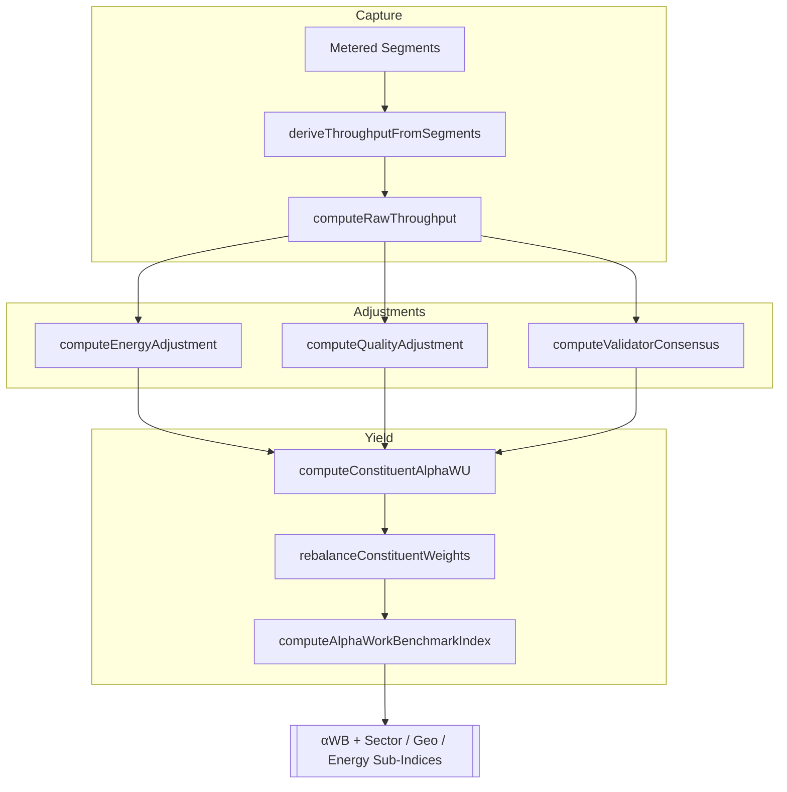

# α‑WU Benchmark (αWB) · Global Agent Productivity Blueprint

<!-- markdownlint-disable MD013 -->

> One comparable index for autonomous work, continuously adjusted for energy, quality, and validator consensus.

## Primer: why αWB exists

- **Unit of account (α‑WU):** 1 α‑WU equals a reference task bundle (doc-writing, code edits, research lookups, data transforms) at baseline difficulty and quality. Bundles rebalance quarterly to mirror live task mix without overfitting.
- **Economic signal:** Operators, buyers, and policymakers see the quality‑adjusted cost of autonomous work at a glance—think an “S&P 500 for autonomous work” priced in α‑WU.
- **Owner control:** Baselines, caps, divisors, and validator penalties stay owner‑governed through `ALPHA_WB` env config and contract‑level pause/override controls.

## Computation Stack (Code)

`src/services/alphaBenchmark.js` implements the v0 calculus end to end:

1. **Raw throughput** — `computeRawThroughput`: tasks completed × Task Difficulty Coefficient (TDC). Difficulty comes from open rubrics (tokens processed, steps, tool calls, novelty).
2. **Energy adjustment (EA)** — `computeEnergyAdjustment`: `EA = cost_baseline / cost_observed`, clamped via `energyAdjustmentFloor`/`Cap` to avoid energy‑washing.
3. **Quality adjustment (QA)** — `computeQualityAdjustment`: `QA = quality_observed / quality_baseline`, winsorized by caps/floors. Quality is sourced from human evals, adversarial sets, and outcome metrics (bugs, NPS, hallucinations).
4. **Validator consensus (VC)** — `computeValidatorConsensus`: rewards reproducibility, penalizes slash rates and reproducibility penalties.
5. **Per‑constituent yield** — `computeConstituentAlphaWU`: `αWU_i = Raw × EA × QA × VC`.
6. **Weighting** — `rebalanceConstituentWeights`: free‑float work share with diversification caps/floors and automatic normalization.
7. **Headline index** — `computeAlphaWorkBenchmarkIndex`: `αWB_t = Σ(weight_i × αWU_i) / baseDivisor`, with sector/geo/energy sub‑indices enabled by labels.
8. **Metering bridge** — `deriveThroughputFromSegments`: aggregates metering snapshots into TDC inputs using quality multipliers as difficulty hints.



## Configuration Surface (`ALPHA_WB`)

Supply JSON via env—no code edits needed:

```bash
export ALPHA_WB='{
  "baselineEnergyCostPerKwh": 0.12,
  "baselineEnergyPerAlphaWU": 1.0,
  "baselineQuality": 1.0,
  "baselineConsensus": 0.99,
  "energyAdjustmentFloor": 0.65,
  "energyAdjustmentCap": 1.25,
  "qualityAdjustmentFloor": 0.6,
  "qualityAdjustmentCap": 1.5,
  "consensusAdjustmentFloor": 0.8,
  "consensusAdjustmentCap": 1.05,
  "rebalanceCap": 0.15,
  "rebalanceFloor": 0.01,
  "smoothingWindowDays": 90,
  "baseDivisor": 1000
}'
```

Validation rules (see `src/config/schema.js`): floors must not exceed caps (energy, quality, consensus, weights); `baselineConsensus` is bounded (≤ 1.5); divisors and smoothing windows are positive integers.

## Index construction & governance

- **Constituents:** Representative autonomous work providers (foundational agents, vertical services, on‑prem orchestrations) with published inclusion criteria and quarterly rebalancing.
- **Weights:** Free‑float work share over rolling 90 days with diversification caps (e.g., 15% max) and minimum presence floors.
- **Sector & geo slices:** Optional sector/geo/energy/compliance sub‑indices use the same math on filtered constituent sets.
- **Validator consensus:** Independent validators re‑run samples under deterministic seeds/tooling; slash events reduce VC and trigger governance hooks.
- **Owner levers:** Baselines, caps, divisors, smoothing windows, and validator penalties are owner-set via environment/contract controls; pausing freezes issuance/acceptance when needed.

## Anti‑gaming defenses

- Hidden gold tasks, replay audits, and randomized audit windows.
- Cost attestation cross‑checks (utility bills or cloud invoices) to validate energy claims.
- Caps on EA/QA multipliers; clawbacks for misreporting via slash events.
- Anomaly detection on latency, cache hit rates, and tool API patterns.

## Minimal math (readable)

- **Cost‑per‑α‑WU (CPA):** `CPA = EnergyCost/αWU + PlatformFees/αWU`
- **Quality‑adjusted price:** `QAP = CPA / QA`
- **Sector index:** same headline formula, limited to sector constituents.

## MVP rollout (fast path)

1. Publish v0 spec with the reference task bundle and scoring rubrics.
2. Onboard 5–10 diverse providers; run 30‑day shadow audits.
3. Release **αWB‑Daily**, plus sector sub‑indices and a public dashboard.
4. Iterate caps/multipliers from live variance data; lock v1.0 after 90 days.

## Usage Examples

### Compute a constituent yield

```js
import { computeConstituentAlphaWU } from './src/services/alphaBenchmark.js';

const alphaYield = computeConstituentAlphaWU({
  label: 'validator-fleet-1',
  tasksCompleted: 240,
  taskDifficultyCoefficient: 1.15,
  energyKwhPerAlphaWU: 0.92,
  energyCostPerKwh: 0.11,
  qualityScore: 1.08,
  consensusRate: 0.99,
  reproducibilityPenalty: 0.01
});
```

### Build the headline index

```js
import { computeAlphaWorkBenchmarkIndex } from './src/services/alphaBenchmark.js';

const { alphaWB, constituents } = computeAlphaWorkBenchmarkIndex([
  {
    label: 'Fleet-A',
    tasksCompleted: 200,
    taskDifficultyCoefficient: 1.05,
    energyKwhPerAlphaWU: 0.9,
    energyCostPerKwh: 0.1,
    qualityScore: 1.1,
    consensusRate: 0.995
  },
  {
    label: 'Fleet-B',
    tasksCompleted: 140,
    taskDifficultyCoefficient: 0.95,
    energyKwhPerAlphaWU: 1.3,
    energyCostPerKwh: 0.14,
    qualityScore: 0.96,
    consensusRate: 0.93,
    workShare: 0.25
  }
]);
```

### Anchor to metering segments

```js
import { deriveThroughputFromSegments } from './src/services/alphaBenchmark.js';
import { getSegmentsSnapshot } from './src/services/metering.js';

const throughput = deriveThroughputFromSegments(getSegmentsSnapshot());
```

## Outcomes

- **Operators:** Track ROI of agent fleets versus energy spend (Cost‑per‑α‑WU, Quality‑Adjusted Price).
- **Buyers:** Compare providers on cost‑per‑α‑WU with transparent QA + VC scoring.
- **Policy / infra:** Observe how grid prices and hardware efficiency shift real AI productivity in near real time.

The αWB spine turns heterogeneous agent swarms into a single, tamper‑resistant productivity signal—ready for dashboards, smart‑contracts, and exchange‑grade dissemination.
