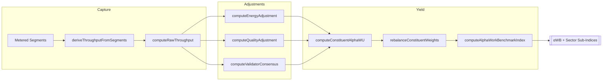

# α‑WU Benchmark (αWB) · Global Agent Productivity Blueprint

<!-- markdownlint-disable MD013 -->

> One comparable index for autonomous work, continuously adjusted for energy, quality, and validator consensus.

## Why αWB exists

- **Unit of account (α‑WU):** 1 α‑WU equals a reference task bundle at baseline difficulty and quality. Bundles rebalance
  quarterly to mirror live task mix without overfitting.
- **Economic signal:** Operators, buyers, and policymakers see the quality‑adjusted cost of autonomous work at a glance.
- **Owner control:** Baselines, caps, divisors, and validator penalties stay owner‑governed through `ALPHA_WB` env config and
  contract‑level pause/override controls.

## Computation Stack (Code)

`src/services/alphaBenchmark.js` implements the v0 calculus:

- `computeRawThroughput` — tasks completed × Task Difficulty Coefficient (TDC).
- `computeEnergyAdjustment` — `EA = cost_baseline / cost_observed`, clamped to anti‑gaming bounds.
- `computeQualityAdjustment` — `QA = quality_observed / quality_baseline`, winsorized for stability.
- `computeValidatorConsensus` — reproducibility/penalty aware consensus factor (`VC`).
- `computeConstituentAlphaWU` — `αWU_i = Raw × EA × QA × VC`.
- `rebalanceConstituentWeights` — free‑float work‑share weights with diversification caps and floors.
- `computeAlphaWorkBenchmarkIndex` — headline `αWB_t = Σ(weight_i × αWU_i) / baseDivisor`.
- `deriveThroughputFromSegments` — bridges metering segments into TDC inputs (uses quality multipliers as difficulty hints).

## Data Plane



- **Energy telemetry:** kWh per α‑WU plus regional energy prices feed `EA`, rewarding efficiency without allowing runaway
  multipliers.
- **Quality telemetry:** human evals, adversarial suites, and outcome metrics roll into `QA`, winsorized to avoid outlier spikes.
- **Validator consensus:** independent replays and slash rates tune `VC`, incentivising reproducibility and honest reporting.

## Configuration Surface (`ALPHA_WB`)

Supply JSON via env—no code edits needed:

```bash
export ALPHA_WB='{
  "baselineEnergyCostPerKwh": 0.12,
  "baselineEnergyPerAlphaWU": 1.0,
  "baselineQuality": 1.0,
  "baselineConsensus": 0.99,
  "energyAdjustmentFloor": 0.65,
  "energyAdjustmentCap": 1.25,
  "qualityAdjustmentFloor": 0.6,
  "qualityAdjustmentCap": 1.5,
  "consensusAdjustmentFloor": 0.8,
  "consensusAdjustmentCap": 1.05,
  "rebalanceCap": 0.15,
  "rebalanceFloor": 0.01,
  "smoothingWindowDays": 90,
  "baseDivisor": 1000
}'
```

Validation rules (see `src/config/schema.js`):

- Floors must not exceed caps (energy, quality, consensus, weights).
- `baselineConsensus` is sanity‑bounded (≤ 1.5) to prevent runaway scores.
- Divisors and smoothing windows must be positive integers.

## Usage Examples

### Compute a constituent yield

```js
import { computeConstituentAlphaWU } from './src/services/alphaBenchmark.js';

const alphaYield = computeConstituentAlphaWU({
  label: 'validator-fleet-1',
  tasksCompleted: 240,
  taskDifficultyCoefficient: 1.15,
  energyKwhPerAlphaWU: 0.92,
  energyCostPerKwh: 0.11,
  qualityScore: 1.08,
  consensusRate: 0.99,
  reproducibilityPenalty: 0.01
});
```

### Build the headline index

```js
import { computeAlphaWorkBenchmarkIndex } from './src/services/alphaBenchmark.js';

const { alphaWB, constituents } = computeAlphaWorkBenchmarkIndex([
  {
    label: 'Fleet-A',
    tasksCompleted: 200,
    taskDifficultyCoefficient: 1.05,
    energyKwhPerAlphaWU: 0.9,
    energyCostPerKwh: 0.1,
    qualityScore: 1.1,
    consensusRate: 0.995
  },
  {
    label: 'Fleet-B',
    tasksCompleted: 140,
    taskDifficultyCoefficient: 0.95,
    energyKwhPerAlphaWU: 1.3,
    energyCostPerKwh: 0.14,
    qualityScore: 0.96,
    consensusRate: 0.93,
    workShare: 0.25
  }
]);
```

### Anchor to metering segments

```js
import { deriveThroughputFromSegments } from './src/services/alphaBenchmark.js';
import { getSegmentsSnapshot } from './src/services/metering.js';

const throughput = deriveThroughputFromSegments(getSegmentsSnapshot());
```

## Governance + Anti‑Gaming

- **Owner override:** Pausing, validator rotation, staking posture, and benchmark baselines remain owner‑controlled. No
  unauthorized caller can issue or accept α‑WU records (`AlphaNodeManager.sol`).
- **Caps & winsorization:** Every multiplier is clamped to prevent energy‑washing or quality inflation.
- **Validator slashing hooks:** Non‑reproducible results can be penalized through slashing events while consensus weights adjust
  dynamically.

## Outcomes

- **Operators:** Track ROI of agent fleets versus energy spend (Cost‑per‑α‑WU, Quality‑Adjusted Price).
- **Buyers:** Compare providers on cost‑per‑α‑WU with transparent QA + VC scoring.
- **Policy / infra:** Observe how grid prices and hardware efficiency shift real AI productivity in near real time.

The αWB spine turns heterogeneous agent swarms into a single, tamper‑resistant productivity signal—ready for dashboards,
smart‑contracts, and exchange‑grade dissemination.
