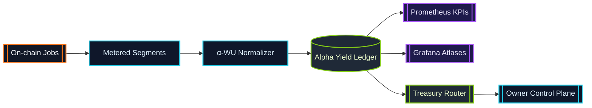

# α-Work Units (α-WU) · Canonical Metering Frame

> α-WU translate heterogeneous GPU execution into a single sovereign ledger.
> Every validator, enclave, and device routes through this metering spine.

## Definition

An α-work unit is the canonical measure of productive compute produced by an
AGI Alpha Node job segment. Each segment is captured as a structured payload:

```json
{
  "jobId": "0x-job-hash",
  "providerLabel": "enclave-eu-west-2",
  "deviceClass": "H100-80GB",
  "vramTier": "TIER_80",
  "modelClass": "LLM_70B",
  "slaProfile": "LOW_LATENCY_ENCLAVE",
  "startedAt": "2024-07-12T14:03:12.000Z",
  "endedAt": "2024-07-12T14:23:12.000Z",
  "gpuMinutes": 20,
  "qualityMultiplier": 2.0,
  "alphaWU": 40
}
```

* **gpuMinutes** – Wall-clock minutes of dedicated GPU time.
* **qualityMultiplier** – Composite multiplier derived from model class, VRAM
  tier, SLA profile, and device benchmark weighting.
* **alphaWU** – Deterministic product `gpuMinutes × qualityMultiplier`.

The base unit (`α-WU = 1`) is defined in
[`src/constants/workUnits.js`](../src/constants/workUnits.js) and can be
re-weighted through configuration.

Programmatic consumers can generate deterministic quality multipliers using
[`calculateQualityMultiplier`](../src/constants/workUnits.js) and feed the
result into [`computeAlphaWorkUnits`](../src/constants/workUnits.js):

```js
import {
  calculateQualityMultiplier,
  computeAlphaWorkUnits
} from '../src/constants/workUnits.js';

const qualityMultiplier = calculateQualityMultiplier({
  modelClass: 'LLM_70B',
  vramTier: 'TIER_80',
  slaProfile: 'LOW_LATENCY_ENCLAVE',
  deviceClass: 'H100-80GB'
});

const alphaWU = computeAlphaWorkUnits({ gpuMinutes: 20, qualityMultiplier });
```

Custom configurations returned from
[`cloneDefaultWorkUnitConfig`](../src/constants/workUnits.js) can be passed as a
second argument to `calculateQualityMultiplier` to apply bespoke weights while
preserving deterministic validation rules.

## Canonical Weights

| Dimension | Enum | Default Weight |
| --- | --- | --- |
| Model Class | `LLM_8B` | `1.0` |
| Model Class | `LLM_70B` | `4.2` |
| Model Class | `DIFFUSION_XL` | `1.8` |
| Model Class | `MULTIMODAL_ROUTER` | `2.6` |
| Model Class | `RESEARCH_AGENT` | `2.1` |
| VRAM Tier | `TIER_16` | `1.0` |
| VRAM Tier | `TIER_24` | `1.35` |
| VRAM Tier | `TIER_48` | `1.85` |
| VRAM Tier | `TIER_80` | `2.3` |
| SLA Profile | `STANDARD` | `1.0` |
| SLA Profile | `LOW_LATENCY_ENCLAVE` | `2.0` |
| SLA Profile | `HIGH_REDUNDANCY` | `1.7` |
| SLA Profile | `TRUSTED_EXECUTION` | `2.4` |

Benchmark weights (OctaneBench-style device multipliers) live alongside the
canonical tables and can be extended without code changes.

## Example Calculation

For a 20-minute job executed on an 80 GB VRAM device, running a 70B parameter
language model within a low-latency enclave, the α-WU calculation follows:

1. **GPU Minutes:** `20`
2. **Multipliers:**
   * Model class `LLM_70B` ⇒ weight `4.2`
   * VRAM tier `TIER_80` ⇒ weight `2.3`
   * SLA profile `LOW_LATENCY_ENCLAVE` ⇒ weight `2.0`
   * Device benchmark `H100-80GB` ⇒ weight `1.45`
3. **Quality Multiplier:** `4.2 × 2.3 × 2.0 × 1.45 = 28.014`
4. **α-WU:** `20 × 28.014 = 560.28`

The runtime uses the quality multiplier to normalize credit issuance, treasury
routing, and KPI dashboards. By default, the resulting α-WU ledger is
aggregated in 900-second epochs to feed Prometheus metrics and staking rewards.

## Environment-Derived Inputs

Alpha metering is driven entirely by runtime environment metadata so operators
can plug hardware into the lattice without editing code. The computation chain
is deliberately redundant—every hop revalidates inputs before moving forward so
bad metadata cannot pollute the α-WU ledger.

### Computation Pipeline (device → SLA → α-WU)

1. **Ingest device profile** — [`getDeviceInfo`](../src/services/executionContext.js)
   inspects `PROVIDER_LABEL`, `GPU_MODEL`, `GPU_VRAM_GB`, and `GPU_COUNT`
   (including aliases) to normalize the provider label, resolve VRAM tiers, and
   clamp GPU counts to safe defaults.【F:src/services/executionContext.js†L76-L104】
2. **Derive SLA profile** — [`getSlaProfile`](../src/services/executionContext.js)
   fuses job payload hints, runtime overrides, environment defaults, and tag
   metadata to yield a deterministic SLA enum. When no override is provided the
   profile falls back to `STANDARD`, preventing null multipliers.【F:src/services/executionContext.js†L106-L140】
3. **Bind runtime segment** — [`bindExecutionLoopMetering`](../src/orchestrator/nodeRuntime.js)
   hands both device info and SLA/model metadata into
   [`startSegment`](../src/services/metering.js) the instant a lifecycle step
   begins. Each segment is stamped with provider label, job ID, epoch index,
   and SLA guarantee for later auditing.【F:src/orchestrator/nodeRuntime.js†L414-L470】【F:src/services/metering.js†L232-L274】
4. **Compute deterministic α-WU** — [`stopSegment`](../src/services/metering.js)
   closes the segment, multiplies rounded GPU-minutes by the quality multiplier
   derived from the device/SLA/model tuple, and stores the result alongside the
   ledger/telemetry updates.【F:src/services/metering.js†L275-L352】

Device metadata can be overridden per invocation by passing a `deviceInfo`
object to `bindExecutionLoopMetering`, making blue/green hardware swaps instant
and fully auditable.【F:src/orchestrator/nodeRuntime.js†L414-L470】

## Configuration Surface

The weights and aggregation cadence can be tuned via the `WORK_UNITS`
configuration block (JSON or object). Example environment override:

```bash
export WORK_UNITS='{
  "baseUnit": 1,
  "epochDurationSeconds": 1800,
  "weights": {
    "modelClass": {
      "LLM_70B": 5.0
    },
    "vramTier": {
      "TIER_80": 2.6
    },
    "slaProfile": {
      "LOW_LATENCY_ENCLAVE": 2.5
    }
  }
}'
```

Invalid or negative weights are rejected at load time by
[`src/config/schema.js`](../src/config/schema.js), ensuring every node instance
maintains deterministic α-WU accounting.

## Aggregation Epochs

Aggregation windows (`epochDurationSeconds`) represent the rolling cadence for
KPI snapshots, staking adjustments, and governance telemetry. Increasing the
epoch reduces churn in dashboards; decreasing it improves responsiveness for
anomaly detection. The default epoch is 900 seconds (15 minutes).

## Lifecycle Flow



*Segments flow through the α-WU normalizer, receive deterministic weighting,
and persist into the ledger that powers dashboards, staking economics, and
treasury automations.*

## Interpreting α-WU Telemetry

Prometheus exports a dedicated α-WU namespace alongside the default runtime
metrics. Each metric is emitted twice (`agi_alpha_node_*` for namespaced
compatibility and the neutral `alpha_wu_*` series) so both legacy dashboards
and modern ones can ingest the stream.【F:src/telemetry/monitoring.js†L173-L252】

* **`agi_alpha_node_alpha_wu_total` / `alpha_wu_total`** — Counter keyed by
  `node`; tracks lifetime α-WU and updates as segments close.【F:src/telemetry/monitoring.js†L34-L88】
* **`agi_alpha_node_alpha_wu_epoch` / `alpha_wu_epoch`** — Gauge keyed by
  `node` + `epochId`; mirrors metering buckets for Grafana parity.【F:src/telemetry/monitoring.js†L90-L142】
* **`agi_alpha_node_alpha_wu_acceptance_rate`** — Gauge keyed by `window`;
  sliding acceptance probability from the lifecycle engine.【F:src/telemetry/monitoring.js†L173-L220】
* **`agi_alpha_node_alpha_wu_on_time_p95_seconds`** — Gauge keyed by `window`;
  p95 completion latency for the active observation window.【F:src/telemetry/monitoring.js†L173-L220】
* **`agi_alpha_node_alpha_wu_slash_adjusted_yield`** — Gauge keyed by
  `window`; yield after slashing adjustments for treasury dashboards.【F:src/telemetry/monitoring.js†L173-L220】
* **`agi_alpha_node_alpha_wu_quality`** — Gauge keyed by `window` +
  `dimension` + `key`; quality per model/SLA/device cohort, matching weight
  enums.【F:src/telemetry/monitoring.js†L221-L252】
* **`agi_alpha_node_alpha_wu_breakdown`** — Gauge keyed by `window` +
  `dimension` + `metric` + `key`; structured KPI slices (e.g., α-WU by SLA or
  provider).【F:src/telemetry/monitoring.js†L221-L252】

Dashboards can mix these metrics with the `/status` surfaces (below) to cross
validate totals against exported JSON before funds move.

## Status API α-WU Fields

The HTTP control plane projects the live α-WU ledger for humans and bots
alike.【F:src/network/apiServer.js†L948-L1007】 Use these surfaces to prove the
numbers Prometheus is reporting:

```jsonc
// GET /status
{
  "status": "ok",
  "offlineMode": false,
  "alphaWU": {
    "lifetimeAlphaWU": 12894.72,
    "lastEpoch": {
      "id": "epoch-1844674407",
      "alphaWU": 512.4
    }
  }
}

// GET /status/diagnostics
{
  "status": "ok",
  "offlineMode": false,
  "alphaWU": {
    "lifetimeAlphaWU": 12894.72,
    "epochs": [
      {
        "id": "epoch-1844674407",
        "alphaWU": 512.4,
        "startedAt": "2024-07-12T14:00:00.000Z",
        "endedAt": "2024-07-12T14:15:00.000Z",
        "byJob": {
          "job-1": 212.4
        },
        "byDeviceClass": {
          "H100-80GB": 512.4
        },
        "bySlaProfile": {
          "LOW_LATENCY_ENCLAVE": 512.4
        }
      }
    ],
    "totals": {
      "byJob": {
        "job-1": 1024.8
      },
      "byDeviceClass": {
        "H100-80GB": 12894.72
      },
      "bySlaProfile": {
        "LOW_LATENCY_ENCLAVE": 6400.12
      }
    }
  }
}
```

`/status` provides a fast heartbeat plus the latest epoch fingerprint, while
`/status/diagnostics` aggregates the last 24 epochs and pre-computes breakdowns
operators typically feed into Grafana or settlement dashboards.【F:src/network/apiServer.js†L948-L1007】

## Oracle `export-epoch` JSON Schema

Settlement oracles call [`buildEpochPayload`](../src/services/oracleExport.js)
with a `[fromTs, toTs]` window to receive a deterministic export. The payload
is ready for direct submission to chain or off-chain clearinghouses.【F:src/services/oracleExport.js†L1-L204】【F:src/services/oracleExport.js†L205-L240】

```json
{
  "epochId": "epoch-4d4a0a9c6b51d3ac",
  "nodeLabel": "fra1-h100",
  "window": {
    "from": "2024-07-12T14:00:00.000Z",
    "to": "2024-07-12T14:15:00.000Z"
  },
  "totals": {
    "alphaWU": 512.4
  },
  "breakdown": {
    "byProvider": {
      "fra1-h100": {
        "alphaWU": 512.4,
        "gpuMinutes": 228.57142857
      }
    },
    "byJob": {
      "job-1": {
        "alphaWU": 212.4,
        "gpuMinutes": 94.28571428
      }
    },
    "byDeviceClass": {
      "H100-80GB": 512.4
    },
    "bySlaProfile": {
      "LOW_LATENCY_ENCLAVE": 512.4
    }
  }
}
```

Hashing is deterministic, GPU minutes are rounded to eight decimals, and
provider labels are case-normalized so downstream contracts do not need
additional validation.【F:src/services/oracleExport.js†L40-L120】【F:src/services/oracleExport.js†L205-L240】
