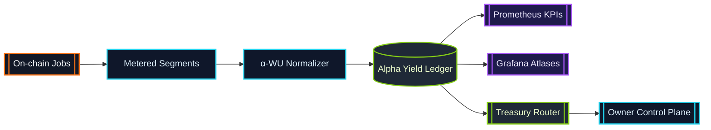

# α-Work Units (α-WU) · Canonical Metering Frame

> α-WU translate heterogeneous GPU execution into a single sovereign ledger.
> Every validator, enclave, and device routes through this metering spine.

## Definition

An α-work unit is the canonical measure of productive compute produced by an
AGI Alpha Node job segment. Each segment is captured as a structured payload:

```json
{
  "jobId": "0x-job-hash",
  "providerLabel": "enclave-eu-west-2",
  "deviceClass": "H100-80GB",
  "vramTier": "TIER_80",
  "modelClass": "LLM_70B",
  "slaProfile": "LOW_LATENCY_ENCLAVE",
  "startedAt": "2024-07-12T14:03:12.000Z",
  "endedAt": "2024-07-12T14:23:12.000Z",
  "gpuMinutes": 20,
  "qualityMultiplier": 2.0,
  "alphaWU": 40
}
```

* **gpuMinutes** – Wall-clock minutes of dedicated GPU time.
* **qualityMultiplier** – Composite multiplier derived from model class, VRAM
  tier, SLA profile, and device benchmark weighting.
* **alphaWU** – Deterministic product `gpuMinutes × qualityMultiplier`.

The base unit (`α-WU = 1`) is defined in
[`src/constants/workUnits.js`](../src/constants/workUnits.js) and can be
re-weighted through configuration.

## Canonical Weights

| Dimension | Enum | Default Weight |
| --- | --- | --- |
| Model Class | `LLM_8B` | `1.0` |
| Model Class | `LLM_70B` | `4.2` |
| Model Class | `DIFFUSION_XL` | `1.8` |
| Model Class | `MULTIMODAL_ROUTER` | `2.6` |
| Model Class | `RESEARCH_AGENT` | `2.1` |
| VRAM Tier | `TIER_16` | `1.0` |
| VRAM Tier | `TIER_24` | `1.35` |
| VRAM Tier | `TIER_48` | `1.85` |
| VRAM Tier | `TIER_80` | `2.3` |
| SLA Profile | `STANDARD` | `1.0` |
| SLA Profile | `LOW_LATENCY_ENCLAVE` | `2.0` |
| SLA Profile | `HIGH_REDUNDANCY` | `1.7` |
| SLA Profile | `TRUSTED_EXECUTION` | `2.4` |

Benchmark weights (OctaneBench-style device multipliers) live alongside the
canonical tables and can be extended without code changes.

## Example Calculation

For a 20-minute job executed on an 80 GB VRAM device, running a 70B parameter
language model within a low-latency enclave, the α-WU calculation follows:

1. **GPU Minutes:** `20`
2. **Multipliers:**
   * Model class `LLM_70B` ⇒ weight `4.2`
   * VRAM tier `TIER_80` ⇒ weight `2.3`
   * SLA profile `LOW_LATENCY_ENCLAVE` ⇒ weight `2.0`
   * Device benchmark `H100-80GB` ⇒ weight `1.45`
3. **Quality Multiplier:** `4.2 × 2.3 × 2.0 × 1.45 = 28.014`
4. **α-WU:** `20 × 28.014 = 560.28`

The runtime uses the quality multiplier to normalize credit issuance, treasury
routing, and KPI dashboards. By default, the resulting α-WU ledger is
aggregated in 900-second epochs to feed Prometheus metrics and staking rewards.

## Configuration Surface

The weights and aggregation cadence can be tuned via the `WORK_UNITS`
configuration block (JSON or object). Example environment override:

```bash
export WORK_UNITS='{
  "baseUnit": 1,
  "epochDurationSeconds": 1800,
  "weights": {
    "modelClass": {
      "LLM_70B": 5.0
    },
    "vramTier": {
      "TIER_80": 2.6
    },
    "slaProfile": {
      "LOW_LATENCY_ENCLAVE": 2.5
    }
  }
}'
```

Invalid or negative weights are rejected at load time by
[`src/config/schema.js`](../src/config/schema.js), ensuring every node instance
maintains deterministic α-WU accounting.

## Aggregation Epochs

Aggregation windows (`epochDurationSeconds`) represent the rolling cadence for
KPI snapshots, staking adjustments, and governance telemetry. Increasing the
epoch reduces churn in dashboards; decreasing it improves responsiveness for
anomaly detection. The default epoch is 900 seconds (15 minutes).

## Lifecycle Flow



*Segments flow through the α-WU normalizer, receive deterministic weighting,
and persist into the ledger that powers dashboards, staking economics, and
treasury automations.*
