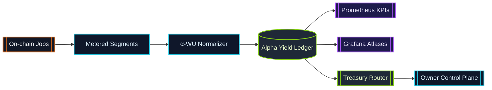

# α-Work Units (α-WU) · Canonical Metering Frame

> α-WU translate heterogeneous GPU execution into a single sovereign ledger.
> Every validator, enclave, and device routes through this metering spine.

## Definition

An α-work unit is the canonical measure of productive compute produced by an
AGI Alpha Node job segment. Each segment is captured as a structured payload:

```json
{
  "jobId": "0x-job-hash",
  "providerLabel": "enclave-eu-west-2",
  "deviceClass": "H100-80GB",
  "vramTier": "TIER_80",
  "modelClass": "LLM_70B",
  "slaProfile": "LOW_LATENCY_ENCLAVE",
  "startedAt": "2024-07-12T14:03:12.000Z",
  "endedAt": "2024-07-12T14:23:12.000Z",
  "gpuMinutes": 20,
  "qualityMultiplier": 2.0,
  "alphaWU": 40
}
```

* **gpuMinutes** – Wall-clock minutes of dedicated GPU time.
* **qualityMultiplier** – Composite multiplier derived from model class, VRAM
  tier, SLA profile, and device benchmark weighting.
* **alphaWU** – Deterministic product `gpuMinutes × qualityMultiplier`.

The base unit (`α-WU = 1`) is defined in
[`src/constants/workUnits.js`](../src/constants/workUnits.js) and can be
re-weighted through configuration.

Programmatic consumers can generate deterministic quality multipliers using
[`calculateQualityMultiplier`](../src/constants/workUnits.js) and feed the
result into [`computeAlphaWorkUnits`](../src/constants/workUnits.js):

```js
import {
  calculateQualityMultiplier,
  computeAlphaWorkUnits
} from '../src/constants/workUnits.js';

const qualityMultiplier = calculateQualityMultiplier({
  modelClass: 'LLM_70B',
  vramTier: 'TIER_80',
  slaProfile: 'LOW_LATENCY_ENCLAVE',
  deviceClass: 'H100-80GB'
});

const alphaWU = computeAlphaWorkUnits({ gpuMinutes: 20, qualityMultiplier });
```

Custom configurations returned from
[`cloneDefaultWorkUnitConfig`](../src/constants/workUnits.js) can be passed as a
second argument to `calculateQualityMultiplier` to apply bespoke weights while
preserving deterministic validation rules.

## Canonical Weights

| Dimension | Enum | Default Weight |
| --- | --- | --- |
| Model Class | `LLM_8B` | `1.0` |
| Model Class | `LLM_70B` | `4.2` |
| Model Class | `DIFFUSION_XL` | `1.8` |
| Model Class | `MULTIMODAL_ROUTER` | `2.6` |
| Model Class | `RESEARCH_AGENT` | `2.1` |
| VRAM Tier | `TIER_16` | `1.0` |
| VRAM Tier | `TIER_24` | `1.35` |
| VRAM Tier | `TIER_48` | `1.85` |
| VRAM Tier | `TIER_80` | `2.3` |
| SLA Profile | `STANDARD` | `1.0` |
| SLA Profile | `LOW_LATENCY_ENCLAVE` | `2.0` |
| SLA Profile | `HIGH_REDUNDANCY` | `1.7` |
| SLA Profile | `TRUSTED_EXECUTION` | `2.4` |

Benchmark weights (OctaneBench-style device multipliers) live alongside the
canonical tables and can be extended without code changes.

## Example Calculation

For a 20-minute job executed on an 80 GB VRAM device, running a 70B parameter
language model within a low-latency enclave, the α-WU calculation follows:

1. **GPU Minutes:** `20`
2. **Multipliers:**
   * Model class `LLM_70B` ⇒ weight `4.2`
   * VRAM tier `TIER_80` ⇒ weight `2.3`
   * SLA profile `LOW_LATENCY_ENCLAVE` ⇒ weight `2.0`
   * Device benchmark `H100-80GB` ⇒ weight `1.45`
3. **Quality Multiplier:** `4.2 × 2.3 × 2.0 × 1.45 = 28.014`
4. **α-WU:** `20 × 28.014 = 560.28`

The runtime uses the quality multiplier to normalize credit issuance, treasury
routing, and KPI dashboards. By default, the resulting α-WU ledger is
aggregated in 900-second epochs to feed Prometheus metrics and staking rewards.

## Environment-Derived Inputs

Alpha metering is driven entirely by runtime environment metadata so operators
can plug hardware into the lattice without editing code. The computation chain
is deliberately redundant—every hop revalidates inputs before moving forward so
bad metadata cannot pollute the α-WU ledger.

### Environment Surfaces → Deterministic Inputs

* **Provider identity** (`PROVIDER_LABEL`, `NODE_LABEL`, `DEVICE_LABEL`) →
  `providerLabel`
  * Empty strings collapse to `null`, preserving ledger clarity when a label is
    intentionally hidden.【F:src/services/executionContext.js†L52-L82】
* **Device model** (`GPU_MODEL`, `GPU_NAME`, `GPU_TYPE`) → `deviceClass`
  * SKU names remain unchanged so downstream policy can map canonical IDs.
  * Missing data resolves to `null`, keeping segments tracked with safe
    defaults in the ledger.【F:src/services/executionContext.js†L52-L82】
  * Metering snapshots mirror the same normalization to prevent drift across
    telemetry and settlements.【F:src/services/metering.js†L232-L324】
* **VRAM tier** (`GPU_VRAM_GB`, `GPU_MEMORY_GB`) → `vramTier` / `vramGb`
  * VRAM is parsed as a float, then mapped onto canonical tiers (`TIER_16` …
    `TIER_80`). Invalid or negative values produce `null` so the meter never
    trusts corrupted telemetry.【F:src/services/executionContext.js†L13-L50】
* **GPU count** (`GPU_COUNT`, `GPU_INSTANCES`, `GPU_SLOTS`) → `gpuCount`
  * Values are clamped to integers ≥ 1 so fractional or zero counts cannot leak
    into α-WU totals.【F:src/services/executionContext.js†L52-L82】
* **SLA defaults** (`DEFAULT_SLA_PROFILE`, runtime overrides, job tags) →
  `slaProfile`
  * Profiles are normalized via alias tables (`LOW_LATENCY`, `TE`, etc.).
  * When overrides are absent they default to
    `STANDARD`.【F:src/services/executionContext.js†L84-L140】

### Computation Pipeline (device → SLA → α-WU)

1. **Ingest device profile** —
   [`getDeviceInfo`](../src/services/executionContext.js) inspects provider and
   GPU environment variables (plus aliases) to normalize the device tuple before
   any metering begins.【F:src/services/executionContext.js†L13-L82】
2. **Derive SLA profile** —
   [`getSlaProfile`](../src/services/executionContext.js) fuses job payload
   hints, runtime overrides, environment defaults, and tag metadata to yield a
    deterministic SLA enum. When no override is provided the profile falls back
    to `STANDARD` by default.【F:src/services/executionContext.js†L84-L140】
    This guard removes null multipliers.
3. **Bind runtime segment** —
   [`bindExecutionLoopMetering`](../src/orchestrator/nodeRuntime.js) hands both
   device info and SLA/model metadata into
   [`startSegment`](../src/services/metering.js) the instant a lifecycle step
   begins. Each segment is stamped with provider label, job ID, and epoch index
   for auditing.【F:src/orchestrator/nodeRuntime.js†L414-L470】
    * Metering snapshots persist the SLA guarantees alongside device metadata so
      telemetry stays aligned.【F:src/services/metering.js†L232-L324】
4. **Compute deterministic α-WU** —
   [`stopSegment`](../src/services/metering.js) closes the segment, multiplies
   rounded GPU-minutes by the quality multiplier derived from the
   device/SLA/model tuple, and stores the result alongside the telemetry
   updates.【F:src/services/metering.js†L274-L352】

Device metadata can be overridden per invocation by passing a `deviceInfo`
object to `bindExecutionLoopMetering`, making blue/green hardware swaps instant
and fully auditable.【F:src/orchestrator/nodeRuntime.js†L414-L470】

## Configuration Surface

The weights and aggregation cadence can be tuned via the `WORK_UNITS`
configuration block (JSON or object). Example environment override:

```bash
export WORK_UNITS='{
  "baseUnit": 1,
  "epochDurationSeconds": 1800,
  "weights": {
    "modelClass": {
      "LLM_70B": 5.0
    },
    "vramTier": {
      "TIER_80": 2.6
    },
    "slaProfile": {
      "LOW_LATENCY_ENCLAVE": 2.5
    }
  }
}'
```

Invalid or negative weights are rejected at load time by
[`src/config/schema.js`](../src/config/schema.js), ensuring every node instance
maintains deterministic α-WU accounting.

## Aggregation Epochs

Aggregation windows (`epochDurationSeconds`) represent the rolling cadence for
KPI snapshots, staking adjustments, and governance telemetry. Increasing the
epoch reduces churn in dashboards; decreasing it improves responsiveness for
anomaly detection. The default epoch is 900 seconds (15 minutes).

## Lifecycle Flow



*Segments flow through the α-WU normalizer, receive deterministic weighting,
and persist into the ledger that powers dashboards, staking economics, and
treasury automations.*

## Interpreting α-WU Telemetry

Prometheus exports a dedicated α-WU namespace alongside the default runtime
metrics. Each metric is emitted twice (`agi_alpha_node_*` for namespaced
compatibility and the neutral `alpha_wu_*` series) so both legacy dashboards
and modern ones can ingest the stream.【F:src/telemetry/monitoring.js†L173-L252】

### Prometheus Metric Catalogue

* **`agi_alpha_node_alpha_wu_total` / `alpha_wu_total`** — Counter keyed by
  `node`; increments whenever a segment closes, keeping lifetime α-WU accurate
  to two decimals.【F:src/telemetry/monitoring.js†L34-L112】
* **`agi_alpha_node_alpha_wu_epoch` / `alpha_wu_epoch`** — Gauge keyed by
  `node` + `epochId`; mirrors the ledger’s epoch buckets for Grafana overlays
  and paging playbooks.【F:src/telemetry/monitoring.js†L90-L176】
* **`agi_alpha_node_alpha_wu_per_job`** —
  Gauge keyed by `node` + `jobId`; keeps oracle parity totals.
  Evidence:【F:src/telemetry/monitoring.js†L123-L176】
* **`agi_alpha_node_alpha_wu_acceptance_rate`** —
  Gauge keyed by `window`; reports acceptance probability.
  Evidence:【F:src/telemetry/monitoring.js†L173-L220】
* **`agi_alpha_node_alpha_wu_on_time_p95_seconds`** —
  Gauge keyed by `window`; surfaces p95 completion latency.
  Evidence:【F:src/telemetry/monitoring.js†L173-L220】
* **`agi_alpha_node_alpha_wu_yield_per_minute`** —
  Gauge keyed by `window`; measures α-WU-per-minute efficiency.
  Evidence:【F:src/telemetry/monitoring.js†L173-L220】
* **`agi_alpha_node_alpha_wu_backlog_seconds`** —
  Gauge keyed by `window`; shows α-WU awaiting export.
  Evidence:【F:src/telemetry/monitoring.js†L173-L220】
* **`agi_alpha_node_alpha_wu_segments_open`** —
  Gauge keyed by `node`; exposes the live segment count.
  Evidence:【F:src/telemetry/monitoring.js†L123-L176】
* **`agi_alpha_node_alpha_wu_quality`** —
  Gauge keyed by `window`,`dimension`,`key`; projects per-dimension multipliers.
  Evidence:【F:src/telemetry/monitoring.js†L221-L252】
* **`agi_alpha_node_alpha_wu_breakdown`** —
  Gauge keyed by `window`,`dimension`,`metric`,`key`; emits oracle-ready KPIs.
  Evidence:【F:src/telemetry/monitoring.js†L221-L252】

All gauges and counters share the rounding helpers from the metering engine.
Dashboards stay jitter-free.【F:src/services/metering.js†L261-L352】

### Status API α-WU Fields

Both status endpoints project the live ledger without any additional
transformation, making them safe for readiness probes and downstream automation.

```jsonc
// GET /status
{
  "status": "ok",
  "offlineMode": false,
  "alphaWU": {
    "lifetimeAlphaWU": 12894.72,
    "lastEpoch": {
      "id": "epoch-1844674407",
      "alphaWU": 512.4
    }
  }
}

// GET /status/diagnostics
{
  "status": "ok",
  "offlineMode": false,
  "alphaWU": {
    "lifetimeAlphaWU": 12894.72,
    "epochs": [
      {
        "id": "epoch-1844674407",
        "alphaWU": 512.4,
        "startedAt": "2024-07-12T14:00:00.000Z",
        "endedAt": "2024-07-12T14:15:00.000Z",
        "byJob": {
          "job-1": 212.4
        },
        "byDeviceClass": {
          "H100-80GB": 512.4
        },
        "bySlaProfile": {
          "LOW_LATENCY_ENCLAVE": 512.4
        }
      }
    ],
    "totals": {
      "byJob": {
        "job-1": 1024.8
      },
      "byDeviceClass": {
        "H100-80GB": 12894.72
      },
      "bySlaProfile": {
        "LOW_LATENCY_ENCLAVE": 6400.12
      }
    }
  }
}
```

Field meanings:

* `status` — `ok` if the control plane is serving requests; non-200 responses
  flag policy gate issues.【F:src/network/apiServer.js†L932-L1017】
* `offlineMode` — mirrors orchestrator posture; `true` means the owner has
  compute paused; telemetry ok.【F:src/network/apiServer.js†L900-L1017】
* `alphaWU.lifetimeAlphaWU` — the canonical total from the ledger, identical to
  the Prometheus counter.【F:src/network/apiServer.js†L948-L1007】
* `alphaWU.lastEpoch` — most recent epoch fingerprint with deterministic `id`
  and α-WU subtotal for fast SLA audits.【F:src/network/apiServer.js†L948-L968】
* `alphaWU.epochs[]` — rolling 24-epoch export with sorted breakdowns that
  mirror the oracle payload schema.【F:src/network/apiServer.js†L968-L1007】

### Oracle `export-epoch` JSON Schema

The oracle export script (`scripts/oracle-export-epoch.mjs`) uses
`buildEpochPayload` to produce deterministic payloads for settlement smart
contracts.【F:src/services/oracleExport.js†L1-L205】 The exporter validates time
windows, normalizes provider labels, and sorts breakdown keys to guarantee
byte-for-byte reproducibility.【F:src/services/oracleExport.js†L33-L180】

```jsonc
{
  "epochId": "epoch-4d4a0a9c6b51d3ac",
  "nodeLabel": "fra1-h100",
  "window": {
    "from": "2024-07-12T14:00:00.000Z",
    "to": "2024-07-12T14:15:00.000Z"
  },
  "totals": {
    "alphaWU": 512.4
  },
  "breakdown": {
    "byProvider": {
      "fra1-h100": {
        "alphaWU": 512.4,
        "gpuMinutes": 228.57142857
      }
    },
    "byJob": {
      "job-1": {
        "alphaWU": 212.4,
        "gpuMinutes": 94.28571428
      }
    },
    "byDeviceClass": {
      "H100-80GB": 512.4
    },
    "bySlaProfile": {
      "LOW_LATENCY_ENCLAVE": 512.4
    }
  }
}
```

* **`epochId`** — Provided identifier or deterministic hash of the node label
  and time window.
  Collisions avoided.【F:src/services/oracleExport.js†L61-L90】
* **`window`** — ISO-8601 timestamps validated by `parseTimestamp`; inverted or
  malformed windows throw before export.【F:src/services/oracleExport.js†L1-L61】
  Parsing guard active.【F:src/services/oracleExport.js†L97-L110】
* **`totals.alphaWU`** — Rounded to eight decimals for byte-for-byte parity with
  settlement contracts.【F:src/services/oracleExport.js†L122-L205】
* **`breakdown.*`** — Sorted key/value objects so reproducible diffs and Merkle
  proofs can be generated off-node.【F:src/services/oracleExport.js†L122-L205】
