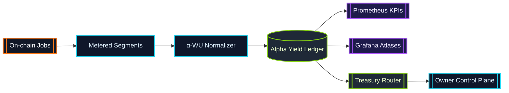

# α-Work Units (α-WU) · Canonical Metering Frame

> α-WU translate heterogeneous GPU execution into a single sovereign ledger.
> Every validator, enclave, and device routes through this metering spine.

## Definition

An α-work unit is the canonical measure of productive compute produced by an
AGI Alpha Node job segment. Each segment is captured as a structured payload:

```json
{
  "jobId": "0x-job-hash",
  "providerLabel": "enclave-eu-west-2",
  "deviceClass": "H100-80GB",
  "vramTier": "TIER_80",
  "modelClass": "LLM_70B",
  "slaProfile": "LOW_LATENCY_ENCLAVE",
  "startedAt": "2024-07-12T14:03:12.000Z",
  "endedAt": "2024-07-12T14:23:12.000Z",
  "gpuMinutes": 20,
  "qualityMultiplier": 2.0,
  "alphaWU": 40
}
```

* **gpuMinutes** – Wall-clock minutes of dedicated GPU time.
* **qualityMultiplier** – Composite multiplier derived from model class, VRAM
  tier, SLA profile, and device benchmark weighting.
* **alphaWU** – Deterministic product `gpuMinutes × qualityMultiplier`.

The base unit (`α-WU = 1`) is defined in
[`src/constants/workUnits.js`](../src/constants/workUnits.js) and can be
re-weighted through configuration.

Programmatic consumers can generate deterministic quality multipliers using
[`calculateQualityMultiplier`](../src/constants/workUnits.js) and feed the
result into [`computeAlphaWorkUnits`](../src/constants/workUnits.js):

```js
import {
  calculateQualityMultiplier,
  computeAlphaWorkUnits
} from '../src/constants/workUnits.js';

const qualityMultiplier = calculateQualityMultiplier({
  modelClass: 'LLM_70B',
  vramTier: 'TIER_80',
  slaProfile: 'LOW_LATENCY_ENCLAVE',
  deviceClass: 'H100-80GB'
});

const alphaWU = computeAlphaWorkUnits({ gpuMinutes: 20, qualityMultiplier });
```

Custom configurations returned from
[`cloneDefaultWorkUnitConfig`](../src/constants/workUnits.js) can be passed as a
second argument to `calculateQualityMultiplier` to apply bespoke weights while
preserving deterministic validation rules.

## Canonical Weights

| Dimension | Enum | Default Weight |
| --- | --- | --- |
| Model Class | `LLM_8B` | `1.0` |
| Model Class | `LLM_70B` | `4.2` |
| Model Class | `DIFFUSION_XL` | `1.8` |
| Model Class | `MULTIMODAL_ROUTER` | `2.6` |
| Model Class | `RESEARCH_AGENT` | `2.1` |
| VRAM Tier | `TIER_16` | `1.0` |
| VRAM Tier | `TIER_24` | `1.35` |
| VRAM Tier | `TIER_48` | `1.85` |
| VRAM Tier | `TIER_80` | `2.3` |
| SLA Profile | `STANDARD` | `1.0` |
| SLA Profile | `LOW_LATENCY_ENCLAVE` | `2.0` |
| SLA Profile | `HIGH_REDUNDANCY` | `1.7` |
| SLA Profile | `TRUSTED_EXECUTION` | `2.4` |

Benchmark weights (OctaneBench-style device multipliers) live alongside the
canonical tables and can be extended without code changes.

## Example Calculation

For a 20-minute job executed on an 80 GB VRAM device, running a 70B parameter
language model within a low-latency enclave, the α-WU calculation follows:

1. **GPU Minutes:** `20`
2. **Multipliers:**
   * Model class `LLM_70B` ⇒ weight `4.2`
   * VRAM tier `TIER_80` ⇒ weight `2.3`
   * SLA profile `LOW_LATENCY_ENCLAVE` ⇒ weight `2.0`
   * Device benchmark `H100-80GB` ⇒ weight `1.45`
3. **Quality Multiplier:** `4.2 × 2.3 × 2.0 × 1.45 = 28.014`
4. **α-WU:** `20 × 28.014 = 560.28`

The runtime uses the quality multiplier to normalize credit issuance, treasury
routing, and KPI dashboards. By default, the resulting α-WU ledger is
aggregated in 900-second epochs to feed Prometheus metrics and staking rewards.

## Environment-Derived Inputs

Alpha metering is driven entirely by runtime environment metadata so operators
can plug hardware into the lattice without editing code:

1. [`getDeviceInfo`](../src/services/executionContext.js) inspects
   `PROVIDER_LABEL`, `GPU_MODEL`, `GPU_VRAM_GB`, and `GPU_COUNT` (with numerous
   aliases) to establish the provider label, device class, VRAM tier, and GPU
   count. Non-finite values are discarded so the resulting object is safe for
   deterministic math.【F:src/services/executionContext.js†L76-L96】
2. [`bindExecutionLoopMetering`](../src/orchestrator/nodeRuntime.js) injects
   the device info plus `modelClass` and `slaProfile` derived from the job
   payload or default SLA into [`startSegment`](../src/services/metering.js),
   ensuring every metered segment records who ran it and under which contract
   guarantees.【F:src/orchestrator/nodeRuntime.js†L414-L467】【F:src/services/metering.js†L232-L274】
3. [`stopSegment`](../src/services/metering.js) multiplies the measured
   GPU-minutes by the quality multiplier returned from
   `calculateQualityMultiplier`, which in turn evaluates the environment-backed
   weights loaded through `getConfig().WORK_UNITS` (JSON, `.env`, or Helm). Any
   unset dimension inherits the canonical defaults, guaranteeing deterministic
   α-WU even when custom values are absent.【F:src/services/metering.js†L275-L324】

Device metadata can be overridden per invocation by passing a `deviceInfo`
object to `bindExecutionLoopMetering`, making blue/green hardware swaps
instant and fully auditable.

## Configuration Surface

The weights and aggregation cadence can be tuned via the `WORK_UNITS`
configuration block (JSON or object). Example environment override:

```bash
export WORK_UNITS='{
  "baseUnit": 1,
  "epochDurationSeconds": 1800,
  "weights": {
    "modelClass": {
      "LLM_70B": 5.0
    },
    "vramTier": {
      "TIER_80": 2.6
    },
    "slaProfile": {
      "LOW_LATENCY_ENCLAVE": 2.5
    }
  }
}'
```

Invalid or negative weights are rejected at load time by
[`src/config/schema.js`](../src/config/schema.js), ensuring every node instance
maintains deterministic α-WU accounting.

## Aggregation Epochs

Aggregation windows (`epochDurationSeconds`) represent the rolling cadence for
KPI snapshots, staking adjustments, and governance telemetry. Increasing the
epoch reduces churn in dashboards; decreasing it improves responsiveness for
anomaly detection. The default epoch is 900 seconds (15 minutes).

## Lifecycle Flow



*Segments flow through the α-WU normalizer, receive deterministic weighting,
and persist into the ledger that powers dashboards, staking economics, and
treasury automations.*

## Interpreting α-WU Telemetry

Prometheus exports a dedicated α-WU namespace alongside the default runtime
metrics. Each metric is emitted twice (`agi_alpha_node_*` for namespaced
compatibility and the neutral `alpha_wu_*` series) so both legacy dashboards
and modern ones can ingest the stream.【F:src/telemetry/monitoring.js†L173-L252】

* **`agi_alpha_node_alpha_wu_acceptance_rate`** — Gauge keyed by `window`;
  surfaces the sliding acceptance probability emitted by the lifecycle engine.
* **`agi_alpha_node_alpha_wu_on_time_p95_seconds`** — Gauge keyed by
  `window`; captures p95 completion latency (seconds) for the active window.
* **`agi_alpha_node_alpha_wu_slash_adjusted_yield`** — Gauge keyed by
  `window`; reflects reward yield after slashing adjustments.
* **`agi_alpha_node_alpha_wu_quality`** — Gauge keyed by
  `window`/`dimension`/`key`; partitions quality scores by model class, SLA, or
  device cohort.
* **`agi_alpha_node_alpha_wu_breakdown`** — Gauge keyed by
  `window`/`dimension`/`metric`/`key`; outputs structured KPI slices like alpha
  by SLA profile.
* **`alpha_wu_total` / `agi_alpha_node_alpha_wu_total`** — Counter keyed by
  `node_label`/`device_class`/`sla_profile`; tracks lifetime α-WU by hardware
  signature.
* **`alpha_wu_epoch` / `agi_alpha_node_alpha_wu_epoch`** — Gauge keyed by
  `epoch_id`; refreshed via `updateAlphaWorkUnitEpochMetrics` after every
  monitor sweep.
* **`alpha_wu_per_job` / `agi_alpha_node_alpha_wu_per_job`*** — Optional gauge
  keyed by `job_id`; surfaces high-cardinality per-job totals when explicitly
  enabled.

*Per-job gauges are only emitted when `enableAlphaWuPerJob` is true to avoid
cardinality explosions.【F:src/telemetry/monitoring.js†L208-L245】*

Use these series to power Grafana dashboards, alert on abnormal acceptance
rates, or trigger staking policy adjustments.

## Status Surfaces

The embedded HTTP API provides JSON mirrors of the α-WU ledger for automation
and human review.【F:src/network/apiServer.js†L932-L1007】

* `GET /status` — readiness snapshot exposing `offlineMode`,
  `alphaWU.lifetimeAlphaWU`, and the latest epoch fingerprint.
* `GET /status/diagnostics` — rolling 24-epoch feed with per-job,
  per-device, and per-SLA breakdowns plus aggregated totals.

All numeric fields are pre-rounded (GPU minutes to 4 decimals, α-WU to 2
decimals) using the same helpers that feed the ledger and metrics pipelines, so
status API consumers observe the exact values exported on-chain.【F:src/services/metering.js†L261-L324】

## Oracle Export Schema

`buildEpochPayload` packages α-WU production into a deterministic JSON payload
ready for oracle relays or settlements.【F:src/services/oracleExport.js†L1-L223】

```jsonc
{
  "epochId": "epoch-7f0b9d2a6b1f3c2d",
  "nodeLabel": "validator-eu-west-2",
  "window": {
    "from": "2024-07-12T14:00:00.000Z",
    "to": "2024-07-12T14:15:00.000Z"
  },
  "totals": {
    "alphaWU": 812.42
  },
  "breakdown": {
    "byProvider": {
      "validator-eu-west-2": { "alphaWU": 812.42, "gpuMinutes": 54.12 }
    },
    "byJob": {
      "0x-job-a": { "alphaWU": 600.12, "gpuMinutes": 40.01 },
      "0x-job-b": { "alphaWU": 212.30, "gpuMinutes": 14.11 }
    },
    "byDeviceClass": {
      "H100-80GB": 812.42
    },
    "bySlaProfile": {
      "LOW_LATENCY_ENCLAVE": 812.42
    }
  }
}
```

Epoch identifiers default to a SHA-256 fingerprint of the node label and time
window, guaranteeing uniqueness even without upstream IDs. GPU minutes and
α-WU totals are re-normalized to eight decimals for downstream finance systems,
while string labels are trimmed and case-normalized before inclusion.
