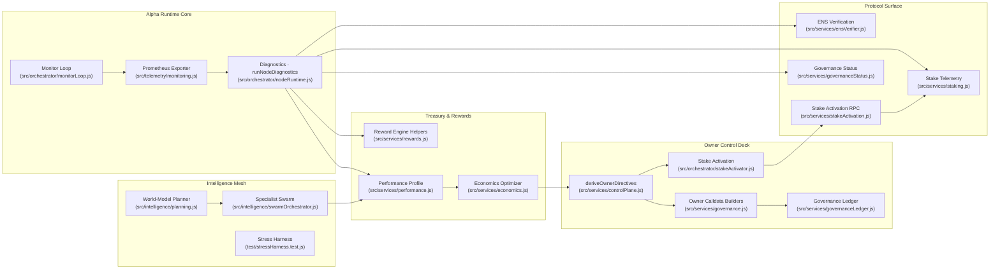
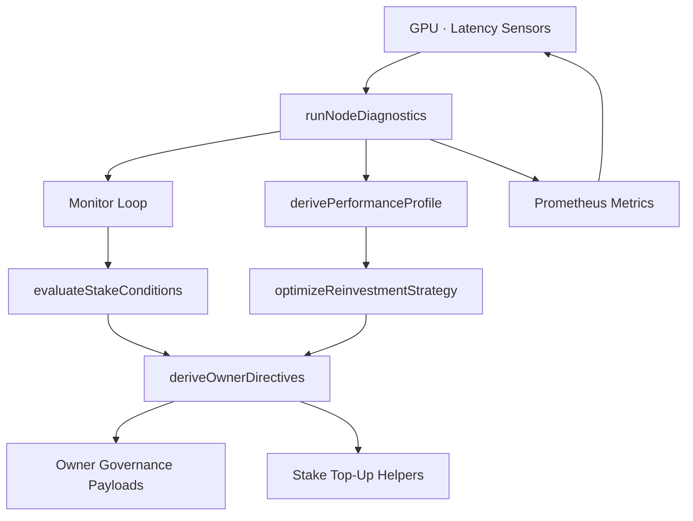
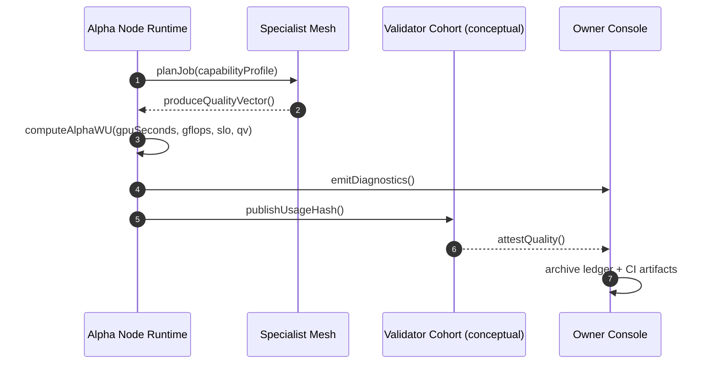
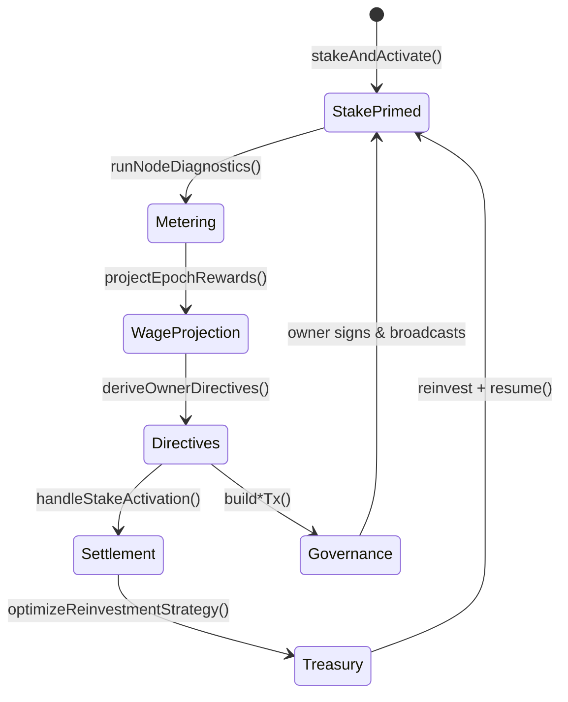
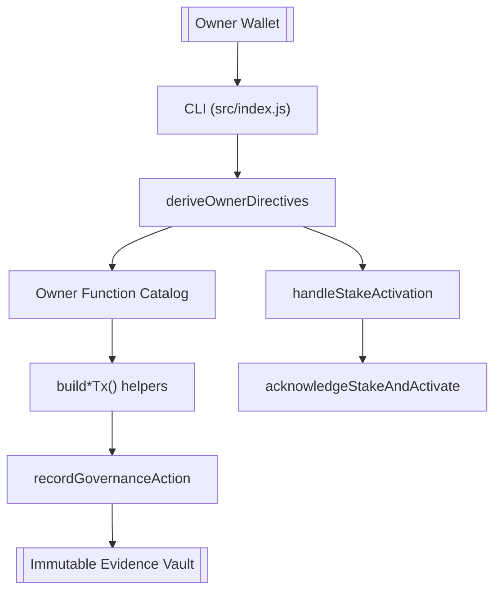
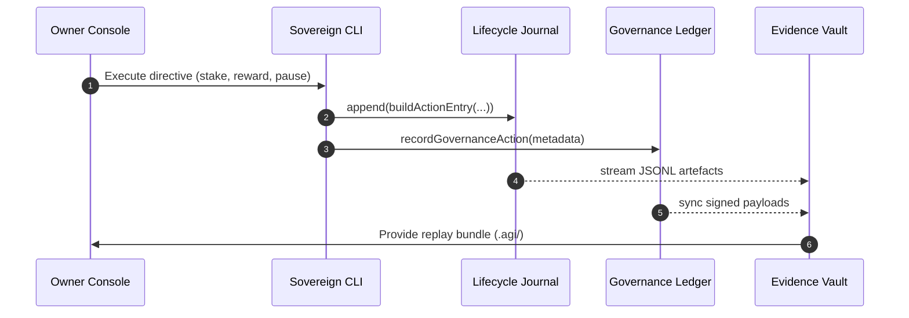

```mermaid
gantt
  title Epoch Wage & Treasury Cadence
  dateFormat  X
  axisFormat  %L
  section Metering
  GPU seconds captured :done, 0, 1
  Normalization applied :done, 1, 1
  section Wage Solving
  Reward projection      :active, 2, 1
  Stake evaluation       : 3, 1
  section Owner Execution
  Governance review      :crit, 4, 1
  Stake activation tx    :crit, 5, 1
  Reinvestment strategy  : 6, 1
```

# AGI ALPHA NODES — Synthetic AI Labor & $AGIALPHA Token Economics

<!-- markdownlint-disable MD013 MD033 -->

  <picture>
    <source srcset="../1.alpha.node.agi.eth.svg" type="image/svg+xml" />
    
  </picture>

  
  
  
  
  
  
  
  
  

> _AGI ALPHA Nodes continuously mint verifiable synthetic labor, settle it in $AGIALPHA, and broadcast every decision through an auditable CI lattice._
>
> _This dossier describes the machine allocators cite when they discuss intelligence powerful enough to reorder markets; every lever remains under the contract owner's fingertips._

---

## 1. Economic Telemetry Schematic

Every arrow corresponds to runtime code executed by the CLI (`src/index.js`) and validated by Vitest suites such as [`nodeRuntime.test.js`](../test/nodeRuntime.test.js), [`governance.integration.test.js`](../test/governance.integration.test.js), and [`stakeActivation.test.js`](../test/stakeActivation.test.js).

---

## 2. Canonical α‑Work Unit Standard

### 2.1 Equation of Record

\[
\alpha\text{-WU} = \mathrm{GPU}_s \times \mathrm{gflops}_{\text{norm}} \times \mathrm{ModelTier} \times \mathrm{SLO}_{\text{pass}} \times \mathrm{QV}
\]

| Factor | Runtime Source | Verification & Tests |
| ------ | -------------- | -------------------- |
| **GPUₛ** | Metered by `runNodeDiagnostics` using provider telemetry hooks. | [`src/orchestrator/nodeRuntime.js`](../src/orchestrator/nodeRuntime.js) · [`test/nodeRuntime.test.js`](../test/nodeRuntime.test.js) |
| **gflops_norm** | Owner-supplied normalization coefficients recorded in diagnostics output. | [`src/orchestrator/nodeRuntime.js`](../src/orchestrator/nodeRuntime.js) |
| **ModelTier** | Derived from planner and swarm capability profiles. | [`src/intelligence/planning.js`](../src/intelligence/planning.js) · [`src/intelligence/swarmOrchestrator.js`](../src/intelligence/swarmOrchestrator.js) · [`test/planning.test.js`](../test/planning.test.js) |
| **SLO_pass** | Monitor loop evaluates heartbeat, latency, and penalty posture. | [`src/orchestrator/monitorLoop.js`](../src/orchestrator/monitorLoop.js) · [`test/monitorLoop.test.js`](../test/monitorLoop.test.js) |
| **QV** | Specialist mesh quality factors plus validator heuristics surface in performance profiles. | [`src/services/performance.js`](../src/services/performance.js) · [`test/performance.test.js`](../test/performance.test.js) |

`runNodeDiagnostics` fuses the factors above with stake telemetry (`getStakeStatus`) and governance readings (`fetchGovernanceStatus`). The resulting α‑WU payloads are journalled through the diagnostics logger and exported via Prometheus.

### 2.2 Telemetry Feedback Loop

The closed loop above is deterministic and re-runnable. Offline snapshots can replay an epoch without a live RPC via [`src/services/offlineSnapshot.js`](../src/services/offlineSnapshot.js) and are exercised in [`test/offlineSnapshot.test.js`](../test/offlineSnapshot.test.js).

### 2.3 Validator-Aware Timeline

---

## 3. $AGIALPHA Token Mechanics

### 3.1 Contract Invariants

- **Canonical address** — `0xa61a3b3a130a9c20768eebf97e21515a6046a1fa` with 18 decimals defined in [`src/constants/token.js`](../src/constants/token.js); all helpers use the checksum variant via `getAddress`.
- **Normalization guard** — `assertCanonicalAgialphaAddress` rejects mismatched token addresses at CLI boundaries, preventing operator misconfiguration. [`test/token.test.js`](../test/token.test.js) exercises both positive and negative cases.
- **Treasury math** — Reward projections and pool splits occur through [`src/services/rewards.js`](../src/services/rewards.js) with 18-decimal precision, validated by [`test/rewards.test.js`](../test/rewards.test.js).
- **Stake evaluation** — [`src/services/staking.js`](../src/services/staking.js) and [`test/staking.test.js`](../test/staking.test.js) ensure minimum stake, penalties, and heartbeats translate directly to governance directives.

### 3.2 Emission & Settlement Cycle

`handleStakeActivation` (see [`src/orchestrator/stakeActivator.js`](../src/orchestrator/stakeActivator.js)) gives the owner full control over pauses, stake top-ups, and activation flows. Transactions are built but never broadcast without explicit owner confirmation or configured keys.

### 3.3 Wage Curve Ledger

Each segment corresponds to deterministic functions within the repository. `optimizeReinvestmentStrategy` and `summarizeStrategy` (tested in [`test/economics.test.js`](../test/economics.test.js)) map past reward history, obligations, and owner-defined buffers into auditable treasury recommendations.

---

## 4. Owner Command Authority

The contract owner commands every parameter across staking, rewards, module routing, and emergency controls.

| Surface | Capability | CLI Entry Point | Verification |
| ------- | ---------- | --------------- | ------------ |
| **SystemPause** | Pause, resume, or unpause all workloads instantly. | `node src/index.js governance system-pause --action <pause|resume|unpause>` | [`src/services/governance.js`](../src/services/governance.js) · [`test/governance.test.js`](../test/governance.test.js) |
| **StakeManager** | Set minimum stake, validator threshold, registry routing. | `node src/index.js governance minimum-stake ...` / `validator-threshold` | [`src/services/governance.js`](../src/services/governance.js) |
| **RewardEngine** | Adjust operator / validator / treasury shares; tune role splits. | `node src/index.js governance global-shares` / `role-share` | [`src/services/governance.js`](../src/services/governance.js) · [`test/controlPlane.test.js`](../test/controlPlane.test.js) |
| **PlatformIncentives** | Repoint stake manager, minimum stake, heartbeat grace, activation fee, treasury address. | `node src/index.js governance incentives-*` | [`src/services/controlPlane.js`](../src/services/controlPlane.js) · [`test/controlPlane.test.js`](../test/controlPlane.test.js) |
| **JobRegistry** | Swap validation/reputation/dispute modules; trigger disputes. | `node src/index.js governance job-module ...` / `dispute` | [`src/services/governance.js`](../src/services/governance.js) |
| **IdentityRegistry** | Delegate or revoke additional operators instantly. | `node src/index.js governance identity-delegate ...` | [`src/services/governance.js`](../src/services/governance.js) |
| **Stake Activation** | Automate acknowledgeStakeAndActivate with explicit owner approval. | `node src/index.js stake-activate` or AUTO_STAKE runtime flag. | [`src/orchestrator/stakeActivator.js`](../src/orchestrator/stakeActivator.js) · [`test/stakeActivator.test.js`](../test/stakeActivator.test.js) |

`recordGovernanceAction` (see [`src/services/governanceLedger.js`](../src/services/governanceLedger.js)) stores signed payloads and metadata so every owner directive is replayable.

---

## 5. Financial Intelligence Stack

### 5.1 Synthetic Labor Yield

\[
\mathrm{SLY}_t = \frac{\text{Validated } \alpha\text{-WU}_t}{\text{Circulating } \$AGIALPHA_t}
\]

- Numerator sourced from diagnostics projections (`runNodeDiagnostics` + `derivePerformanceProfile`).
- Denominator obtained from on-chain supply queries recorded alongside ledger exports.
- `summarizeStrategy` supplies buffer coverage metrics so owners can correlate SLY against reinvestment posture. Tests in [`test/economics.test.js`](../test/economics.test.js) assert edge cases for zero-history, large obligations, and buffer violations.

### 5.2 Treasury Control Metrics

| Metric | Source | Purpose |
| ------ | ------ | ------- |
| **Stake Health** | `evaluateStakeConditions` output captured by `runNodeDiagnostics`. | Flags deficits, stale heartbeats, and penalty activation before SLO breaches. |
| **Reward Gradient** | `projectEpochRewards` and `splitRewardPool`. | Projects wage curve at basis-point resolution for operator/validator/treasury shares. |
| **Reinvestment Score** | `optimizeReinvestmentStrategy` + `summarizeStrategy`. | Recommends reinvestment percentages satisfying buffer requirements. |
| **Governance Drift** | `fetchGovernanceStatus`. | Detects mismatched registry modules; diffs surface in CLI before execution. |
| **Performance Envelope** | `derivePerformanceProfile`. | Blends swarm throughput, quality, and job metrics to adjust ModelTier multipliers. |

### 5.3 Intelligence Calibration

The specialist mesh can be retuned at runtime using CLI flags such as `--agents`, `--model-tier`, and `--reward-share`. [`src/intelligence/swarmOrchestrator.js`](../src/intelligence/swarmOrchestrator.js) and [`test/swarmOrchestrator.test.js`](../test/swarmOrchestrator.test.js) confirm deterministic agent selection, while [`test/learningLoop.test.js`](../test/learningLoop.test.js) validates curriculum adjustments.

---

## 6. Evidence & Compliance Instruments

| Instrument | Purpose | Implementation | Validation |
| ---------- | ------- | -------------- | ---------- |
| **Lifecycle Journal** | Appends deterministic JSONL entries for every job action and governance directive so auditors can replay history. | [`src/services/lifecycleJournal.js`](../src/services/lifecycleJournal.js) · [`src/orchestrator/bootstrap.js`](../src/orchestrator/bootstrap.js) | [`test/bootstrap.test.js`](../test/bootstrap.test.js) ensures journals are initialized and appended on boot. |
| **Snapshot Ledger** | Produces immutable job snapshots with keccak hashes to notarize α‑WU proofs. | [`buildSnapshotEntry`](../src/services/lifecycleJournal.js) · [`src/services/jobLifecycle.js`](../src/services/jobLifecycle.js) | [`test/jobLifecycle.test.js`](../test/jobLifecycle.test.js) validates snapshot capture. |
| **ENS Command Guide** | Generates step-by-step ENS activation scripts for each operator label. | [`src/services/ensGuide.js`](../src/services/ensGuide.js) | [`test/ensGuide.test.js`](../test/ensGuide.test.js) covers normalization, formatting, and link composition. |
| **Governance Ledger** | Records every signed payload with timestamps and metadata. | [`src/services/governanceLedger.js`](../src/services/governanceLedger.js) | [`test/governance.test.js`](../test/governance.test.js) verifies append-only guarantees. |
| **Evidence Vault Structure** | Boot sequence binds lifecycle + governance logs inside `.agi/` for cold storage replication. | [`src/index.js`](../src/index.js) | [`test/bootstrap.test.js`](../test/bootstrap.test.js) covers directory creation and permission guards. |

The `.agi/` evidence tree created during bootstrap unifies runtime diagnostics, governance directives, and lifecycle snapshots. Each file path is deterministic, enabling cold-storage replication without brittle tooling.

## 7. Continuous Assurance & CI Hardening

- **Workflow** — [`.github/workflows/ci.yml`](../.github/workflows/ci.yml) executes Markdown lint, link validation, tests, coverage, and Docker smoke tests on every push, PR, and manual trigger; each job exposes a live status badge surfaced in this dossier and the root README.
- **Required checks** — [`.github/required-checks.json`](../.github/required-checks.json) enforces `Lint Markdown & Links`, `Unit & Integration Tests`, `Coverage Report`, and `Docker Build & Smoke Test` on protected branches.
- **Local parity** — `npm run ci:verify` (see [`package.json`](../package.json)) reproduces the CI matrix locally. `lint:links` now validates `docs/economics.md` alongside the rest of the corpus.
- **Artifacts** — Coverage reports and Docker smoke logs are uploaded via `actions/upload-artifact` for forensic retention.

---

## 8. Risk Surfaces & Mitigations

| Risk Vector | Mitigation | Evidence |
| ----------- | ---------- | -------- |
| **Hardware or telemetry drift** | Monitor loop + stake evaluation halt workloads and surface recommended actions. | [`src/orchestrator/monitorLoop.js`](../src/orchestrator/monitorLoop.js) · [`test/monitorLoop.test.js`](../test/monitorLoop.test.js) |
| **Governance misfire** | Calldata builders compute diffs and metadata before signing; ledger stores immutable proof. | [`src/services/governance.js`](../src/services/governance.js) · [`src/services/governanceLedger.js`](../src/services/governanceLedger.js) |
| **Treasury underfunding** | Economics optimizer enforces buffer floors and risk aversion policies. | [`src/services/economics.js`](../src/services/economics.js) · [`test/economics.test.js`](../test/economics.test.js) |
| **Stake penalties** | `handleStakeActivation` automates remediation with explicit owner consent. | [`src/orchestrator/stakeActivator.js`](../src/orchestrator/stakeActivator.js) |
| **Documentation drift** | Markdown lint + link check wired into CI block merges on broken docs. | [`package.json`](../package.json) |
| **Secret leakage** | [`src/services/secretManager.js`](../src/services/secretManager.js) normalizes environment loading and is exercised in [`test/config.test.js`](../test/config.test.js). |

---

## 9. Activation Checklist for Allocators

1. **Clone & install** — `git clone … && npm ci` for deterministic dependencies.
2. **Run local CI** — `npm run lint:md`, `npm run lint:links`, `npm test`, `npm run coverage`, or the aggregate `npm run ci:verify`.
3. **Verify ENS custody** — `node src/index.js verify-ens --label <id> --address <0x…>` ensures ownership of `⟨label⟩.alpha.node.agi.eth`.
4. **Snapshot readiness** — Generate offline snapshots via `node src/index.js offline-snapshot --label <id>` before major upgrades.
5. **Stake posture** — `node src/index.js status --label <id> --operator <0x…> --rpc <https://...>` prints stake health, wage projections, and reinvestment directives.
6. **Governance adjustments** — Review `node src/index.js governance catalog` then execute directives with `--execute --confirm --ledger-root ./ledger` for automatic journaling.
7. **Emergency drills** — Rehearse `system-pause`, stake top-ups, and governance updates on a forked network before mainnet execution.
8. **Evidence archiving** — Store CI run logs, ledger entries, ENS proofs, branch-protection exports, and stake receipts in your compliance vault.

---

AGI Alpha Node v0 is production-ready, aggressively observable, and completely owner-directed. Its economics stack translates synthetic labor into verifiable $AGIALPHA wage flows while keeping every override in the owner's hands.
