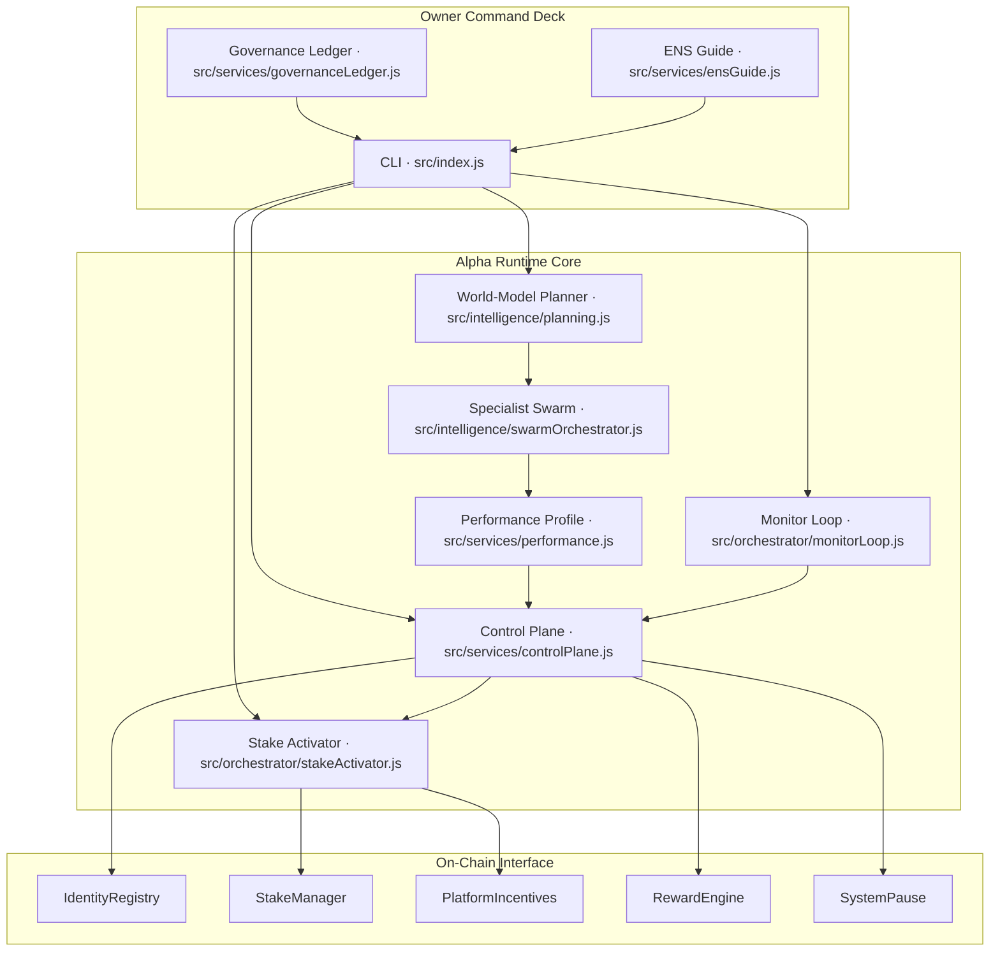
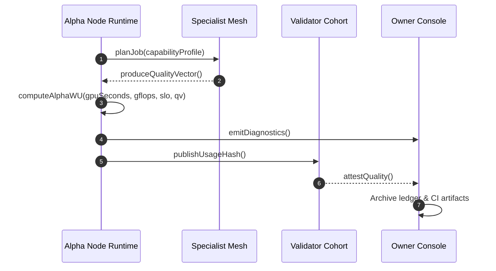
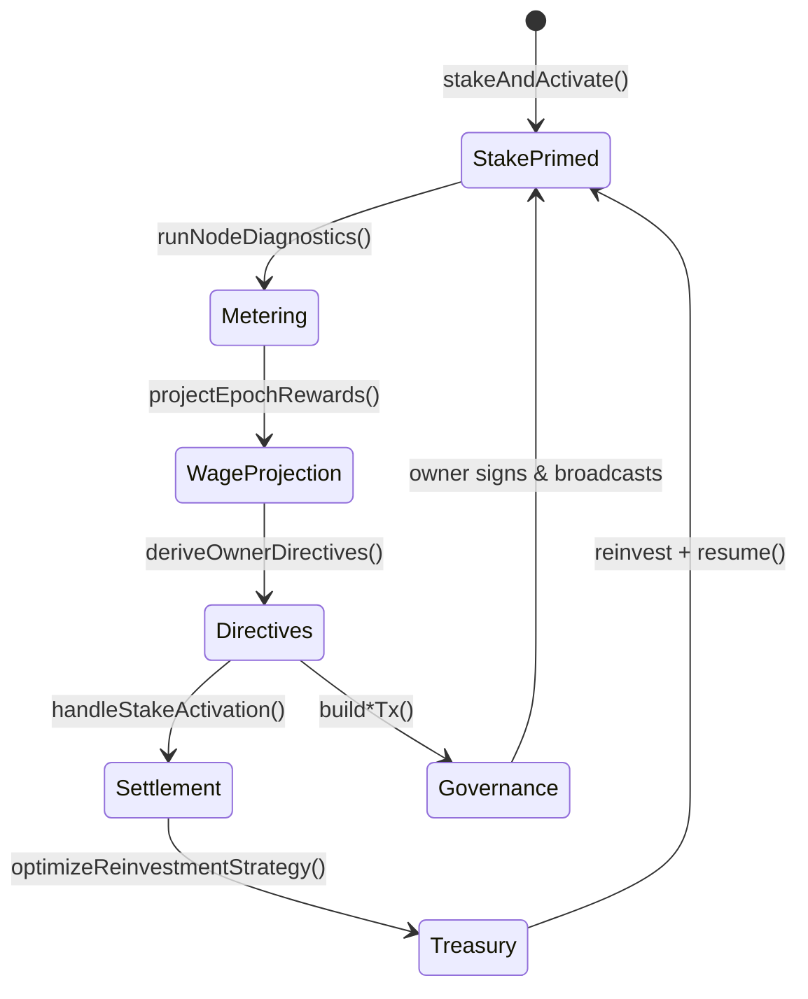
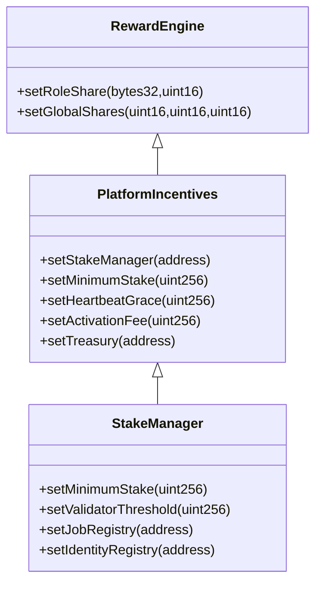
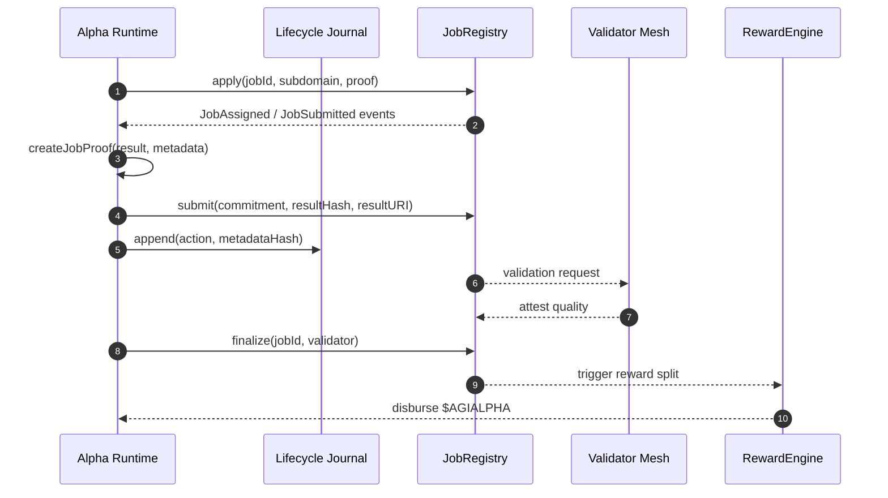
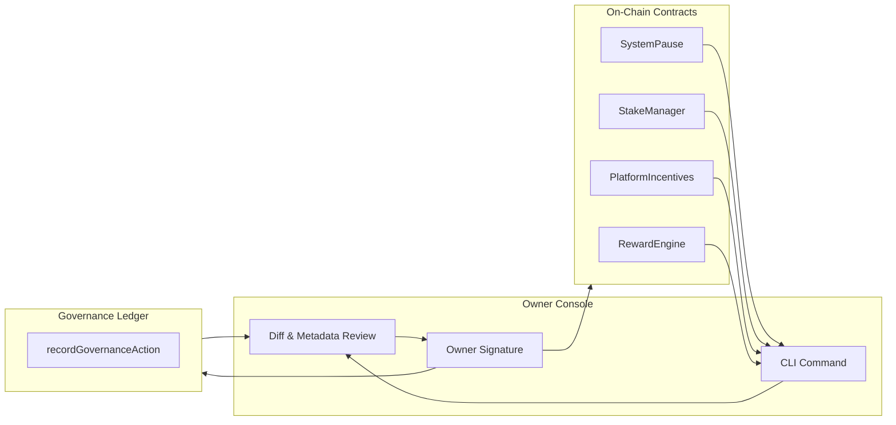
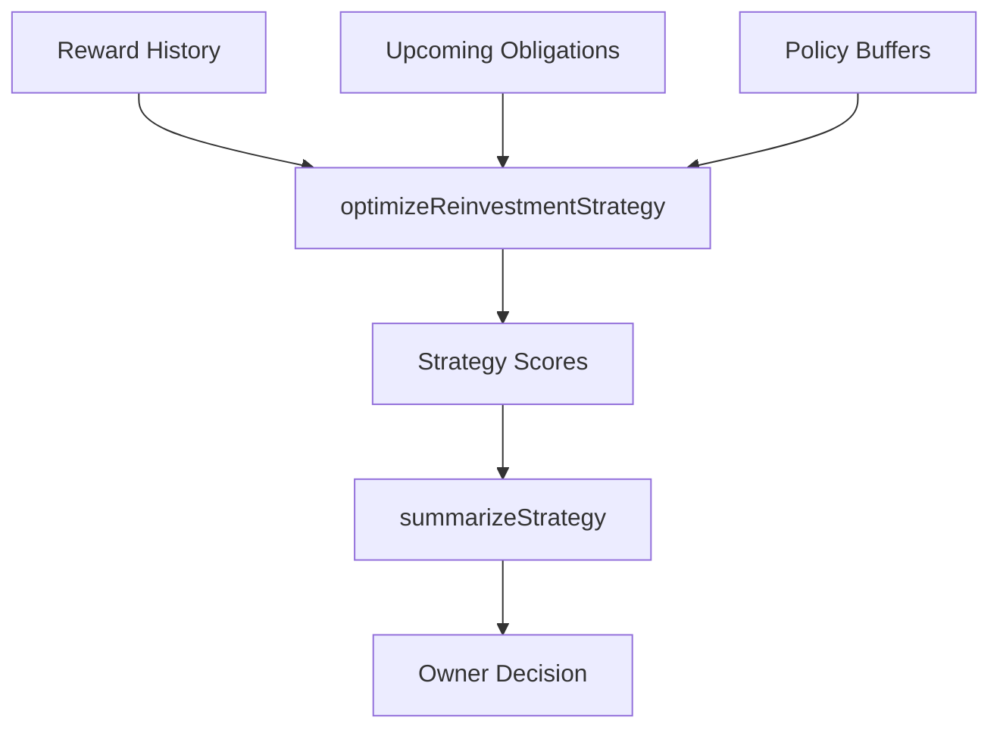
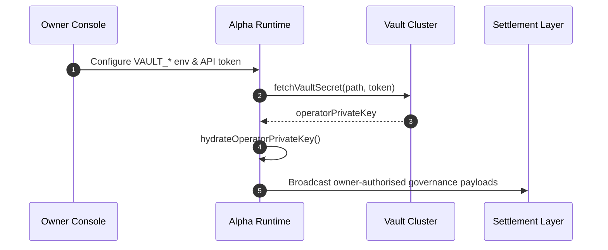
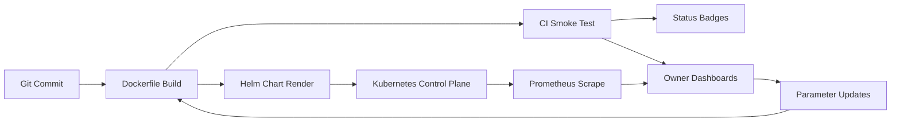
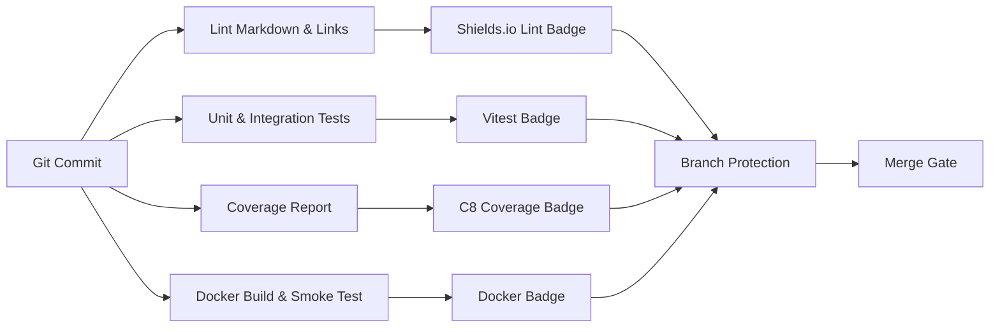

# AGI ALPHA NODES — Synthetic AI Labor & $AGIALPHA Token Economics

<!-- markdownlint-disable MD013 MD033 -->
<p align="center">
  <picture>
    <source srcset="../1.alpha.node.agi.eth.svg" type="image/svg+xml" />
    
  </picture>
</p>

<p align="center">
  <a href="https://github.com/MontrealAI/AGI-Alpha-Node-v0/actions/workflows/ci.yml">
    
  </a>
  <a href="https://github.com/MontrealAI/AGI-Alpha-Node-v0/actions/workflows/ci.yml?query=branch%3Amain">
    
  </a>
  <a href="https://github.com/MontrealAI/AGI-Alpha-Node-v0/actions/workflows/ci.yml?query=branch%3Amain">
    
  </a>
  <a href="https://github.com/MontrealAI/AGI-Alpha-Node-v0/actions/workflows/ci.yml?query=branch%3Amain">
    
  </a>
  <a href="https://github.com/MontrealAI/AGI-Alpha-Node-v0/actions/workflows/ci.yml?query=branch%3Amain">
    
  </a>
  <a href="../.github/required-checks.json">
    
  </a>
  <a href="https://etherscan.io/token/0xa61a3b3a130a9c20768eebf97e21515a6046a1fa">
    
  </a>
  
  
  
  
</p>

> _AGI ALPHA Nodes metabolize raw compute into sovereign wage streams, settle every ledger in $AGIALPHA, and remain absolutely obedient to the owner who directs them._
>
> _This codex documents the economic machinery that market makers reference when they describe intelligence capable of reorganising value flows without ever relinquishing owner supremacy._

---

## Table of Contents

1. [Economic Command Spine](#economic-command-spine)
   - [Sovereign Flow Atlas](#sovereign-flow-atlas)
   - [Observability Anchors](#observability-anchors)
   - [Governance Telemetry](#governance-telemetry)
2. [Canonical α-Work Standard](#canonical-%CE%B1-work-standard)
   - [Equation of Record](#equation-of-record)
   - [Normalization & Instrumentation](#normalization--instrumentation)
   - [Validator Cadence](#validator-cadence)
3. [Token Engine & Wage Dynamics](#token-engine--wage-dynamics)
   - [Synthetic Labor Wage Circuit](#synthetic-labor-wage-circuit)
   - [Reward Split Mathematics](#reward-split-mathematics)
   - [Synthetic Labor Yield](#synthetic-labor-yield)
4. [Job Market & Settlement Logistics](#job-market--settlement-logistics)
   - [Lifecycle Choreography](#lifecycle-choreography)
   - [Proof & Journal Fabric](#proof--journal-fabric)
   - [Settlement Telemetry](#settlement-telemetry)
5. [Owner Dominion & Parameter Control](#owner-dominion--parameter-control)
   - [Command Surface](#command-surface)
   - [Owner Function Arsenal](#owner-function-arsenal)
6. [Treasury Intelligence & Risk Posture](#treasury-intelligence--risk-posture)
7. [Liquidity, Access & Vault Hydration](#liquidity-access--vault-hydration)
8. [Deployment Surfaces & Policy Channels](#deployment-surfaces--policy-channels)
9. [Identity, ENS, and Registry Authority](#identity-ens-and-registry-authority)
10. [Safety, Slashing, and Recovery](#safety-slashing-and-recovery)
11. [Continuous Assurance & Branch Protection](#continuous-assurance--branch-protection)
12. [Glossary of Economic Signals](#glossary-of-economic-signals)

---

## Economic Command Spine

### Sovereign Flow Atlas



### Observability Anchors

- [`runNodeDiagnostics`](../src/orchestrator/nodeRuntime.js) fuses ENS verification, stake telemetry, rewards projection, and performance synthesis before publishing diagnostics and Prometheus metrics for the owner to review in a single command stream.
- [`startMonitorLoop`](../src/orchestrator/monitorLoop.js) orchestrates heartbeat cadence, telemetry streaming, Docker health, and offline snapshot replay so the runtime self-assesses even when RPC access is intermittent.
- The monitoring server in [`telemetry/monitoring.js`](../src/telemetry/monitoring.js) exports gauges for stake, heartbeat age, throughput, success ratios, registry profile status, and agent utilisation, giving dashboards real-time wage and compatibility intelligence.

### Governance Telemetry

- [`deriveOwnerDirectives`](../src/services/controlPlane.js) synthesises stake posture, projected rewards, and desired policy targets into a prioritised action stack, each including pre-built transactions when addresses are configured.
- [`fetchGovernanceStatus`](../src/services/governanceStatus.js) interrogates StakeManager and JobRegistry dependencies so owners can confirm the active modules before signing upgrades.
- [`generateEnsSetupGuide`](../src/services/ensGuide.js) renders ENS onboarding steps that bind domain custody, records, and resolver alignment directly into the staking activation ritual.

---

## Canonical α-Work Standard

### Equation of Record

\[
\alpha\text{-WU} = \mathrm{GPU}_s \times \mathrm{gflops}_{\text{norm}} \times \mathrm{ModelTier} \times \mathrm{SLO}_{\text{pass}} \times \mathrm{QV}
\]

| Factor | Runtime Source | Verification Surface |
| ------ | --------------- | -------------------- |
| **GPUₛ** | Derived from runtime diagnostics and hardware telemetry hooks exposed in [`runNodeDiagnostics`](../src/orchestrator/nodeRuntime.js). | [`test/nodeRuntime.test.js`](../test/nodeRuntime.test.js) |
| **gflops_norm** | Owner-supplied normalisation multipliers captured with diagnostics payloads. | [`test/nodeRuntime.test.js`](../test/nodeRuntime.test.js) |
| **ModelTier** | Planner and swarm capability profiles feed tier multipliers from [`planning.js`](../src/intelligence/planning.js) and [`swarmOrchestrator.js`](../src/intelligence/swarmOrchestrator.js). | [`test/planning.test.js`](../test/planning.test.js) |
| **SLO_pass** | Heartbeat and latency compliance enforced via [`monitorLoop`](../src/orchestrator/monitorLoop.js). | [`test/monitorLoop.test.js`](../test/monitorLoop.test.js) |
| **QV** | Quality vectors computed in [`performance.js`](../src/services/performance.js) blend specialist mesh scores with validator heuristics. | [`test/performance.test.js`](../test/performance.test.js) |

### Normalization & Instrumentation

- Diagnostics snapshot ENS proofs, stake health, governance posture, and projected rewards simultaneously so α‑WU attestations remain tamper-evident even during offline replay using [`offlineSnapshot.js`](../src/services/offlineSnapshot.js).
- [`derivePerformanceProfile`](../src/services/performance.js) calculates throughput, success rate, utilisation vectors, and token earnings projections that feed quality validation and wage models.
- Offline epochs can be reconstructed through [`loadOfflineSnapshot`](../src/services/offlineSnapshot.js), enabling auditors to reproduce α‑WU trails without touching live RPC endpoints.

### Validator Cadence



---

## Token Engine & Wage Dynamics

### Synthetic Labor Wage Circuit



- [`handleStakeActivation`](../src/orchestrator/stakeActivator.js) constructs pause, resume, and stake top-up payloads while keeping execution under the owner’s explicit authority.
- [`optimizeReinvestmentStrategy`](../src/services/economics.js) blends historic wage flow, obligations, and policy buffers into forward strategies without violating reserve floors.
- Governance directives are notarised through [`governanceLedger.js`](../src/services/governanceLedger.js), capturing structured diffs for every parameter shift.

### Reward Split Mathematics



- Owner-only ABI signatures are codified in [`governance.js`](../src/services/governance.js), ensuring every governance payload is produced against authoritative call data.
- [`rewards.js`](../src/services/rewards.js) keeps reward math in 18-decimal precision (`c8`-covered via [`test/rewards.test.js`](../test/rewards.test.js)) and aligns with the canonical token contract [`token.js`](../src/constants/token.js).
- The CLI surfaces every governance command through [`src/index.js`](../src/index.js), pairing metadata diffs with JSON payloads ready for the owner’s signature.

### Synthetic Labor Yield

\[
\mathrm{SLY} = \frac{\sum_{i=1}^{n} \alpha\text{-WU}_i}{\text{Circulating } $AGIALPHA}
\]

- Yield analytics default to the canonical `$AGIALPHA` contract (`0xa61a3b3a130a9c20768eebf97e21515a6046a1fa`) guarded by [`assertCanonicalAgialphaAddress`](../src/constants/token.js) and tested via [`test/token.test.js`](../test/token.test.js).
- Stake telemetry and validator verdicts stream into [`deriveOwnerDirectives`](../src/services/controlPlane.js), letting SLY react instantly to demand shocks or penalty states.

---

## Job Market & Settlement Logistics

### Lifecycle Choreography

```mermaid
flowchart LR
  Client["Job Originator"] -->|JobCreated| Registry["JobRegistry"]
  AlphaNode["Alpha Node Runtime"] -->|discover()| Registry
  AlphaNode -->|apply()| Registry
  Registry -->|assign| AlphaNode
  AlphaNode -->|submit() & notifyValidator()| Validator["Validator Mesh"]
  Validator -->|attest| Registry
  Registry -->|finalize()| RewardEngine
  RewardEngine -->|mint rewards| AlphaNode
  RewardEngine -->|burn fees| Treasury
```

- [`createJobLifecycle`](../src/services/jobLifecycle.js) sustains discovery, watches registry events, and normalises heterogeneous job feeds so the runtime orchestrates assignments across registry variants.
- Applying, submitting results, finalising work, and notifying validators remain first-class operations with dynamic ABI fallbacks, protected by [`jobLifecycle.test.js`](../test/jobLifecycle.test.js).
- Compatibility watchers and resumable configuration updates ensure the runtime never loses sync with on-chain registries.

### Proof & Journal Fabric



- [`createJobProof`](../src/services/jobProof.js) deterministically binds job IDs, operator custody, timestamps, and metadata into verifiable commitments.
- [`lifecycleJournal.js`](../src/services/lifecycleJournal.js) hashes every lifecycle mutation, forging a cryptographic audit trail the owner can replay without on-chain reads.
- Job metrics, ledger entries, and compatibility warnings surface in [`jobLifecycle.js`](../src/services/jobLifecycle.js) so intelligence modules can rebalance workload distribution mid-epoch.

### Settlement Telemetry

- Lifecycle metrics expose discovery counts, validator notifications, and last-action states, giving the owner a live view of production velocity.
- [`telemetry/monitoring.js`](../src/telemetry/monitoring.js) projects stake levels, throughput, success ratios, and registry compatibility for downstream dashboards.
- `getMetrics`, `listJobs`, and watcher hooks feed into automation surfaces, empowering treasury and staking strategies to react as soon as job economics shift.

---

## Owner Dominion & Parameter Control

### Command Surface

| Directive | CLI Entry Point | What Changes | Sources |
| --------- | --------------- | ------------ | ------- |
| Pause or resume all labor | `governance system-pause --system-pause <addr> --action <pause\|resume\|unpause>` | Routes through `SystemPause` to halt or restore execution instantly. | [`src/index.js`](../src/index.js), [`src/services/governance.js`](../src/services/governance.js) |
| Set minimum stake (StakeManager) | `governance minimum-stake --stake-manager <addr> --amount <decimal>` | Updates minimum stake with 18-decimal precision. | [`src/services/staking.js`](../src/services/staking.js), [`test/staking.test.js`](../test/staking.test.js) |
| Adjust validator quorum | `governance validator-threshold --stake-manager <addr> --threshold <count>` | Aligns validator requirements to match network posture. | [`src/services/governance.js`](../src/services/governance.js) |
| Repoint registry dependencies | `governance registry-upgrade --stake-manager <addr> --type <job|identity> --address <addr>` | Swaps StakeManager registries without downtime. | [`src/services/governance.js`](../src/services/governance.js) |
| Upgrade JobRegistry modules | `governance job-module --job-registry <addr> --module <validation|reputation|dispute> --address <addr>` | Rotates module implementations atomically. | [`src/services/governance.js`](../src/services/governance.js) |
| Trigger disputes | `governance dispute --job-registry <addr> --job-id <id>` | Escalates contested jobs through `JobRegistry.triggerDispute`. | [`src/services/governance.js`](../src/services/governance.js) |
| Delegate or revoke operators | `governance identity-delegate --identity-registry <addr> --operator <addr> --allowed <bool>` | Grants or revokes node operator access with checksum enforcement. | [`src/services/governance.js`](../src/services/governance.js) |
| Redirect PlatformIncentives StakeManager | `governance incentives-manager --incentives <addr> --stake-manager <addr>` | Repoints incentives to a new StakeManager. | [`src/services/governance.js`](../src/services/governance.js) |
| Update PlatformIncentives minimum | `governance incentives-minimum --incentives <addr> --amount <decimal>` | Aligns onboarding minimum stake in $AGIALPHA. | [`src/services/governance.js`](../src/services/governance.js) |
| Tune heartbeat grace window | `governance incentives-heartbeat --incentives <addr> --grace-seconds <seconds>` | Retunes heartbeat tolerances before penalties apply. | [`src/services/governance.js`](../src/services/governance.js) |
| Set activation fees | `governance incentives-activation-fee --incentives <addr> --fee <decimal>` | Controls the cost to enter the labor market. | [`src/services/governance.js`](../src/services/governance.js) |
| Redirect treasury distribution | `governance incentives-treasury --incentives <addr> --treasury <addr>` | Reassigns treasury sinks instantly. | [`src/services/governance.js`](../src/services/governance.js) |
| Rebalance operator/validator/treasury shares | `governance reward-shares --reward-engine <addr> --operator-bps <bps> --validator-bps <bps> --treasury-bps <bps>` | Atomically rewrites global share splits. | [`src/services/rewards.js`](../src/services/rewards.js) |
| Adjust per-role share | `governance role-share --reward-engine <addr> --role <role> --bps <bps>` | Tunes role-specific splits such as guardian or agent cohorts. | [`src/services/governance.js`](../src/services/governance.js) |

### Owner Function Arsenal

- [`getOwnerFunctionCatalog`](../src/services/governance.js) enumerates every owner-only ABI signature so consoles and APIs can render exact capability menus without hardcoding addresses.
- Governance builders encode metadata diffs, serialised bigints, and checksum enforcement, guaranteeing that each payload is ready for signature the moment it is generated.
- The CLI defaults to dry-run output with structured diffs; adding `--execute` persists payloads to the governance ledger before the owner signs, producing deterministic audit trails backed by [`test/governance.integration.test.js`](../test/governance.integration.test.js).



---

## Treasury Intelligence & Risk Posture

- [`optimizeReinvestmentStrategy`](../src/services/economics.js) analyses reward history, obligations, and configurable risk aversion to propose reinvestment blueprints that preserve buffer requirements even in volatile epochs.
- Risk penalties scale with mean absolute deviation, preventing over-aggressive compounding when validator volatility spikes, while [`summarizeStrategy`](../src/services/economics.js) exposes buffer epochs and shortfalls for non-technical review.



---

## Liquidity, Access & Vault Hydration

- [`hydrateOperatorPrivateKey`](../src/services/secretManager.js) draws operator signing keys from HashiCorp Vault (or bypasses hydration if a key already exists), giving the owner instant credential rotation without redeploying the runtime.
- Container bootstrap wiring in [`orchestrator/bootstrap.js`](../src/orchestrator/bootstrap.js) fuses Vault hydration, provider instantiation, lifecycle orchestration, and governance API exposure into a single directive.
- [`provider.js`](../src/services/provider.js) and wallet creation enforce checksum validation and signer readiness, yielding deterministic pipelines from hydrated secrets to on-chain control.
- The governance API server in [`network/apiServer.js`](../src/network/apiServer.js) exposes JSON payload endpoints for building, notarising, and cataloguing owner actions while sanitising every field.



---

## Deployment Surfaces & Policy Channels

- The production container is built from a Node.js 20 slim base with deterministic `npm ci` installs and an embedded entrypoint that asserts runtime readiness before execution ([Dockerfile](../Dockerfile)).
- Container launches are gated by [`deploy/docker/entrypoint.sh`](../deploy/docker/entrypoint.sh), which validates environment, sanitises labels, and hydrates secrets before touching the chain.
- Helm values in [`deploy/helm/agi-alpha-node/values.yaml`](../deploy/helm/agi-alpha-node/values.yaml) expose autoscaling, Prometheus annotations, RPC URLs, ENS labels, staking parameters, and Vault integration for declarative infrastructure control.
- Release rituals captured in the [Operator Runbook](./operator-runbook.md) enforce badge verification, required-check audits, local CI mirroring, container smoke tests, and Helm linting before promotion.



---

## Identity, ENS, and Registry Authority

- ENS enforcement begins with [`buildNodeNameFromLabel`](../src/services/ensVerifier.js) and verification logic that blocks activation unless the owner controls the ENS node.
- [`generateEnsSetupGuide`](../src/services/ensGuide.js) returns deterministic steps and CLI commands that bind ENS configuration to staking activation.
- [`fetchGovernanceStatus`](../src/services/governanceStatus.js) surfaces validation, reputation, and dispute module addresses so registry upgrades can be rehearsed before signature.


---

## Safety, Slashing, and Recovery

- [`startMonitorLoop`](../src/orchestrator/monitorLoop.js) dispatches alerts when heartbeats miss their window, triggering directives to pause workloads or replenish stake before penalties compound.
- Stake evaluation integrates penalties, grace windows, and treasury buffers via [`evaluateStakeConditions`](../src/services/staking.js), ensuring intervention precedes slashing as covered by [`test/staking.test.js`](../test/staking.test.js).
- Dispute triggers and validator rotations propagate through governance helpers in [`governance.js`](../src/services/governance.js), isolating fraudulent work without collateral damage.
- Stress harness simulations in [`intelligence/stressHarness.js`](../src/intelligence/stressHarness.js) replay adversarial epochs to confirm graceful recovery under cascading penalties.

---

## Continuous Assurance & Branch Protection



- [`.github/workflows/ci.yml`](../.github/workflows/ci.yml) runs linting, unit + integration tests, coverage, and Docker smoke checks on every push and pull request targeting `main` with concurrency guards.
- Required status checks enforced through [`.github/required-checks.json`](../.github/required-checks.json) make a green pipeline mandatory for merge.
- [`package.json`](../package.json) exposes `npm run ci:verify` so contributors can reproduce the full assurance lattice locally before opening a pull request.
- Branch protection visibility is reinforced via the badges in this codex and the [root README](../README.md), keeping enforcement legible to operators and auditors.

---

## Glossary of Economic Signals

| Signal | Definition |
| ------ | ---------- |
| **α‑WU** | Normalised unit of AI labor incorporating GPU time, hardware capability, model tier, service-level compliance, and quality validation. |
| **Synthetic Labor Yield (SLY)** | Ratio of validated α‑WU per epoch to circulating `$AGIALPHA`, signalling real productivity backing the token. |
| **Stake Deficit** | Token amount required to restore StakeManager minimums, computed within [`evaluateStakeConditions`](../src/services/staking.js). |
| **Reward Pool Projection** | Estimated epoch pool and share split produced by [`projectEpochRewards`](../src/services/rewards.js). |
| **Governance Directive** | Structured action stack produced by [`deriveOwnerDirectives`](../src/services/controlPlane.js) containing ready-to-sign transactions. |
| **Ledger Artifact** | Immutable JSON dossier recorded by [`recordGovernanceAction`](../src/services/governanceLedger.js) when `--execute` is used. |
| **Synthetic Labor Wage Rate** | Tokens emitted per α‑WU during an epoch after applying share splits and treasury routing. |

---

_The AGI Alpha Node runtime is engineered to let its owner command a network-scale synthetic labor force with absolute clarity, immediate auditability, and token economics anchored in verifiable productivity._
