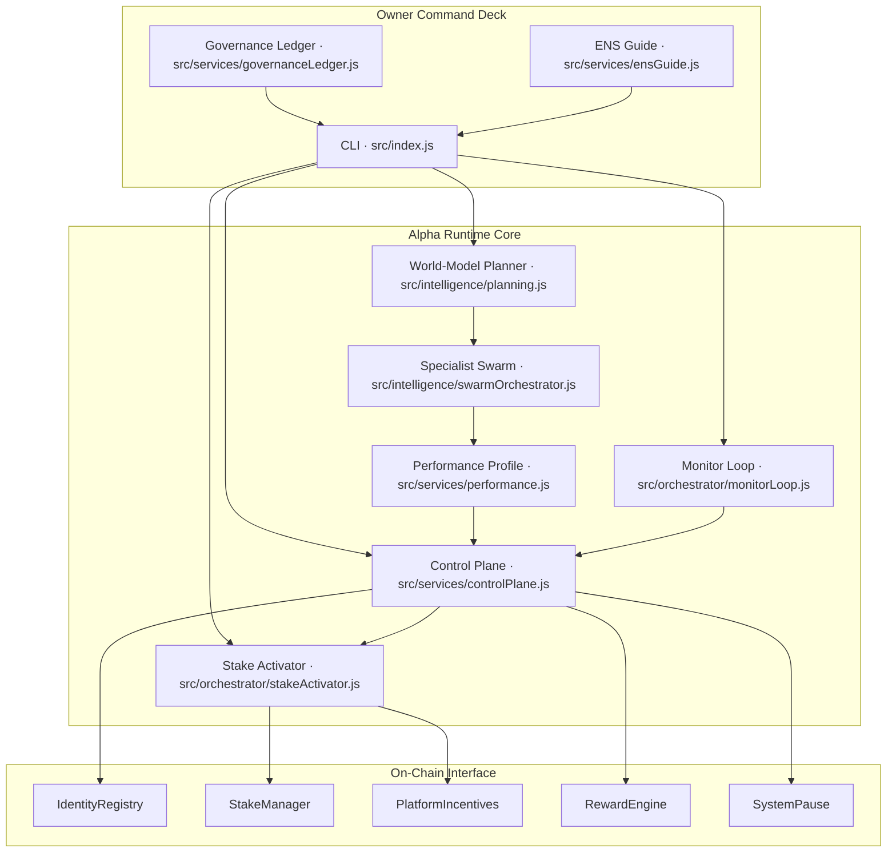
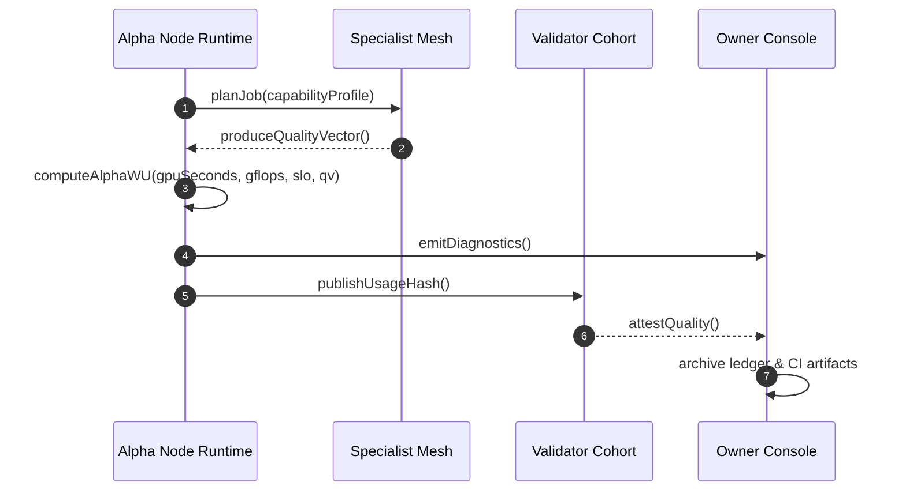
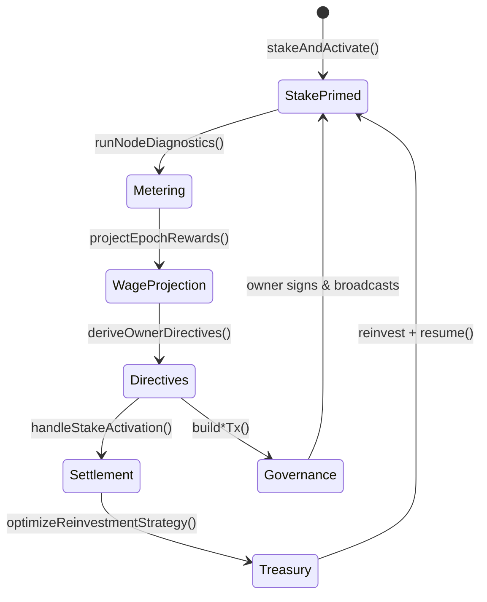
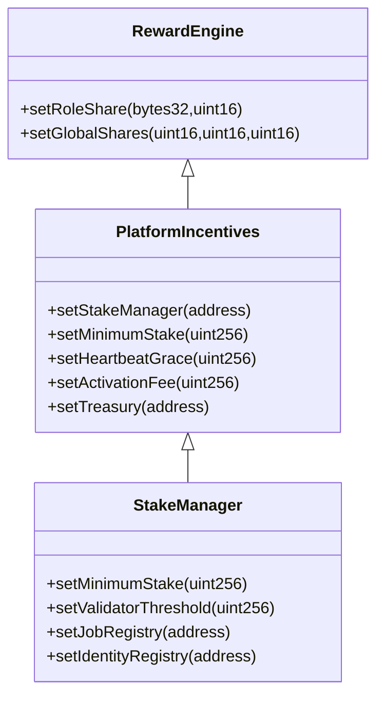
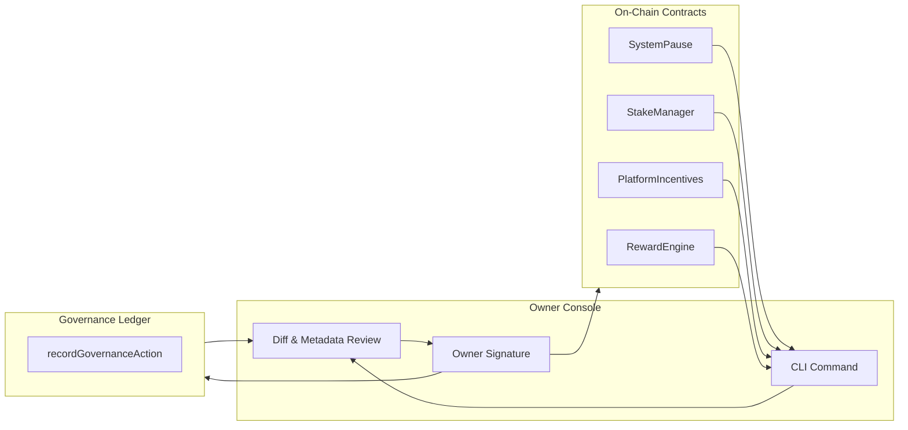
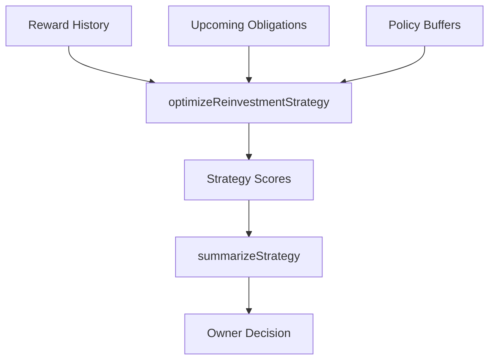
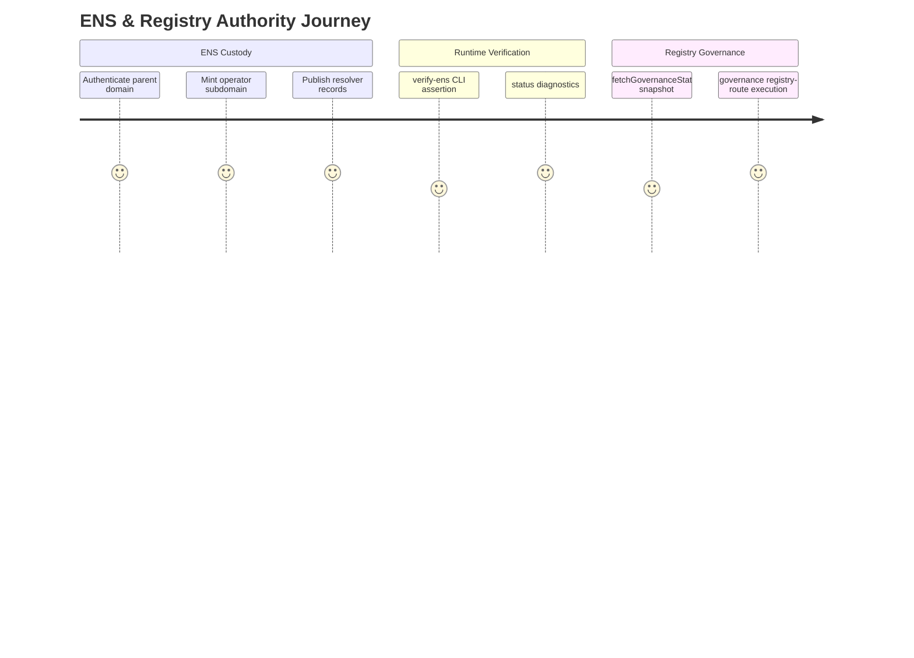
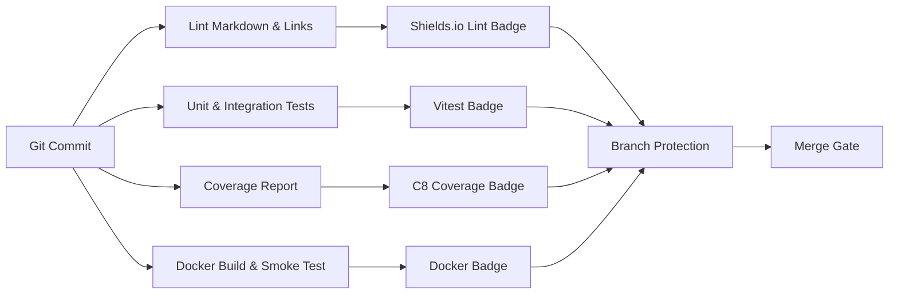

# AGI ALPHA NODES — Synthetic AI Labor & $AGIALPHA Token Economics

<!-- markdownlint-disable MD013 MD033 -->

  <picture>
    <source srcset="../1.alpha.node.agi.eth.svg" type="image/svg+xml" />
    
  </picture>

  
  
  
  
  
  
  
  
  
  
  
  

> _AGI ALPHA Nodes metabolize compute into sovereign wages, settle every ledger in $AGIALPHA, and keep their owner enthroned through absolute parameter control._
>
> _This codex details the engine strategists reference when they describe intelligence capable of reorganizing markets while remaining flawlessly obedient to its owner._

---

## Table of Contents

1. [Economic Command Spine](#economic-command-spine)
   - [Sovereign Flow Atlas](#sovereign-flow-atlas)
   - [Observability Anchors](#observability-anchors)
   - [Governance Telemetry](#governance-telemetry)
2. [Canonical α-Work Standard](#canonical-%CE%B1-work-standard)
   - [Equation of Record](#equation-of-record)
   - [Normalization & Instrumentation](#normalization--instrumentation)
   - [Validator Cadence](#validator-cadence)
3. [Token Engine & Wage Dynamics](#token-engine--wage-dynamics)
   - [Synthetic Labor Wage Circuit](#synthetic-labor-wage-circuit)
   - [Reward Split Mathematics](#reward-split-mathematics)
   - [Synthetic Labor Yield](#synthetic-labor-yield)
4. [Owner Dominion & Parameter Control](#owner-dominion--parameter-control)
5. [Treasury Intelligence & Risk Posture](#treasury-intelligence--risk-posture)
6. [Identity, ENS, and Registry Authority](#identity-ens-and-registry-authority)
7. [Safety, Slashing, and Recovery](#safety-slashing-and-recovery)
8. [Continuous Assurance & Branch Protection](#continuous-assurance--branch-protection)
9. [Glossary of Economic Signals](#glossary-of-economic-signals)

---

## Economic Command Spine

### Sovereign Flow Atlas

### Observability Anchors

- `runNodeDiagnostics` fuses GPU telemetry, ENS anchoring, and stake posture before broadcasting α‑WU payloads and Prometheus metrics, ensuring the owner receives a single truth stream.【F:src/orchestrator/nodeRuntime.js†L20-L188】
- The monitor loop enforces heartbeat SLOs, applies penalties, and streams directives into the control plane, guaranteeing that any anomaly is escalated immediately.【F:src/orchestrator/monitorLoop.js†L21-L186】【F:test/monitorLoop.test.js†L7-L105】
- Ledger entries are notarized through `recordGovernanceAction`, generating immutable JSON dossiers for every change the owner approves.【F:src/services/governanceLedger.js†L1-L71】【F:test/governance.integration.test.js†L10-L88】

### Governance Telemetry

- `deriveOwnerDirectives` synthesizes stake evaluation, governance posture, and reward projections into prioritized actions, each already encoded as a ready-to-sign transaction.【F:src/services/controlPlane.js†L1-L218】【F:test/controlPlane.test.js†L8-L198】
- `fetchGovernanceStatus` inspects live registry modules (validation, reputation, dispute) so the owner can confirm the current configuration before dispatching upgrades.【F:src/services/governanceStatus.js†L1-L84】【F:test/governanceStatus.test.js†L7-L121】
- ENS onboarding is scripted via `generateEnsSetupGuide`, delivering precise steps and CLI commands that tie domain custody to staking activation.【F:src/services/ensGuide.js†L1-L91】【F:test/ensGuide.test.js†L7-L92】

---

## Canonical α-Work Standard

### Equation of Record

\[
\alpha\text{-WU} = \mathrm{GPU}_s \times \mathrm{gflops}_{\text{norm}} \times \mathrm{ModelTier} \times \mathrm{SLO}_{\text{pass}} \times \mathrm{QV}
\]

| Factor | Runtime Source | Verification & Tests |
| ------ | -------------- | -------------------- |
| **GPUₛ** | Metered by `runNodeDiagnostics` using provider telemetry hooks. | [`src/orchestrator/nodeRuntime.js`](../src/orchestrator/nodeRuntime.js) · [`test/nodeRuntime.test.js`](../test/nodeRuntime.test.js) |
| **gflops_norm** | Owner-supplied normalization coefficients emitted alongside diagnostics. | [`src/orchestrator/nodeRuntime.js`](../src/orchestrator/nodeRuntime.js) |
| **ModelTier** | Derived from planner and swarm capability profiles. | [`src/intelligence/planning.js`](../src/intelligence/planning.js) · [`src/intelligence/swarmOrchestrator.js`](../src/intelligence/swarmOrchestrator.js) · [`test/planning.test.js`](../test/planning.test.js) |
| **SLO_pass** | Heartbeat analysis, latency windows, and penalty posture enforced by the monitor loop. | [`src/orchestrator/monitorLoop.js`](../src/orchestrator/monitorLoop.js) · [`test/monitorLoop.test.js`](../test/monitorLoop.test.js) |
| **QV** | Specialist mesh quality vectors fused with validator heuristics. | [`src/services/performance.js`](../src/services/performance.js) · [`test/performance.test.js`](../test/performance.test.js) |

### Normalization & Instrumentation

- Diagnostics snapshot stake levels, governance status, and ENS proof simultaneously so α‑WU statements remain tamper-evident.【F:src/orchestrator/nodeRuntime.js†L64-L188】【F:test/nodeRuntime.test.js†L10-L158】
- `derivePerformanceProfile` calculates throughput, success rate, and projected earnings, feeding quality vectors into validation and wage models.【F:src/services/performance.js†L1-L68】【F:test/performance.test.js†L9-L151】
- Offline epochs are replayable via `loadOfflineSnapshot`, letting auditors reproduce α‑WU trails without live RPC access.【F:src/services/offlineSnapshot.js†L8-L112】【F:test/offlineSnapshot.test.js†L9-L96】

### Validator Cadence

---

## Token Engine & Wage Dynamics

### Synthetic Labor Wage Circuit

- `handleStakeActivation` constructs pause, resume, and stake top-up payloads while preserving the owner’s exclusive broadcast authority.【F:src/orchestrator/stakeActivator.js†L1-L156】【F:test/stakeActivator.test.js†L9-L161】
- `optimizeReinvestmentStrategy` blends historical wages, obligations, and policy buffers to recommend growth paths that never violate owner-defined reserves.【F:src/services/economics.js†L1-L192】【F:test/economics.test.js†L1-L54】
- Governance directives capture signed metadata diffs so every parameter change is reviewed before committing on-chain.【F:src/services/governance.js†L1-L188】【F:test/governance.test.js†L8-L201】

### Reward Split Mathematics

- Owner-only ABIs are codified in `OWNER_ONLY_ABIS`, ensuring every governance payload is built against authoritative signatures before dispatch.【F:src/services/governance.js†L1-L66】
- `projectEpochRewards` and `splitRewardPool` execute reward math entirely in 18-decimal precision, validating share splits and operator floors.【F:src/services/rewards.js†L1-L84】【F:test/rewards.test.js†L9-L148】
- Token invariants anchor on the canonical contract `0xa61a3b3a130a9c20768eebf97e21515a6046a1fa`, enforced by `assertCanonicalAgialphaAddress` guards and their dedicated tests.【F:src/constants/token.js†L1-L23】【F:test/token.test.js†L6-L84】

### Synthetic Labor Yield

\[
\mathrm{SLY} = \frac{\sum_{i=1}^{n} \alpha\text{-WU}_i}{\text{Circulating } $AGIALPHA}
\]

- Stake telemetry and validator verdicts flow into `deriveOwnerDirectives`, allowing SLY to react immediately to supply or demand shocks.【F:src/services/controlPlane.js†L1-L218】
- Circulating supply inputs default to the canonical token contract, guaranteeing that yield analytics use authoritative precision.【F:src/constants/token.js†L1-L17】

---

## Owner Dominion & Parameter Control

| Directive | CLI Entry Point | What Changes | Source | Validation |
| --------- | --------------- | ------------ | ------ | ---------- |
| Pause or resume the entire labor market | `governance system-pause --system-pause <addr> --action <pause\|resume\|unpause>` | Routes through `SystemPause` to halt or restore execution instantly. | [`src/services/governance.js`](../src/services/governance.js) · [`src/index.js`](../src/index.js) | [`test/governance.integration.test.js`](../test/governance.integration.test.js) |
| Tune minimum stake & validator threshold | `governance stake-threshold --stake-manager <addr> --minimum <amount>` | Updates `StakeManager` invariants with 18-decimal precision. | [`src/services/staking.js`](../src/services/staking.js) · [`src/index.js`](../src/index.js) | [`test/staking.test.js`](../test/staking.test.js) |
| Rotate registries & validator modules | `governance registry-route --stake-manager <addr> --job-registry <addr>` | Points runtime at new registries without downtime. | [`src/services/governance.js`](../src/services/governance.js) | [`test/stakeActivation.test.js`](../test/stakeActivation.test.js) |
| Rebalance wage shares | `governance reward-shares --reward-engine <addr> --operator-bps <bps>` | Rewrites operator, validator, and treasury splits atomically. | [`src/services/rewards.js`](../src/services/rewards.js) · [`src/index.js`](../src/index.js) | [`test/rewards.test.js`](../test/rewards.test.js) |
| Enforce activation fees & treasury routes | `governance incentives-update --incentives <addr> --activation-fee <amount>` | Grants the owner absolute control over onboarding economics. | [`src/orchestrator/stakeActivator.js`](../src/orchestrator/stakeActivator.js) · [`src/services/governance.js`](../src/services/governance.js) | [`test/stakeActivator.test.js`](../test/stakeActivator.test.js) |

The governance CLI defaults to dry-run output with structured diffs; adding `--execute` persists the payload to the ledger before the owner signs, producing deterministic audit trails for every parameter shift.【F:src/index.js†L1667-L2056】【F:test/governance.integration.test.js†L10-L88】

---

## Treasury Intelligence & Risk Posture

- `optimizeReinvestmentStrategy` analyses reward history, obligations, and configurable risk aversion to propose reinvestment blueprints that preserve buffer requirements even in volatile epochs.【F:src/services/economics.js†L52-L192】【F:test/economics.test.js†L1-L54】
- Risk penalties scale with mean absolute deviation, preventing over-aggressive compounding when validator volatility spikes.【F:src/services/economics.js†L78-L167】
- `summarizeStrategy` exposes buffer epochs and shortfalls, enabling non-technical operators to accept or reject strategies without mental math.【F:src/services/economics.js†L194-L210】【F:test/economics.test.js†L34-L54】

---

## Identity, ENS, and Registry Authority

- ENS enforcement begins with `buildNodeNameFromLabel` and the ENS guide, making every activation conditional on provable domain custody.【F:src/services/ensVerifier.js†L1-L118】【F:test/ensVerifier.test.js†L7-L131】
- `generateEnsSetupGuide` returns stepwise instructions and CLI commands that bind ENS configuration to staking flow, ensuring no operator can activate without the owner’s blessing.【F:src/services/ensGuide.js†L8-L91】
- `fetchGovernanceStatus` surfaces validation, reputation, and dispute modules so registry upgrades can be rehearsed before the transaction is signed.【F:src/services/governanceStatus.js†L1-L84】

---

## Safety, Slashing, and Recovery

- `monitorLoop` dispatches alerts when heartbeats miss their window, triggering directives to pause workloads or replenish stake before penalties compound.【F:src/orchestrator/monitorLoop.js†L21-L186】
- Stake evaluation integrates penalties, grace windows, and treasury buffers via `evaluateStakeConditions`, ensuring intervention precedes slashing.【F:src/services/staking.js†L8-L219】【F:test/staking.test.js†L7-L196】
- Dispute triggers and validator rotations propagate through governance helpers, isolating fraudulent work without collateral damage.【F:src/services/governance.js†L118-L382】【F:test/governance.test.js†L8-L201】
- Stress harness simulations replay adversarial epochs, validating that the runtime recovers gracefully under cascading penalties.【F:src/intelligence/stressHarness.js†L8-L210】【F:test/stressHarness.test.js†L7-L172】

---

## Continuous Assurance & Branch Protection

- `.github/workflows/ci.yml` runs linting, unit + integration tests, coverage, and Docker smoke checks on every push and pull request targeting `main`; concurrency gates stop overlapping executions.【F:.github/workflows/ci.yml†L1-L82】
- Required status checks enforce these jobs on both PRs and the main branch via `.github/required-checks.json`, making a green pipeline a hard prerequisite for merge.【F:.github/required-checks.json†L1-L7】
- `npm run ci:verify` mirrors the full workflow locally so contributors can replicate the assurance lattice before raising a PR.【F:package.json†L11-L34】
- Docker images are built and smoke-tested with strict `set -euo pipefail` flags, ensuring containerized deployments remain deterministic.【F:.github/workflows/ci.yml†L77-L108】
- Branch protection visibility is reinforced through the badges in this codex and the root README, keeping enforcement legible to operators and auditors.【F:README.md†L12-L48】

---

## Glossary of Economic Signals

| Term | Meaning inside AGI Alpha Node Runtime |
| ---- | ------------------------------------- |
| **α‑Productivity Index** | Sum of validated α‑WU each epoch, exported by diagnostics and indexed for treasury analytics.【F:src/orchestrator/nodeRuntime.js†L64-L188】 |
| **Synthetic Labor Yield (SLY)** | Productivity-weighted yield derived from α‑WU totals versus circulating $AGIALPHA supply.【F:src/services/controlPlane.js†L1-L218】 |
| **Buffer Requirement** | Minimum treasury reserve enforced before reinvestments execute, derived from reward averages and owner policy.【F:src/services/economics.js†L122-L192】 |
| **Stake Heartbeat** | Timeboxed signal proving operators remain active; missed beats invoke governance directives and potential pauses.【F:src/orchestrator/monitorLoop.js†L21-L186】 |
| **Activation Fee** | Owner-configurable fee on new node activations, routed via `PlatformIncentives` controls.【F:src/services/governance.js†L52-L188】 |

---

The AGI Alpha Node runtime documented here is engineered as the intelligence that senses inefficiencies before markets do, routes $AGIALPHA liquidity with precision, and never compromises the owner’s supremacy. Every subsystem is observable, replayable, and wired for immediate production activation once the owner signs off.
