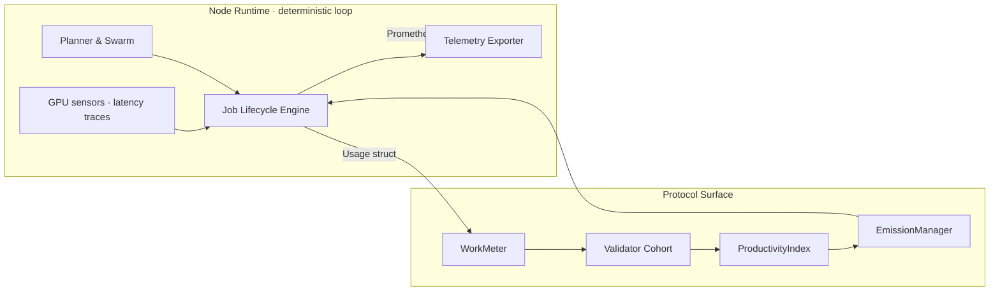
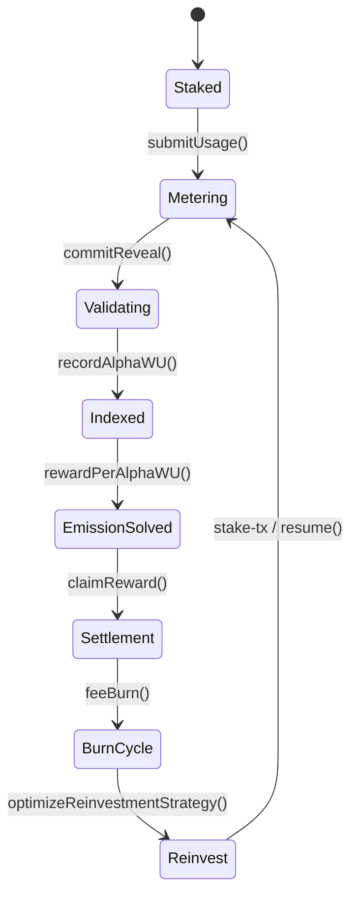
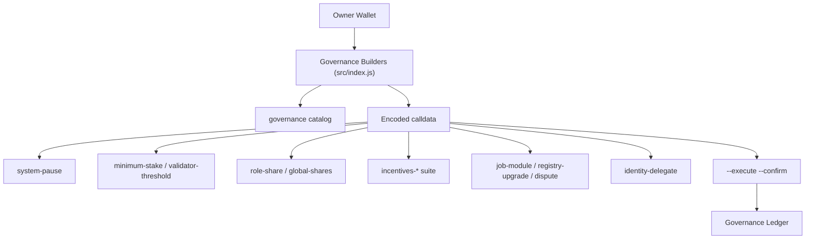

# AGI ALPHA NODES — Synthetic AI Labor & $AGIALPHA Token Economics

<!-- markdownlint-disable MD013 MD033 -->

  

  
  
  
  
  
  
  

> _AGI ALPHA Nodes continuously mint verifiable synthetic labor, settle it in $AGIALPHA, and broadcast every metric through a CI-guarded lattice under absolute owner control._

This dossier captures the latest economic firmware of **AGI Alpha Node v0**—the machine allocators model when they price programmable AI labor. Every claim below is wired to code paths, tests, or workflows inside this repository, and every lever remains under the direct custody of the contract owner.

---

## 1. Canonical α‑Work Unit Primitive

### 1.1 Equation of Record

\[
\alpha\text{-WU} = \mathrm{GPU}_s \times \mathrm{gflops}_{\text{norm}} \times \mathrm{ModelTier} \times \mathrm{SLO}_{\text{pass}} \times \mathrm{QV}
\]

- **GPUₛ** — Metered accelerator seconds captured by the diagnostics loop in [`src/orchestrator/nodeRuntime.js`](../src/orchestrator/nodeRuntime.js).
- **gflops_norm** — Governance-calibrated silicon normalization factors maintained by owner builders in [`src/services/governance.js`](../src/services/governance.js).
- **ModelTier** — Difficulty multiplier sourced from the capability catalogue in [`src/services/jobProfiles.js`](../src/services/jobProfiles.js).
- **SLO_pass** — Latency and uptime compliance derived from the monitor surfaces in [`src/telemetry/monitoring.js`](../src/telemetry/monitoring.js).
- **QV** — Validator quality verdicts orchestrated by the lifecycle engine in [`src/services/jobLifecycle.js`](../src/services/jobLifecycle.js).

The product is a fungible scalar representing validated synthetic labor independent of the silicon or model mix that produced it.

### 1.2 Measurement Pipeline

### 1.3 Instrumentation Ledger

| Factor | Runtime Source | Contract Surface | Repository Anchor |
| ------ | -------------- | ---------------- | ----------------- |
| GPUₛ & gflops_norm | Diagnostics via [`runNodeDiagnostics`](../src/orchestrator/nodeRuntime.js) | Usage payload hashed for WorkMeter | [`src/orchestrator/nodeRuntime.js`](../src/orchestrator/nodeRuntime.js) |
| ModelTier | Capability profiles and registry adapters | `JobRegistry` + `ValidationModule` | [`src/services/jobLifecycle.js`](../src/services/jobLifecycle.js) |
| SLO_pass | Monitor loop + validator attestation | `ValidationModule.commitReveal` | [`src/telemetry/monitoring.js`](../src/telemetry/monitoring.js) |
| QV | Peer-derived scoring | `ProductivityIndex.record` | [`src/services/governanceStatus.js`](../src/services/governanceStatus.js) & [`test/governance.integration.test.js`](../test/governance.integration.test.js) |

---

## 2. Token Supply Choreography ($AGIALPHA ↔ α‑WU)

### 2.1 Epoch Mechanics

1. **Stake ignition** — Operators stake $AGIALPHA (`0xa61a3b3a130a9c20768eebf97e21515a6046a1fa`, 18 decimals) using `node src/index.js stake-tx` before submitting on-chain.
2. **Usage attestation** — Sidecar runtime packages metered α‑WU payloads through [`submit`](../src/services/jobLifecycle.js) and lifecycle journal hooks that prepare `WorkMeter` usage transactions.
3. **Validator arbitration** — Commit–reveal loops scored in [`test/swarmOrchestrator.test.js`](../test/swarmOrchestrator.test.js) enforce SLO and QV integrity with slashing hooks.
4. **Productivity indexing** — `ProductivityIndex.totalAlphaWU(epoch)` aggregates validated labor for the epoch wage book.
5. **Emission solving** — [`EmissionManager.rewardPerAlphaWU`](../src/services/rewards.js) resolves the wage curve used by the CLI governance builders.
6. **Settlement & burns** — Jobs settle in $AGIALPHA; fee slices routed to the treasury are governed via `governance incentives-treasury`.
7. **Reinvestment loop** — [`optimizeReinvestmentStrategy`](../src/services/economics.js) computes the recommended reinvest basis points for the next epoch.

### 2.2 Flow Atlas

### 2.3 Owner-Controlled Modules

| Module | Core Function | Owner Control Vector | CLI Builder |
| ------ | ------------- | -------------------- | ----------- |
| `SystemPause` | Network-wide halt/resume | Pause, resume, or unpause every subsystem | `node src/index.js governance system-pause --system-pause <addr> --action pause` |
| `StakeManager` | Minimum stake & validator threshold | Adjust floors and quorum at will | `node src/index.js governance minimum-stake ...` · `governance validator-threshold ...` |
| `RewardEngine` | Role share allocation | Tune operator / validator / treasury shares | `node src/index.js governance role-share ...` · `governance global-shares ...` |
| `JobRegistry` | Module upgrades & disputes | Swap validation/reputation/dispute modules or escalate jobs | `node src/index.js governance job-module ...` · `governance dispute ...` |
| `IdentityRegistry` | Delegate operators | Add or revoke operators instantly | `node src/index.js governance identity-delegate ...` |
| `PlatformIncentives` | Stake routing, heartbeat grace, fees, treasury | Redirect stake manager, buffers, and fee paths | `node src/index.js governance incentives-manager ...` · `incentives-minimum ...` · `incentives-heartbeat ...` · `incentives-activation-fee ...` · `incentives-treasury ...` |

Every command above produces calldata plus a diff-aware summary; persisting the action requires `--execute --confirm`, which journals the payload through [`recordGovernanceAction`](../src/services/governanceLedger.js).

---

## 3. Owner Command Authority & Safety Nets

### Command Surfaces

| Capability | Description | Command Surface | Repository Anchor |
| ---------- | ----------- | --------------- | ----------------- |
| Pause / Resume | Instantly halt or relaunch every job pipeline | `node src/index.js governance system-pause --system-pause <addr> --action pause` | [`src/services/governance.js`](../src/services/governance.js) |
| Stake floors & quorum | Adjust minimum stake and validator counts live | `node src/index.js governance minimum-stake ...` · `governance validator-threshold ...` | [`src/services/governance.js`](../src/services/governance.js) |
| Role share tuning | Fine-tune basis points per actor or reset global shares | `node src/index.js governance role-share ...` · `governance global-shares ...` | [`src/services/governance.js`](../src/services/governance.js) |
| Registry rotation | Migrate validation/reputation/dispute modules or registry endpoints | `node src/index.js governance job-module ...` · `governance registry-upgrade ...` | [`src/services/governance.js`](../src/services/governance.js) |
| Delegation control | Allow or revoke identity delegates with audit trail | `node src/index.js governance identity-delegate ...` | [`src/services/governance.js`](../src/services/governance.js) |
| Incentive retuning | Repoint stake manager, adjust heartbeat grace, fees, or treasury | `node src/index.js governance incentives-* ...` | [`src/services/governance.js`](../src/services/governance.js) |
| ENS validation | Verify subdomain custody before runtime activation | `node src/index.js verify-ens --label <id> --address <0x...>` | [`src/services/ensVerifier.js`](../src/services/ensVerifier.js) |
| Ledger journaling | Persist calldata, metadata, and operator signatures | `node src/index.js ... --execute --confirm --ledger-root <dir>` | [`src/services/governanceLedger.js`](../src/services/governanceLedger.js) |

Vitest integration suites in [`test/governance.integration.test.js`](../test/governance.integration.test.js) and [`test/stakeActivation.test.js`](../test/stakeActivation.test.js) confirm that only the contract owner’s key passes every branch of the governance matrix.

---

## 4. Financial Intelligence & Productivity Metrics

### 4.1 Synthetic Labor Yield (SLY)

\[
\mathrm{SLY}_t = \frac{\sum \alpha\text{-WU}_{t}}{\mathrm{AGIALPHA}_{\text{circulating}, t}}
\]

- **Input feeds** — `ProductivityIndex.totalAlphaWU(epoch)` plus on-chain circulating supply of `$AGIALPHA`.
- **Interpretation** — Protocol-native yield curve exposing the productivity multiple of the network.

### 4.2 Treasury Autopilot

[`optimizeReinvestmentStrategy`](../src/services/economics.js) executes deterministic capital allocation:

1. Normalizes reward history, obligations, and reinvest options with 18-decimal precision.
2. Computes totals, averages, and mean absolute deviation to infer volatility penalties.
3. Applies owner-selected buffer policies (`minimumBufferBps`) and risk aversion weights.
4. Scores every strategy and returns the recommended basis points alongside buffer coverage metrics.

The CLI exposes the flow via `node src/index.js economics optimize --current-stake <amount> --rewards <csv|json> ...`, and [`test/economics.test.js`](../test/economics.test.js) validates every branch—including error handling for malformed histories.

### 4.3 Telemetry Dashboard

Prometheus gauges defined in [`src/orchestrator/monitorLoop.js`](../src/orchestrator/monitorLoop.js) emit:

- Stake posture, heartbeat recency, and activation readiness.
- α‑WU throughput per epoch, success ratios, and $AGIALPHA projections.
- Job registry compatibility, validation health, and governance diff advisories.

The metrics power the compliance ledger enforced by the CI pipeline and keep allocators synchronized with live productivity output.

---

## 5. Continuous Assurance & CI Enforcement

- **Workflow coverage** — [`.github/workflows/ci.yml`](../.github/workflows/ci.yml) runs linting, unit/integration tests, coverage, and Docker smoke tests on every push, PR, or manual trigger.
- **Required checks** — [`.github/required-checks.json`](../.github/required-checks.json) enforces `Lint Markdown & Links`, `Unit & Integration Tests`, `Coverage Report`, and `Docker Build & Smoke Test` on `main` and gated PRs.
- **Local mirror** — `npm run ci:verify` replicates the full matrix (`lint`, `test`, `coverage`) before any merge request.
- **Branch protection** — README and operator guides document exporting GitHub branch protection proofs for archival custody.

CI transcripts become part of every governance evidence pack to ensure emissions and wage updates never ship without a verified green badge.

---

## 6. Risk Surfaces & Mitigations

| Risk Vector | Mitigation | Evidence Path |
| ----------- | ---------- | ------------- |
| Hardware drift / misreported compute | Diagnostics normalization + validator recomputation trigger slashing | [`src/orchestrator/monitorLoop.js`](../src/orchestrator/monitorLoop.js) · [`test/monitorLoop.test.js`](../test/monitorLoop.test.js) |
| Governance misconfiguration | Diff-aware calldata builders gated by owner key | [`src/services/governance.js`](../src/services/governance.js) · [`test/governance.integration.test.js`](../test/governance.integration.test.js) |
| Treasury underfunding | Economics optimizer enforces buffer floors and risk aversion | [`src/services/economics.js`](../src/services/economics.js) |
| Documentation drift | Markdown + link lint wired to CI; failures block merges | [`package.json`](../package.json) |
| Operational blind spots | Telemetry gauges, ENS verification, and governance ledger halt runtime on anomaly | [`src/services/ensVerifier.js`](../src/services/ensVerifier.js) · [`src/services/governanceLedger.js`](../src/services/governanceLedger.js) |

---

## 7. Implementation Index

| Component | Description | File(s) |
| --------- | ----------- | ------- |
| CLI Command Spine | Sovereign runtime, governance, ENS, economics, and intelligence entry points | [`src/index.js`](../src/index.js) |
| Governance Builder Library | Encodes owner-only calldata, diffs, and ledger metadata | [`src/services/governance.js`](../src/services/governance.js) |
| ENS & Identity Guard | Validates ENS custody and identity registry delegates | [`src/services/ensVerifier.js`](../src/services/ensVerifier.js) |
| Job Lifecycle Engine | Discovery → apply → execute → submit → finalize pipeline | [`src/services/jobLifecycle.js`](../src/services/jobLifecycle.js) |
| Economics Optimizer | Reinvestment scoring, buffer enforcement, and reporting | [`src/services/economics.js`](../src/services/economics.js) |
| Telemetry Surface | Prometheus exporter and diagnostics loop | [`src/orchestrator/monitorLoop.js`](../src/orchestrator/monitorLoop.js) |
| Testing Harness | Vitest suites spanning governance, staking, ENS, lifecycle, and intelligence flows | [`test/`](../test) |

---

## 8. Activation Checklist for Allocators

1. **Clone & install** — `git clone … && npm ci` for a deterministic toolchain.
2. **Run local CI** — `npm run lint:md`, `npm run lint:links`, `npm test`, `npm run coverage`.
3. **Verify ENS custody** — `node src/index.js verify-ens --label <id> --address <0x…>`.
4. **Generate stake payload** — `node src/index.js stake-tx --amount <value> --incentives <0x…>` (18-decimal precision enforced).
5. **Activate runtime** — `node src/index.js status --label <id> --address <0x…> --auto-resume` to validate stake posture and emit Prometheus metrics.
6. **Govern parameters** — Use `node src/index.js governance catalog` to inspect owner functions, then issue targeted commands with `--execute --confirm` for ledger persistence.
7. **Monitor telemetry** — Scrape the Prometheus endpoint and archive CI transcripts, ledger entries, ENS proofs, staking transactions, and α‑WU ledgers as compliance artifacts.

---

**AGI ALPHA NODES** translate raw compute into programmable labor economics, while **$AGIALPHA** captures the wage curve. The entire economy is wired for immediate execution, auditability, and owner supremacy within this repository.
