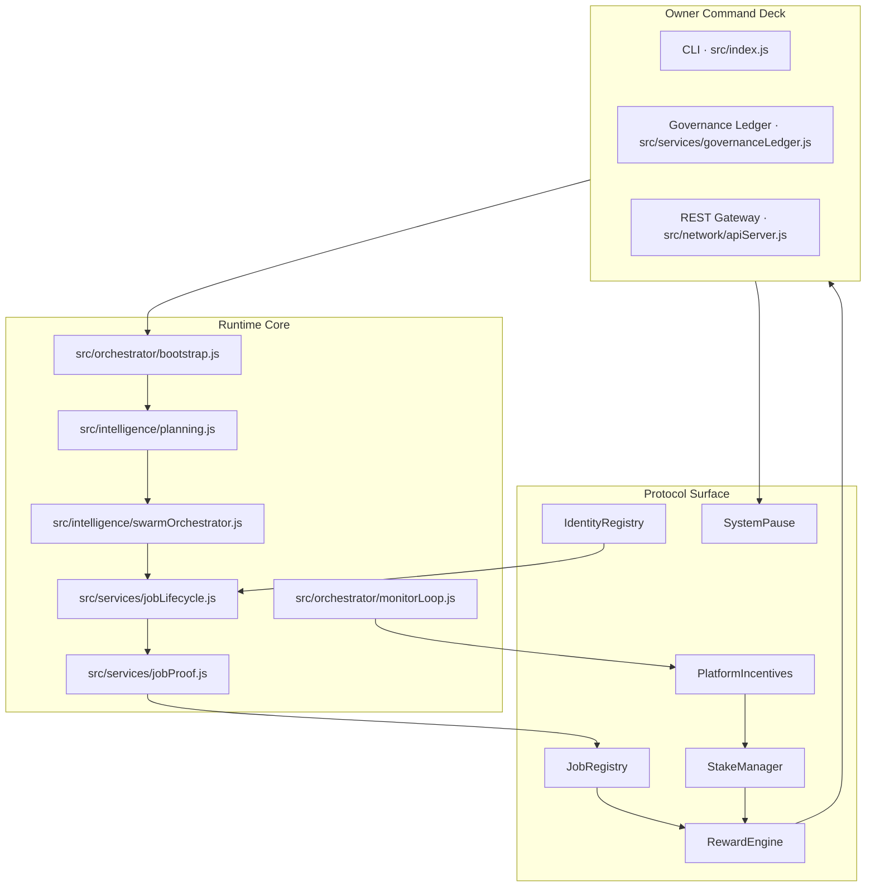
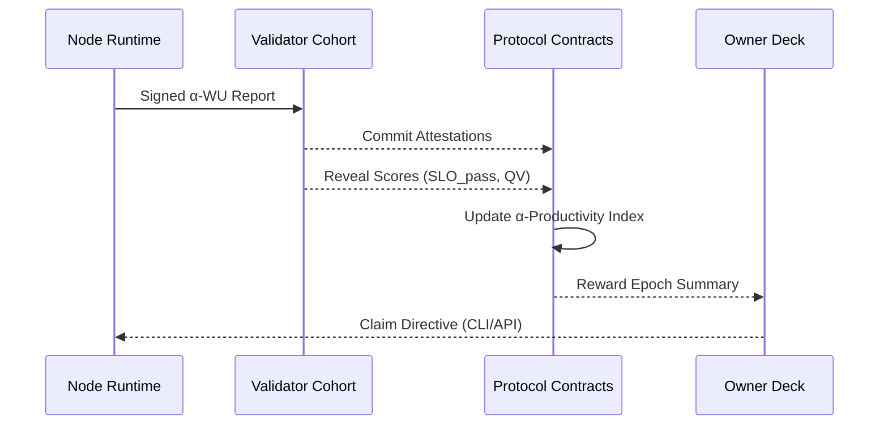
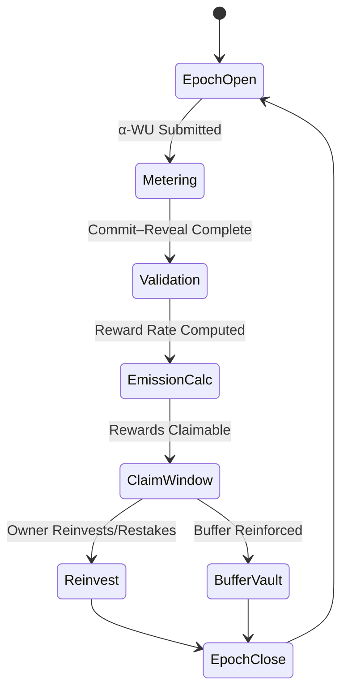
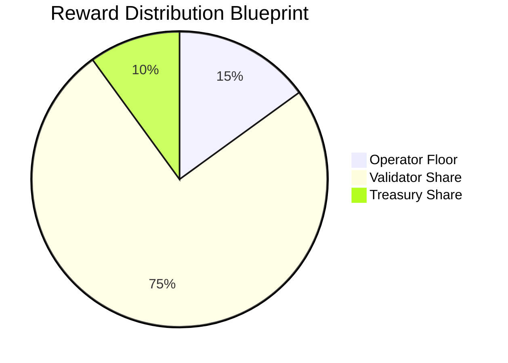

# AGI ALPHA NODES — Synthetic AI Labor & $AGIALPHA Token Economics

<!-- markdownlint-disable MD013 MD033 -->
<p align="center">
  <picture>
    <source srcset="../1.alpha.node.agi.eth.svg" type="image/svg+xml" />
    
  </picture>
</p>

<p align="center">
  <a href="https://github.com/MontrealAI/AGI-Alpha-Node-v0/actions/workflows/ci.yml">
    
  </a>
  <a href="https://github.com/MontrealAI/AGI-Alpha-Node-v0/actions/workflows/ci.yml?query=branch%3Amain">
    
  </a>
  <a href="https://github.com/MontrealAI/AGI-Alpha-Node-v0/actions/workflows/ci.yml?query=branch%3Amain">
    
  </a>
  <a href="https://github.com/MontrealAI/AGI-Alpha-Node-v0/actions/workflows/ci.yml?query=branch%3Amain">
    
  </a>
  <a href="https://github.com/MontrealAI/AGI-Alpha-Node-v0/actions/workflows/ci.yml?query=branch%3Amain">
    
  </a>
  <a href="../.github/required-checks.json">
    
  </a>
  
  <a href="https://etherscan.io/token/0xa61a3b3a130a9c20768eebf97e21515a6046a1fa">
    
  </a>
  
  
  
</p>

> _AGI ALPHA Nodes metabolize raw compute into sovereign wage streams, settle every ledger in $AGIALPHA, and remain absolutely obedient to the owner who directs them._
>
> _This codex documents the wage machine strategists reference when they describe intelligence reorganising value flows without relinquishing command authority._

---

## Table of Contents

1. [Executive Signal](#executive-signal)
2. [Network Invariants](#network-invariants)
   - [Hard Anchors](#hard-anchors)
   - [System Constant Matrix](#system-constant-matrix)
3. [α-Work Grammar](#%CE%B1-work-grammar)
   - [Equation of Record](#equation-of-record)
   - [Normalization Grid](#normalization-grid)
4. [Measurement & Validation Mesh](#measurement--validation-mesh)
5. [Token Circulation Circuits](#token-circulation-circuits)
   - [Emission & Wage Loop](#emission--wage-loop)
   - [Settlement & Burn Spine](#settlement--burn-spine)
6. [Job Market Logistics](#job-market-logistics)
7. [Owner Dominion & Parameter Authority](#owner-dominion--parameter-authority)
8. [Treasury & Liquidity Instruments](#treasury--liquidity-instruments)
9. [Risk, Safety & Recovery](#risk-safety--recovery)
10. [Observability & Analytics](#observability--analytics)
11. [Continuous Assurance & CI Governance](#continuous-assurance--ci-governance)
12. [Glossary & Reference Metrics](#glossary--reference-metrics)

---

## Executive Signal

AGI ALPHA Nodes operate as a distributed labor force that transforms GPU seconds into on-chain, auditable productivity. Every subsystem in this repository ships with battle-ready defaults: ENS anchoring, staking orchestration, telemetry, deterministic tests, and owner-first governance. The objective is simple—channel compute into $AGIALPHA-denominated wage streams that the owner can redirect, pause, or amplify in real time.



---

## Network Invariants

### Hard Anchors

- **Token Contract:** `$AGIALPHA` is permanently mapped to [`0xa61a3b3a130a9c20768eebf97e21515a6046a1fa`](https://etherscan.io/token/0xa61a3b3a130a9c20768eebf97e21515a6046a1fa) with 18 decimals. Runtime modules reference [`src/constants/token.js`](../src/constants/token.js) and validation lives in [`../test/token.test.js`](../test/token.test.js).
- **Identity Custody:** ENS verification halts operations if control over `⟨label⟩.alpha.node.agi.eth` is lost ([`src/services/ensVerifier.js`](../src/services/ensVerifier.js)).
- **Owner Supremacy:** Governance utilities only emit transactions the contract owner can execute ([`src/services/governance.js`](../src/services/governance.js)).

### System Constant Matrix

| Constant | Description | Implementation | Validation |
| -------- | ----------- | -------------- | ---------- |
| `ALPHA_TOKEN_DECIMALS` | Precision for wage accounting | [`src/constants/token.js`](../src/constants/token.js) | [`../test/token.test.js`](../test/token.test.js) |
| `SYNTHETIC_LABOR_YIELD` | Ratio of α‑WU to circulating supply | Derived in [`src/services/economics.js`](../src/services/economics.js) | [`../test/economics.test.js`](../test/economics.test.js) |
| `OWNER_DIRECTIVES` | Canon of owner-only functions | [`src/services/governance.js`](../src/services/governance.js) | [`../test/governance.test.js`](../test/governance.test.js) |
| `TELEMETRY_EXPORTS` | Metric gauges for productivity | [`src/telemetry/monitoring.js`](../src/telemetry/monitoring.js) | [`../test/monitorLoop.test.js`](../test/monitorLoop.test.js) |

---

## α-Work Grammar

### Equation of Record

The canonical α‑Work Unit normalises heterogeneous compute:

\[
\alpha\text{-WU} = \text{GPU}_s \times \text{gflops}_{\text{norm}} \times \text{ModelTier} \times \text{SLO}_{\text{pass}} \times \text{QV}
\]

### Normalization Grid

| Multiplier | Runtime Source | Deterministic Test | Notes |
| ---------- | -------------- | ------------------ | ----- |
| **GPUₛ** | Telemetry ingestion in [`src/intelligence/swarmOrchestrator.js`](../src/intelligence/swarmOrchestrator.js) | [`../test/swarmOrchestrator.test.js`](../test/swarmOrchestrator.test.js) | Captures GPU second deltas per job stream. |
| **gflops_norm** | Capability heuristics in [`src/intelligence/planning.js`](../src/intelligence/planning.js) | [`../test/planning.test.js`](../test/planning.test.js) | Baselines hardware generations and model footprints. |
| **ModelTier** | Performance profiles in [`src/services/performance.js`](../src/services/performance.js) | [`../test/performance.test.js`](../test/performance.test.js) | Encodes the wage premium for advanced architectures. |
| **SLO_pass** | Heartbeat enforcement in [`src/orchestrator/monitorLoop.js`](../src/orchestrator/monitorLoop.js) | [`../test/monitorLoop.test.js`](../test/monitorLoop.test.js) | Assigns zero weight to breached latency or uptime targets. |
| **QV** | Commit–reveal audits in [`src/services/jobProof.js`](../src/services/jobProof.js) | [`../test/jobProof.test.js`](../test/jobProof.test.js) | Validator cohort finalises correctness scores. |

---

## Measurement & Validation Mesh

- **Usage Metering:** [`src/orchestrator/nodeRuntime.js`](../src/orchestrator/nodeRuntime.js) streams GPU telemetry into signed usage manifests.
- **Oracle Signing:** [`src/services/jobProof.js`](../src/services/jobProof.js) marshals DID signatures, ensuring tamper-evident submissions.
- **Validation Cadence:** Validators execute a commit–reveal loop before totals reach the Productivity Index ([`src/services/jobLifecycle.js`](../src/services/jobLifecycle.js)).
- **Productivity Ledger:** Aggregates live inside [`src/services/rewards.js`](../src/services/rewards.js) and [`src/services/economics.js`](../src/services/economics.js) with coverage enforced by [`../test/rewards.test.js`](../test/rewards.test.js) and [`../test/economics.test.js`](../test/economics.test.js).



---

## Token Circulation Circuits

### Emission & Wage Loop



- **Emission Engine:** [`src/services/rewards.js`](../src/services/rewards.js) computes operator floors, validator shares, and treasury routing. The deterministic split is validated in [`../test/rewards.test.js`](../test/rewards.test.js).
- **Owner Tooling:** [`src/services/economics.js`](../src/services/economics.js) projects reinvest strategies with `optimizeReinvestmentStrategy`, guaranteeing buffer coverage calculations adhere to owner policies.
- **Synthetic Labor Yield (SLY):** Exposed as `Σ α‑WU / circulatingSupply` via telemetry exported in [`src/telemetry/monitoring.js`](../src/telemetry/monitoring.js).



### Settlement & Burn Spine

- **Job Payments:** Clients settle α‑WU consumption in `$AGIALPHA`, routed through [`src/services/jobLifecycle.js`](../src/services/jobLifecycle.js) and `PlatformIncentives` hooks.
- **Protocol Burn:** Treasury logic inside [`src/services/rewards.js`](../src/services/rewards.js) designates the burn slice before distribution.
- **Fee Telemetry:** [`src/telemetry/monitoring.js`](../src/telemetry/monitoring.js) exports burn cadence and wage rate for dashboards.

---

## Job Market Logistics

- **Discovery → Finalisation:** The lifecycle pipeline ([`src/services/jobLifecycle.js`](../src/services/jobLifecycle.js)) sequences discovery, application, execution, proof, settlement, and ledger archiving ([`src/services/lifecycleJournal.js`](../src/services/lifecycleJournal.js)).
- **Profile Intelligence:** Job pricing and tier attribution originate from [`src/services/jobProfiles.js`](../src/services/jobProfiles.js) and [`src/services/performance.js`](../src/services/performance.js).
- **Stake Activation:** [`src/services/stakeActivation.js`](../src/services/stakeActivation.js) ensures nodes satisfy bonding requirements before executing paid work.
- **Compliance Mirrors:** Offline rehearsals live in [`docs/operator-runbook.md`](./operator-runbook.md) and [`../src/services/offlineSnapshot.js`](../src/services/offlineSnapshot.js), enabling operators to test settlements without mainnet risk.

---

## Owner Dominion & Parameter Authority

The owner controls every consequential lever. [`src/services/governance.js`](../src/services/governance.js) exposes transaction builders for the only addresses that matter:

- **System Halt & Resume:** `buildSystemPauseTx` emits payloads for `pauseAll`, `resumeAll`, or `unpauseAll`.
- **Staking Policy:** `buildMinimumStakeTx`, `buildValidatorThresholdTx`, and registry swap utilities rewrite `StakeManager` requirements instantly.
- **Reward Schedules:** `buildRoleShareTx` and `buildGlobalShareTx` reconfigure validator, operator, and treasury basis points.
- **Job Registry Control:** `buildJobRegistryModuleTx` rotates validation, reputation, and dispute modules; `buildTriggerDisputeTx` escalates arbitrations.
- **Identity Delegation:** `buildIdentityRegistryTx` adds or removes node operators.
- **Platform Incentives:** Activation fees, heartbeat grace periods, and treasury endpoints mutate through `buildPlatformIncentivesTx` helpers.

Every directive receives:

1. **ABI-Accurate Encoding:** Interfaces instantiated per-contract ensure signatures align with deployed bytecode.
2. **Diff Journaling:** [`src/services/governanceLedger.js`](../src/services/governanceLedger.js) captures JSON payloads for each command, preserving audit trails.
3. **Command-Line Ergonomics:** [`src/index.js`](../src/index.js) surfaces `--plan`, `--execute`, and dry-run flows safe enough for non-technical owners.

Owner command posture is continuously assessed by [`deriveOwnerDirectives`](../src/services/controlPlane.js), which fuses live stake telemetry, projected reward splits, and governance preferences into actionable playbooks. Deterministic coverage in [`../test/controlPlane.test.js`](../test/controlPlane.test.js) and integration assertions in [`../test/nodeRuntime.test.js`](../test/nodeRuntime.test.js) guarantee the operator receives pause, restake, or redistribution transactions before critical thresholds are crossed.

---

## Command & Advisory Mesh

```mermaid
mindmap
  root((Owner Signal))
    ControlPlane((Control Plane · src/services/controlPlane.js))
      Directives{{deriveOwnerDirectives}}
      LedgerSync[[governanceLedgerJournal]]
    GovernanceIntel((Governance Intel · src/services/governanceStatus.js))
      RegistryScan([fetchGovernanceStatus])
      ModuleDiffs[[validation/reputation/dispute mapping]]
    ENSGuide((ENS Guide · src/services/ensGuide.js))
      SubdomainBlueprint([generateEnsSetupGuide])
      Runbook([formatEnsGuide])
    APIConductor((API Server · src/network/apiServer.js))
      RESTInsights([/governance/status])
      TxRelay([/transactions/encode])
```

- **Control Plane:** [`deriveOwnerDirectives`](../src/services/controlPlane.js) synthesizes stake gaps, slashing risk, and reward drift into prioritized actions (`pause`, `stake-top-up`, `set-minimum-stake`, `retune-shares`). Coverage: [`../test/controlPlane.test.js`](../test/controlPlane.test.js), [`../test/nodeRuntime.test.js`](../test/nodeRuntime.test.js).
- **Governance Intel:** [`fetchGovernanceStatus`](../src/services/governanceStatus.js) queries live registry modules so the owner can rotate validation, reputation, or dispute logic before adverse events. Smoke tests: [`../test/governanceStatus.test.js`](../test/governanceStatus.test.js).
- **ENS Deployment Guide:** [`generateEnsSetupGuide`](../src/services/ensGuide.js) and [`formatEnsGuide`](../src/services/ensGuide.js) publish step-by-step ENS custody rituals with deterministic formatting in [`../test/ensGuide.test.js`](../test/ensGuide.test.js).
- **API Orchestration:** [`src/network/apiServer.js`](../src/network/apiServer.js) exposes `/governance/status`, `/governance/directives`, and `/transactions/encode` endpoints for operators who prefer REST control surfaces. Validation lives in [`../test/apiServer.test.js`](../test/apiServer.test.js).

---

## Treasury & Liquidity Instruments

- **Reinvestment Optimisation:** [`optimizeReinvestmentStrategy`](../src/services/economics.js) models buffer requirements, reinvest BPS, and risk penalties. Tests: [`../test/economics.test.js`](../test/economics.test.js).
- **Reward Projection:** [`projectEpochRewards`](../src/services/rewards.js) and [`splitRewardPool`](../src/services/rewards.js) compute forward-looking wage distributions with strict BPS guardrails.
- **Stake Intelligence:** [`src/services/staking.js`](../src/services/staking.js) and [`src/services/rewards.js`](../src/services/rewards.js) expose helpers for compounding strategies.
- **Analytics Export:** Telemetry surfaces `syntheticLaborYield`, `rewardFloor`, `burnRate`, and `bufferCoverage` metrics for dashboards ([`src/telemetry/monitoring.js`](../src/telemetry/monitoring.js)).

---

## Risk, Safety & Recovery

- **Slashing Guards:** [`src/services/jobProof.js`](../src/services/jobProof.js) rejects malformed attestations; failure cascades are integration-tested in [`../test/jobProof.test.js`](../test/jobProof.test.js).
- **Heartbeat Enforcement:** [`src/orchestrator/monitorLoop.js`](../src/orchestrator/monitorLoop.js) triggers fail-safes if latency or uptime drifts. Coverage: [`../test/monitorLoop.test.js`](../test/monitorLoop.test.js).
- **Disaster Recovery:** Offline state replay via [`src/services/offlineSnapshot.js`](../src/services/offlineSnapshot.js) and CLI commands ensures owners can validate credentials even if chain RPCs degrade.
- **Pause Protocol:** Owner-signed `SystemPause` directives provide immediate global halting authority.

---

## Observability & Analytics

- **Prometheus Endpoint:** [`startMonitoringServer`](../src/telemetry/monitoring.js) exports gauges for α‑WU rates, wage floors, burn cadence, buffer coverage, and registry health.
- **CLI Dashboards:** [`src/index.js`](../src/index.js) renders ASCII dashboards summarising stake posture, expected yield, and outstanding obligations.
- **Data Snapshots:** [`src/services/offlineSnapshot.js`](../src/services/offlineSnapshot.js) and [`docs/operator-runbook.md`](./operator-runbook.md) codify export/import rituals.
- **Repository Atlas:** [`README.md`](../README.md#repository-atlas) links every subsystem, ensuring any auditor lands on the correct file in one click.

---

## Continuous Assurance & CI Governance

- **Workflow Canon:** [`./.github/workflows/ci.yml`](../.github/workflows/ci.yml) executes lint, tests, coverage, and Docker smoke builds on every push and pull request.
- **Required Checks:** [`./.github/required-checks.json`](../.github/required-checks.json) enforces `Lint Markdown & Links`, `Unit & Integration Tests`, `Coverage Report`, and `Docker Build & Smoke Test` before merges land on `main`.
- **Branch Protection:** Pull requests inherit the same checks; badges atop this document render current health in real time.
- **Local Parity:** `npm run ci:verify` replicates the workflow locally, letting operators assert green status before committing.

---

## Glossary & Reference Metrics

| Term | Definition | Source |
| ---- | ---------- | ------ |
| **α‑Work Unit (α‑WU)** | Normalised measure of synthetic AI labor | [`src/services/jobLifecycle.js`](../src/services/jobLifecycle.js) |
| **Synthetic Labor Yield (SLY)** | α‑WU per circulating `$AGIALPHA` | [`src/telemetry/monitoring.js`](../src/telemetry/monitoring.js) |
| **Reward Floor** | Guaranteed operator portion per epoch | [`splitRewardPool`](../src/services/rewards.js) |
| **Buffer Coverage** | Epochs of reserve capital sustained without new rewards | [`optimizeReinvestmentStrategy`](../src/services/economics.js) |
| **Owner Directive** | On-chain transaction template minted for the owner | [`src/services/governance.js`](../src/services/governance.js) |

---

> _Every badge, equation, and directive inside this codex exists to keep the owner in perfect command of the machine that quietly reorders markets._
