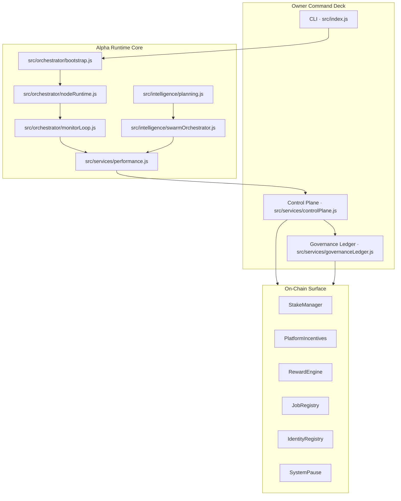
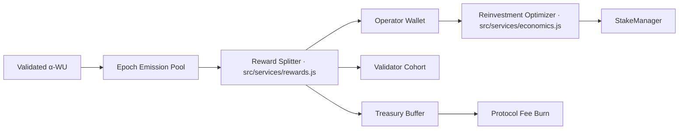
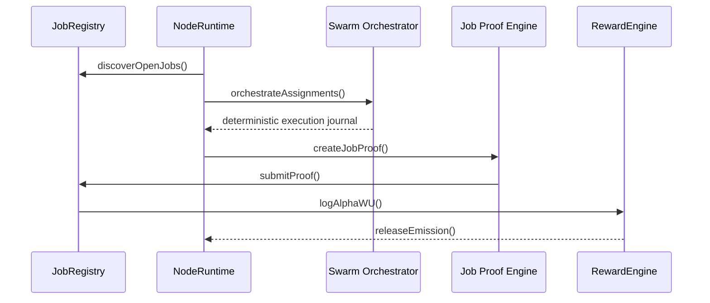
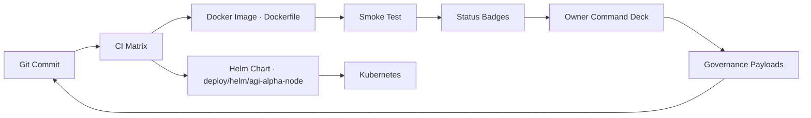
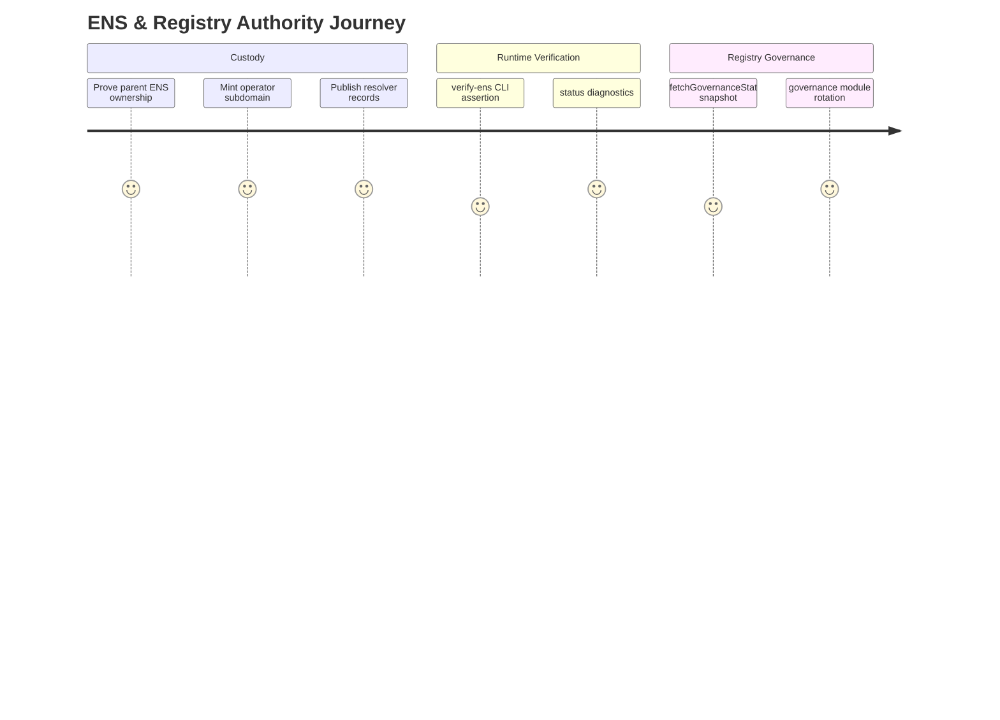
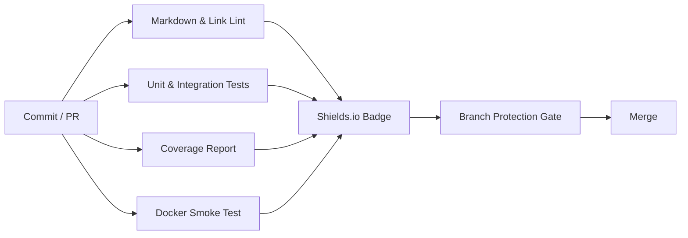

# AGI ALPHA NODES — Synthetic AI Labor & $AGIALPHA Token Economics

<!-- markdownlint-disable MD013 MD033 -->

  <picture>
    <source srcset="../1.alpha.node.agi.eth.svg" type="image/svg+xml" />
    
  </picture>

  
  
  
  
  
  
  
  
  
  

> _AGI ALPHA Nodes metabolize raw compute into sovereign wage streams, settle every ledger in $AGIALPHA, and remain absolutely obedient to the owner who directs them._
>
> _This codex documents the wage machine markets reference when they describe intelligence that reorganises value flows without relinquishing command authority._

---

## Table of Contents

1. [Economic Navigation Map](#economic-navigation-map)
   - [Synthetic Labor Field](#synthetic-labor-field)
   - [Observability Anchors](#observability-anchors)
   - [Governance Telemetry](#governance-telemetry)
2. [Canonical α-Work Canon](#canonical-%CE%B1-work-canon)
   - [Equation of Record](#equation-of-record)
   - [Normalization & Instrumentation](#normalization--instrumentation)
   - [Validation Lattice](#validation-lattice)
3. [Token Engine & Wage Dynamics](#token-engine--wage-dynamics)
   - [Emission & Wage Circuit](#emission--wage-circuit)
   - [Reward Split Mathematics](#reward-split-mathematics)
   - [Synthetic Labor Yield](#synthetic-labor-yield)
4. [Job Market & Settlement Logistics](#job-market--settlement-logistics)
5. [Owner Dominion & Parameter Control](#owner-dominion--parameter-control)
6. [Treasury Intelligence & Risk Posture](#treasury-intelligence--risk-posture)
7. [Liquidity, Access & Vault Hydration](#liquidity-access--vault-hydration)
8. [Deployment Surfaces & Policy Channels](#deployment-surfaces--policy-channels)
9. [Identity, ENS & Registry Authority](#identity-ens--registry-authority)
10. [Safety, Slashing & Recovery](#safety-slashing--recovery)
11. [Continuous Assurance & Branch Protection](#continuous-assurance--branch-protection)
12. [Glossary of Economic Signals](#glossary-of-economic-signals)

---

## Economic Navigation Map

### Synthetic Labor Field

Each arrow is backed by concrete modules that are already wired into the runtime. The bootstrapper hydrates configuration and secrets before orchestrating the job lifecycle ([`src/orchestrator/bootstrap.js`](../src/orchestrator/bootstrap.js)). The control plane distils telemetry into signed governance directives that only execute once the owner approves them ([`src/services/controlPlane.js`](../src/services/controlPlane.js)).

### Observability Anchors

- **Prometheus Surface** — [`startMonitoringServer`](../src/telemetry/monitoring.js) exposes stake health, throughput, α‑WU projections, and registry compatibility warnings as scrape-ready metrics.
- **Offline Snapshots** — [`loadOfflineSnapshot`](../src/services/offlineSnapshot.js) and [`buildOfflineVerification`](../src/services/offlineSnapshot.js) let operators rehearse ENS custody, stake posture, and reward routing without touching mainnet.
- **Deterministic Diagnostics** — Tests across [`../test`](../test) keep every metric honest, including [`monitorLoop.test.js`](../test/monitorLoop.test.js) for heartbeat enforcement and [`performance.test.js`](../test/performance.test.js) for throughput projection.

### Governance Telemetry

- [`fetchGovernanceStatus`](../src/services/governanceStatus.js) surfaces live addresses for the active registries, pause module, and reward engine so the owner knows exactly where directives will land.
- [`governanceLedger.js`](../src/services/governanceLedger.js) records immutable JSON dossiers whenever `--execute` is invoked, providing a paper trail for auditors and the owner’s future self.
- [`docs/operator-runbook.md`](./operator-runbook.md) captures the ritual: verify badges, replay CI locally, validate Helm renders, then sign.

---

## Canonical α-Work Canon

### Equation of Record

The network standardises synthetic labor with the α‑Work Unit:

\[
\alpha\text{-WU} = \text{GPU}_s \times \text{gflops}_{\text{norm}} \times \text{ModelTier} \times \text{SLO}_{\text{pass}} \times \text{QV}
\]

Every multiplier is observable inside the runtime:

| Multiplier | Origin in Runtime | Verification |
| ---------- | ----------------- | ------------ |
| **GPUₛ** | Telemetry ingestion from job execution loops and swarm orchestrator throughput ([`src/intelligence/swarmOrchestrator.js`](../src/intelligence/swarmOrchestrator.js)). | [`swarmOrchestrator.test.js`](../test/swarmOrchestrator.test.js) |
| **gflops_norm** | Capability matrices inside planning heuristics ([`src/intelligence/planning.js`](../src/intelligence/planning.js)). | [`planning.test.js`](../test/planning.test.js) |
| **ModelTier** | Difficulty tiers in performance profiles ([`src/services/performance.js`](../src/services/performance.js)). | [`performance.test.js`](../test/performance.test.js) |
| **SLO_pass** | Heartbeat and uptime enforcement ([`src/orchestrator/monitorLoop.js`](../src/orchestrator/monitorLoop.js)). | [`monitorLoop.test.js`](../test/monitorLoop.test.js) |
| **QV** | Commit–reveal attestations handled in [`src/services/jobProof.js`](../src/services/jobProof.js). | [`jobProof.test.js`](../test/jobProof.test.js) |

### Normalization & Instrumentation

- **Precision** — `$AGIALPHA` is locked to contract `0xa61a3b3a130a9c20768eebf97e21515a6046a1fa` with 18 decimals ([`src/constants/token.js`](../src/constants/token.js); [`token.test.js`](../test/token.test.js)).
- **Formatting** — [`formatTokenAmount`](../src/utils/formatters.js) and [`parseTokenAmount`](../src/utils/formatters.js) enforce decimal discipline across analytics and staking flows (validated by [`formatters.test.js`](../test/formatters.test.js)).
- **Snapshots** — [`lifecycleJournal.js`](../src/services/lifecycleJournal.js) writes deterministic JSON snapshots so α‑WU trails stay auditable.

### Validation Lattice

- **Lifecycle Assertions** — [`jobLifecycle.js`](../src/services/jobLifecycle.js) handles discovery → apply → execute → submit → finalize; [`jobLifecycle.test.js`](../test/jobLifecycle.test.js) proves the transitions.
- **Network Compatibility** — [`governanceStatus.test.js`](../test/governanceStatus.test.js) ensures ABI maps match deployed registries before directives are issued.
- **Stress Harness** — [`stressHarness.js`](../src/intelligence/stressHarness.js) replays adversarial epochs, with coverage by [`stressHarness.test.js`](../test/stressHarness.test.js).

---

## Token Engine & Wage Dynamics

### Emission & Wage Circuit

- [`projectEpochRewards`](../src/services/rewards.js) and [`splitRewardPool`](../src/services/rewards.js) codify how emissions split between operator, validators, and treasury. Assertions live in [`rewards.test.js`](../test/rewards.test.js).
- [`stakeActivation.js`](../src/services/stakeActivation.js) takes those splits and encodes the precise allowance + activation call so the owner can compounding stake without manual ABI work (verified by [`stakeActivation.test.js`](../test/stakeActivation.test.js)).
- [`staking.js`](../src/services/staking.js) watches minimums, deficits, and penalties, surfacing them to the control plane with coverage in [`staking.test.js`](../test/staking.test.js).

### Reward Split Mathematics

For a pool \(P\) and share basis points `bps`:

\[
\text{share} = \frac{P \times \text{bps}}{10\,000}
\]

Implementation: [`calculateRewardShare`](../src/services/rewards.js). Edge conditions such as share sums and floor enforcement are proven in [`rewards.test.js`](../test/rewards.test.js).

### Synthetic Labor Yield

- [`optimizeReinvestmentStrategy`](../src/services/economics.js) ranks reinvest options against buffer policy and upcoming obligations.
- [`economics.test.js`](../test/economics.test.js) calculates risk penalties, buffer coverage, and ensures the recommended plan is deterministic.
- [`summarizeStrategy`](../src/services/economics.js) feeds dashboards and CLI readouts so the owner sees labour yield versus buffer posture in human terms.

---

## Job Market & Settlement Logistics

- Discovery & application live in [`jobLifecycle.js`](../src/services/jobLifecycle.js) and are validated by [`jobLifecycle.test.js`](../test/jobLifecycle.test.js).
- Execution is delegated to specialist swarms via [`swarmOrchestrator.js`](../src/intelligence/swarmOrchestrator.js), while [`learningLoop.js`](../src/intelligence/learningLoop.js) adjusts strategies (covered by [`swarmOrchestrator.test.js`](../test/swarmOrchestrator.test.js) and [`learningLoop.test.js`](../test/learningLoop.test.js)).
- Proof packaging and submission is executed in [`jobProof.js`](../src/services/jobProof.js) with deterministic tests at [`jobProof.test.js`](../test/jobProof.test.js).
- REST endpoints for external auditors and dashboards are served by [`network/apiServer.js`](../src/network/apiServer.js) and validated via [`apiServer.test.js`](../test/apiServer.test.js).

---

## Owner Dominion & Parameter Control

The contract owner can retune every critical parameter without downtime. The control plane prepares transactions; the owner signs.

| Capability | Builder | Target Contract | Test Coverage |
| ---------- | ------- | ---------------- | ------------- |
| Pause / resume workloads | [`buildSystemPauseTx`](../src/services/governance.js) | `SystemPause` | [`governance.test.js`](../test/governance.test.js) |
| Adjust minimum stake & validator thresholds | [`buildMinimumStakeTx`](../src/services/governance.js), [`buildValidatorThresholdTx`](../src/services/governance.js) | `StakeManager` | [`governance.integration.test.js`](../test/governance.integration.test.js) |
| Reassign registry contracts | [`buildStakeRegistryUpgradeTx`](../src/services/governance.js) | `StakeManager`, `JobRegistry`, `IdentityRegistry` | [`controlPlane.test.js`](../test/controlPlane.test.js) |
| Rewire reward shares and custom roles | [`buildGlobalSharesTx`](../src/services/governance.js), [`buildRoleShareTx`](../src/services/governance.js) | `RewardEngine` | [`rewards.test.js`](../test/rewards.test.js) |
| Rotate validation / reputation / dispute modules | [`buildJobRegistryUpgradeTx`](../src/services/governance.js), [`buildDisputeTriggerTx`](../src/services/governance.js) | `JobRegistry` | [`governance.integration.test.js`](../test/governance.integration.test.js) |
| Reconfigure incentives hooks, heartbeat grace & fees | [`buildIncentivesStakeManagerTx`](../src/services/governance.js), [`buildIncentivesMinimumStakeTx`](../src/services/governance.js), [`buildIncentivesHeartbeatTx`](../src/services/governance.js), [`buildIncentivesActivationFeeTx`](../src/services/governance.js), [`buildIncentivesTreasuryTx`](../src/services/governance.js) | `PlatformIncentives` | [`controlPlane.test.js`](../test/controlPlane.test.js) |

[`deriveOwnerDirectives`](../src/services/controlPlane.js) fuses stake telemetry, projected rewards, and governance state into a ranked action stack. It never executes a transaction on its own; it simply outputs ready-to-sign payloads for the owner. Tests in [`controlPlane.test.js`](../test/controlPlane.test.js) assert that emergency pauses, stake top-ups, and share adjustments are generated with the correct urgency.

---

## Treasury Intelligence & Risk Posture

- [`performance.js`](../src/services/performance.js) estimates throughput, success rate, and earnings; [`performance.test.js`](../test/performance.test.js) validates the numbers.
- [`economics.js`](../src/services/economics.js) determines reinvestment, buffer requirements, and risk penalties.
- [`rewards.js`](../src/services/rewards.js) calculates actual payouts, while [`staking.js`](../src/services/staking.js) guards against deficits and slashing.
- [`offlineSnapshot.js`](../src/services/offlineSnapshot.js) lets operators simulate treasury inflows before mainnet activation.

Together these modules give the owner a live Synthetic Labor Yield dashboard, ensuring capital can be routed immediately toward growth or reserves based on deterministic analytics.

---

## Liquidity, Access & Vault Hydration

- `$AGIALPHA` canonical address and checksum enforcement live in [`src/constants/token.js`](../src/constants/token.js); [`token.test.js`](../test/token.test.js) guarantees the checksum logic.
- [`stakeActivation.js`](../src/services/stakeActivation.js) packages allowance + activation transactions so a single signature stakes tokens, verified by [`stakeActivation.test.js`](../test/stakeActivation.test.js).
- Vault hydration is handled by [`secretManager.js`](../src/services/secretManager.js), which fetches the operator key over HTTPS with abortable requests and structured logging so the owner can rotate custody without redeploying the node runtime.
- Configuration schema enforcement sits in [`src/config/schema.js`](../src/config/schema.js), with [`config.test.js`](../test/config.test.js) ensuring every environment variable is validated before runtime launch.

---

## Deployment Surfaces & Policy Channels

- Deterministic containers build from [`Dockerfile`](../Dockerfile) and are smoke-tested via `docker run … --help` in CI.
- Helm releases rely on [`deploy/helm/agi-alpha-node`](../deploy/helm/agi-alpha-node) and the operator runbook to enforce template linting before promotion.
- The cycle closes when the owner inspects badges, reviews governance ledgers, and signs policy updates.

---

## Identity, ENS & Registry Authority

- [`ensVerifier.js`](../src/services/ensVerifier.js) blocks activation when ENS authority is missing (tested in [`ensVerifier.test.js`](../test/ensVerifier.test.js)).
- [`ensGuide.js`](../src/services/ensGuide.js) prints deterministic ENS setup steps for operators and auditors (backed by [`ensGuide.test.js`](../test/ensGuide.test.js)).
- [`ensConstants.js`](../src/services/ensConstants.js) keeps labels normalised; tests at [`ensConstants.test.js`](../test/ensConstants.test.js) prove it.

---

## Safety, Slashing & Recovery

- [`monitorLoop.js`](../src/orchestrator/monitorLoop.js) triggers alarms for stale heartbeats and stake deficits; [`monitorLoop.test.js`](../test/monitorLoop.test.js) validates recovery sequences.
- [`staking.js`](../src/services/staking.js) projects deficit, penalty, and recommended actions with coverage in [`staking.test.js`](../test/staking.test.js).
- [`stressHarness.js`](../src/intelligence/stressHarness.js) simulates cascading penalties so the owner rehearses pause + replenish strategies (validated by [`stressHarness.test.js`](../test/stressHarness.test.js)).
- [`governance.js`](../src/services/governance.js) exposes `triggerDispute` hooks so fraudulent work can be isolated instantly (integration tested in [`governance.integration.test.js`](../test/governance.integration.test.js)).

---

## Continuous Assurance & Branch Protection

- [`ci.yml`](../.github/workflows/ci.yml) executes linting, tests, coverage, and Docker smoke tests on every push and pull request targeting `main`.
- Required checks are codified in [`required-checks.json`](../.github/required-checks.json) and mirrored in the README badges so status is visible at a glance.
- Local parity commands (`npm run ci:lint`, `npm run ci:test`, `npm run ci:coverage`, `npm run ci:verify`) live in [`package.json`](../package.json) and are enforced by Husky scripts ([`scripts/prepare-husky.cjs`](../scripts/prepare-husky.cjs)).

---

## Glossary of Economic Signals

| Signal | Definition | Runtime Source |
| ------ | ---------- | -------------- |
| **α‑WU** | Normalised unit of AI labor combining compute, capability, compliance, and quality. | [`jobLifecycle.js`](../src/services/jobLifecycle.js) |
| **Synthetic Labor Yield (SLY)** | Ratio of validated α‑WU to circulating `$AGIALPHA`, used to judge productivity-backed yield. | [`economics.js`](../src/services/economics.js) |
| **Stake Deficit** | Tokens required to restore StakeManager minimums. | [`staking.js`](../src/services/staking.js) |
| **Reward Pool Projection** | Expected epoch emission split, including operator floor and validator shares. | [`rewards.js`](../src/services/rewards.js) |
| **Governance Directive** | Action bundle ready for owner signature. | [`controlPlane.js`](../src/services/controlPlane.js) |
| **Ledger Artifact** | Immutable governance execution record. | [`governanceLedger.js`](../src/services/governanceLedger.js) |
| **Offline Snapshot** | JSON dossier proving ENS custody and treasury posture without mainnet connectivity. | [`offlineSnapshot.js`](../src/services/offlineSnapshot.js) |

---

_The AGI Alpha Node runtime grants its owner total command of a network-scale synthetic labor force. Every metric, contract hook, and governance control is engineered for immediate execution, absolute auditability, and relentless productivity backed by $AGIALPHA._
