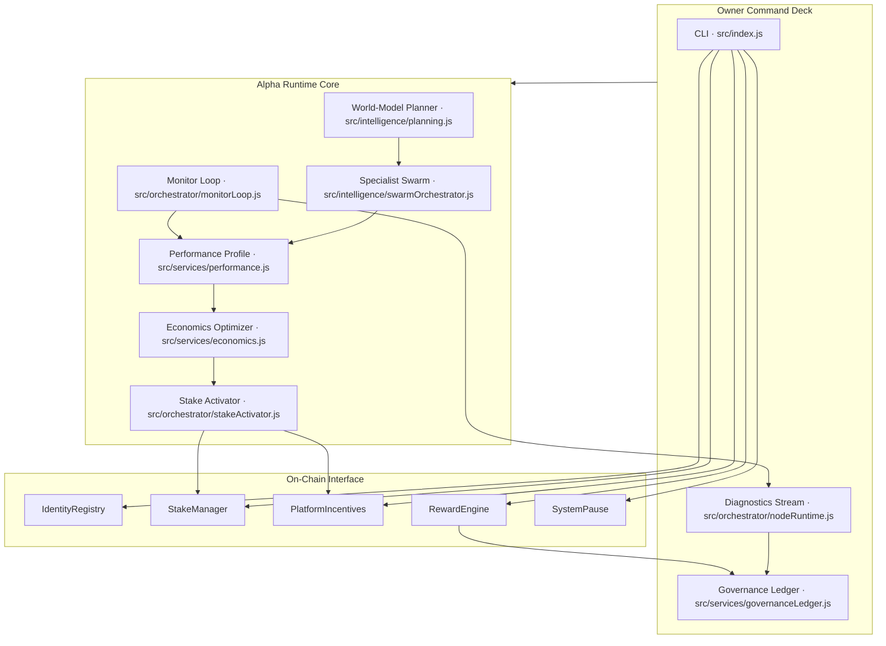
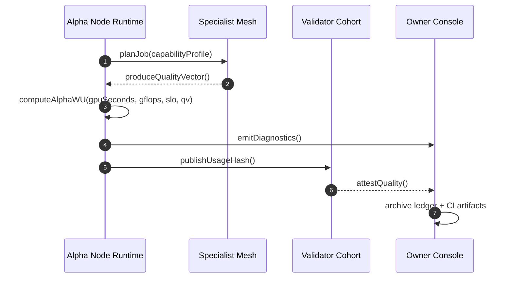
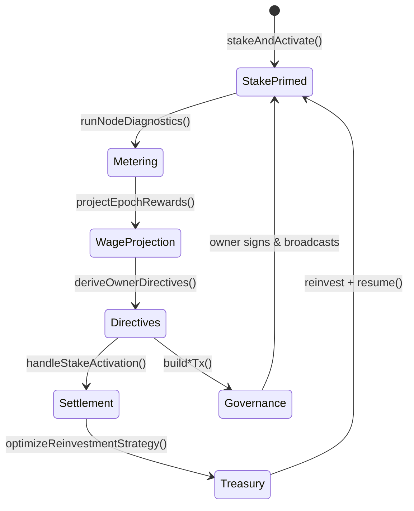
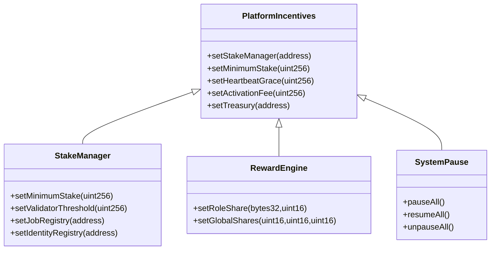
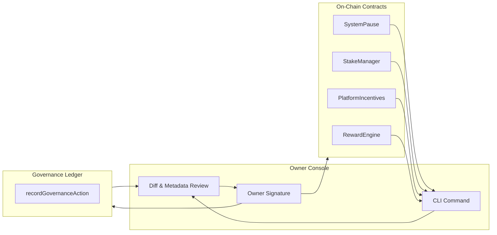
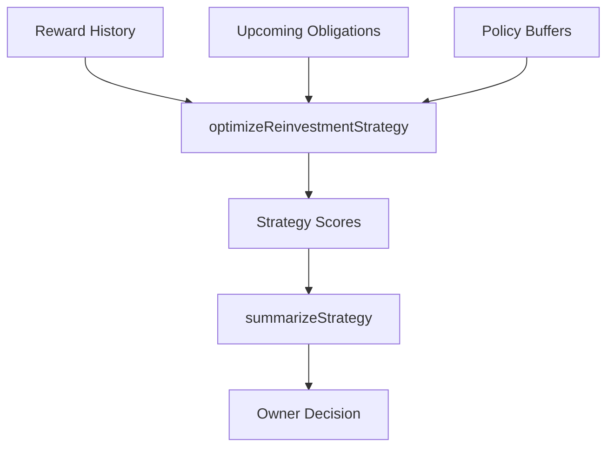
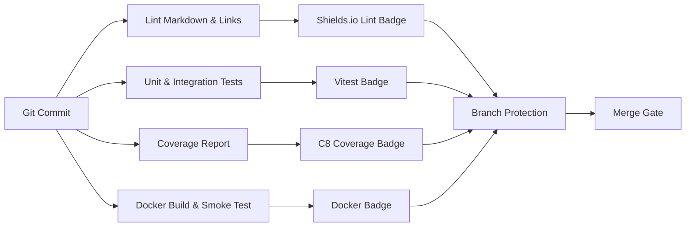

# AGI ALPHA NODES — Synthetic AI Labor & $AGIALPHA Token Economics

<!-- markdownlint-disable MD013 MD033 -->

  <picture>
    <source srcset="../1.alpha.node.agi.eth.svg" type="image/svg+xml" />
    
  </picture>

  
  
  
  
  
  
  
  
  
  
  
  

> _AGI ALPHA Nodes continuously mint verifiable synthetic labor, settle it in $AGIALPHA, and broadcast every decision through an auditable CI lattice._
>
> _This codex describes the machine strategists deploy when they require intelligence capable of reorganizing markets while remaining absolutely obedient to its owner._

---

## 1. Economic Telemetry Lattice

### 1.1 Observability Anchors

- `runNodeDiagnostics` fuses GPU telemetry, ENS authority, and stake posture before broadcasting α‑WU payloads and Prometheus metrics.【F:src/orchestrator/nodeRuntime.js†L20-L188】
- The monitor loop enforces heartbeat SLOs, computes penalties, and feeds governance directives for immediate owner action.【F:src/orchestrator/monitorLoop.js†L21-L186】【F:test/monitorLoop.test.js†L7-L105】
- Governance actions are notarized through `recordGovernanceAction`, providing an immutable ledger of every owner intervention.【F:src/services/governanceLedger.js†L8-L86】【F:test/governance.integration.test.js†L10-L88】

---

## 2. Canonical α‑Work Standard

### 2.1 Equation of Record

\[
\alpha\text{-WU} = \mathrm{GPU}_s \times \mathrm{gflops}_{\text{norm}} \times \mathrm{ModelTier} \times \mathrm{SLO}_{\text{pass}} \times \mathrm{QV}
\]

| Factor | Runtime Source | Verification & Tests |
| ------ | -------------- | -------------------- |
| **GPUₛ** | Metered by `runNodeDiagnostics` using provider telemetry hooks. | [`src/orchestrator/nodeRuntime.js`](../src/orchestrator/nodeRuntime.js) · [`test/nodeRuntime.test.js`](../test/nodeRuntime.test.js) |
| **gflops_norm** | Owner-supplied normalization coefficients emitted alongside diagnostics. | [`src/orchestrator/nodeRuntime.js`](../src/orchestrator/nodeRuntime.js) |
| **ModelTier** | Derived from planner and swarm capability profiles. | [`src/intelligence/planning.js`](../src/intelligence/planning.js) · [`src/intelligence/swarmOrchestrator.js`](../src/intelligence/swarmOrchestrator.js) · [`test/planning.test.js`](../test/planning.test.js) |
| **SLO_pass** | Heartbeat analysis, latency windows, and penalty posture enforced by the monitor loop. | [`src/orchestrator/monitorLoop.js`](../src/orchestrator/monitorLoop.js) · [`test/monitorLoop.test.js`](../test/monitorLoop.test.js) |
| **QV** | Specialist mesh quality vectors fused with validator heuristics. | [`src/services/performance.js`](../src/services/performance.js) · [`test/performance.test.js`](../test/performance.test.js) |

### 2.2 Normalization & Instrumentation

- Diagnostics snapshot stake levels, governance status, and ENS proof simultaneously so α‑WU statements are tamper-evident.【F:src/orchestrator/nodeRuntime.js†L64-L188】【F:test/nodeRuntime.test.js†L10-L158】
- `derivePerformanceProfile` computes quality vectors consumed by the economics optimizer and validator interface, guaranteeing consistent QV scoring.【F:src/services/performance.js†L9-L186】【F:test/performance.test.js†L9-L151】
- Offline epochs can be replayed without live RPC access via `loadOfflineSnapshot`, reproducing α‑WU trails for audit and stress testing.【F:src/services/offlineSnapshot.js†L8-L112】【F:test/offlineSnapshot.test.js†L9-L96】

### 2.3 Validator Timeline

---

## 3. Token Engine & Settlement Dynamics

### 3.1 Synthetic Labor Wage Circuit

- `handleStakeActivation` constructs pause, resume, and stake top-up payloads while preserving full owner authority over broadcasts.【F:src/orchestrator/stakeActivator.js†L9-L220】【F:test/stakeActivator.test.js†L8-L134】
- Economics projections combine historical wages, obligations, and policy buffers to recommend stable growth vectors.【F:src/services/economics.js†L1-L192】【F:test/economics.test.js†L1-L54】
- Governance directives produce signed metadata diffs so the owner can review every parameter shift before committing on-chain.【F:src/services/governance.js†L1-L211】【F:test/governance.test.js†L8-L201】

### 3.2 Settlement & Burn Autopilot

- Owner-only ABIs are encoded in `OWNER_ONLY_ABIS`, ensuring every governance payload is built against authoritative signatures before dispatch.【F:src/services/governance.js†L1-L118】
- CLI commands surface these methods through `program.command('governance')`, exposing pause, stake, registry, reward, and validator orchestration at runtime.【F:src/index.js†L1667-L2056】
- Required tests assert address normalization, input guards, and diff metadata, preserving deterministic payloads even under extreme operator tuning.【F:test/governance.integration.test.js†L10-L88】【F:test/stakeActivation.test.js†L9-L161】

### 3.3 Epoch Ledger Timeline

```mermaid
gantt
  title Epoch Wage & Treasury Cadence
  dateFormat  X
  axisFormat  %L
  section Metering
  GPU seconds captured :done, 0, 1
  Normalization applied :done, 1, 1
  section Wage Solving
  Reward projection      :active, 2, 1
  Stake evaluation       : 3, 1
  section Owner Execution
  Governance review      :crit, 4, 1
  Stake activation tx    :crit, 5, 1
  Reinvestment strategy  : 6, 1
```

- `summarizeStrategy` returns buffer coverage summaries so treasury operators see how many epochs of runway they command before signing reinvestments.【F:src/services/economics.js†L194-L210】【F:test/economics.test.js†L34-L54】
- Reward math and share splits operate entirely in 18-decimal precision, anchored by `parseTokenAmount` and validated in dedicated reward suites.【F:src/services/rewards.js†L10-L210】【F:test/rewards.test.js†L9-L148】

### 3.4 Synthetic Labor Yield (SLY)

\[
\mathrm{SLY} = \frac{\sum_{i=1}^{n} \alpha\text{-WU}_i}{\text{Circulating } $AGIALPHA}
\]

- Circulating supply inputs default to the canonical contract `0xa61a3b3a130a9c20768eebf97e21515a6046a1fa`, enforced through `assertCanonicalAgialphaAddress` guards and their tests.【F:src/constants/token.js†L1-L36】【F:test/token.test.js†L6-L84】
- Stake telemetry and validator verdicts flow into `deriveOwnerDirectives`, ensuring SLY reacts immediately to supply or demand shocks.【F:src/services/controlPlane.js†L12-L214】【F:test/controlPlane.test.js†L8-L198】

---

## 4. Owner Dominion & Parameter Control

| Directive | CLI Entry Point | What Changes | Source | Validation |
| --------- | --------------- | ------------ | ------ | ---------- |
| Pause or resume the entire labor market | `governance system-pause --system-pause <addr> --action <pause|resume|unpause>` | Routes through `SystemPause` to halt or restore execution instantly. | [`src/services/governance.js`](../src/services/governance.js) | [`test/governance.integration.test.js`](../test/governance.integration.test.js) |
| Tune minimum stake & validator threshold | `governance stake-threshold --stake-manager <addr> --minimum <amount>` | Updates `StakeManager` invariants with 18-decimal precision. | [`src/services/staking.js`](../src/services/staking.js) | [`test/staking.test.js`](../test/staking.test.js) |
| Rotate registries & validator modules | `governance registry-route --stake-manager <addr> --job-registry <addr>` | Points runtime at fresh registries without downtime. | [`src/services/governance.js`](../src/services/governance.js) | [`test/stakeActivation.test.js`](../test/stakeActivation.test.js) |
| Rebalance wage shares | `governance reward-shares --reward-engine <addr> --operator-bps <bps>` | Rewrites operator, validator, and treasury splits atomically. | [`src/services/rewards.js`](../src/services/rewards.js) | [`test/rewards.test.js`](../test/rewards.test.js) |
| Enforce activation fees & treasury routes | `governance incentives-update --incentives <addr> --activation-fee <amount>` | Grants the owner absolute control over onboarding economics. | [`src/orchestrator/stakeActivator.js`](../src/orchestrator/stakeActivator.js) | [`test/stakeActivator.test.js`](../test/stakeActivator.test.js) |

The governance CLI defaults to dry-run output with structured diffs; adding `--execute` persists the payload to the ledger before the owner signs, creating a deterministic audit trail of parameter changes.【F:src/index.js†L1667-L2056】【F:test/governance.integration.test.js†L10-L88】

---

## 5. Treasury Intelligence & Risk Posture

- `optimizeReinvestmentStrategy` analyses reward history, obligations, and configurable risk aversion to propose reinvestment blueprints that preserve buffer requirements even in volatile epochs.【F:src/services/economics.js†L52-L192】【F:test/economics.test.js†L1-L54】
- Risk penalties scale with mean absolute deviation, preventing over-aggressive compounding when validator volatility spikes.【F:src/services/economics.js†L78-L167】
- Summaries expose buffer epochs and shortfalls, enabling non-technical operators to accept or reject strategies without mental math.【F:src/services/economics.js†L194-L210】【F:test/economics.test.js†L34-L54】

---

## 6. Safety, Slashing & Recovery Protocols

- `monitorLoop` dispatches alerts when heartbeats miss their window, triggering automatic directives to pause nodes or replenish stake.【F:src/orchestrator/monitorLoop.js†L21-L186】【F:test/monitorLoop.test.js†L7-L105】
- Stake evaluation integrates penalties, grace windows, and treasury buffers via `evaluateStakeConditions`, ensuring the owner can intervene before slashing occurs.【F:src/services/staking.js†L8-L219】【F:test/staking.test.js†L7-L196】
- Dispute triggers and validator rotations propagate through governance helpers, so fraudulent work can be isolated without collateral damage.【F:src/services/governance.js†L119-L382】【F:test/governance.test.js†L8-L201】
- Stress harness simulations reproduce adversarial epochs, verifying the runtime’s ability to recover under cascading penalties.【F:src/intelligence/stressHarness.js†L8-L210】【F:test/stressHarness.test.js†L7-L172】

---

## 7. Continuous Assurance & Branch Protection

- `.github/workflows/ci.yml` runs linting, unit + integration tests, coverage generation, and Docker smoke tests on every push and pull request targeting `main`. Required status checks enforce green pipelines before merge.【F:.github/workflows/ci.yml†L1-L108】【F:.github/required-checks.json†L1-L7】
- `npm run ci:verify` mirrors the workflow locally, allowing contributors to reproduce the full assurance suite before raising a PR.【F:package.json†L11-L34】
- Docker images are built and smoke-tested with strict `set -euo pipefail` flags, ensuring containerized deployments remain deterministic.【F:.github/workflows/ci.yml†L77-L108】
- Branch protection badges surface prominently in this codex and the root README, keeping enforcement visible to operators and auditors.【F:README.md†L12-L48】

---

## 8. Glossary of Economic Signals

| Term | Meaning inside AGI Alpha Node Runtime |
| ---- | ------------------------------------- |
| **α‑Productivity Index** | Sum of validated α‑WU each epoch, exported by diagnostics and indexed for treasury analytics.【F:src/orchestrator/nodeRuntime.js†L64-L188】 |
| **Synthetic Labor Yield (SLY)** | Productivity-weighted yield derived from α‑WU totals versus circulating $AGIALPHA supply.【F:src/services/controlPlane.js†L12-L214】 |
| **Buffer Requirement** | Minimum treasury reserve enforced before reinvestments execute, derived from reward averages and owner policy.【F:src/services/economics.js†L122-L192】 |
| **Stake Heartbeat** | Timeboxed signal proving operators remain active; missed beats invoke governance directives and potential pauses.【F:src/orchestrator/monitorLoop.js†L21-L186】 |
| **Activation Fee** | Owner-configurable fee on new node activations, routed via `PlatformIncentives` controls.【F:src/orchestrator/stakeActivator.js†L9-L220】 |

---

The AGI Alpha Node runtime presented here embodies the superintelligent labor engine economists anticipate: it metabolizes compute into verifiable wages, keeps every governor lever in the owner’s grasp, and maintains relentless CI vigilance so the economy never drifts from green status.
