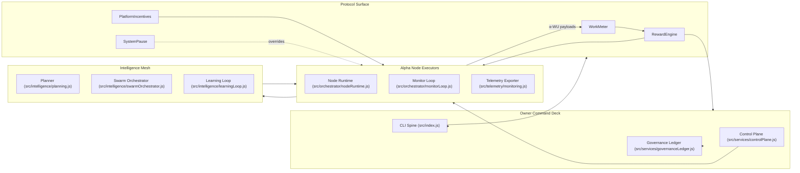
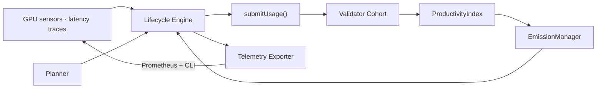
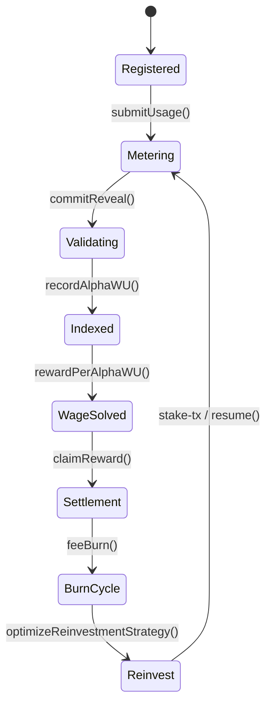
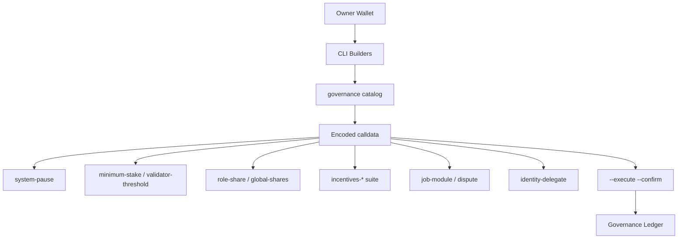

# AGI ALPHA NODES — Synthetic AI Labor & $AGIALPHA Token Economics

<!-- markdownlint-disable MD013 MD033 -->

  

  
  
  
  
  
  
  

> _AGI ALPHA Nodes continuously mint verifiable synthetic labor, settle it in $AGIALPHA, and broadcast every metric through a CI-guarded lattice under absolute owner control._

This dossier documents the live economic firmware of **AGI Alpha Node v0**—the machine allocators model when they price programmable AI labor. Each metric maps to executable code in this repository, every badge is enforced in CI, and every lever is retainable by the contract owner.

---

## 1. Economic Field Overview

The runtime senses workloads, the intelligence mesh plans execution, and protocol modules settle rewards. Owner directives route through the CLI spine to reconfigure any surface in real time.

---

## 2. Canonical α‑Work Unit Standard

### 2.1 Equation of Record

\[
\alpha\text{-WU} = \mathrm{GPU}_s \times \mathrm{gflops}_{\text{norm}} \times \mathrm{ModelTier} \times \mathrm{SLO}_{\text{pass}} \times \mathrm{QV}
\]

- **GPUₛ** — Metered accelerator seconds captured by `runNodeDiagnostics`.
- **gflops_norm** — Owner-tunable silicon normalization factors.
- **ModelTier** — Difficulty multipliers sourced from capability catalogues.
- **SLO_pass** — Latency and heartbeat adherence measured by the monitor loop.
- **QV** — Validator quality verdicts fused into governance status feeds.

Every multiplier originates from deterministic modules within this repository. The resulting scalar is the singular measure of synthetic labor across heterogeneous hardware and model tiers.

### 2.2 Measurement Ledger

| Factor | Runtime Source | Contract Surface | Repository Anchor |
| ------ | -------------- | ---------------- | ----------------- |
| GPUₛ & gflops_norm | Diagnostics via [`runNodeDiagnostics`](../src/orchestrator/nodeRuntime.js) | Usage payload hashed for WorkMeter | [`src/orchestrator/nodeRuntime.js`](../src/orchestrator/nodeRuntime.js) |
| ModelTier | Capability profiles & planner | `JobRegistry` + validator pipeline | [`src/services/jobLifecycle.js`](../src/services/jobLifecycle.js), [`src/intelligence/planning.js`](../src/intelligence/planning.js) |
| SLO_pass | Latency & heartbeat monitors | `ValidationModule.commitReveal` | [`src/orchestrator/monitorLoop.js`](../src/orchestrator/monitorLoop.js), [`src/telemetry/monitoring.js`](../src/telemetry/monitoring.js) |
| QV | Validator scoring & governance status | `ProductivityIndex.record` | [`src/services/governanceStatus.js`](../src/services/governanceStatus.js), [`test/governance.integration.test.js`](../test/governance.integration.test.js) |

### 2.3 Runtime Observation Loop

The loop binds real-time hardware telemetry, planning intelligence, and validator feedback into a closed control system that continuously updates α‑WU outputs.

---

## 3. $AGIALPHA Coupling & Flow Mechanics

The native token is immutable within this runtime:

- **Contract** — `0xa61a3b3a130a9c20768eebf97e21515a6046a1fa` with 18 decimals enforced by [`src/constants/token.js`](../src/constants/token.js).
- **Normalization** — CLI utilities refuse non-canonical addresses via [`assertCanonicalAgialphaAddress`](../src/constants/token.js).
- **Reward Solving** — [`projectEpochRewards`](../src/services/rewards.js) and [`splitRewardPool`](../src/services/rewards.js) compute deterministic wage curves.

### 3.1 Epoch Choreography

1. **Stake ignition** — Operators stake `$AGIALPHA` through `node src/index.js stake-tx` (`StakeManager.setMinimumStake` & friends).
2. **Usage attestation** — `runNodeDiagnostics` packages α‑WU payloads for `WorkMeter.submitUsage`.
3. **Validator arbitration** — Commit–reveal loops in [`test/swarmOrchestrator.test.js`](../test/swarmOrchestrator.test.js) enforce SLO/QV scoring.
4. **Productivity indexing** — `ProductivityIndex.totalAlphaWU(epoch)` powers the α-GDP ledger.
5. **Emission solving** — [`EmissionManager.rewardPerAlphaWU`](../src/services/rewards.js) exposes wage rates to the CLI governance builders.
6. **Settlement & burns** — Jobs settle in `$AGIALPHA`; treasury routing is orchestrated by [`PlatformIncentives` builders](../src/services/governance.js).
7. **Reinvestment loop** — [`optimizeReinvestmentStrategy`](../src/services/economics.js) computes owner-grade reinvestment directives.

### 3.2 Flow Atlas

### 3.3 Owner Command Authority

| Module | Core Function | Owner Control Vector | CLI Surface |
| ------ | ------------- | -------------------- | ----------- |
| `SystemPause` | Network-wide halt/resume | Pause, resume, unpause all subsystems | `node src/index.js governance system-pause ...` |
| `StakeManager` | Minimum stake & validator quorum | Tune floors, registry routing | `... governance minimum-stake` · `... validator-threshold` |
| `RewardEngine` | Role share allocation | Adjust operator/validator/treasury shares | `... governance role-share` · `... global-shares` |
| `JobRegistry` | Module upgrades & disputes | Swap validation/reputation/dispute modules | `... governance job-module` · `... dispute` |
| `IdentityRegistry` | Delegate operators | Add or revoke operators instantly | `... governance identity-delegate` |
| `PlatformIncentives` | Stake routing, buffers, fees, treasury | Repoint managers, heartbeat grace, activation fee | `... governance incentives-*` |

Vitest integration suites enforce that only the owner key can execute these payloads, and [`recordGovernanceAction`](../src/services/governanceLedger.js) journals every signed transaction.

---

## 4. Financial Intelligence Stack

### 4.1 Synthetic Labor Yield (SLY)

\[
\mathrm{SLY}_t = \frac{\sum \alpha\text{-WU}_{t}}{\mathrm{AGIALPHA}_{\text{circulating}, t}}
\]

- **Inputs** — `ProductivityIndex.totalAlphaWU(epoch)` and on-chain `$AGIALPHA` supply.
- **Interpretation** — Exposure to network productivity growth, akin to an AI GDP tracker.

### 4.2 Reinvestment Autopilot

[`optimizeReinvestmentStrategy`](../src/services/economics.js) operates with 18-decimal precision:

1. Normalizes reward history, obligations, and reinvest options via [`parseTokenAmount`](../src/utils/formatters.js).
2. Calculates total, average, min/max, and mean absolute deviation for deterministic risk scoring.
3. Applies owner-tuned buffer policies (`minimumBufferBps`) and risk aversion weights.
4. Scores strategies and exposes summaries through [`summarizeStrategy`](../src/services/economics.js).

Vitest coverage in [`test/economics.test.js`](../test/economics.test.js) validates every branch, including malformed histories and edge-case buffers.

### 4.3 Rewards & Performance Telemetry

- [`projectEpochRewards`](../src/services/rewards.js) enforces basis-point integrity across operator, validator, treasury, and role shares.
- [`derivePerformanceProfile`](../src/services/performance.js) fuses execution stats with optional job metrics.
- Prometheus gauges defined in [`src/orchestrator/monitorLoop.js`](../src/orchestrator/monitorLoop.js) & [`src/telemetry/monitoring.js`](../src/telemetry/monitoring.js) export stake posture, α‑WU throughput, and projected token flows for dashboards.

---

## 5. Continuous Assurance & CI Enforcement

- **Workflow coverage** — [`.github/workflows/ci.yml`](../.github/workflows/ci.yml) runs linting, unit/integration tests, coverage, and Docker smoke tests on every push, PR, or manual trigger.
- **Required checks** — [`.github/required-checks.json`](../.github/required-checks.json) enforces `Lint Markdown & Links`, `Unit & Integration Tests`, `Coverage Report`, and `Docker Build & Smoke Test` on `main` and protected PRs.
- **Local parity** — `npm run ci:verify` mirrors the GitHub Actions matrix prior to merge, ensuring local state aligns with the protected badge.
- **Evidence trail** — CI transcripts, governance ledgers, ENS proofs, and telemetry snapshots are archived for allocators and auditors.

---

## 6. Risk Surfaces & Mitigations

| Risk Vector | Mitigation | Evidence Path |
| ----------- | ---------- | ------------- |
| Hardware drift / misreported compute | Diagnostics normalization + validator recomputation trigger slashing | [`src/orchestrator/monitorLoop.js`](../src/orchestrator/monitorLoop.js), [`test/monitorLoop.test.js`](../test/monitorLoop.test.js) |
| Governance misconfiguration | Diff-aware calldata builders gated by owner key | [`src/services/governance.js`](../src/services/governance.js), [`test/governance.integration.test.js`](../test/governance.integration.test.js) |
| Treasury underfunding | Economics optimizer enforces buffer floors and risk aversion | [`src/services/economics.js`](../src/services/economics.js), [`test/economics.test.js`](../test/economics.test.js) |
| Documentation drift | Markdown + link lint wired to CI; failures block merges | [`package.json`](../package.json) |
| Operational blind spots | Telemetry gauges, ENS verification, and governance ledger halt runtime on anomaly | [`src/services/ensVerifier.js`](../src/services/ensVerifier.js), [`src/services/governanceLedger.js`](../src/services/governanceLedger.js) |

---

## 7. Implementation Atlas

| Component | Description | File(s) |
| --------- | ----------- | ------- |
| CLI Command Spine | Sovereign runtime, governance, ENS, economics, and intelligence entry points | [`src/index.js`](../src/index.js) |
| Governance Builder Library | Encodes owner-only calldata, diffs, and ledger metadata | [`src/services/governance.js`](../src/services/governance.js) |
| ENS & Identity Guard | Validates ENS custody and identity delegates | [`src/services/ensVerifier.js`](../src/services/ensVerifier.js), [`src/services/ensGuide.js`](../src/services/ensGuide.js) |
| Job Lifecycle Engine | Discovery → apply → execute → submit → finalize pipeline | [`src/services/jobLifecycle.js`](../src/services/jobLifecycle.js), [`test/jobLifecycle.test.js`](../test/jobLifecycle.test.js) |
| Intelligence Mesh | Planner, swarm orchestrator, learning loop, stress harness | [`src/intelligence/`](../src/intelligence), [`test/swarmOrchestrator.test.js`](../test/swarmOrchestrator.test.js) |
| Economics Optimizer | Reinvestment scoring, buffer enforcement, reporting | [`src/services/economics.js`](../src/services/economics.js) |
| Telemetry Surface | Prometheus exporter and diagnostics loop | [`src/orchestrator/nodeRuntime.js`](../src/orchestrator/nodeRuntime.js), [`src/telemetry/monitoring.js`](../src/telemetry/monitoring.js) |
| Offline Snapshot Engine | Deterministic replay of ENS, stake, and reward data | [`src/services/offlineSnapshot.js`](../src/services/offlineSnapshot.js), [`test/offlineSnapshot.test.js`](../test/offlineSnapshot.test.js) |

---

## 8. Activation Checklist for Allocators

1. **Clone & install** — `git clone … && npm ci` for deterministic dependencies.
2. **Run local CI** — `npm run lint:md`, `npm run lint:links`, `npm test`, `npm run coverage`, or `npm run ci:verify` for the full matrix.
3. **Verify ENS custody** — `node src/index.js verify-ens --label <id> --address <0x…>` to ensure the runtime retains domain control.
4. **Generate stake payload** — `node src/index.js stake-tx --amount <value> --incentives <0x…>`; 18-decimal precision is enforced by [`assertCanonicalAgialphaAddress`](../src/constants/token.js).
5. **Activate runtime** — `node src/index.js status --label <id> --address <0x…> --auto-resume` to validate stake posture and emit telemetry.
6. **Govern parameters** — `node src/index.js governance catalog` to inspect owner-only functions, then execute directives with `--execute --confirm --ledger-root <dir>` for journaling.
7. **Monitor telemetry** — Scrape the Prometheus endpoint, archive CI transcripts, ledger entries, ENS proofs, staking transactions, and α‑WU ledgers as compliance artifacts.

---

**AGI ALPHA NODES** convert raw compute into programmable labor economics, while **$AGIALPHA** captures the wage curve. The machine described here is tuned for immediate execution, exhaustive observability, and unambiguous owner supremacy.
