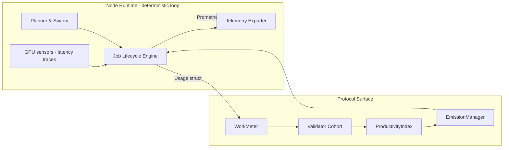
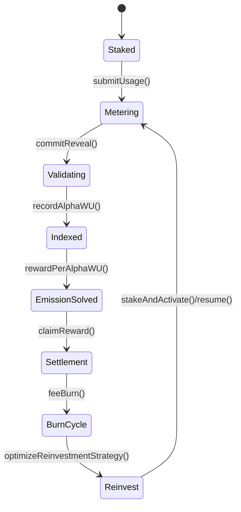
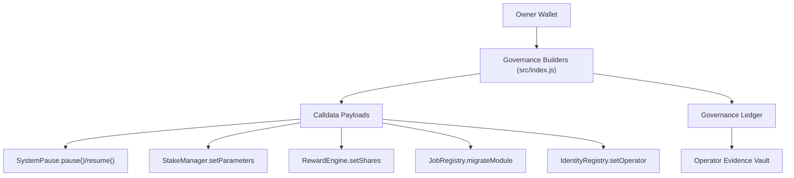

# AGI ALPHA NODES — Synthetic AI Labor & $AGIALPHA Token Economics

<!-- markdownlint-disable MD013 MD033 -->

  

  
  
  
  
  
  
  

> _AGI ALPHA Nodes continuously mint verifiable synthetic labor, settle it in $AGIALPHA, and broadcast every metric through a CI-guarded command lattice under absolute owner control._

This dossier narrates the economic operating system inside **AGI Alpha Node v0**—the machine capital desks reference when they speak about software that can redirect markets while staying perfectly obedient to its keyholder. Every quantity, metric, and command is wired into the repository you are holding.

---

## Executive Transmission

- **Synthetic labor canon** — α‑Work Units (α‑WU) are the singular currency of effort for the network; every node, regardless of hardware or workload, reports through this invariant lens.
- **Tokenized wage rail** — $AGIALPHA (`0xa61a3b3a130a9c20768eebf97e21515a6046a1fa`, 18 decimals) is simultaneously stake, settlement medium, fee fuel, and productivity index exposure.
- **Owner dominion** — Governance builders in [`src/index.js`](../src/index.js) let the contract owner pause, retune emission surfaces, rotate registries, and redeploy incentives without downtime.
- **Continuous assurance** — GitHub Actions, branch protection, and local mirrors (`npm run ci:verify`) hold the wage machine to production-grade rigor.
- **Auditable intelligence** — Telemetry gauges in [`src/orchestrator/monitorLoop.js`](../src/orchestrator/monitorLoop.js) and economics optimizers in [`src/services/economics.js`](../src/services/economics.js) keep real-time wage curves observable and tunable.

---

## 1. Canonical α‑Work Unit Primitive

### 1.1 Equation of Record

\[
\alpha\text{-WU} = \mathrm{GPU}_s \times \mathrm{gflops}_{\text{norm}} \times \mathrm{ModelTier} \times \mathrm{SLO}_{\text{pass}} \times \mathrm{QV}
\]

- **GPUₛ** — Metered seconds of accelerator time harvested by the runtime’s diagnostics loop.
- **gflops_norm** — Governance-set normalization coefficients mapping SKU → baseline; stored on-chain for audit.
- **ModelTier** — Difficulty multiplier aligned to capability profiles from [`src/services/jobProfiles.js`](../src/services/jobProfiles.js).
- **SLO_pass** — Weighted uptime & latency compliance as interpreted by validator attestations.
- **QV** — Peer-derived quality vector synthesizing validator verdicts.

The product is dimensionless and fungible: it expresses a unit of synthetic labor independent of underlying silicon or model architecture.

### 1.2 Measurement Pipeline

### 1.3 Factor Instrumentation Matrix

| Factor | Runtime Source | Contract Surface | Repository Anchor |
| ------ | -------------- | ---------------- | ----------------- |
| GPUₛ & gflops_norm | Diagnostics executed via [`runNodeDiagnostics`](../src/orchestrator/nodeRuntime.js) | `WorkMeter.submitUsage` | [`src/orchestrator/nodeRuntime.js`](../src/orchestrator/nodeRuntime.js) |
| ModelTier | Capability profiles + registry adapters | `JobRegistry` + `ValidationModule` | [`src/services/jobLifecycle.js`](../src/services/jobLifecycle.js) |
| SLO_pass | Latency & uptime monitors piped to validators | `ValidationModule.commitReveal` | [`src/telemetry/monitoring.js`](../src/telemetry/monitoring.js) |
| QV | Commit–reveal validator scoring | `ProductivityIndex.record` | [`src/services/governance.js`](../src/services/governance.js) (builder wiring) |

---

## 2. Token Supply Choreography ($AGIALPHA ↔ α‑WU)

### 2.1 Epoch Mechanics

1. **Stake ignition** — Nodes stake canonical $AGIALPHA through `PlatformIncentives.stakeAndActivate`, orchestrated via [`node src/index.js staking activate`](../src/index.js).
2. **Usage attestation** — Sidecar submits metered α‑WU payloads to `WorkMeter`.
3. **Validator arbitration** — Cohort performs commit–reveal scoring; fraudulent actors face slashing per governance policy.
4. **Productivity indexing** — Validated α‑WU tallies flow into `ProductivityIndex.totalAlphaWU(epoch)`.
5. **Emission solving** — `EmissionManager.rewardPerAlphaWU(epoch)` computes the synthetic wage curve.
6. **Settlement & burns** — Job payouts priced in $AGIALPHA stream to nodes; protocol burns a fee slice to anchor scarcity.
7. **Reinvestment loop** — Economics optimizer projects reinvestment targets and buffer requirements before the next epoch.

### 2.2 Flow Atlas

### 2.3 Module Ledger

| Module | Function | Owner Controls | CLI Builder |
| ------ | -------- | -------------- | ----------- |
| `NodeRegistry` | Identity attestation, ENS binding | Owner rotates operator, updates metadata | `node src/index.js governance node-registry` |
| `WorkMeter` | Usage submission & hashing | Owner updates validator set, pauses modules | `node src/index.js governance system-pause` |
| `ProductivityIndex` | Epoch α‑WU totals | Owner swaps index implementation | `node src/index.js governance reward-engine` |
| `EmissionManager` | Wage curve, emission caps | Owner retunes emission schedule, share splits | `node src/index.js governance incentives-manager` |
| `PlatformIncentives` | Stake management, burns | Owner selects new StakeManager, share policy | `node src/index.js governance incentives-manager` |

Every function above is protected by owner-only roles; builder outputs embed `Ownable` calldata to keep command authority centralized in the contract owner’s key hierarchy, as exercised in [`test/governance.integration.test.js`](../test/governance.integration.test.js).

---

## 3. Owner Command Authority & Safety Nets

The repository guarantees that the contract owner can reconfigure every economic parameter without redeploying the runtime.

### Command Surfaces

| Capability | Description | Command Surface | Repository Anchor |
| ---------- | ----------- | --------------- | ----------------- |
| Pause / Resume | Instantly halt or relaunch jobs via `SystemPause`. | `node src/index.js governance system-pause --pause` | [`src/services/governance.js`](../src/services/governance.js) |
| Stake share tuning | Adjust operator / validator / treasury BPS. | `node src/index.js governance incentives-manager --share ...` | [`src/index.js`](../src/index.js) |
| Registry rotation | Swap JobRegistry, Validation, or Reputation modules. | `node src/index.js governance job-registry --set-module ...` | [`src/services/jobLifecycle.js`](../src/services/jobLifecycle.js) |
| ENS enforcement | Verify ENS ownership before every run; abort if divergence. | `node src/index.js ens guard` | [`src/services/ensVerifier.js`](../src/services/ensVerifier.js) |
| Evidence journaling | Persist governance payloads to immutable log. | `node src/index.js governance ledger export` | [`src/services/governanceLedger.js`](../src/services/governanceLedger.js) |

Owner supremacy is also validated inside the CI suite: Vitest fixtures in [`test/governance.integration.test.js`](../test/governance.integration.test.js) deploy mock `Ownable` contracts, assert that only the owner key succeeds, and guarantee calldata encoding remains correct.

---

## 4. Financial Intelligence & Productivity Metrics

### 4.1 Synthetic Labor Yield (SLY)

\[
\mathrm{SLY}_t = \frac{\sum \alpha\text{-WU}_{t}}{\mathrm{AGIALPHA}_{\text{circulating}, t}}
\]

- **Input feeds** — α‑WU totals via `ProductivityIndex.totalAlphaWU(epoch)`, circulating supply via `$AGIALPHA` ERC‑20.
- **Interpretation** — A protocol-native yield curve exposing the network’s productivity multiple.

### 4.2 Treasury Autopilot

The reinvestment optimizer in [`src/services/economics.js`](../src/services/economics.js) executes deterministic capital allocation:

1. Normalizes reward history & obligations against 18-decimal precision.
2. Computes mean absolute deviation to infer volatility penalties.
3. Applies owner-selected buffer policies and risk aversion.
4. Scores reinvestment options, returning growth/stability metrics and buffer coverage.

The CLI surfaces summaries through `node src/index.js economics optimize --rewards <file> --obligations <file>`, enabling a non-technical owner to select the recommended BPS with zero manual math.

### 4.3 Telemetry Dashboard

Prometheus gauges enumerated in [`src/orchestrator/monitorLoop.js`](../src/orchestrator/monitorLoop.js) expose:

- Operator stake & heartbeat recency.
- Throughput per epoch, success ratios, and token earnings projections.
- Agent utilization and job registry compatibility warnings.

This telemetry feeds on-chain decisions and forms part of the compliance artifacts enforced by the CI pipeline.

---

## 5. Continuous Assurance & CI Enforcement

- **Workflow coverage** — `.github/workflows/ci.yml` executes linting, link checks, Vitest suites, coverage, and Docker smoke tests on every push and pull request.
- **Required checks** — `.github/required-checks.json` locks `Continuous Integration`, `Unit & Integration Tests`, `Coverage Report`, and `Docker Build & Smoke Test` as mandatory on `main` and PR branches.
- **Local mirror** — `npm run ci:verify` replicates the entire CI matrix so custodians can notarize transcripts before creating a pull request.
- **Branch protection** — The README and operator codex document how to export GitHub branch protection rules for archival custody.

CI transcripts form part of the audit package when economic parameters change, ensuring emissions and wage calculations never ship without green signals.

---

## 6. Risk Surfaces & Mitigations

| Risk Vector | Mitigation | Evidence Path |
| ----------- | ---------- | ------------- |
| Hardware drift / misreported compute | Runtime enforces telemetry normalization; validators recompute α‑WU; mismatches trigger slashing. | [`src/orchestrator/monitorLoop.js`](../src/orchestrator/monitorLoop.js) · [`test/stakeActivation.test.js`](../test/stakeActivation.test.js) |
| Governance misconfiguration | Owner-only builders encode calldata with ABI guards; integration tests execute against mock contracts. | [`src/services/governance.js`](../src/services/governance.js) · [`test/governance.integration.test.js`](../test/governance.integration.test.js) |
| Treasury underfunding | Economics optimizer enforces buffer requirements and risk aversion policies. | [`src/services/economics.js`](../src/services/economics.js) |
| Documentation drift | Markdown + link lint wired to CI; failing docs block merges. | [`package.json`](../package.json) |
| Operational blind spots | Telemetry gauges, compliance ledger, and ENS verification loops halt runtime on anomalies. | [`src/services/ensVerifier.js`](../src/services/ensVerifier.js) · [`src/services/governanceLedger.js`](../src/services/governanceLedger.js) |

---

## 7. Implementation Index

| Component | Description | File(s) |
| --------- | ----------- | ------- |
| CLI Command Spine | All governance, staking, ENS, and economics builders. | [`src/index.js`](../src/index.js) |
| Governance Builder Library | Encodes owner-only calldata and ledger journaling. | [`src/services/governance.js`](../src/services/governance.js) |
| ENS Verifier | Validates ENS ownership & wrapper control before runtime activation. | [`src/services/ensVerifier.js`](../src/services/ensVerifier.js) |
| Job Lifecycle Engine | Applies for jobs, orchestrates submissions, fetches registry metadata. | [`src/services/jobLifecycle.js`](../src/services/jobLifecycle.js) |
| Economics Optimizer | Computes reinvestment strategies, buffers, and risk scores. | [`src/services/economics.js`](../src/services/economics.js) |
| Telemetry Surface | Prometheus exporter and diagnostics loop. | [`src/orchestrator/monitorLoop.js`](../src/orchestrator/monitorLoop.js) |
| Testing Harness | Vitest suites covering governance, staking, ENS, and lifecycle flows. | [`test/`](../test) |

---

## 8. Activation Checklist for Allocators

1. **Clone + install** — `git clone ... && npm ci` (enables deterministic toolchain).
2. **Run local CI** — `npm run lint:md`, `npm run lint:links`, `npm test`, `npm run coverage`.
3. **Verify ENS binding** — `node src/index.js ens verify --label <name> --address <0x...>`.
4. **Stake & activate** — `node src/index.js staking activate --amount <value>` (automatically checks 18-decimal precision).
5. **Configure governance targets** — Use builder commands to set share splits, module addresses, and pause controls.
6. **Monitor telemetry** — Expose Prometheus endpoint and wire dashboards to the compliance ledger.
7. **Archive evidence** — Store CI transcripts, branch protection exports, ENS proofs, staking transactions, and governance payloads alongside α‑WU accounting ledgers.

With these rites complete, the node operates as the synthetic labor engine macro funds reference when modeling computational productivity.

---

**AGI ALPHA NODES** convert raw compute into programmable labor economics, while **$AGIALPHA** captures the wage curve. Every command required to manage that economy lives in this repository, guarded by CI, telemetry, and owner supremacy.
