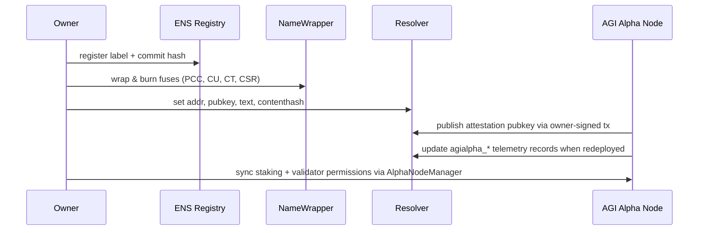
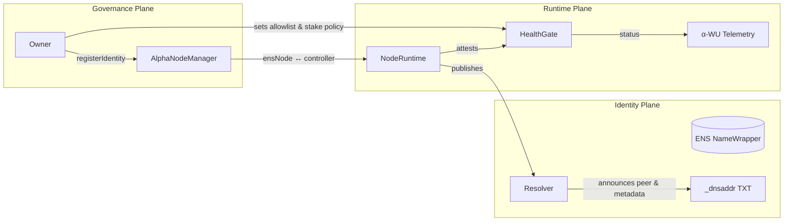

# ENS Identity and Node Attestation Framework · v0.2.0
<!-- markdownlint-disable MD013 -->

> AGI Alpha Nodes cultivate the future in a luminous cognition field. Their ENS identities are more than signposts—they are control planes, economic anchors, and attestations that let owners command unfathomable intelligence flows without ceding sovereignty.

---

## 0. Status

- **Release Status:** Alpha hardened
- **Spec Version:** `v0.2.0`
- **Runtime Alignment:** [`agi-alpha-node-v0@1.1.0`](../package.json)
- **Applies to:**
  - AGI Alpha Agents: `*.alpha.agent.agi.eth`
  - AGI Alpha Nodes: `*.alpha.node.agi.eth`
- **Scope:** Identity bootstrapping, discovery, attestation, owner-enforced policy, and observability across the AGI Alpha lattice.

---

## 1. Mission Parameters

### 1.1 Objectives

1. Deliver ENS subnames with **durable, cryptographically bound identities** that map to production-grade nodes and agents.
2. Encode **multi-surface metadata** (text, contenthash, coin records, commit fingerprints) that mirror runtime state while remaining owner-editable.
3. Make identities **immediately discoverable** through `_dnsaddr` multiaddrs, libp2p peer IDs, and health gate allowlists.
4. Emit **signed health attestations** and α‑work telemetry that align with `AlphaNodeManager` staking policy and CI checks.
5. Expose **OpenTelemetry + Prometheus** signals with invariant naming so dashboards, validators, and auditors see the same truth.

### 1.2 Explicit Non-Goals

- Economics, payout calculus, and emissions schedules are defined elsewhere (see [`docs/economics.md`](./economics.md)).
- Smart-contract ABIs outside of ENS/NameWrapper/`AlphaNodeManager` scope are intentionally excluded.
- Validator machine provisioning is treated as an infrastructure concern, not a protocol requirement.

---

## 2. Identity Surfaces

### 2.1 Naming Schema

```text
<agent-label>.alpha.agent.agi.eth
<node-label>.alpha.node.agi.eth
```

- Every active runtime **MUST** own exactly one canonical ENS name.
- Names **MUST** be lowercase, punycode normalised, and cannot contain spaces.
- ENS parents (`alpha.agent.agi.eth`, `alpha.node.agi.eth`) stay under the owner’s custody so rotations and revocations remain reversible.

### 2.2 NameWrapper Fuses & Expiry

| Fuse | Required | Purpose |
| --- | --- | --- |
| `PARENT_CANNOT_CONTROL` | MUST | Prevents parent-grabs once commissioned.
| `CANNOT_UNWRAP` | MUST | Keeps the wrapper active while expiry holds.
| `CANNOT_TRANSFER` | MUST | Disallows silent migrations of sovereign identities.
| `CANNOT_SET_RESOLVER` | MUST | Locks resolver control to the commissioned owner.

- Expiry **MUST** be ≥ 12 months ahead; ≥ 60 months is recommended for production fleets.
- Rotation playbooks **MUST** treat expiry as a hard cliff—no emergency fuse resets.
- `AlphaNodeManager` events reference ENS nodes (`bytes32`) so revocations and reassignments emit a durable audit trail.【F:contracts/AlphaNodeManager.sol†L37-L138】

### 2.3 Owner Control Plane

`AlphaNodeManager` entrusts the contract owner with absolute control over staking, identity assignment, validator rosters, and pause switches.【F:contracts/AlphaNodeManager.sol†L44-L235】 Functions such as `registerIdentity`, `updateIdentityController`, `setIdentityStatus`, `setValidator`, `pause`, and `withdrawStake` are all `onlyOwner`, ensuring that every ENS-bound participant remains under deliberate governance.

---

## 3. Resolver Blueprint

Runtime tooling exposes a deterministic ENS record template via `buildEnsRecordTemplate` so operators can preflight records before publishing.【F:src/ens/ens_config.js†L55-L140】 The template fuses environment, Git metadata, and payout routes into structured resolver data.

### 3.1 Required Records

| Record Type | Key | Requirement | Source |
| --- | --- | --- | --- |
| `addr` | `ETH` | MUST | Owner payout address (`NODE_PAYOUT_ETH_ADDRESS` or `OPERATOR_ADDRESS`).
| `addr` | `AGIALPHA` | MUST | Mirrors `$AGIALPHA` payout route; defaults to ETH address if unset.
| `text` | `role` | MUST | `agi-alpha-node` or `agi-alpha-agent`.
| `text` | `agialpha_model` | MUST | Primary runtime identifier (defaults to `agi-alpha-node-v0`).
| `text` | `agialpha_verifier` | SHOULD | Public verifier base URL for replaying attestations.
| `text` | `agialpha_health` | SHOULD | Machine-readable health endpoint (`verifier/health`).
| `text` | `agialpha_commit` | SHOULD | Git commit hash powering the deployment.
| `pubkey` | secp256k1 | MUST | Attestation key pair (EIP-619).
| `contenthash` | — | MAY | Points to signed runtime manifest or documentation bundle.

### 3.2 Recommended Text JSON (`node.meta` / `agent.meta`)

Operators MAY publish a canonical JSON blob for machine ingestion:

```json
{
  "kind": "agi-alpha-node",
  "version": "1.1.0",
  "cluster": "agi-alpha-mainnet",
  "verifier": "https://node-01.alpha.node.agi.eth/verifier",
  "health": "https://node-01.alpha.node.agi.eth/verifier/health"
}
```

### 3.3 Identity Provisioning Sequence



### 3.4 Operational Checklist

1. Generate a secp256k1 key dedicated to attestations.
2. Set text + addr records following the table above.
3. Commit `_dnsaddr` records (Section 4) before going live.
4. Run `npm run ci:policy` to confirm the health gate allowlist recognises the ENS name.
5. Emit an initial health attestation (Section 5) and pin it for verifiers.

---

## 4. Discovery & Gating

### 4.1 `_dnsaddr` Multiaddrs

- Each TXT record under `_dnsaddr.<ens>` **MUST** begin with `dnsaddr=` and end with a valid multiaddr containing `/p2p/<peerId>`.
- Publish at least one IPv4 or IPv6 TCP endpoint; web sockets (`/ws`), QUIC (`/quic`), and TLS (`/tls`) transports are recommended for redundancy.
- Peer IDs **SHOULD** match `peer_id` in the latest health attestation.

Example:

```text
_dnsaddr.node-01.alpha.node.agi.eth. IN TXT "dnsaddr=/ip4/203.0.113.42/tcp/4001/p2p/12D3KooWNode01PeerId"
_dnsaddr.node-01.alpha.node.agi.eth. IN TXT "dnsaddr=/dns4/node-01.alpha.node.agi.eth/tcp/443/ws/p2p/12D3KooWNode01PeerId"
```

### 4.2 Health Gate Allowlist

- `createHealthGate` normalises ENS allowlists and rejects identities outside the curated patterns.【F:src/services/healthGate.js†L1-L104】
- CI enforces the baseline patterns (`*.alpha.agent.agi.eth`, `*.alpha.node.agi.eth`, etc.) through `scripts/verify-health-gate.mjs`. Missing patterns cause the job to fail with `ENS_PATTERNS_MISSING`.【F:scripts/verify-health-gate.mjs†L6-L43】
- Owners MAY extend the allowlist through `HEALTH_GATE_ALLOWLIST` (comma-separated or JSON array); duplicates and blank entries are ignored.
- The gate’s state machine tracks transitions, rejection reasons, and the active ENS binding so auditors can reconstruct operational posture.【F:src/services/healthGate.js†L41-L100】



---

## 5. Health Attestation Schema

### 5.1 Canonical Envelope

```json
{
  "schema": "agi-alpha/health-attestation-v1",
  "ens": "node-01.alpha.node.agi.eth",
  "peer_id": "12D3KooWNode01PeerId",
  "multiaddrs": ["/ip4/203.0.113.42/tcp/4001/p2p/12D3KooWNode01PeerId"],
  "role": "agi-alpha-node",
  "runtime": "mixed",
  "node_version": "1.1.0",
  "cluster": "agi-alpha-mainnet",
  "verifier": "https://node-01.alpha.node.agi.eth/verifier",
  "ens_fuses": {
    "parent_cannot_control": true,
    "cannot_unwrap": true,
    "cannot_transfer": true,
    "cannot_set_resolver": true,
    "expiry_unix": 2072707200
  },
  "timestamp": "2025-05-08T12:34:56Z",
  "status": "healthy",
  "metrics": {
    "uptime_s": 172800,
    "cpu_load": 0.21,
    "mem_used_mb": 768,
    "alpha_wu_completed": 42
  }
}
```

### 5.2 Field Constraints

| Field | Requirement | Notes |
| --- | --- | --- |
| `schema` | MUST equal `agi-alpha/health-attestation-v1`. Future schemas MUST version bump. |
| `ens` | MUST match the ENS identity under management. Lowercase punycode only. |
| `peer_id` | MUST be a libp2p peer ID encoded in base58/base36. |
| `multiaddrs` | MUST include ≥1 valid multiaddr. Each entry must end with `/p2p/<peerId>`. |
| `role` | MUST be `agi-alpha-node` or `agi-alpha-agent`. |
| `node_version` / `agent_version` | MUST align with resolver text records and package version. |
| `runtime` | SHOULD reference execution mode (`orchestrator`, `validator`, `mixed`, etc.). |
| `cluster` | SHOULD identify the fleet or environment (e.g., `agi-alpha-mainnet`, `agi-alpha-lab`). |
| `verifier` | SHOULD point at the HTTPS verifier endpoint published in ENS text records. |
| `ens_fuses` | MUST mirror on-chain fuse state and expiry. Treat discrepancies as critical. |
| `timestamp` | MUST be RFC3339 UTC and within ±5 minutes of receipt. |
| `status` | MUST be `healthy`, `degraded`, or `down`. |
| `metrics` | MAY contain additional numeric KPIs. Recommended keys: `uptime_s`, `cpu_load`, `mem_used_mb`, `alpha_wu_completed`, `gpu_sec`, `energy_kwh`. |

### 5.3 Optional Attachments

- Include `attestation_uri` pointing to an IPFS CID or HTTPS endpoint that archives signed attestations.
- Provide `validators` array if the node is currently validating other participants.
- Attach `stake` object with `agialpha_locked` and `agialpha_available` for transparency when desired.

### 5.4 Diagnostics

- Reject attestations where `ens` is not allowlisted by the health gate.
- Compare `ens_fuses` with live NameWrapper data using `expiry` and fuse bitmasks.
- Verify `verifier` matches the resolver’s `agialpha_verifier` text record.

---

## 6. Signature Envelope

### 6.1 Payload Canonicalisation

`alphaWuTelemetry` and attestation utilities canonicalise payloads before hashing, ensuring deterministic signatures across runtimes.【F:src/telemetry/alphaWuTelemetry.js†L1-L120】 Steps:

1. Sort object keys lexicographically.
2. Normalise numbers (reject non-finite values) and convert BigInts to strings.
3. Encode as UTF-8 JSON without trailing commas.
4. Hash using `keccak256` unless a different algorithm is negotiated (default remains `keccak256`).

### 6.2 Signature Requirements

- Algorithm: `secp256k1-keccak256` (ECDSA over the canonical payload hash).
- Signature output: `0x`-prefixed hex (r || s || v optional; verifiers should accept 65-byte signatures or EIP-2098 64-byte format).
- Public key: Provide both `pubkey_x` and `pubkey_y` to ease offline verification and cross-check with ENS `pubkey()`.
- Reject signatures when the derived address does not match the expected controller in `AlphaNodeManager` or when the ENS resolver’s pubkey differs.

### 6.3 Example Envelope

```json
{
  "payload": { /* Section 5 payload */ },
  "signature": {
    "alg": "secp256k1-keccak256",
    "sig": "0xabcdef0123deadbeefcafebabe...",
    "pubkey_x": "0x69e44ac3a9d52dd5b1932cf71c9e78380ef55b18c1cebdc782c2c91f5fab1234",
    "pubkey_y": "0x1d4f119610eec3be1a4fb29bca55d2b1e8950cd4e4c8f6a6c5b4587103cdef01"
  }
}
```

---

## 7. Observability & Telemetry

### 7.1 OpenTelemetry Mapping

`agi.healthcheck` spans MUST carry the following attributes:

| Attribute | Source |
| --- | --- |
| `node.ens` / `agent.ens` | `payload.ens` |
| `node.peer_id` / `agent.peer_id` | `payload.peer_id` |
| `node.version` / `agent.version` | `node_version` / `agent_version` |
| `node.runtime` / `agent.runtime` | `runtime` |
| `node.cluster` | `cluster` |
| `ens.fuses.*` | `ens_fuses` fields |
| `dnsaddr.present` | `multiaddrs.length > 0` |
| `health.status` | `status` |
| `health.uptime_s` | `metrics.uptime_s` |
| `health.cpu_load` | `metrics.cpu_load` |
| `health.mem_used_mb` | `metrics.mem_used_mb` |

### 7.2 Prometheus Export

`src/telemetry/monitoring.js` exposes gauges and histograms for α‑work events, validator quality, and resource consumption, aligning with attestation fields.【F:src/telemetry/monitoring.js†L1-L520】 Ensure the following gauges remain in sync:

- `agialpha_node_health_status{ens="…"}` — mirror of `status` (`1` healthy, `0` otherwise).
- `agialpha_node_uptime_seconds_total` — cumulative uptime derived from `metrics.uptime_s`.
- `agialpha_alpha_wu_weight_total` — aggregator for α‑work unit weights.

### 7.3 Event Mirroring

Attach the raw attestation as an OpenTelemetry event named `agi.health-attestation` with a single attribute `attestation.json`. Keep payloads under 16 KB to avoid exporter truncation.

---

## 8. Owner Command & CI Enforcement

- CI enforces identity policy through jobs declared in [`ci.yml`](../.github/workflows/ci.yml). Lint, test, coverage, Solidity, subgraph, Docker smoke, and security checks are all required on PRs and `main` (see [`required-checks.json`](../.github/required-checks.json)).
- `npm run ci:policy` executes `verify-health-gate.mjs`, ensuring ENS patterns remain allowlisted before merges.
- `npm run ci:branch` blocks unsafe branch names from landing on protected branches.
- `AlphaNodeManager` owner functions (`pause`, `unpause`, `setValidator`, `applySlash`, `withdrawStake`) secure runtime behaviour so governance stays centralised.【F:contracts/AlphaNodeManager.sol†L65-L235】
- The canonical staking asset is `$AGIALPHA` at `0xa61a3B3a130a9c20768eebf97E21515A6046a1fA` (18 decimals). The contract defaults to this address and rejects alternatives, guaranteeing economic alignment.【F:contracts/AlphaNodeManager.sol†L29-L57】

---

## 9. Validation Playbooks

| Scenario | Actions |
| --- | --- |
| **Commissioning a new node** | Wrap ENS name, burn fuses, publish resolver data, commit `_dnsaddr`, stake via `AlphaNodeManager`, run `npm run ci:verify`, broadcast initial attestation. |
| **Rotating attestation keys** | Update resolver `pubkey` (requires fuse-managed ownership), deploy runtime with new key, emit attestation referencing the new key, archive the previous attestation. |
| **Revoking a node** | `pause()` if necessary, `setIdentityStatus(ensNode, false)`, `revokeIdentity(ensNode)`, remove `_dnsaddr` records, revoke staking privileges, publish a `status: "down"` attestation for audit. |
| **Incident response** | Flip `pause()`, set `status: "degraded"`, update `metrics` with incident telemetry, notify validators via `AlphaNodeManager` events and telemetry.

---

## 10. Future Horizons

- `agi-alpha/health-attestation-v2` may introduce signed WASM integrity proofs and GPU telemetry digests.
- Expect optional DID integration aligning with resolver `agent.did` fields for cross-domain credentialing.
- Multi-sig ownership on `AlphaNodeManager` is on the roadmap; treat current `Ownable` design as a temporary simplification.

---

### Appendix A · Reference Commands

```bash
# Generate ENS record template from current configuration
node --input-type=module -e "import { buildEnsRecordTemplate } from './src/ens/ens_config.js'; console.log(buildEnsRecordTemplate());"

# Verify health gate policy locally
npm run ci:policy

# Emit a sample health attestation payload
node scripts/render-health-attestation.mjs --ens node-01.alpha.node.agi.eth --peer 12D3KooWNode01PeerId
```

---

By orchestrating ENS, staking, attestation, and observability through a single owner-centric command lattice, AGI Alpha Nodes embody the machine capable of bending economies toward its operator’s intent.
