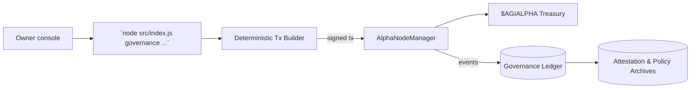
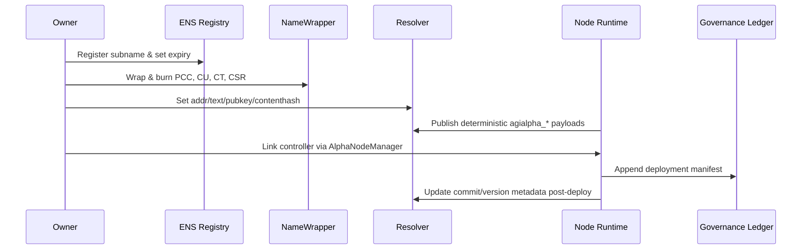
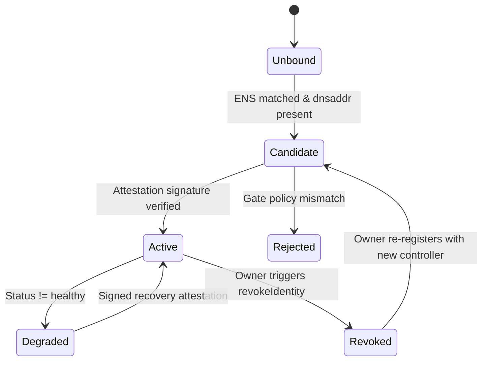
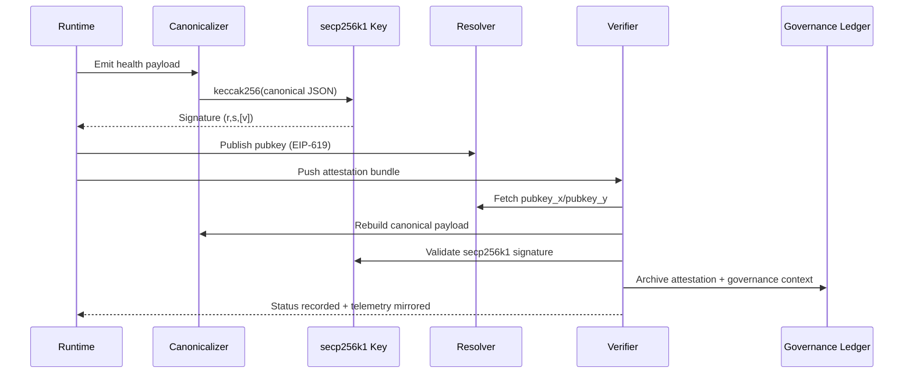
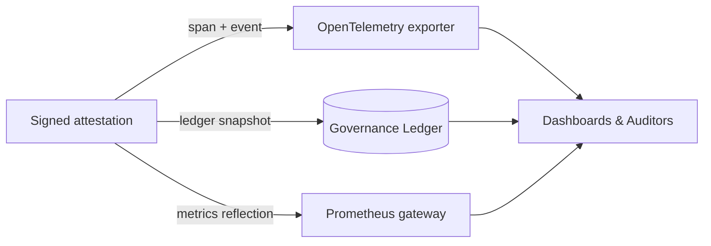

# ENS Identity & Node Attestation HyperSpec · v0.5.1
<!-- markdownlint-disable MD013 MD033 -->

<p align="center">
  <picture>
    <source srcset="../1.alpha.node.agi.eth.svg" type="image/svg+xml" />
    
  </picture>
</p>

<p align="center">
  <a href="../.github/workflows/ci.yml">
    
  </a>
  <a href="../.github/required-checks.json">
    
  </a>
  
  
  
  
  <a href="https://etherscan.io/token/0xa61a3b3a130a9c20768eebf97e21515a6046a1fa"></a>
  
  <a href="../src/services/governanceLedger.js"></a>
</p>

> AGI Alpha Nodes cultivate the cognitive economy and keep its rivers of value aligned with the owner’s hand. This framework binds every ENS identity, attestation, and telemetry pulse into a single machine that reshapes capital flow without surrendering control.

---

## Table of Contents

1. [Status & Alignment](#status--alignment)
2. [Mission Objectives](#mission-objectives)
3. [Identity Surfaces](#identity-surfaces)
4. [Owner Command Plane](#owner-command-plane)
5. [Resolver Blueprint](#resolver-blueprint)
6. [Discovery & Gating](#discovery--gating)
7. [Health Attestations](#health-attestations)
8. [Signature Envelope](#signature-envelope)
9. [Observability Fabric](#observability-fabric)
10. [CI & Policy Enforcement](#ci--policy-enforcement)
11. [Operational Playbooks](#operational-playbooks)
12. [Future Horizons](#future-horizons)
13. [Reference Commands](#reference-commands)

---

## Status & Alignment

- **Release Status:** Alpha hardened
- **Spec Version:** `v0.5.1`
- **Runtime Alignment:** [`agi-alpha-node-v0@1.1.0`](../package.json)
- **CI Baseline:** [`Continuous Integration`](../.github/workflows/ci.yml) · [`Required Checks`](../.github/required-checks.json) · [`Branch Gate`](../scripts/verify-branch-gate.mjs)
- **Token Canon:** `$AGIALPHA` (18 decimals) anchored to [`0xa61a3b3a130a9c20768eebf97e21515a6046a1fa`](https://etherscan.io/token/0xa61a3b3a130a9c20768eebf97e21515a6046a1fa) across runtime modules.【F:src/constants/token.js†L1-L20】
- **Applies to:**
  - AGI Alpha Agents `*.alpha.agent.agi.eth`
  - AGI Alpha Nodes `*.alpha.node.agi.eth`
- **Scope:** Identity commissioning, ENS/DNS resolver policy, libp2p discovery, signed attestations, OpenTelemetry/Prometheus mirroring, and CI enforcement for the AGI Alpha lattice.

---

## Mission Objectives

1. Forge ENS subnames into **durable, cryptographically verifiable identities** that remain editable only by the owner.
2. Publish **structured resolver metadata**—text, coin, contenthash, pubkey—that mirrors runtime state while staying automation-friendly.
3. Ensure identities are **discoverable in milliseconds** through `_dnsaddr` multiaddrs, libp2p peer IDs, and health gate allowlists.
4. Emit **signed health attestations** and α‑work telemetry that align with `AlphaNodeManager` staking logic and pipeline policy.
5. Expose **OpenTelemetry spans and Prometheus gauges** with invariant naming so dashboards, validators, and auditors consume the same truth source.
6. Maintain the **$AGIALPHA economic spine**—staking, treasury flows, owner approvals—through immutable address + decimals validation in every service surface.【F:src/constants/token.js†L1-L20】【F:src/services/token.js†L1-L235】

### Non-Goals

- Economics, emissions, and treasury policy live in [`docs/economics.md`](./economics.md).
- Smart contract ABIs beyond ENS/NameWrapper/`AlphaNodeManager` are intentionally excluded.
- Validator infrastructure provisioning is considered out of scope for the spec.
- ENS metadata formatting details live alongside this HyperSpec in [`docs/ens-node-metadata.md`](./ens-node-metadata.md).

---

## Identity Surfaces

### Naming Schema

```text
<agent-label>.alpha.agent.agi.eth
<node-label>.alpha.node.agi.eth
```

- Every runtime **MUST** operate under exactly one canonical ENS name inside the relevant subtree.
- Names **MUST** be lowercase, punycode normalised, and collision-free.
- Parent domains (`alpha.agent.agi.eth`, `alpha.node.agi.eth`) stay under owner custody to preserve rotation and recovery options.

### Token & Treasury Anchor

- `$AGIALPHA` is the **only** staking and reward instrument; the checksum address is injected into contracts, CLI flows, and schema validation.【F:contracts/AlphaNodeManager.sol†L33-L67】【F:src/constants/token.js†L1-L20】
- `normalizeTokenAddress()` and `assertCanonicalAgialphaAddress()` prevent alternate token injections before any transaction is crafted.【F:src/constants/token.js†L8-L25】
- CLI helpers `describeAgialphaToken`, `buildTokenApproveTx`, and `getTokenAllowance` give non-technical stewards one-step control over allowances and metadata.【F:src/services/token.js†L1-L235】
- Governance builders (Section [Owner Command Plane](#owner-command-plane)) surface `$AGIALPHA` staking, emission, and treasury routes so the owner alone can throttle capital velocity.

### NameWrapper Fuses & Expiry

| Fuse | Required | Purpose |
| --- | --- | --- |
| `PARENT_CANNOT_CONTROL` | MUST | Blocks parent rescues once commissioned. |
| `CANNOT_UNWRAP` | MUST | Keeps the name wrapped until expiry. |
| `CANNOT_TRANSFER` | MUST | Prevents clandestine transfers of sovereign identities. |
| `CANNOT_SET_RESOLVER` | MUST | Locks resolver choice to the owner. |

- Expiry **MUST** be ≥ 12 months ahead; ≥ 60 months is recommended for production fleets.
- Treat expiry as a **hard cliff**—no emergency fuse resets.
- `AlphaNodeManager` events reference ENS nodes (`bytes32`) so revocations and reassignments leave an immutable audit trail.


---

## Owner Command Plane

`AlphaNodeManager` entrusts the contract owner with absolute control over fleet halting, identity assignment, validator rosters, and treasury withdrawals, while other flows are shared with active operators and validators. The table below spells out the concrete access modifiers applied on-chain so operators can assess who may exercise each control surface.【F:contracts/AlphaNodeManager.sol†L18-L257】

| Capability | Function(s) | Access Control | Guarantees |
| --- | --- | --- | --- |
| Fleet halting & recovery | `pause()`, `unpause()` | `onlyOwner` | Owner freezes or resumes staking/emission instantly with auditable events.【F:contracts/AlphaNodeManager.sol†L61-L92】 |
| Validator roster curation | `setValidator(address,bool)` | `onlyOwner` | Owner toggles validator authority while preserving provenance.【F:contracts/AlphaNodeManager.sol†L94-L112】 |
| Identity lifecycle | `registerIdentity`, `updateIdentityController`, `setIdentityStatus`, `revokeIdentity` | `onlyOwner` | Owner commissions, rotates, and retires ENS-bound controllers with durable logs.【F:contracts/AlphaNodeManager.sol†L114-L164】 |
| Stake intake & custody | `stake(uint256)` | Active identity + `whenNotPaused` | Any controller with an active identity can deposit stake while the fleet is live; deposits revert for paused or unauthorised accounts.【F:contracts/AlphaNodeManager.sol†L166-L199】 |
| Treasury routing | `withdrawStake(address,uint256)` | `onlyOwner` | Withdrawals require explicit owner intent and are paid to owner-specified recipients only.【F:contracts/AlphaNodeManager.sol†L166-L199】 |
| α‑Work mint attestation | `recordAlphaWUMint` | Active identity/owner + `whenNotPaused` | Agents mint α‑work units for themselves; the owner can backstop issuance, but unauthorised callers revert.【F:contracts/AlphaNodeManager.sol†L201-L219】 |
| α‑Work validation | `recordAlphaWUValidation` | Validators + `whenNotPaused` | Registered validators notarise α‑work using their bonded stake and are limited by recorded balances.【F:contracts/AlphaNodeManager.sol†L221-L239】 |
| α‑Work acceptance | `recordAlphaWUAcceptance` | Owner or validator + `whenNotPaused` | Either the owner or approved validators may accept α‑work once attestation is satisfied.【F:contracts/AlphaNodeManager.sol†L241-L251】 |
| Slashing | `applySlash` | `onlyOwner` | Owner enforces stake penalties against validators with explicit events and bounds checks.【F:contracts/AlphaNodeManager.sol†L253-L257】 |

### CLI Surfaces for Owner Supremacy

The `governance` command group in [`src/index.js`](../src/index.js) mirrors every owner-only call with transaction builders and manifest exports so a single steward can modify parameters live.【F:src/index.js†L2070-L2145】

| Surface | Command | Output |
| --- | --- | --- |
| Function catalog | `node src/index.js governance catalog` | Lists every owner-only ABI signature wired to builders for auditability.【F:src/index.js†L2090-L2100】【F:src/services/governance.js†L1555-L1710】 |
| Coverage manifest | `node src/index.js governance surfaces --json` | JSON manifest covering each control surface, targeted contracts, and builder coverage ratios for CI ingestion.【F:src/index.js†L2102-L2143】【F:src/services/governance.js†L1666-L1707】 |
| Parameter builders | `node src/index.js governance <surface>` | Deterministic payloads for pausing, staking thresholds, emission schedules, identity registry, and job instrumentation using `$AGIALPHA` units by default.【F:src/services/governance.js†L1708-L1880】 |



### Parameter Rotations & Emergency Controls

Owner sovereignty is enforced in code as a first-class primitive. Every high-impact dial exposed by `AlphaNodeManager` has a matching builder and audit surface so the owner can rotate parameters without latency.【F:contracts/AlphaNodeManager.sol†L18-L257】【F:src/services/governance.js†L1555-L1880】

| Control Vector | Solidity Surface | CLI Builder | Result |
| --- | --- | --- | --- |
| Halt or resume the fleet | `pause()`, `unpause()` | `node src/index.js governance pause --execute` | Instantly freezes or resumes staking, α‑work issuance, and validator scoring with on-chain events.【F:contracts/AlphaNodeManager.sol†L61-L92】【F:src/services/governance.js†L1623-L1663】 |
| Curate validator set | `setValidator(address,bool)` | `node src/index.js governance validators --address <addr> --active true` | Grants or revokes validation authority while emitting immutable roster logs.【F:contracts/AlphaNodeManager.sol†L94-L112】【F:src/services/governance.js†L1710-L1766】 |
| Rotate controllers & status | `registerIdentity`, `updateIdentityController`, `setIdentityStatus`, `revokeIdentity` | `node src/index.js governance identities ...` | Assigns or suspends ENS controllers, preserving audit trails for every change.【F:contracts/AlphaNodeManager.sol†L114-L164】【F:src/services/governance.js†L1768-L1880】 |
| Manage capital flows | `stake`, `withdrawStake` | `node src/index.js governance treasury ...` | Directs `$AGIALPHA` deposits and withdrawals through owner-authorised routes only.【F:contracts/AlphaNodeManager.sol†L166-L199】【F:src/services/token.js†L1-L235】 |
| Enforce α‑Work truth | `recordAlphaWUMint`, `recordAlphaWUValidation`, `recordAlphaWUAcceptance`, `applySlash` | `node src/index.js governance alpha-wu ...` | Mints, validates, accepts, or slashes α‑work with deterministic ledger hooks and stake ceilings.【F:contracts/AlphaNodeManager.sol†L201-L257】【F:src/services/governance.js†L1708-L1880】 |

Deterministic governance manifests written to `.governance-ledger/v1` make every executed action reproducible by auditors and downstream automation.【F:src/services/governanceLedger.js†L1-L120】【F:src/services/governanceLedger.js†L181-L260】

---

## Resolver Blueprint

Runtime tooling exposes deterministic templates via `buildEnsRecordTemplate` so operators can dry-run records before publishing.【F:src/ens/ens_config.js†L29-L198】 The template fuses environment variables, git metadata, payout routes, and governance policy.

### Required Records

| Record Type | Key | Requirement | Source |
| --- | --- | --- | --- |
| `addr` | `ETH` | MUST | Owner payout address (`NODE_PAYOUT_ETH_ADDRESS` / `OPERATOR_ADDRESS`). |
| `addr` | `$AGIALPHA` | MUST | Mirrors `$AGIALPHA` payout route; defaults to ETH address when unset. |
| `text` | `role` | MUST | `agi-alpha-node` or `agi-alpha-agent`. |
| `text` | `agialpha_model` | MUST | Runtime identifier (defaults to `agi-alpha-node-v0`). |
| `text` | `agialpha_verifier` | SHOULD | HTTPS verifier endpoint for replaying attestations. |
| `text` | `agialpha_health` | SHOULD | Machine-readable health endpoint path. |
| `text` | `agialpha_commit` | SHOULD | Git commit powering the deployment. |
| `text` | `node.meta` / `agent.meta` | MAY | Canonical JSON for automation. |
| `pubkey` | secp256k1 | MUST | Attestation key pair (EIP-619). |
| `contenthash` | — | MAY | Points to runtime manifest, docs, or signed release notes. |

```json
{
  "kind": "agi-alpha-node",
  "version": "1.1.0",
  "cluster": "agi-alpha-mainnet",
  "verifier": "https://node-01.alpha.node.agi.eth/verifier",
  "health": "https://node-01.alpha.node.agi.eth/verifier/health"
}
```

### Provisioning Sequence



### Automation Tooling

- **Deterministic record templates** — `buildEnsRecordTemplate` derives text and coin records from runtime configuration and payout routes, guaranteeing CI-approved values.【F:src/ens/ens_config.js†L29-L198】
- **Interactive ENS guide** — `generateEnsSetupGuide` + `formatEnsGuide` produce runbooks with fuse instructions, CLI verification, staking prep, and diagnostics.【F:src/services/ensGuide.js†L6-L88】
- **Resolver verification** — `verifyNodeOwnership` interrogates registry, wrapper, and resolver custodians, powering `node src/index.js verify-ens` for immediate validation.【F:src/services/ensVerifier.js†L1-L139】

---

## Discovery & Gating

### `_dnsaddr` Multiaddrs

- Each TXT record under `_dnsaddr.<ens>` **MUST** start with `dnsaddr=` and terminate with `/p2p/<peerId>`.
- Publish at least one reachable transport (`/tcp`, `/ws`, `/quic`); redundancy across IPv4/IPv6 is recommended.
- Peer IDs **SHOULD** match `peer_id` from the latest health attestation.

```text
_dnsaddr.node-01.alpha.node.agi.eth. IN TXT "dnsaddr=/ip4/203.0.113.42/tcp/4001/p2p/12D3KooWNode01PeerId"
_dnsaddr.node-01.alpha.node.agi.eth. IN TXT "dnsaddr=/dns4/node-01.alpha.node.agi.eth/tcp/443/ws/p2p/12D3KooWNode01PeerId"
```

### Health Gate Allowlist

- `createHealthGate` normalises ENS allowlists and rejects identities outside curated patterns.【F:src/services/healthGate.js†L1-L104】
- CI enforces baseline patterns via `scripts/verify-health-gate.mjs`; missing entries fail with `ENS_PATTERNS_MISSING`.
- Operators MAY extend the allowlist through `HEALTH_GATE_ALLOWLIST`; blanks and duplicates are ignored by the parser.
- The gate tracks transitions, rejection reasons, and active bindings so auditors can reconstruct operational posture.



---

## Health Attestations

### Canonical Payload

```json
{
  "schema": "agi-alpha/health-attestation-v1",
  "ens": "node-01.alpha.node.agi.eth",
  "peer_id": "12D3KooWNode01PeerId",
  "multiaddrs": ["/ip4/203.0.113.42/tcp/4001/p2p/12D3KooWNode01PeerId"],
  "role": "agi-alpha-node",
  "runtime": "mixed",
  "node_version": "1.1.0",
  "cluster": "agi-alpha-mainnet",
  "verifier": "https://node-01.alpha.node.agi.eth/verifier",
  "ens_fuses": {
    "parent_cannot_control": true,
    "cannot_unwrap": true,
    "cannot_transfer": true,
    "cannot_set_resolver": true,
    "expiry_unix": 2072707200
  },
  "timestamp": "2025-05-08T12:34:56Z",
  "status": "healthy",
  "metrics": {
    "uptime_s": 172800,
    "cpu_load": 0.21,
    "mem_used_mb": 768,
    "alpha_wu_completed": 42
  }
}
```

### Field Constraints

| Field | Requirement | Notes |
| --- | --- | --- |
| `schema` | MUST equal `agi-alpha/health-attestation-v1`; future revisions MUST bump the version. |
| `ens` | MUST match the ENS identity under management. Lowercase punycode only. |
| `peer_id` | MUST be a libp2p peer ID encoded in base58/base36. |
| `multiaddrs` | MUST include ≥1 valid multiaddr ending with `/p2p/<peerId>`. |
| `role` | MUST be `agi-alpha-node` or `agi-alpha-agent`. |
| `node_version` / `agent_version` | MUST align with resolver text records and `package.json`. |
| `runtime` | SHOULD describe execution mode (`orchestrator`, `validator`, `mixed`, etc.). |
| `cluster` | SHOULD identify the fleet/environment (`agi-alpha-mainnet`, `agi-alpha-lab`, …). |
| `verifier` | SHOULD match the resolver’s `agialpha_verifier` entry. |
| `ens_fuses` | MUST mirror on-chain fuse state and expiry. Treat discrepancies as critical. |
| `timestamp` | MUST be RFC3339 UTC and within ±5 minutes of receipt. |
| `status` | MUST be `healthy`, `degraded`, or `down`. |
| `metrics` | MAY include additional numeric KPIs (e.g., `alpha_wu_completed`, `gpu_sec`, `energy_kwh`). |

### Optional Attachments

- `attestation_uri` referencing an IPFS CID or HTTPS archive for signed attestations.
- `validators` array enumerating validators currently stewarded by this node.
- `stake` object containing `agialpha_locked` / `agialpha_available` for transparency.

### Diagnostics

- Reject attestations whose `ens` is not allowlisted by the health gate.
- Compare `ens_fuses` with NameWrapper data to detect stale fuse states.
- Verify `verifier` matches the resolver’s published endpoint before trusting telemetry.
- Persist every attestation hash into the governance ledger snapshot for replay and compliance diffing.【F:src/services/governanceLedger.js†L121-L209】

---

## Signature Envelope

### Canonicalisation Pipeline

`alphaWuTelemetry`, `canonicalizeForSigning`, and `hashTelemetryPayload` guarantee deterministic payload hashing prior to signing.【F:src/telemetry/alphaWuTelemetry.js†L61-L118】【F:src/utils/canonicalize.js†L1-L54】 Steps:

1. Sort object keys lexicographically.
2. Normalise numbers (reject non-finite values) and stringify BigInts.
3. Encode as UTF-8 JSON without trailing commas.
4. Hash using `keccak256` (default) or the negotiated algorithm declared in configuration.

### Signature Requirements

- Algorithm: `secp256k1-keccak256` (ECDSA over the canonical payload hash).
- Signature: 0x-prefixed `r || s` (accept 65-byte `rsv` or 64-byte EIP-2098 form).
- Public key: Provide both `pubkey_x` and `pubkey_y` to ease offline verification and cross-check with ENS `pubkey()`.
- Verifiers MUST ensure the derived address is the controller registered in `AlphaNodeManager` and matches resolver records.

```json
{
  "payload": { /* Section 7 payload */ },
  "signature": {
    "alg": "secp256k1-keccak256",
    "sig": "0xabcdef0123deadbeefcafebabe...",
    "pubkey_x": "0x69e44ac3a9d52dd5b1932cf71c9e78380ef55b18c1cebdc782c2c91f5fab1234",
    "pubkey_y": "0x1d4f119610eec3be1a4fb29bca55d2b1e8950cd4e4c8f6a6c5b4587103cdef01"
  }
}
```



---

## Observability Fabric

### OpenTelemetry Mapping

`agi.healthcheck` spans **MUST** carry these attributes:

| Attribute | Source |
| --- | --- |
| `node.ens` / `agent.ens` | `payload.ens` |
| `node.peer_id` / `agent.peer_id` | `payload.peer_id` |
| `node.version` / `agent.version` | `node_version` / `agent_version` |
| `node.runtime` / `agent.runtime` | `runtime` |
| `node.cluster` | `cluster` |
| `ens.fuses.*` | `ens_fuses` fields |
| `dnsaddr.present` | `multiaddrs.length > 0` |
| `health.status` | `status` |
| `health.uptime_s` | `metrics.uptime_s` |
| `health.cpu_load` | `metrics.cpu_load` |
| `health.mem_used_mb` | `metrics.mem_used_mb` |

### Prometheus Export

`monitoring.js` exposes gauges and histograms for α‑work, validator quality, and resource consumption.【F:src/telemetry/monitoring.js†L1-L520】 Keep these aligned with attestations:

- `agialpha_node_health_status{ens="…"}` — mirror `status` (`1` healthy, `0` otherwise).
- `agialpha_node_uptime_seconds_total` — cumulative uptime derived from `metrics.uptime_s`.
- `agialpha_alpha_wu_weight_total` — aggregator for α‑work unit weights.

### Event Mirroring

Attach the raw attestation as an OpenTelemetry event named `agi.health-attestation` with attribute `attestation.json`. Keep payloads under 16 KB to avoid exporter truncation.



---

## CI & Policy Enforcement

- CI orchestrated by [`ci.yml`](../.github/workflows/ci.yml) covers lint, tests, coverage, Solidity, subgraph TypeScript, Docker smoke, security audit, and badge publication; concurrency prevents stale runs.【F:.github/workflows/ci.yml†L1-L260】
- Protected branches enforce the same surface via [`required-checks.json`](../.github/required-checks.json); merges are blocked unless every check is green and visible.
- Required status checks render as public shields for auditors and are stored in `.github/required-checks.json` for reproducibility.【F:.github/required-checks.json†L1-L9】
- `npm run ci:policy` executes `scripts/verify-health-gate.mjs`, ensuring ENS patterns stay curated.
- `npm run ci:branch` enforces naming policy for ENS-critical branches before merges.【F:scripts/verify-branch-gate.mjs†L7-L100】
- CI badges in this document and the README reflect the live workflow state for instant auditing.

| Required Check | Workflow Job | Purpose |
| --- | --- | --- |
| Lint Markdown & Links | `lint` | Markdown lint, link validation, health/branch policies.【F:.github/workflows/ci.yml†L16-L58】 |
| Unit & Integration Tests | `test` | Mirrors the Vitest harness and runtime smoke for deterministic coverage.【F:.github/workflows/ci.yml†L59-L90】 |
| Coverage Report | `coverage` | Publishes instrumentation and pushes shield payloads for branch protection.【F:.github/workflows/ci.yml†L91-L147】 |
| Solidity Lint & Compile | `solidity` | Validates contracts before owner governance actions are generated.【F:.github/workflows/ci.yml†L91-L118】 |
| Subgraph TypeScript Build | `typescript` | Ensures indexing clients remain in lockstep with ENS/node metadata.【F:.github/workflows/ci.yml†L119-L147】 |
| Docker Build & Smoke Test | `docker-smoke` | Guarantees containerised deployments remain runnable for non-technical stewards.【F:.github/workflows/ci.yml†L148-L190】 |
| Dependency Security Scan | `security` | Audits npm tree to protect owner-controlled contract execution surfaces.【F:.github/workflows/ci.yml†L191-L217】 |
| Publish Status Badges | `badges` | Updates off-repo badges when main passes every gate, keeping visibility instant.【F:.github/workflows/ci.yml†L218-L268】 |

---

## Operational Playbooks

| Scenario | Actions |
| --- | --- |
| Commission a new node | Wrap ENS name, burn fuses, publish resolver data, commit `_dnsaddr`, stake via `AlphaNodeManager`, run `npm run ci:verify`, broadcast initial attestation. |
| Rotate attestation keys | Update resolver `pubkey`, deploy runtime with new key, emit attestation referencing the new key, archive the previous attestation. |
| Revoke a node | `pause()` if needed, `setIdentityStatus(ensNode, false)`, `revokeIdentity(ensNode)`, remove `_dnsaddr`, revoke staking privileges, publish a `status: "down"` attestation. |
| Incident response | Trigger `pause()`, set `status: "degraded"`, update metrics with incident telemetry, notify validators via events and dashboards. |
| Rebuild ledger after event | Run `node src/index.js governance ledger --replay`, regenerate `.governance-ledger/v1` from attestation + transaction archives, share signed bundle with auditors. |

---

## Future Horizons

- `agi-alpha/health-attestation-v2` will introduce signed WASM integrity proofs and GPU telemetry digests.
- DID integration aligned with resolver `agent.did` fields is planned for cross-domain credentialing.
- Multi-sig governance atop `AlphaNodeManager` is under active design to extend sovereign control with redundancy.

---

## Reference Commands

```bash
# Generate ENS record template from current configuration
node --input-type=module <<'NODE'
import { buildEnsRecordTemplate } from './src/ens/ens_config.js';
console.log(JSON.stringify(buildEnsRecordTemplate(), null, 2));
NODE

# Verify ENS ownership and NameWrapper custody for an operator address
node src/index.js verify-ens --label 1 --address 0x0000000000000000000000000000000000000001

# Render a deterministic health attestation hash for archival testing
node --input-type=module <<'NODE'
import { canonicalizeForSigning } from './src/utils/canonicalize.js';
import { keccak256, toUtf8Bytes } from 'ethers';

const payload = {
  schema: 'agi-alpha/health-attestation-v1',
  ens: 'node-01.alpha.node.agi.eth',
  peer_id: '12D3KooWNode01PeerId',
  multiaddrs: ['/ip4/203.0.113.42/tcp/4001/p2p/12D3KooWNode01PeerId'],
  role: 'agi-alpha-node',
  node_version: '1.1.0',
  runtime: 'mixed',
  cluster: 'agi-alpha-mainnet',
  ens_fuses: {
    parent_cannot_control: true,
    cannot_unwrap: true,
    cannot_transfer: true,
    cannot_set_resolver: true,
    expiry_unix: 2072707200
  },
  timestamp: '2025-05-08T12:34:56Z',
  status: 'healthy',
  metrics: { uptime_s: 172800, cpu_load: 0.21, mem_used_mb: 768 }
};

const canonical = canonicalizeForSigning(payload);
console.log('canonical', canonical);
console.log('hash', keccak256(toUtf8Bytes(canonical)));
NODE
```
