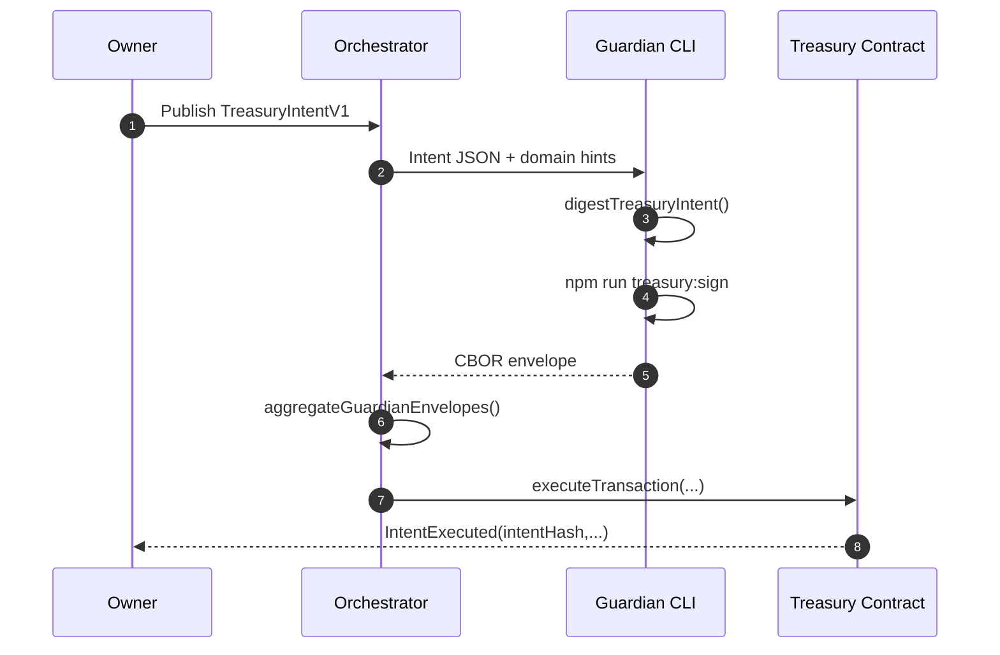

# Guardian Runbook · Mode A Treasury Approvals

<!-- markdownlint-disable MD013 MD033 -->
<p align="center">
  
</p>

> Guardians shepherd post-quantum approvals that keep the `$AGIALPHA` treasury
> under the owner’s command while minimizing on-chain footprint.

## Navigation

1. [Context](#context)
2. [Generate Dilithium keys](#generate-dilithium-keys)
3. [Ingest intents + compute digests](#ingest-intents--compute-digests)
4. [Sign with the CLI](#sign-with-the-cli)
5. [Submit envelopes](#submit-envelopes)
6. [Operational checklist](#operational-checklist)

---

## Context

Mode A keeps signature aggregation off-chain: guardians verify the intent
parameters, sign the canonical digest with Dilithium keys, and hand the CBOR
artifact to the orchestrator. Once the threshold is met, a single
`executeTransaction` call moves the treasury, and the owner retains absolute
control over every pause switch via `AlphaNodeManager.sol`.



---

## Generate Dilithium keys

1. Install dependencies: `npm ci` ensures `dilithium-crystals-js` is ready.
2. Use the bundled node REPL helper:

```bash
node --input-type=module <<'NODE'
import { getDilithiumInstance } from '../src/treasury/pqEnvelope.js';
const dilithium = await getDilithiumInstance();
const keys = dilithium.generateKeys(2);
console.log('PUBLIC_KEY_BASE64=', Buffer.from(keys.publicKey).toString('base64'));
console.log('PRIVATE_KEY_BASE64=', Buffer.from(keys.privateKey).toString('base64'));
NODE
```

1. Store the private key in an encrypted vault or HSM. Share only the base64
  public key with the orchestrator so it can be listed in `config/guardians.json`.

---

## Ingest intents + compute digests

Guardians can receive intents as JSON blobs or raw digests.

- When receiving JSON, load it with the signing CLI to reproduce the digest:

```bash
TREASURY_ADDRESS=0xa61a3b3a130a9c20768eebf97e21515a6046a1fa \
npm run treasury:sign -- \
  --intent intents/payout.json \
  --contract $TREASURY_ADDRESS \
  --chain-id 11155111 \
  --guardian-id guardian-3 \
  --private-key $GUARDIAN_PRIVATE_KEY_BASE64 \
  --public-key $GUARDIAN_PUBLIC_KEY_BASE64 \
  --emit-json --output-dir ./envelopes
```

- When the orchestrator distributes the digest directly, supply it via
  `--digest 0x...` and skip the intent file.

---

## Sign with the CLI

`scripts/treasury/sign-intent.ts` exposes every dial guardians asked for:

| Flag | Purpose |
| ---- | ------- |
| `--intent <file>` | Parses a `TreasuryIntentV1` JSON file and recomputes the digest. |
| `--digest <hex>` | Signs an already-computed digest. |
| `--chain-id`, `--contract`, `--function-signature` | Domain binding controls to defeat replay. |
| `--private-key`, `--public-key` | Accept base64, hex, or file paths for Dilithium keys. |
| `--guardian-id`, `--note`, `--issued-at` | Embed auditing metadata inside the envelope. |
| `--output-dir`, `--out`, `--emit-json` | Control where CBOR/JSON artifacts are written. |

Envelopes follow the schema documented in
[`docs/treasury-mode-a.md`](./treasury-mode-a.md) and remain interoperable with
any CBOR-aware tooling.

---

## Submit envelopes

1. Verify the CLI output:
   - Digest must match the orchestrator broadcast.
   - CBOR + optional JSON files land in `./envelopes/<digest>-<guardian>.cbor`.
2. Deliver the files via the channel agreed upon with the orchestrator
   (shared storage, secure API, etc.).
3. Track status: the orchestrator prints `✓ guardian-id` once your envelope is
   verified and counted toward the threshold.

---

## Operational checklist

- ✅ Keys rotated every quarter or on compromise, with updated public keys pushed
  to `config/guardians.json`.
- ✅ Guardian machines store private keys in encrypted volumes or TPM-backed
  stores; CLI invocation pulls from environment variables, not plaintext files.
- ✅ Each envelope is archived alongside the intent JSON/digest and timestamp for
  audit trails.
- ✅ Guardians observe GitHub Actions → **Continuous Integration** to confirm the
  CI shield stays green before accepting new software updates.
- ✅ If a digest mismatches, halt and request the orchestrator to resend the
  intent—the deterministic encoding makes mismatches a sign of tampering.

With this runbook, a non-technical guardian can safely contribute to the
post-quantum approval mesh and keep the `$AGIALPHA` treasury obedient to the
owner’s directives.
