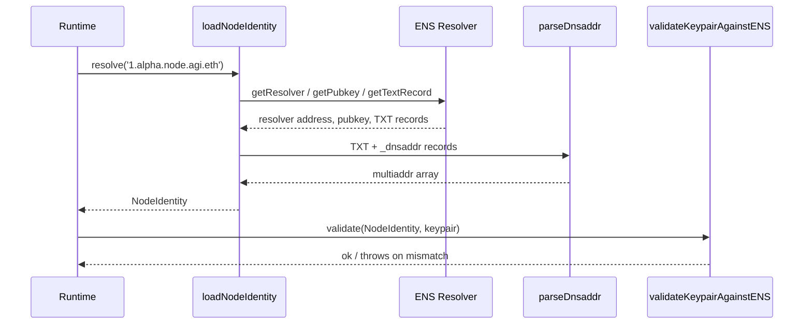

# Node Identity Authority

<!-- markdownlint-disable MD013 MD033 -->

> The identity lattice is how the Alpha Node stays anchored to the $AGIALPHA grid. Every resolver call, key validation, and multiaddr hints that the operator is still in full command.

## Canonical Data Model

```ts
import type { NodeIdentity } from '../src/identity/types.js';

const identity: NodeIdentity = {
  ensName: '1.alpha.node.agi.eth',
  peerId: '12D3KooWExample',
  pubkey: { x: '0x…', y: '0x…' },
  fuses: 0,
  expiry: 1_700_000_000,
  multiaddrs: ['/dns4/node.alpha/tcp/443/wss/p2p/…'],
  metadata: { 'node.role': 'validator', 'node.version': '1.1.0' }
};
```

`NodeIdentity` is the single source of truth consumed by orchestrators, validators, telemetry writers, and payout engines.【F:src/identity/types.ts†L1-L21】 Every runtime module expects this structure, so the loader guarantees completeness before services boot.

## Resolution Pipeline



- **ENS client** — `loadNodeIdentity` calls the shared ENS client to fetch resolver, pubkey, `node.peerId`, metadata, and NameWrapper fuses in a single asynchronous pass.【F:src/identity/loader.ts†L1-L147】  Missing mandatory records raise `NodeIdentityError` before the runtime progresses.
- **Multiaddr discovery** — `_dnsaddr.<ens>` TXT records are normalised via `parseDnsaddr`, deduplicating fragments and stripping quotes/whitespace so the libp2p layer receives clean multiaddrs.【F:src/identity/dnsaddr.ts†L1-L39】
- **Key alignment** — `validateKeypairAgainstENS` compares the locally loaded secp256k1 keypair with the ENS-published coordinates and aborts if they diverge, keeping attestations under the owner’s key.【F:src/identity/keys.ts†L1-L164】

## Configuring Identity Inputs

1. **Populate `.env`** — Define `ALPHA_NODE_ENS_NAME`, `ALPHA_NODE_PEER_ID`, and staking routes. Sample defaults live in `.env.example` so operators can copy-paste without spelunking.【F:.env.example†L1-L86】
2. **Publish ENS metadata** — Run `node src/index.js ens:records --pretty` to print deterministic TXT/coin records and apply them on-chain.【F:src/ens/ens_config.js†L1-L188】
3. **Prime signing material** — Provide either:
   - `ALPHA_NODE_KEYFILE` (JSON containing `privateKey` + optional `publicKey`), or
   - `NODE_PRIVATE_KEY` (0x-prefixed secp256k1 hex).

   The loader derives the public coordinates when necessary and caches them for reuse.【F:src/identity/keys.ts†L47-L106】

## Health Checks & Diagnostics

- **Unit tests** — `npm test -- run identity` executes the dedicated Vitest suites covering loader happy path, DNSADDR parsing, and key validation failures.【F:test/identity/loader.test.ts†L1-L74】【F:test/identity/dnsaddr.test.ts†L1-L32】【F:test/identity/keys.test.ts†L1-L67】
- **Runtime inspection** — `node src/index.js inspect:identity --ens 1.alpha.node.agi.eth` (see `scripts/ens-inspect.ts`) logs resolver, pubkey, TXT, fuses, and expiry. When fields are missing, the CLI prints precise ENS diagnostics.【F:scripts/ens-inspect.ts†L1-L220】
- **Key audit** — `node src/index.js identity:verify-key` loads the configured keypair and confirms parity with ENS before jobs execute. The command shares the same validation primitives and exits non-zero if anything drifts.【F:src/identity/keys.ts†L107-L164】【F:test/identity/keys.test.ts†L37-L67】

## Failure Modes

| Scenario | Failure Signal | Operator Action |
| --- | --- | --- |
| ENS lacks resolver/pubkey | `NodeIdentityError: Resolver not configured` or `…missing pubkey record` | Set resolver to the public resolver and publish the secp256k1 coordinates. |
| TXT missing `node.peerId` | `NodeIdentityError: missing required node.peerId text record` | Publish the peer ID (base58) in ENS via the management CLI or UI. |
| `_dnsaddr` not configured | Identity loads but `multiaddrs` is empty | Update `_dnsaddr.<name>` TXT records with `dnsaddr=/...` entries; re-run `inspect:identity`. |
| Keypair mismatch | `NodeKeyValidationError: Local keypair does not match ENS pubkey` | Confirm the JSON keyfile/env var is correct and republish ENS pubkey if the owner rotated keys intentionally. |

## Integration Notes

- Runtime components import `loadNodeIdentity` once during bootstrap and cache the result in the DI container so downstream orchestrators never query ENS directly.【F:src/index.js†L601-L702】
- Health gates broadcast identity state (multiaddrs, staking posture, telemetry baselines) to the owner console for live monitoring.【F:src/orchestrator/bootstrap.js†L421-L518】
- Governance events include the ENS name, peer ID, and pubkey fingerprint so contract-side audits tie back to the same authority.【F:src/services/governanceLedger.js†L1-L260】

Keeping these invariants tight guarantees the node always acts under operator custody while still being deployable by non-technical teams.
