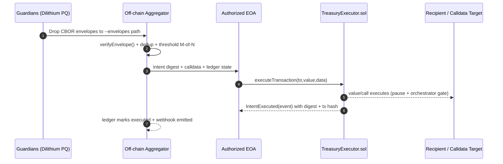

# Orchestrator Runbook (Mode A Treasury)
<!-- markdownlint-disable MD013 MD033 -->

> Purpose: deterministic, guardian-approved execution of TreasuryIntentV1 payloads using Dilithium CBOR envelopes, with owner controls enforced by `TreasuryExecutor.sol`.

## Prerequisites

- Node.js 20.18+ and `npm ci` completed (installs Dilithium, ethers, vitest helpers).
- Access to the orchestrator EOA private key (owner-authorized) and RPC endpoint (Anvil/Hardhat/local testnet or mainnet fork).
- Guardian registry JSON containing `guardianId`, `publicKey`, and optional metadata; path is passed to `--registry`.
- Treasury contract address (from deploys or local fixture) and chain ID.
- Intent JSON following `TreasuryIntentV1` (`{ "to": "0x...", "value": "1000000000000000000", "data": "0x" }`).

## Command surface

```bash
# Dry-run: print usage for all flags
npm run treasury:execute -- --help

# Execute a validated intent once M-of-N signatures are present
TREASURY_ADDRESS=0x... \
RPC_URL=http://localhost:8545 \
ORCHESTRATOR_KEY=0xabc... \
npm run treasury:execute -- intents/transfer.json \
  --registry config/guardians.json \
  --envelopes ./envelopes \
  --threshold 2 \
  --chain-id 31337 \
  --ledger ./state/intent-ledger.json \
  --log-file ./logs/treasury-executor.log \
  --webhook https://ops.example/hooks/agi-intents
```

### Required flags

- `--registry <path>`: Guardian allowlist (public keys + IDs). Prevents spoofing/duplicate signers.
- `--envelopes <dir>`: Directory containing CBOR/JSON envelopes emitted by `npm run treasury:sign`.
- `--threshold <M>`: Minimum unique guardian approvals required; must be <= allowlisted guardians.
- `--chain-id <id>` and `--contract <addr>`: Domain binding for digest verification and replay defense.
- `--ledger <path>`: JSON ledger tracking executed digests to block replays; can be committed to ops backups.

### Optional flags

- `--webhook <url>`: POST digest + tx hash once `IntentExecuted` is observed on-chain.
- `--log-file <path>`: Structured JSONL log with ingest, verification, threshold, broadcast, and receipt events.
- `--selector <0x...>`: Override function selector if using a custom executor entrypoint.

## Happy path



## Failure handling

- **Not enough signatures**: `execute-intent` exits non-zero with a summary of missing guardian IDs. Upload new envelopes to `--envelopes` and rerun; ledger prevents duplicate executions.
- **Malformed envelope**: Logged as a warning and ignored. Guardians should re-run `npm run treasury:sign` with the same intent hash.
- **Replay attempt**: If the digest is already in the ledger or contract state, the script refuses to broadcast. Owner can reset status via `setIntentStatus(bytes32,bool)` when needed.
- **On-chain revert**: Transaction receipts are written to the log; inspect revert reason, adjust calldata/value, and re-aggregate signatures. Paused treasuries must be unpaused by the owner.
- **RPC instability**: Use a fallback RPC URL or rerun once connectivity resumes; signing artifacts remain valid as long as the intent digest is unchanged.

## Security considerations

- Keep `ORCHESTRATOR_KEY` in a vault/HSM; avoid shell history by exporting via `.env` files or task runners.
- Validate guardian public keys out-of-band before adding them to `--registry`.
- Rotate guardians by updating the registry and communicating the new allowlist; old envelopes from removed guardians should be discarded.
- Monitor `logs/treasury-executor.log` and webhook payloads; reconcile against on-chain `IntentExecuted` events for every digest.
- Owner retains full control: `pause`, `setOrchestrator`, `setIntentStatus`, and `sweep` are callable at any time to override orchestrator behavior.

## Validation checklist

- `npm test -- test/treasury/modeA.integration.test.ts`: end-to-end guardian envelopes → threshold → executor dispatch on EthereumJS VM.
- `npm test -- test/treasury/thresholdAggregator.test.ts`: uniqueness + M-of-N boundary cases.
- `npm test -- test/treasury/executionLogger.test.ts`: webhook/log coverage for ops traceability.
- `npm run ci:verify`: mirrors the GitHub Actions wall; required checks are enforced on PRs and `main`.
