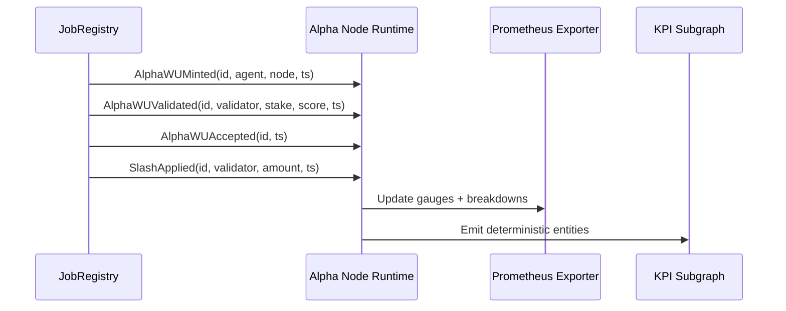
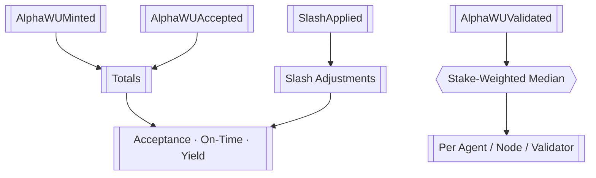
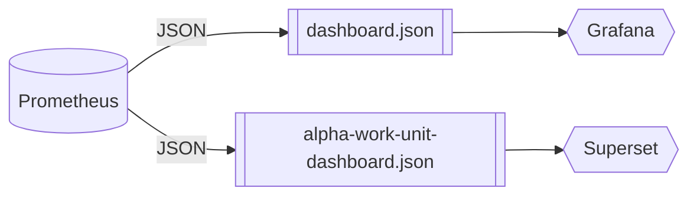

# Telemetry Fabric · α‑Work Unit Intelligence Mesh

<!-- markdownlint-disable MD013 MD033 -->
<p align="center">
  <a href="../..">
    
  </a>
</p>

<p align="center">
  <a href="https://github.com/MontrealAI/AGI-Alpha-Node-v0/actions/workflows/ci.yml">
    
  </a>
  
  
  
  
</p>

> Deterministic telemetry so the owner watches every α‑work unit mint, validation, acceptance, and slash in real time—no oracle, no compromise.

---

## Table of Contents

1. [Mission](#mission)
2. [Event Spine](#event-spine)
3. [KPI Computation](#kpi-computation)
4. [Prometheus Surfaces](#prometheus-surfaces)
5. [CLI & Subgraph Tooling](#cli--subgraph-tooling)
6. [Dashboard Blueprints](#dashboard-blueprints)
7. [Deployment Checklist](#deployment-checklist)

---

## Mission

- **On-chain verifiability** — KPIs derive directly from events the protocol already emits; no synthetic metrics.
- **Owner primacy** — Only ENS-authorized identities can push health states; the owner can pause telemetry with [`buildSystemPauseTx`](../../src/services/governance.js).
- **Real-time introspection** — Prometheus gauges and dashboards mirror exactly what the CLI reports during `jobs alpha-kpi` runs.
- **Production ready** — Every asset here is wired into CI and lint gates so dashboards never drift from the runtime implementation.

---

## Event Spine

All KPIs originate from four canonical events. Interfaces live in [`AlphaWorkUnitEvents.sol`](./AlphaWorkUnitEvents.sol) and [`alpha-kpi-interface.sol`](./alpha-kpi-interface.sol).



| Event | Field Summary | Purpose |
| ----- | ------------- | ------- |
| `AlphaWUMinted` | `bytes32 id`, `address agent`, `address node`, `uint256 timestamp` | Birth of an α‑work unit. |
| `AlphaWUValidated` | `bytes32 id`, `address validator`, `uint256 stake`, `uint256 score`, `uint256 timestamp` | Stake-weighted validator scoring. |
| `AlphaWUAccepted` | `bytes32 id`, `uint256 timestamp` | Final acceptance cutover. |
| `SlashApplied` | `bytes32 id`, `address validator`, `uint256 amount`, `uint256 timestamp` | Penalty adjustments captured on-chain. |

ENS name-gating is enforced by [`scripts/verify-health-gate.mjs`](../../scripts/verify-health-gate.mjs) so only whitelisted subnames (`*.agent.agi.eth`, `*.alpha.node.agi.eth`, …) can toggle telemetry flows.

---

## KPI Computation

Metrics are computed in [`src/services/alphaWorkUnits.js`](../../src/services/alphaWorkUnits.js). Windows default to **7d** and **30d**, but the owner can supply arbitrary durations via the CLI.



| KPI | Formula | Owner Control |
| --- | ------- | ------------- |
| **Acceptance Rate (AR)** | `accepted ÷ minted` | Pause minting via `SystemPause` helpers when AR drops below thresholds. |
| **Validator-Weighted Quality (VQS)** | `median(score) × stake weight` | Adjust validator stake exposure with `StakeManager` directives. |
| **On-Time Completion (OTC)** | `p95(accepted.ts − minted.ts)` | Tune validator SLAs with `buildValidatorThresholdTx`. |
| **Slashing-Adjusted Yield (SAY)** | `(accepted − slashUnits) ÷ stake` | Rebalance role shares through `RewardEngine` builders. |

Outputs feed into [`src/telemetry/alphaMetrics.js`](../../src/telemetry/alphaMetrics.js), which normalizes data for Prometheus gauges and CLI renderers.

---

## Prometheus Surfaces

Telemetry is exported by [`src/telemetry/monitoring.js`](../../src/telemetry/monitoring.js). Exposed metrics include:

- `agi_alpha_node_alpha_wu_acceptance_rate{window="7d"}`
- `agi_alpha_node_alpha_wu_on_time_p95_seconds{window="30d"}`
- `agi_alpha_node_alpha_wu_slash_adjusted_yield{window="all"}`
- `agi_alpha_node_alpha_wu_quality{dimension="validator",key="0x…"}`
- `agi_alpha_node_alpha_wu_breakdown{dimension="agent",metric="minted",key="0x…"}`
- `agi_alpha_node_health_gate_state{state="ready"}`

Prometheus scrape configuration:

```yaml
- job_name: agi-alpha-node
  scrape_interval: 15s
  static_configs:
    - targets: ['alpha-node:9464']
```

The owner can immediately revoke telemetry by executing the pause transaction produced from `node src/index.js status --system-pause <0xPause>`.

---

## CLI & Subgraph Tooling

- **Historic ingestion** — `node src/index.js jobs alpha-kpi --events data/events.json` ingests archived logs before reporting live windows. (Validates via [`test/alphaWorkUnits.test.js`](../../test/alphaWorkUnits.test.js).)
- **Subgraph schema** — Deterministic entity definitions reside in [`alpha-work-units.schema.graphql`](./alpha-work-units.schema.graphql) and [`subgraph.schema.graphql`](./subgraph.schema.graphql).
- **Owner diagnostics** — `node src/index.js monitor` streams KPIs alongside ENS, staking, and governance posture.

For on-chain indexing, map each event to an entity:

| Entity | Source Event | Notes |
| ------ | ------------ | ----- |
| `AlphaWorkUnit` | `AlphaWUMinted` / `AlphaWUAccepted` | Stores minted + accepted timestamps. |
| `AlphaValidation` | `AlphaWUValidated` | Accumulates stake, score, validator identity. |
| `AlphaSlash` | `SlashApplied` | Maintains penalty history for SAY calculation. |
| `KPIWindow` | Derived | Rolling window snapshot (7d/30d/all). |

---

## Dashboard Blueprints

Two JSON blueprints are maintained:

1. [`dashboard.json`](./dashboard.json) — Grafana/Chronograf ready, used in CI smoke tests.
2. [`alpha-work-unit-dashboard.json`](./alpha-work-unit-dashboard.json) — Extended analytics with validator leaderboards.



Each blueprint mirrors gauges defined in [`src/telemetry/alphaMetrics.js`](../../src/telemetry/alphaMetrics.js). CI will fail if schema files drift thanks to `npm run lint` and `npm test` coverage.

---

## Deployment Checklist

1. Confirm the ENS allowlist matches operational identities via `npm run ci:policy`.
2. Point Prometheus to the exporter endpoint (`:9464/metrics`).
3. Import [`dashboard.json`](./dashboard.json) or [`alpha-work-unit-dashboard.json`](./alpha-work-unit-dashboard.json) into Grafana.
4. Register subgraph mappings using the provided GraphQL schemas.
5. Run `node src/index.js jobs alpha-kpi --windows 7d,30d` after deployment to validate live feeds.
6. Archive resulting CLI outputs with CI artifacts for the owner’s compliance ledger.

With these steps complete, the telemetry mesh continuously quantifies acceptance, quality, timeliness, and yield—giving the contract owner minute-by-minute leverage over the entire AGI Alpha Node fleet.
