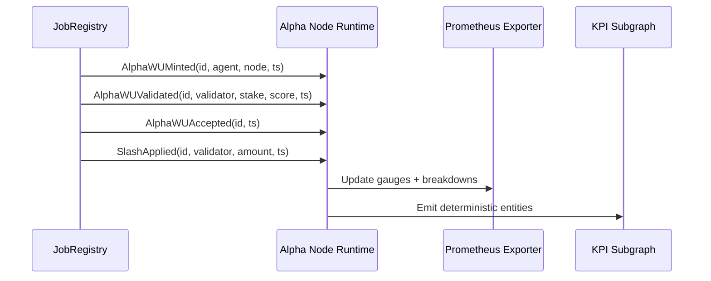
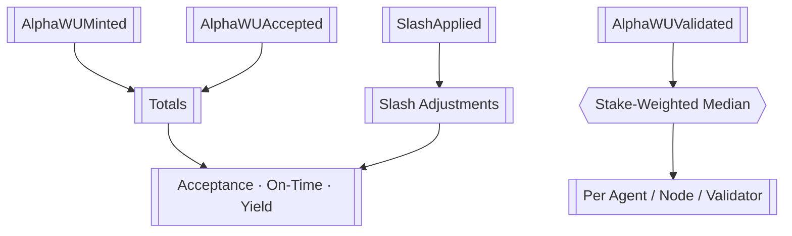
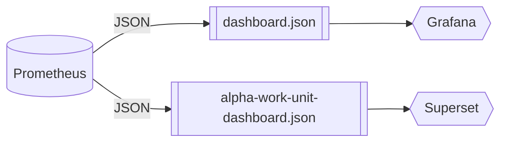

# Telemetry Fabric · α‑Work Unit Intelligence Mesh

<!-- markdownlint-disable MD013 MD033 -->
<p align="center">
  <a href="../..">
    
  </a>
</p>

<p align="center">
  <a href="https://github.com/MontrealAI/AGI-Alpha-Node-v0/actions/workflows/ci.yml">
    
  </a>
  
  
  
  
</p>

> Deterministic telemetry so the owner watches every α‑work unit mint, validation, acceptance, and slash in real time—no oracle, no compromise.

---

## Table of Contents

1. [Mission](#mission)
2. [Event Spine](#event-spine)
3. [KPI Computation](#kpi-computation)
4. [Prometheus Surfaces](#prometheus-surfaces)
5. [CLI & Subgraph Tooling](#cli--subgraph-tooling)
6. [Dashboard Blueprints](#dashboard-blueprints)
7. [Deployment Checklist](#deployment-checklist)

---

## Mission

- **On-chain verifiability** — KPIs derive directly from events the protocol already emits; no synthetic metrics.
- **Owner primacy** — Only ENS-authorized identities can push health states; the owner can pause telemetry with [`buildSystemPauseTx`](../../src/services/governance.js).
- **Real-time introspection** — Prometheus gauges and dashboards mirror exactly what the CLI reports during `jobs alpha-kpi` runs.
- **Production ready** — Every asset here is wired into CI and lint gates so dashboards never drift from the runtime implementation.

---

## Event Spine

All KPIs originate from four canonical events. Interfaces live in [`AlphaWorkUnitEvents.sol`](./AlphaWorkUnitEvents.sol) and [`alpha-kpi-interface.sol`](./alpha-kpi-interface.sol).



| Event | Field Summary | Purpose |
| ----- | ------------- | ------- |
| `AlphaWUMinted` | `bytes32 id`, `address agent`, `address node`, `uint256 mintedAt` | Birth of an α‑work unit. |
| `AlphaWUValidated` | `bytes32 id`, `address validator`, `uint256 stake`, `uint256 score`, `uint256 validatedAt` | Stake-weighted validator scoring. |
| `AlphaWUAccepted` | `bytes32 id`, `uint256 acceptedAt` | Final acceptance cutover. |
| `SlashApplied` | `bytes32 id`, `address validator`, `uint256 amount`, `uint256 slashedAt` | Penalty adjustments captured on-chain. |

ENS name-gating is enforced by [`scripts/verify-health-gate.mjs`](../../scripts/verify-health-gate.mjs) so only whitelisted subnames (`*.agent.agi.eth`, `*.alpha.node.agi.eth`, …) can toggle telemetry flows.

---

## KPI Computation

Metrics are computed in [`src/services/alphaWorkUnits.js`](../../src/services/alphaWorkUnits.js). Windows default to **7d** and **30d**, but the owner can supply arbitrary durations via the CLI.



| KPI | Formula | Owner Control |
| --- | ------- | ------------- |
| **Acceptance Rate (AR)** | `accepted ÷ minted` | Pause minting via `SystemPause` helpers when AR drops below thresholds. |
| **Validator-Weighted Quality (VQS)** | `median(score) × stake weight` | Adjust validator stake exposure with `StakeManager` directives. |
| **On-Time Completion (OTC)** | `p95(accepted.ts − minted.ts)` | Tune validator SLAs with `buildValidatorThresholdTx`. |
| **Slashing-Adjusted Yield (SAY)** | `(accepted − slashUnits) ÷ stake` | Rebalance role shares through `RewardEngine` builders. |

`subgraph/schema.graphql` materialises the raw ingredients needed for the four KPIs across **agents**, **nodes**, and **validators**. Windowed aggregates expose:

- `acceptanceRate`
- `qualityScore` (stake-weighted median derived from 0-100 quality histograms)
- `onTimeP95Seconds` (latency histogram quantile)
- `slashingAdjustedYield`

Daily metrics retain mint/accept/validation counts, slash totals, and stake sums so that alternate windows (e.g. 14d) can be recomputed off-chain without resyncing the chain.

Outputs feed into [`src/telemetry/alphaMetrics.js`](../../src/telemetry/alphaMetrics.js), which normalizes data for Prometheus gauges and CLI renderers.

---

## Prometheus Surfaces

Telemetry is exported by [`src/telemetry/monitoring.js`](../../src/telemetry/monitoring.js). Exposed metrics include:

- `agi_alpha_node_alpha_wu_acceptance_rate{window="7d"}`
- `agi_alpha_node_alpha_wu_on_time_p95_seconds{window="30d"}`
- `agi_alpha_node_alpha_wu_slash_adjusted_yield{window="all"}`
- `agi_alpha_node_alpha_wu_quality{dimension="validator",key="0x…"}`
- `agi_alpha_node_alpha_wu_breakdown{dimension="agent",metric="minted",key="0x…"}`
- `agi_alpha_node_health_gate_state{state="ready"}`

Prometheus scrape configuration:

```yaml
- job_name: agi-alpha-node
  scrape_interval: 15s
  static_configs:
    - targets: ['alpha-node:9464']
```

The owner can immediately revoke telemetry by executing the pause transaction produced from `node src/index.js status --system-pause <0xPause>`.

---

## CLI & Subgraph Tooling

- **Historic ingestion** — `node src/index.js jobs alpha-kpi --events data/events.json` ingests archived logs before reporting live windows. (Validates via [`test/alphaWorkUnits.test.js`](../../test/alphaWorkUnits.test.js).)
- **Subgraph schema** — Deterministic entity definitions reside in [`alpha-work-units.schema.graphql`](./alpha-work-units.schema.graphql) and [`subgraph.schema.graphql`](./subgraph.schema.graphql).
- **Owner diagnostics** — `node src/index.js monitor` streams KPIs alongside ENS, staking, and governance posture.

For on-chain indexing, map each event to an entity:

| Entity | Source Event | Notes |
| ------ | ------------ | ----- |
| `WorkUnit` | `AlphaWUMinted` / `AlphaWUAccepted` | Captures agent/node ownership, timestamps, and validator roster. |
| `ValidatorParticipation` | `AlphaWUValidated` | Tracks which validators touched the work unit plus their stake-weighted score. |
| `QualityBucket` | `AlphaWUValidated` | Maintains 0-100 score histograms per agent/node/validator/day for stake-weighted medians. |
| `LatencyBucket` | `AlphaWUAccepted` | Keeps latency histograms so p95 is derivable without replaying events. |
| `AgentDailyMetric` / `NodeDailyMetric` / `ValidatorDailyMetric` | All | Daily minted/accepted/validation counts, stake sums, and slash totals. |
| `AgentMetricWindow` / `NodeMetricWindow` / `ValidatorMetricWindow` | Derived | Rolling window KPI snapshots (7d/30d by default). |

---

## Dashboard Blueprints

Two JSON blueprints are maintained:

1. [`dashboard.json`](./dashboard.json) — Grafana/Chronograf ready, used in CI smoke tests.
2. [`alpha-work-unit-dashboard.json`](./alpha-work-unit-dashboard.json) — Extended analytics with validator leaderboards.



Each blueprint mirrors gauges defined in [`src/telemetry/alphaMetrics.js`](../../src/telemetry/alphaMetrics.js). CI will fail if schema files drift thanks to `npm run lint` and `npm test` coverage.

### Dashboard schema contract

- [`dashboard.schema.json`](./dashboard.schema.json) codifies the dashboard contract and is referenced by every blueprint via the `$schema` field.
- The schema enumerates widgets for SLO health (`status`, `stat`), time-series KPIs, and leaderboard/table surfaces backed by Prometheus or subgraph data sources.
- Validate an authoring change with `npx ajv-cli validate -s docs/telemetry/dashboard.schema.json -d docs/telemetry/dashboard.json` before shipping.

```jsonc
{
  "title": "AGI Alpha Node KPI Control Plane",
  "domains": ["slo", "validation", "leaderboard"],
  "datasources": [
    { "name": "prometheus", "type": "prometheus", "endpoint": "https://prometheus.alpha-node.local/api/v1" },
    { "name": "alphaSubgraph", "type": "subgraph", "endpoint": "https://api.thegraph.com/subgraphs/name/agi/alpha-work-units" }
  ]
}
```

### Lightweight embed stub

Drop-in React hook for loading `dashboard.json` and binding to an existing charting surface:

```tsx
import useSWR from "swr";

const fetcher = (url: string) => fetch(url).then((res) => res.json());

export function useAlphaDashboard() {
  const { data, error, isLoading } = useSWR("/dashboards/dashboard.json", fetcher, {
    revalidateOnFocus: false,
  });

  return {
    spec: data,
    isLoading,
    error,
  };
}

// Usage inside a component
// const { spec, isLoading } = useAlphaDashboard();
// if (!spec || isLoading) return <Spinner label="Loading KPIs" />;
// <DashboardRenderer spec={spec} />
```

For non-React front-ends, fetch the JSON once and hydrate an existing Grafana panel via the HTTP API `POST /api/dashboards/db` using the same payload.

### Subgraph integration guide

Widgets can point directly at the deterministic KPI subgraph (`alphaSubgraph` datasource). The following GraphQL snippets cover common tasks:

#### Validator quality leaderboard (rolling 24h proxy)

```graphql
query ValidatorQuality($windowDays: Int!) {
  validators: validatorMetricWindows(
    first: 10
    orderBy: qualityScore
    orderDirection: desc
    where: { windowDays: $windowDays }
  ) {
    validator { id }
    qualityScore
    acceptanceRate
    onTimeP95Seconds
  }
}
```

#### Agent acceptance rate SLO (7d window)

```graphql
query AgentAcceptance($agent: ID!) {
  windows: agentMetricWindows(
    first: 1
    where: { agent: $agent, windowDays: 7 }
  ) {
    acceptanceRate
    onTimeP95Seconds
    slashingAdjustedYield
  }
}
```

#### Minted vs. accepted totals by node (30d window)

```graphql
query NodeProduction($windowDays: Int!) {
  nodes: nodeMetricWindows(
    where: { windowDays: $windowDays }
    orderBy: acceptanceRate
    orderDirection: desc
  ) {
    node { id }
    mintedCount
    acceptedCount
    slashingAdjustedYield
  }
}
```

Execute queries with any GraphQL client or via cURL:

```bash
curl -X POST https://api.thegraph.com/subgraphs/name/agi/alpha-work-units \
  -H 'content-type: application/json' \
  -d '{"query":"query ($windowDays: Int!) { validators: validatorMetricWindows(first: 10, orderBy: qualityScore, orderDirection: desc, where: { windowDays: $windowDays }) { validator { id } qualityScore acceptanceRate onTimeP95Seconds }}","variables":{"windowDays":7}}'
```

### Agent/Node customization playbook

Stakeholders tailor dashboards by adjusting `labels`, `transform.variables`, or datasource variables per widget:

1. **Agent focus** — duplicate [`dashboard.json`](./dashboard.json) and set `labels.agent` on KPI widgets to the ENS or address of interest. Combine with subgraph variables (`$agent`) for derived queries.
2. **Node-specific drill-down** — apply `labels.node` and limit leaderboard widgets with `transform.limit` or GraphQL `where: { node: $node }` filters.
3. **Per-tenant overlays** — use the schema's `domains` and `tags` arrays to annotate the dashboard (e.g., `"tags": ["agent:orca", "sla:gold"]`) so renderers can surface tenant selectors.
4. **Access control** — check-in custom blueprints under `docs/telemetry/custom/<agent>.dashboard.json` and wire CI validation against `dashboard.schema.json` to prevent malformed payloads.

Runtime overrides can be applied without redeploying Grafana by pushing the JSON via `POST /api/dashboards/db` or by shipping the blueprint through the CLI helper `node src/index.js dashboards push --file docs/telemetry/custom/orca.dashboard.json`.

---

## Deployment Checklist

1. Confirm the ENS allowlist matches operational identities via `npm run ci:policy`.
2. Point Prometheus to the exporter endpoint (`:9464/metrics`).
3. Import [`dashboard.json`](./dashboard.json) or [`alpha-work-unit-dashboard.json`](./alpha-work-unit-dashboard.json) into Grafana.
4. Register subgraph mappings using the provided GraphQL schemas.
5. Run `node src/index.js jobs alpha-kpi --windows 7d,30d` after deployment to validate live feeds.
6. Archive resulting CLI outputs with CI artifacts for the owner’s compliance ledger.

With these steps complete, the telemetry mesh continuously quantifies acceptance, quality, timeliness, and yield—giving the contract owner minute-by-minute leverage over the entire AGI Alpha Node fleet.
