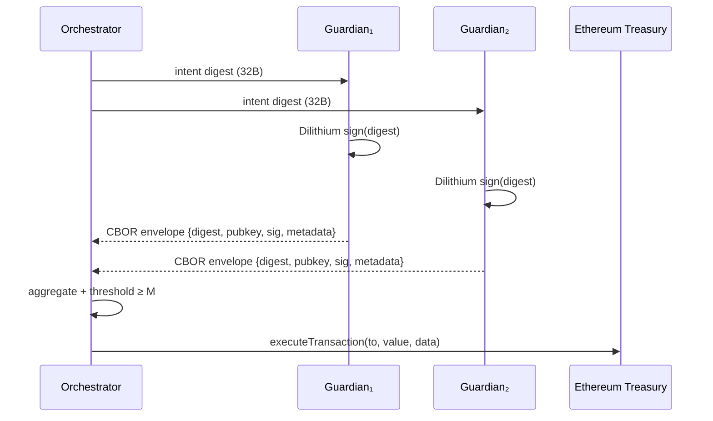

# Mode A Treasury Intents · Post-Quantum Guardian Path
<!-- markdownlint-disable MD013 -->

> Guardians sign canonicalized treasury intents with Dilithium envelopes,
> aggregate them offline, and the orchestrator executes a single deterministic
> call on-chain once the threshold is met.

## Canonical Intent Structure

```ts
interface TreasuryIntentV1 {
  to: string; // address
  value: bigint; // wei
  data: `0x${string}`; // calldata payload
}
```

- Encoding uses `ethers` ABI tuples `(address,uint256,bytes)` so every
  runtime—TypeScript, Solidity, Foundry—consumes identical bytes.
- `digestTreasuryIntent` prepends a domain block `(bytes4 selector, uint256
  chainId, address contract, uint32 version)` before hashing with `keccak256`
  to defeat cross-chain/cross-contract replay attempts.

## PQ Signing Envelope



Envelope schema:

| Field | Description |
| --- | --- |
| `version` | Always `1` for compatibility gating. |
| `algorithm` | `dilithium` (post-quantum lattice signatures). |
| `parameterSet` | 0–3 mapping to Dilithium parameter sets. |
| `digest` | Canonical keccak256 hash of the intent. |
| `publicKey` | Base64 Dilithium public key. |
| `signature` | Base64 Dilithium signature bytes. |
| `metadata.guardianId` | Optional human-readable guardian slug. |
| `metadata.issuedAt` | ISO-8601 timestamp for auditing. |

## Aggregation Logic

1. Load guardians from `config/guardians.json` (id, base64 public key,
   Dilithium parameter set).
2. Parse each envelope via CBOR (falls back to JSON for debugging).
3. Verify Dilithium signature matches digest + guardian public key.
4. De-duplicate guardians so one signer cannot satisfy the threshold twice.
5. Once approvals ≥ `threshold`, assemble calldata and submit
   `executeTransaction` to the treasury contract.

## Guardian CLI (`npm run treasury:sign`)

Guardians can now rely on the built-in signing CLI to produce identical
Dilithium envelopes without recreating digest logic.

### Generate key material first

Run `npm run treasury:keygen -- --guardian-id guardian-1 --out ./keys/guardian-1` to emit:

- `./keys/guardian-1.pk` – Base64 Dilithium public key ready for `config/guardians.json`.
- `./keys/guardian-1.sk` – Base64 Dilithium private key (permissions default to `0600`).
- `./keys/guardian-1.json` – Guardian metadata stub (id, parameter set, public key) you can
  paste into the orchestrator registry.

Use `--seed 0x…` (or `--seed @path/to/seed.bin`) when you need reproducible
key material for HSM mirroring. The full custody runbook—storage guidance,
rotation, and revocation—is documented in [`docs/runes/guardian.md`](./runes/guardian.md).

```mermaid
flowchart LR
  IntentJSON[TreasuryIntentV1 JSON]:::lava --> Digest[digestTreasuryIntent\n(+domain binding)]:::neon
  Digest --> GuardianCLI[`npm run treasury:sign`\nDilithium signer]:::frost
  GuardianCLI --> Envelope[CBOR / JSON envelope]:::neon
  Envelope --> OrchestratorCLI[`npm run treasury:execute`]:::lava
  OrchestratorCLI --> Treasury[executeTransaction\nowner-controlled]:::neon
  classDef lava fill:#0b1120,stroke:#f97316,stroke-width:2px,color:#ffedd5;
  classDef neon fill:#0b1120,stroke:#22c55e,stroke-width:2px,color:#e2e8f0;
  classDef frost fill:#0b1120,stroke:#0ea5e9,stroke-width:2px,color:#e0f2fe;
```

```bash
# Sign JSON intent with Dilithium keys stored on disk
npm run treasury:sign -- intents/treasury.json \
  --private-key @keys/guardian-1.sk \
  --public-key @keys/guardian-1.pk \
  --guardian-id guardian-1 \
  --chain-id 11155111 \
  --contract 0xa61a3b3a130a9c20768eebf97e21515a6046a1fa \
  --out ./envelopes/guardian-1.cbor

# Already have the digest? skip JSON parsing entirely
npm run treasury:sign -- --digest 0x<32-bytes> \
  --private-key @keys/guardian-1.sk \
  --public-key @keys/guardian-1.pk \
  --guardian-id guardian-1 \
  --out ./envelopes/guardian-1.cbor
```

| Flag | Purpose |
| ---- | ------- |
| `--private-key`, `--public-key` | Accept base64/hex strings or `@path` files for Dilithium material. |
| `--chain-id`, `--contract`, `--function-signature` | Bind the digest to chain + treasury selector to defeat replay. |
| `--guardian-id`, `--note`, `--issued-at` | Populate envelope metadata; `issuedAt` auto-populates unless `--skip-timestamp` is set. |
| `--digest` | Bypass JSON parsing when the orchestrator already distributed the hash. |
| `--out` + extension | Write `.cbor` or `.json` envelopes directly; default stdout is pretty-printed JSON. |

The CLI is implemented in `scripts/treasury/sign-intent.ts` and backed by the
shared `signIntentWithKeys` helper to guarantee the digest matches the Solidity
ABI encoding under test.【F:scripts/treasury/sign-intent.ts†L1-L190】【F:src/treasury/signingTools.ts†L1-L65】

## Orchestrator Runbook

```bash
cp config/guardians.example.json config/guardians.json
# Fill guardian ids + base64 Dilithium public keys

cat > intents/treasury.json <<'JSON'
{
  "to": "0x000000000000000000000000000000000000dead",
  "value": "1000000000000000",
  "data": "0x"
}
JSON

# Guardians sign the digest with the signing tool (see docs/runes/guardian.md)
# and drop CBOR envelopes into ./envelopes

TREASURY_ADDRESS=0x123... \
RPC_URL=https://sepolia.infura.io/v3/... \
ORCHESTRATOR_KEY=0xabc... \
npm run treasury:execute -- intents/treasury.json \
  --envelopes ./envelopes \
  --registry config/guardians.json \
  --threshold 2 \
  --chain-id 11155111 \
  --domain-version 1 \
  --dry-run # remove to broadcast
```

Successful executions emit `IntentExecuted(intentHash, executor, to, value)`
and appear in the CLI output with tx hash + gas stats. Dry-run mode halts
before broadcasting but still proves the threshold is satisfied.

## On-chain Treasury Executor

- `contracts/TreasuryExecutor.sol` keeps the vault owner-supreme: orchestrator-only `executeTransaction`, pause/unpause toggles, digest deduplication, owner overrides (`setIntentStatus`), and `sweep` all surface deterministic events (notably `IntentExecuted` for the calldata hash).【F:contracts/TreasuryExecutor.sol†L1-L113】
- `test/treasury/treasuryExecutor.test.ts` deploys the contract inside `@ethereumjs/vm`, proving orchestrator rotation, replay prevention, pause enforcement, and sweep mechanics before anything touches a public chain.【F:test/treasury/treasuryExecutor.test.ts†L1-L178】

When onboarding, deploy `TreasuryExecutor` with your orchestrator address (or default to owner), store the address in `TREASURY_ADDRESS`, and bind every digest via `--contract` + `--chain-id` + `--function-signature` so the off-chain hash always matches the on-chain calldata fingerprint that shows up in `IntentExecuted`.
