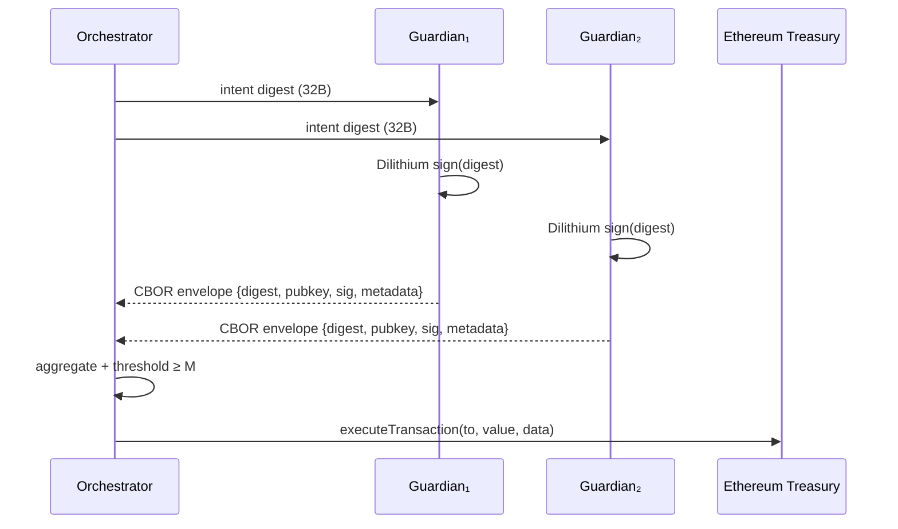

# Mode A Treasury Intents · Post-Quantum Guardian Path

> Guardians sign canonicalized treasury intents with Dilithium envelopes,
> aggregate them offline, and the orchestrator executes a single deterministic
> call on-chain once the threshold is met.

## Canonical Intent Structure

```ts
interface TreasuryIntentV1 {
  to: string; // address
  value: bigint; // wei
  data: `0x${string}`; // calldata payload
}
```

- Encoding uses `ethers` ABI tuples `(address,uint256,bytes)` so every
  runtime—TypeScript, Solidity, Foundry—consumes identical bytes.
- `digestTreasuryIntent` prepends a domain block `(bytes4 selector, uint256
  chainId, address contract, uint32 version)` before hashing with `keccak256`
  to defeat cross-chain/cross-contract replay attempts.

## PQ Signing Envelope



Envelope schema:

| Field | Description |
| --- | --- |
| `version` | Always `1` for compatibility gating. |
| `algorithm` | `dilithium` (post-quantum lattice signatures). |
| `parameterSet` | 0–3 mapping to Dilithium parameter sets. |
| `digest` | Canonical keccak256 hash of the intent. |
| `publicKey` | Base64 Dilithium public key. |
| `signature` | Base64 Dilithium signature bytes. |
| `metadata.guardianId` | Optional human-readable guardian slug. |
| `metadata.issuedAt` | ISO-8601 timestamp for auditing. |

## Aggregation Logic

1. Load guardians from `config/guardians.json` (id, base64 public key,
   Dilithium parameter set).
2. Parse each envelope via CBOR (falls back to JSON for debugging).
3. Verify Dilithium signature matches digest + guardian public key.
4. De-duplicate guardians so one signer cannot satisfy the threshold twice.
5. Once approvals ≥ `threshold`, assemble calldata and submit
   `executeTransaction` to the treasury contract.

## Orchestrator Runbook

```bash
cp config/guardians.example.json config/guardians.json
# Fill guardian ids + base64 Dilithium public keys

cat > intents/treasury.json <<'JSON'
{
  "to": "0x000000000000000000000000000000000000dead",
  "value": "1000000000000000",
  "data": "0x"
}
JSON

# Guardians sign the digest with the signing tool (see docs/runes/guardian.md)
# and drop CBOR envelopes into ./envelopes

TREASURY_ADDRESS=0x123... \
RPC_URL=https://sepolia.infura.io/v3/... \
ORCHESTRATOR_KEY=0xabc... \
npm run treasury:execute -- intents/treasury.json \
  --envelopes ./envelopes \
  --registry config/guardians.json \
  --threshold 2 \
  --chain-id 11155111 \
  --domain-version 1 \
  --dry-run # remove to broadcast
```

Successful executions emit `IntentExecuted(intentHash, executor, to, value)`
and appear in the CLI output with tx hash + gas stats. Dry-run mode halts
before broadcasting but still proves the threshold is satisfied.
