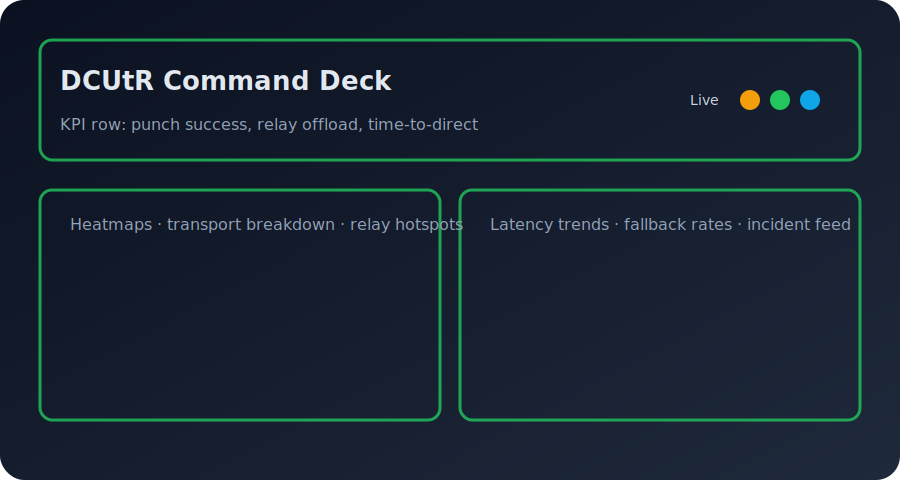
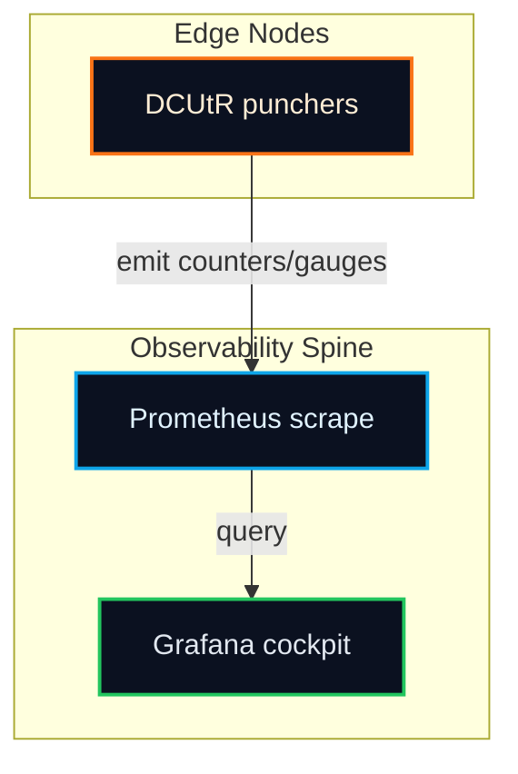

# DCUtR Grafana Dashboard Stub
<!-- markdownlint-disable MD013 -->

Import `observability/grafana/dcutr_dashboard.json` into Grafana to visualize the hole punching control loop end-to-end.

> Replace the placeholder with a freshly exported Grafana capture after wiring your datasource so GitHub rendering stays in lockstep with the live cockpit.

## Panel guide

1. **Punch Success %** — live gauge sourced from `dcutr_punch_success_rate{region,asn,transport,relay_id}`; slice by geography and transport to spot hotspots.
2. **Attempts vs Success vs Failure** — per-5m rate comparison of attempts, successes, and failures to isolate regressions or blocked transports.
3. **Time to Direct p50/p95** — quantiles over `dcutr_time_to_direct_seconds_bucket` to catch coordination jitter by relay or AS.
4. **Path Quality (RTT & Loss)** — gauges keyed by `relay_id` and `asn` for jitter/loss anomalies after a successful punch.
5. **Relay vs Direct Data** — bytes per second over relay vs direct paths to highlight cost regressions or underperforming direct paths.
6. **Relay Fallback vs Offload** — rate of sessions sticking to relays or offloading; drill down by `region` and `transport` to validate policy flips.
7. **Heatmap: Success by Region × AS** — correlates geography with provider behavior to detect asymmetric NAT pockets.
8. **Incidents rail** — top failing relays/regions in the last 24h and 7d to anchor incident response.

Panel wiring hints:

- Prometheus datasource set to the same scrape target that registers `registerDCUtRMetrics`.
- Use `region=~".*"` and `asn=~".*"` regex variables to drive the heatmap and KPI slices.
- Overlay `transport` in tooltips for every panel to quickly decide when to flip to TCP.

## Import steps

1. Navigate to **Dashboards → New → Import** in Grafana.
2. Upload `observability/grafana/dcutr_dashboard.json` or paste its JSON payload.
3. Select your Prometheus datasource and save.
4. (Recommended) Wire alert rules for `dcutr_punch_success_rate` and p95 `dcutr_time_to_direct_seconds` to match your SLOs.

Screenshot placeholder file: `observability/docs/assets/dcutr-dashboard-placeholder.svg` (replace with your exported Grafana image when ready to ship dashboards to stakeholders).

## Playbook overlays (from the README primer)

- If a graph dips, scope whether it is global or limited to a region/AS and check the transport split (QUIC vs TCP).
- Inspect relay reservations and expiration churn when success collapses despite healthy transports.
- Verify punch timing changes against RTT estimates; roll back overly aggressive jitter.

## Topology

