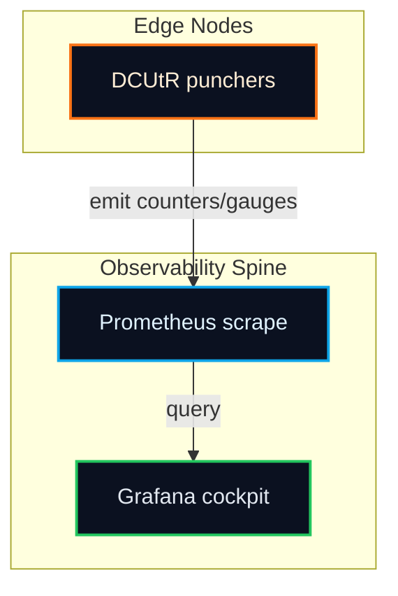

# DCUtR Grafana Dashboard Stub
<!-- markdownlint-disable MD013 -->

Import `observability/grafana/dcutr_dashboard.json` into Grafana to visualize the hole punching control loop.

## Panels

1. **Punch Success %** — live gauge sourced from `dcutr_punch_success_rate{region,asn,transport,relay_id}`; slice by region and transport to find hotspots.
2. **Attempts vs Success vs Failure** — compare per-5m rates of attempts, successes, and failures with matching labels to spot localized regressions.
3. **Time to Direct p50/p95** — quantiles over `dcutr_time_to_direct_seconds_bucket` to catch latency drift by relay and transport.
4. **Path Quality (RTT & Loss)** — direct path quality gauges for jitter and loss anomalies keyed by `relay_id` and `asn`.
5. **Relay vs Direct Data** — bytes per second over relay vs direct paths to surface cost regressions and bandwidth drainage.
6. **Relay Fallback vs Offload** — rate of connections sticking to relays or leaving them; supports drill-down by `region` and `transport`.

## Import steps

1. Navigate to **Dashboards → New → Import** in Grafana.
2. Upload `observability/grafana/dcutr_dashboard.json` or paste its JSON payload.
3. Select your Prometheus datasource and save.
4. (Optional) Add alert rules for p95 `dcutr_time_to_direct_seconds` and falling `dcutr_punch_success_rate`.

## Topology

