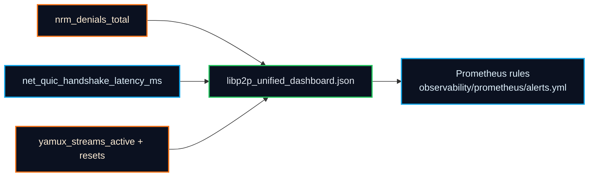
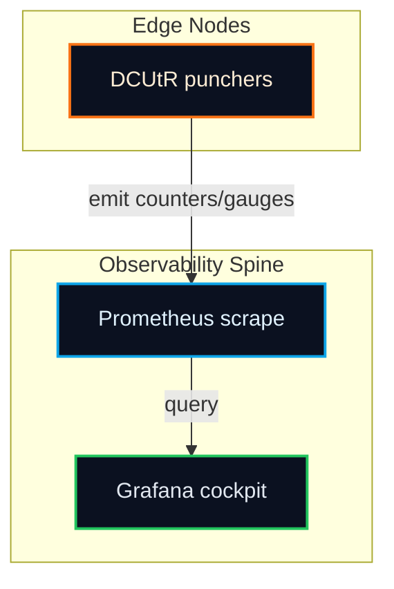

# DCUtR Grafana Dashboard Stub
<!-- markdownlint-disable MD013 -->

Import `observability/grafana/dcutr_dashboard.json` into Grafana to visualize the hole punching control loop end-to-end.

> Mermaid fences here match GitHub’s renderer, so the topology sketch below renders cleanly on GitHub Pages and in previews.

## Panel guide

1. **Punch Success Rate** — PromQL: `sum(rate(dcutr_punch_success_total[5m])) / sum(rate(dcutr_punch_attempts_total[5m]))`; primary KPI for the punch loop.
2. **Punch Attempts / Success / Failures** — PromQL: `sum(rate(dcutr_punch_attempts_total[5m]))`, `sum(rate(dcutr_punch_success_total[5m]))`, `sum(rate(dcutr_punch_failure_total[5m]))`; separates pure transport failures from coordination misses.
3. **Time To Direct (Latency Histogram)** — PromQL: `histogram_quantile(0.95, sum(rate(dcutr_time_to_direct_seconds_bucket[5m])) by (le))`; track p95 time from relay coordination to direct path establishment.
4. **Relay Offload** — PromQL: `sum(rate(dcutr_relay_offload_total[5m]))`; confirms sessions are evacuating relays after a landed punch.
5. **Direct Path Quality (RTT)** — PromQL: `avg(dcutr_path_quality_rtt_ms)`; highlights degradation after the migration to direct paths.
6. **Region × ASN Heatmap** — PromQL: `sum(rate(dcutr_punch_success_total[10m])) by (region, asn)`; spot geography/provider pockets with suppressed success.

Panel wiring hints:

- Prometheus datasource set to the same scrape target that registers `registerDCUtRMetrics`.
- Use `region=~".*"` and `asn=~".*"` regex variables to drive the heatmap and KPI slices.
- Overlay `transport` in tooltips for every panel to quickly decide when to flip to TCP.
- Mirror your SLOs directly: punch success ≥ target, p95 time-to-direct within budget, relay offload trending upward with explicit annotations for changes to punch windows or relay policies.

## Import steps

1. Navigate to **Dashboards → New → Import** in Grafana.
2. Upload `observability/grafana/dcutr_dashboard.json` or paste its JSON payload.
3. Select your Prometheus datasource and save (Docker compose auto-wires this via `grafana/provisioning/dashboards/dcutr.yaml`).【F:grafana/provisioning/dashboards/dcutr.yaml†L1-L6】【F:docker-compose.yml†L1-L25】
4. Run `grafana dashboards lint observability/grafana/dcutr_dashboard.json` (Grafana 10.3+ CLI) to catch structural issues before shipping.
5. (Recommended) Wire alert rules for `dcutr_punch_success_rate` and p95 `dcutr_time_to_direct_seconds` to match your SLOs.

Screenshot placeholder file: `observability/docs/assets/dcutr-dashboard-placeholder.svg` (replace with your exported Grafana image when ready to ship dashboards to stakeholders).

## Libp2p unified observability cockpit

`observability/grafana/libp2p_unified_dashboard.json` auto-provisions with Docker compose and groups the libp2p subsystems that operators triage most frequently:

1. **NRM denials (rate by limit_type)** — PromQL: `sum(rate(nrm_denials_total[10m])) by (limit_type)`; thresholds at 1/5 events per second flag early banlist/per-ip/per-asn clamp downs.
2. **QUIC handshake p95** — PromQL: `histogram_quantile(0.95, sum(rate(net_quic_handshake_latency_ms_bucket[5m])) by (le, direction))`; warning at 350ms, critical at 500ms.
3. **Yamux streams + resets** — PromQL: `sum(yamux_streams_active) by (direction)` plus `sum(rate(yamux_stream_resets_total[5m]))`; highlights multiplexor pressure and reset storms.

These panels ship with color-coded thresholds so operators can spot regressions without drilling into PromQL. The provisioning bundle in `grafana/provisioning/dashboards` loads both DCUtR and libp2p dashboards automatically.

## Playbook overlays (from the README primer)

- If a graph dips, scope whether it is global or limited to a region/AS and check the transport split (QUIC vs TCP).
- Inspect relay reservations and expiration churn when success collapses despite healthy transports.
- Verify punch timing changes against RTT estimates; roll back overly aggressive jitter.

## Topology

